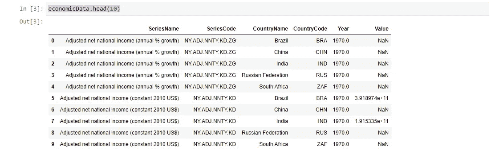
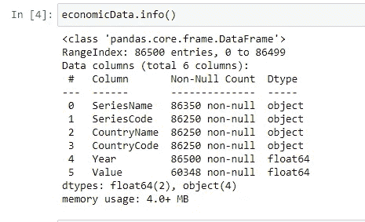
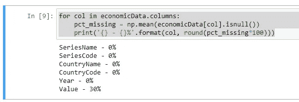
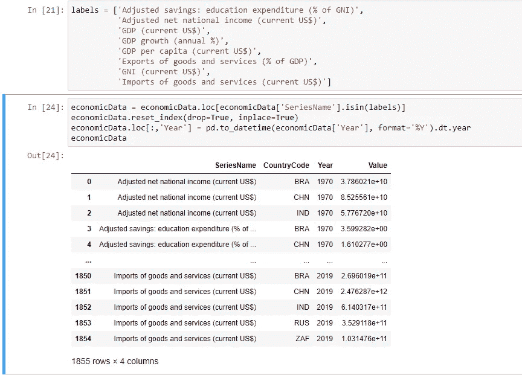
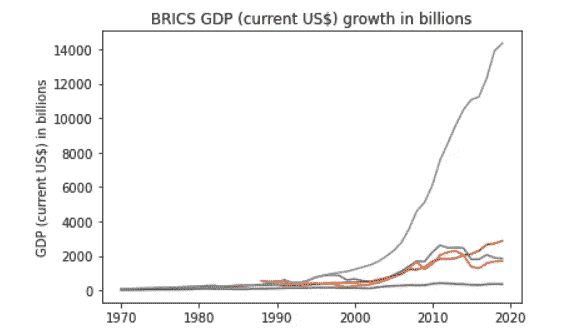
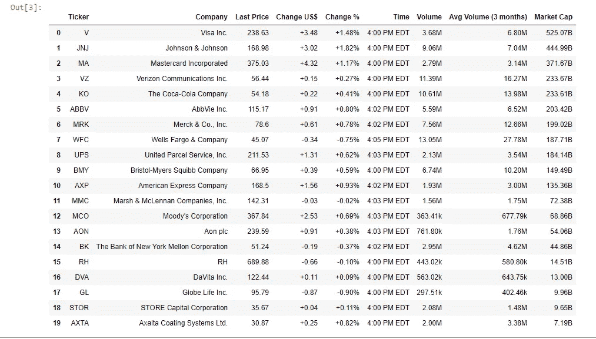

# 任何机器学习项目的数据清理基础

> 原文：<https://medium.com/analytics-vidhya/data-cleaning-fundamentals-for-any-machine-learning-project-7db745a42d95?source=collection_archive---------8----------------------->

大家好！在本文中，我将讨论数据科学家在任何项目中最喜欢的任务…清理数据。开玩笑，几乎没有人喜欢这个任务。正如你在这篇[福布斯文章](forbes.com/sites/gilpress/2016/03/23/data-preparation-most-time-consuming-least-enjoyable-data-science-task-survey-says/?sh=2cb7333a6f63)中读到的，76%的数据科学家发现数据清理是他们工作中最耗时、最不愉快的任务。然而，这可以说是任何机器或深度学习项目中最重要的一个阶段，因此对数据清理艺术的基础的良好理解对您的项目的成功至关重要。在这篇文章中，我将讨论两个主要类别:

1.  **处理结构化数据**

*   它是什么，从哪里得到它。
*   清理数据帧的基本技术。

2.**处理非结构化数据**

*   它是什么，如何得到它。
*   一个从 web 中提取数据的 web scraper 示例。

> 这并不是数据清理的全面指南。相反，我的目标是帮助你们理解数据清理的主要概念，以及数据科学家试图通过这样做来实现什么。清理数据没有固定的方法，在某些方面，它更像是一门艺术而不是科学，所以保持开放的心态，尝试不同的事情。此外，有许多复杂的算法和技术可以用来清理更复杂的数据集，我将在以后的文章中介绍。我希望你觉得它有用，是一个很好的初学者练习。

# 结构数据

结构化数据是指那些组织有序、定义明确且易于访问的数据集。酷，这是什么意思？这意味着数据分析师可以轻松地分析这种类型的数据。因为它被清楚地标记和有效地组织，它还简化了机器学习工程师开发训练/验证集以训练他们的模型的任务。结构化数据的一些例子是 excel 电子表格、SQL 数据库或医疗记录。总的来说，它只是让处理大量数据变得更加容易。

你如何获得这些数据集？嗯，有很多可能性，你可以从 [Kaggle](https://www.kaggle.com/) 下载一个，自己开发一个电子表格或者利用你公司的数据库。查看[这篇文章](https://pub.towardsai.net/best-datasets-for-machine-learning-data-science-computer-vision-nlp-ai-c9541058cf4f)，了解从哪里获取数据集的更详细的研究。今天，我们将从 Kaggle 下载一个包含金砖四国经济数据的数据集，并执行基本的探索性数据分析(EDA)和数据清理技术。金砖国家是世界上最大的新兴国家类别，代表巴西、俄罗斯、印度、中国和南非。

你可以从[这里](https://www.kaggle.com/docstein/brics-world-bank-indicators)下载数据。

如果你还没有一个 Kaggle 帐户，这是一个很好的时机。Kaggle 提供了大量不同的数据集和比赛，可以为你的个人项目提供数据，并提供机会在比赛中展示你的技能，这些比赛通常提供工作，实习或非常丰厚的奖品。

很好，让我们把手弄脏。我将包含经济数据的 csv 文件存储在我的电脑上，并使用 pandas 在 jupyter 笔记本上阅读它(你可以在本文底部找到链接)。

```
import pandas as pd
import numpy as np
import matplotlib.pyplot as plt
import seaborn as sns
%matplotlib inlineeconomicData = pd.read_csv('C:\\Users\\Bonoc\\Documents\\Medium\\BRICS\\archive\\BRICS Development Indicators\\Economy_Data.csv', sep=';')
```

接下来，我们可以开始研究数据集的一些细节。首先，我们将打印出前 10 行，以检查它是如何组织的。

```
economicData.head(10)
```



很好，我们观察到数据集有一个[长格式](https://www.theanalysisfactor.com/wide-and-long-data/)，并且似乎有几个 NaN 值。让我们检查每一列的数据类型。

```
economicData.info()
```



当看到这个描述时，我首先想到的是，我们可以将“Year”的数据类型改为更简单的类型。我们可以将其更改为 datetime，但是因为我们只提供了年份(不是完整的日期),所以我们应该将它们规范化为 int64。当您想快速浏览数据集包含的所有内容时，info()方法非常有用。或者，您可以使用以下命令分别分析每个部分:

```
# returns a tuple (num of rows, num of columns)
economicData.shape# Returns the data type of each column
economicData.dtypes# Returns the name of the columns in your dataset
economicData.columns
```

接下来我们应该检查的是空值。我们可以用很多方法来检查这一点，但我发现最具描述性的方法是空值相对于记录数的百分比。

```
for col in economicData.columns:
    pct_missing = np.mean(economicData[col].isnull())
    print('{} - {}%'.format(col, round(pct_missing*100)))
```



现在我们面临着一个棘手的决定。我们注意到有 30%的值丢失了。好吧，我们该拿他们怎么办？我们可以删除这些行，用平均值或中值(或分类数据的模式)等统计测量值填充空值，或者我们可以为其分配一个特殊值，如超大值或小值(即-99999 或 12345678)，以便区分它们。现在决定权在你手中，如果你认为这些值不会给你的分析增加大量的信息，那就删除它们。如果您想开发一个预测模型，也许您可以尝试用数据集中所有值的平均值或中值来替换它们。因为在这篇文章中，我们并不特别试图开发一个特定的模型，所以我决定删除那些缺少值的行，以减少这个数据集的大小和复杂性。我们通过利用熊猫 dropna 方法实现了这一目标:

```
economicData.dropna(subset=['Value'], inplace=True)
```

请注意，inplace=True 会将更改直接应用到数据集，inplace=False 会输出数据集外观的预览，但不会应用这些更改。此外，我想删除一些似乎没有添加重要信息的列:“SeriesCode”和“CountryName”。你可能会问，为什么是“国家名称”而不是“国家代码”？答案是国家代码是国家的统一表示，它不会随着数据集而改变，而名称可以缩写或使用不同的语言。如果在某个时候您决定将另一个数据集与这些国家的其他数据进行聚合，这将非常有用，如果您保留国家代码，您可以基于这些代码连接或合并这些数据集(因为[连接](https://pandas.pydata.org/pandas-docs/stable/reference/api/pandas.DataFrame.join.html)和[合并](https://pandas.pydata.org/pandas-docs/stable/reference/api/pandas.DataFrame.merge.html)要求单元格值相同)。

```
economicData.drop(['SeriesCode', 'CountryName'], axis=1, inplace=True)
```

厉害！我们的数据集看起来已经整洁多了。如果我们再次打印数据集，我们会注意到索引已经被修改，因为我们删除了行而没有更新索引。这是一个可选步骤，但通常很有用。现在我们已经清理了大部分数据集，让我们重新设置索引:

```
economicData.reset_index(drop=True, inplace=True)
```

最后，我们可以选择特定的指标来进一步缩减数据集的规模，只关注那些我们真正感兴趣的分析内容。我挑选了 8 个指标，并修改了现有的 economicData 数据框架，使其只包含关于这些指标的数据，由于我们已经处理了空值，因此我们可以确定每一行都包含值。然后，我最后一次重置索引，并将“Year”列的数据类型更改为 int64。

```
economicData = economicData.loc[economicData['SeriesName'].isin(labels)]economicData.reset_index(drop=True, inplace=True)economicData.loc[:,'Year'] = pd.to_datetime(economicData['Year'], format='%Y').dt.yeareconomicData
```



太神奇了！现在，我们只剩下原始数据集的一个更小的子集，没有空值和具有首选数据类型的列。从这里开始，世界就是你的了，你可以创建单独的数据框架，只包含特定国家的数据或每个国家一个数据，如下所示:

```
brazil = economicData[economicData['CountryCode'] == 'BRA']china = economicData[economicData['CountryCode'] == 'CHN']southAfrica = economicData[economicData['CountryCode'] == 'ZAF']russia = economicData[economicData['CountryCode'] == 'RUS']india = economicData[economicData['CountryCode'] == 'IND']
```

或者你可以绘制一个特定指标随时间的演变。例如，我们可以将每个国家每年的 GDP 增长可视化。原谅我的代码不够整洁，我还在掌握 python 中的可视化:)

```
plt.plot(brazil.loc[economicData['SeriesName'].isin(['GDP (current US$)'])]['Year'],
         brazil.loc[economicData['SeriesName'].isin(['GDP (current US$)'])]['Value']/1000000000)plt.plot(russia.loc[economicData['SeriesName'].isin(['GDP (current US$)'])]['Year'],
         russia.loc[economicData['SeriesName'].isin(['GDP (current US$)'])]['Value']/1000000000)plt.plot(southAfrica.loc[economicData['SeriesName'].isin(['GDP (current US$)'])]['Year'],
         southAfrica.loc[economicData['SeriesName'].isin(['GDP (current US$)'])]['Value']/1000000000)plt.plot(india.loc[economicData['SeriesName'].isin(['GDP (current US$)'])]['Year'],
         india.loc[economicData['SeriesName'].isin(['GDP (current US$)'])]['Value']/1000000000)plt.plot(china.loc[economicData['SeriesName'].isin(['GDP (current US$)'])]['Year'],
         china.loc[economicData['SeriesName'].isin(['GDP (current US$)'])]['Value']/1000000000)plt.title('BRICS GPD (current US$) growth in billions')
plt.xlabel('Year')
plt.ylabel('GPD (current US$) in billions')plt.show()
```



# **非结构化数据**

与结构化数据不同，这些数据集没有特定的格式，也没有有效的组织方式。这并不意味着他们更好或更差，他们只是不同。结构化和非结构化数据通常互为补充，因为它们有非常不同的用途。非结构化数据的一些例子是 pdf、tweets、自然语言和从网络上搜集的数据。非结构化数据通常更慢，处理起来更具挑战性，但它为我们提供了执行各种酷实验的机会，如情感分析、图像分类、自动化金融分析以及许多其他任务。另外，谁不喜欢好的挑战呢？

今天，我们将刮下伯克希尔·哈撒韦公司的投资组合，清理干净，并将其存储在熊猫的数据框架中。请注意，这篇文章的重点是数据清理，因此没有太多的重点放在解释网络抓取的概念。然而，如果你对此感兴趣，请在评论中告诉我，我会写一篇文章详细解释网络抓取的艺术:)

让我们开始吧…

首先，我们将使用[美汤](https://pypi.org/project/beautifulsoup4/)和[请求](https://pypi.org/project/requests/)来编写我们的 web scraper。下面是如何做到这一点:

```
import pandas as pd
import bs4 as soup
import requests
import numpy as np## link where we will get our data from
url = '[https://finance.yahoo.com/u/yahoo-finance/watchlists/the-berkshire-hathaway-portfolio?.tsrc=fin-srch'](https://finance.yahoo.com/u/yahoo-finance/watchlists/the-berkshire-hathaway-portfolio?.tsrc=fin-srch')## download webpage HTML code
info = requests.get(url) 
data = soup.BeautifulSoup(info.text, 'lxml')
```

简而言之，web scraper 是一个程序，它提取给定网页的 HTML 代码，并让您与它交互以提取信息。它是用于各种数据挖掘任务的非常常见的工具。

现在我们有了 HTML，我们需要检查它并找到与我们的项目相关的信息。在我们的例子中，我们将提取包含伯克希尔·哈撒韦公司投资组合中所有持股的表，以及它们各自的信息(价格、交易量、股票代码……)。为此，我们可以右键单击包含此类信息的表格，然后选择“inspect”。如果这是你第一次看 HTML 代码，它可能会有点令人生畏，采取深度广度和放松，它看起来简单得多。将鼠标悬停在不同的代码行上，你会看到网页浏览器突出显示了与代码行相关的网页部分。标签似乎包含了表中的所有数据。如果您点击标签，将会出现其他几个标签。同样，将鼠标悬停在它们上面，注意到标签包含表格行，而标签包含每个单元格的信息。很直观吧？很好，因为我们需要表格中每个单元格的信息，所以我们将遍历这个 HTML 上的所有标签，并将数据存储在一个 python 列表中:

```
## we leverage bs4 to inspect the HTML we just downloaded
## once we find the location of the data we are interested in we store it on a liststocks = []for i in data.findAll('td'):
    stocks.append(i.text)
```

我鼓励你打印出原始数据并进行分析。稍微摆弄一下。实验是任何研究项目的一个关键方面。这样做时，我们可以观察到，例如，返回了网页中所有表格的单个单元格的数据，在本例中是两个。所以，我想去掉第一张表中的信息，它包含了整个投资组合的表现数据。

```
## extra code to eliminate the first ten data points about the overall portfolio
parsedStocks = stocks[10:]
```

太好了！我们已经走了一半了。我们必须做的下一件事是重新组织我们的数据，以便能够创建一个熊猫数据框架。为此，我认为创建一个嵌套列表会有所帮助，在一个单独的列表中包含每只股票的信息。每只股票提供了九个数据点，所以如果我们将我们的*股票*列表分成每九个元素，我们很可能会得到我们想要的。让我们试一试:

```
## Let's create a a list per stock. 
## This way it will be easier to create a dataframe with each row representing a ticker and all its infox=0
y=len(parsedStocks)listStocks = []
for i in range(x,y,9):
    x=i
    listStocks.append(parsedStocks[x:x+9])
```

这里我们循环遍历我们的 *parsedStocks* 列表，范围从 0 到列表的长度(但不包括在内),并且每 9 个元素遍历一次。然后，我们将这些列表添加到一个名为 *listStocks* 的新列表中(我知道这不是很有创意)，瞧！我们已经清理了嵌套列表，其中包含关于 BHportfolio 持股的信息。让我们现在就创建我们心爱的熊猫数据框架:

```
## The column names for our dataframe
headers = ['Ticker', 'Company', 'Last Price', 'Change US$', 'Change %',
            'Time', 'Volume', 'Avg Volume (3 months)', 'Market Cap']## Create dataframe
BHportfolio = pd.DataFrame(columns=headers)## Finally populate the dataframe with out stock data
for row in listStocks:
    length = len(BHportfolio)
    BHportfolio.loc[length] = row

BHportfolio
```



难以置信！从这里，我们可以继续利用我们在清理 BRICS 数据集时试验过的任何上述技术。查看 BHportfolio.info()并检查 dtypes 和列/行数。检查您是否可以删除任何内容以使其更加简洁(例如，我决定删除时间列，因为我对它没有用处)，检查是否有任何空值。

或者，您可以用新的数据框架非常容易地开发一个 SQL 数据库。只需复制以下代码:

```
import sqlite3database = sqlite3.connect('CursoDB2.db') # Any name you want
c = database.cursor()# I create a table called "STOCKS" 
# Note we are now using SQL syntax, but in Python! Pretty cool...c.execute("CREATE TABLE STOCKS (Ticker, Company, LastPrice, ChangeDollar, ChangePerc, Volume, AvgVolume, MarketCap)")database.commit()BHportfolio.to_sql('STOCKS', database, if_exists = 'replace', index=False)# Now we can access our new SQL database and perform queriesc.execute('''
SELECT * FROM STOCKS
          ''')for row in c.fetchall():
    print(row)
```

哇，对于各种项目来说，python 确实是一个了不起的工具。从这里开始，你只能被你的想象所束缚。比如我用这个程序创建了一个[。bat 每天在开市前后自动从 yahoo finance 获取股票，然后我可以开发一个交易机器人，使用更新数据进行交易或发出警报。可能性是无限的！](https://www.lifewire.com/bat-file-2619796)

# **结论**

我希望这篇文章对你有所帮助和启发。主要目标是为读者提供一种简单的方法来下载、分析和清理结构化和非结构化格式的数据集，并解释两者之间的主要差异(特别是为什么一个不应该被认为比另一个“更好”)。理解数据清理和分析的基本概念不仅对机器或深度学习项目至关重要，而且对未来的任何项目都至关重要，因为大数据的最新趋势，对每个学科都有某种编程技能的员工/实习生的需求，以及对更加数字化和数据驱动的社会的普遍推动。

## 非常感谢您的阅读！

这里是完整的笔记本和一些额外的内容，以满足最好奇的读者的想法:

[](https://github.com/Bonorinoa/medium/tree/main/dataCleaning) [## bono rinoa/培养基

### 我用来补充我的媒体文章的笔记本和脚本的集合。- Bonorinoa/medium

github.com](https://github.com/Bonorinoa/medium/tree/main/dataCleaning) [](https://www.scrapingbee.com/blog/web-scraping-101-with-python/) [## Python 网络抓取:你需要知道的一切(2021)

### 在这篇文章中，我们将介绍…

www.scrapingbee.com](https://www.scrapingbee.com/blog/web-scraping-101-with-python/) [](https://handsoffinvesting.com/automating-your-stock-analysis-with-python/) [## 使用 Python 自动化您的股票分析——放手投资

### 沃伦·巴菲特曾建议投资者“在别人贪婪时恐惧，在别人恐惧时贪婪”。今天…

handsoffinvesting.com](https://handsoffinvesting.com/automating-your-stock-analysis-with-python/) [](https://www.auedbaki.com/article/how-to-schedule-batch-files-to-run-automatically-in-windows-10-1609865374401#) [## 如何安排批处理文件在 Windows 10 中自动运行

### 批处理文件通常用于自动化 Windows 计算机中的重复性任务，并且能够安排这些任务…

www.auedbaki.com](https://www.auedbaki.com/article/how-to-schedule-batch-files-to-run-automatically-in-windows-10-1609865374401#)