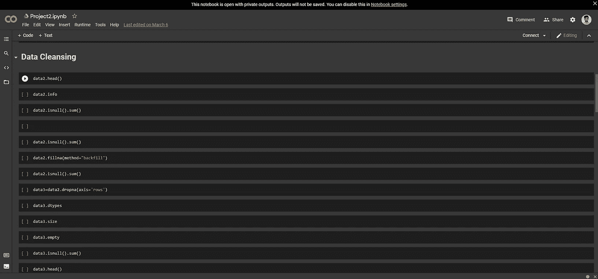

# 使用熊猫图书馆进行数据清理

> 原文：<https://medium.com/analytics-vidhya/data-cleaning-using-the-pandas-library-4519c23641fd?source=collection_archive---------8----------------------->

当我们解决机器学习问题时，我们需要 pandas 库，因为没有 pandas 库，我们无法查看和操作数据，或者我们无法修改数据来解决问题。

因此，当我们需要访问数据时，我们使用 pandas 的库函数，如果数据是 CSV 格式，我们使用 obj.read_csv()，如果数据是另一种格式，我们使用不同的函数。

熊猫有如此多的功能，可以根据我们的需要使用它们来达到不同的目的。**数据清理的主要目标是将原始数值数据集(这里的数据有结构化和非结构化两种类型，结构化是指数值数据集表格格式，非结构化是指音频、图像、视频)转换为特征工程步骤，这意味着我们处理原始数值数据并将其设置为对特征工程有用**

照片由[法比安·伊尔萨拉](https://unsplash.com/@firsara?utm_source=unsplash&utm_medium=referral&utm_content=creditCopyText)在 [Unsplash](https://unsplash.com/s/photos/technology?utm_source=unsplash&utm_medium=referral&utm_content=creditCopyText) 上拍摄

机器学习管道的第一步是数据清理(如果你不知道机器学习管道，请阅读我的博客

[https://medium . com/analytics-vid hya/machine-learning-with-flow-696 ff 42 F8 aff](/analytics-vidhya/machine-learning-with-flowchart-696ff42f8aff)

当您从框架中获取数据集时，我们的第一步是使用 objects.type()函数检查列类型，我们可以检查数据列类型

在我们理解了数据类型之后，我们检查哪些列具有空值，因此我们检查空值来清理数据

在 pandas 库中有一些可用的内置函数，所以我们只是用它来删除空值

这些是

在这张图片中，你可以看到

我们检查数据值是否为空。在了解我们的数据集有空值之后，我们将知道有多少个空值，因此我们使用 sum()函数。该函数计算每列中的总空值，我们必须选择是否要删除空值，或者是否要在空值中填充一些值。您可以使用 fillna()函数，在 fillna()中有一些类型。此外，您还可以使用 pandas 函数来检查空值和某些数据集是否有重复数据，以便检查数据值是否重复。使用 data.duplicated()函数使用此函数，您可以检查数据是否重复，并使用 drop_duplicate 函数删除重复值

结论:总的来说，数据清洗是机器学习流水线的第一步，我们已经使用 python pandas 库应用了一些清洗数据的函数，在你清洗数据之后，你就可以进行数据可视化和特征选择了。