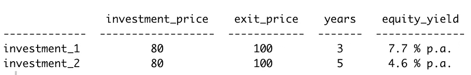
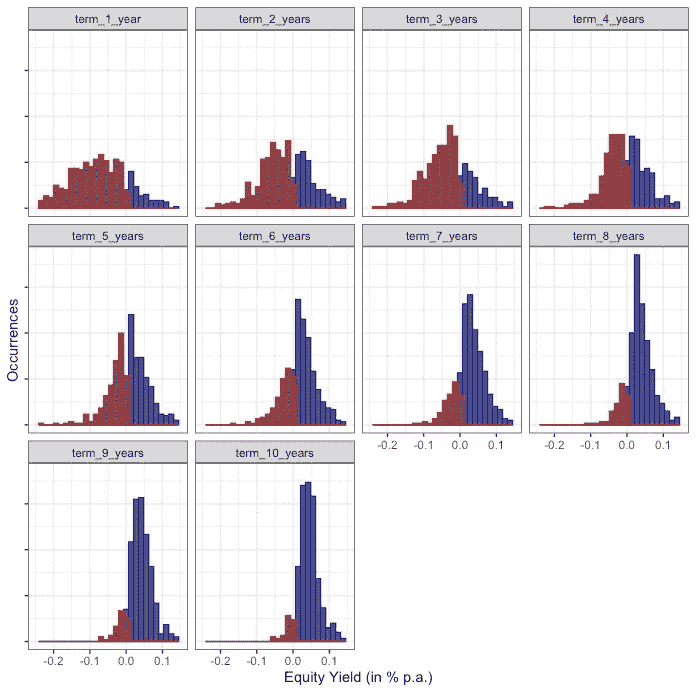
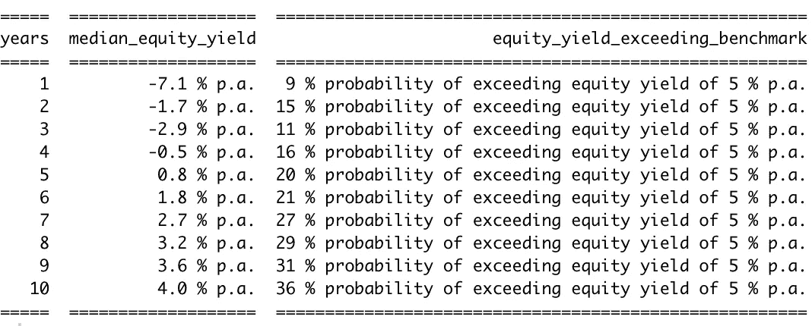

# 房地产中约束条件下的数据驱动决策

> 原文：<https://medium.com/analytics-vidhya/data-driven-decision-making-under-constraints-in-real-estate-30237674a0d9?source=collection_archive---------3----------------------->

# 受限决策环境

决策几乎从来都不是一件容易的事情。

既不是所有需要的信息都可用，也不是所有可能的选项都经过权衡和评估，以便在适当考虑所有风险和观点的情况下做出平衡的决策。

决策总是在一定的约束条件下做出的决策。当面对在一个可替代性较低的市场中用一种资产投入大量资本时，这些决策框架甚至会变得更糟。

另类投资市场，尤其是房地产市场，是让决策者面临诸多限制的市场之一。

在本文中，我们将讨论房地产业务中的**主要限制之一**:分别是**时间****时间**—**数据驱动的方法如何减轻一些负担**。

# 房地产投资

在大多数情况下，对房地产资产的投资是为了赚钱，这些钱可以用例如股票收益率来表示。

权益收益率主要取决于投资于某项资产的权益资本、出售时相关资产类别的市场收益率以及权益投资于该资产的时间。

换句话说，一项投资持续的时间越长，你就必须赚得越多，才能保持同等水平的股本收益率。

除此之外，这个行业还有各种各样的**投资者类型**。

投资者的范围包括那些跳入一个市场的人，他们拥有很小的股权碎片(与整体投资相比)，超短的投资视角，并希望市场收益率贬值足够快，以获得可观的利润退出资产。这是高度投机的极限。

另一个极端是真正以长期投资为导向的投资者，他们持有大量股票，不受周期性价格行为的影响，在投资生命周期内收集流动现金收入，并着眼于大的投资前景(甚至可以超过工作一代)。

也许这对这位超长期投资者来说并不重要，但对所有其他投资者来说，投资的时间方面以及投资的时机——包括这项投资的退出时机——是至关重要的。

# 解除约束

下面是一个时间框架如何影响股票收益率的例子:

按作者分类的表格

为了让他/她的钱得到最好的交易，投资者必须根据投资者的风险状况找到最佳的投资期限。问题在于，退出方案取决于对未来市场形势的假设。

你怎么知道 3 年后可以达到 100 的退出价格？你怎么知道这种情况在 5 年后还会发生？

这只是需要注意的一个参数。许多其他参数也在影响投资。问题是这些**退出参数的性质不确定，因为未来的发展受到关注**。这就是为什么这个**限制了决策者选择他/她的最佳选项的能力**。

**处理不确定性下决策的一种方式**是模拟基于各自市场模式的潜在投资场景，并根据其实现的概率进行加权。

**先进的预测分析模型即将登场！**

这些方法在这里支持决策者减轻一些约束。这方面有两个主要考虑因素:

*   处理不同的潜在市场情景，并根据实现的机会对其进行权衡。换句话说，在投资期限结束时，投资者最有可能面临的情况是什么。
*   考虑投资本身的期限，即评估**一段时间内投资的风险状况如何变化**。

第二个方面极其重要，因为它持续监控投资(或投资组合以保持更广泛的视野)的风险/机会概况，并帮助决策者在适当的时候做出反应。

# 投资期限内风险状况的变化

一旦投资的关键参数确定下来，投资者自然会受到各自房地产市场进一步发展的影响。

问题是未来市场的预期是什么，这将如何影响投资(或投资组合)的表现。更重要的是，这些风险/绩效状况如何随着时间的推移而变化？是否存在更高的机会窗口？是否存在风险显著增加的时期

事实上，这些都是决策者必须做出反应的主题，越早做出反应，回旋的余地就越大。

下图显示了基于模拟市场发展的一段时间内投资权益收益率的可能发展，而投资框架本身保持不变(红色…亏损区域，蓝色…盈利区域):

作者图片

似乎很明显，这项投资不算短期考虑，因为在最初几年亏损的概率比以后几年高得多(根本不考虑投资问题)。

每个时间情景的权益收益率中值以及获得权益收益率(比如说)超过 5 %的机会也证实了这一点。参见下表:

按作者分类的表格

这将是考虑此处所示的理想投资期限是否符合投资实体的整体战略/风险状况的时刻。

当然，**结果**是**而非静态**随着市场的进一步发展，市场模式也可能随着时间的推移而改变。这是定期监控投资和整个投资组合的**触发点，以便记住理想的时间框架**(如投资时间、退出时间)，并能够适时做出反应。

# 结论

**将时间框架和时机**纳入投资或投资组合的风险/绩效指标**提高了决策者在不确定条件下采取行动的可能性**。

它不会以股本收益率而告终。不同风险模块**的组合**，如短期流动性考虑、与债务融资合作伙伴的契约违约问题等，可以在受限环境下做出不同的决策。

顺便说一句，决策过程中的透明度是一个副作用。

另一个要点是**有时投资公司在投资中会受到某些期限的约束**。例如，为投资发放的贷款到期，公司债券必须在固定的期限内偿还，或者投资基金的期限终止，打破了固定的退出时间线。

在所有这些场景中，了解在各自的截止日期最有可能出现的场景并在适当的时候开始准备是非常有用的。

鉴于这些**帮助工具**可以在自动化基础上**交付**的事实，这无疑是将高级预测分析方法纳入最新风险管理系统的另一个有利论据。