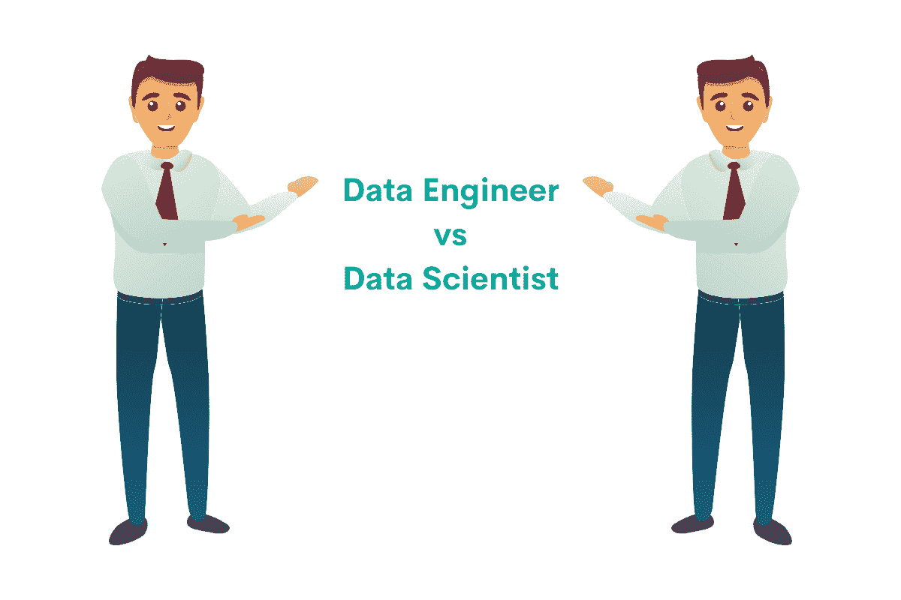
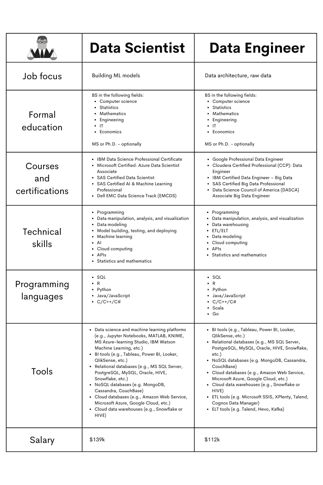

# 数据工程师与数据科学家:异同

> 原文：<https://medium.com/analytics-vidhya/data-engineer-vs-data-scientist-similarities-and-differences-4dcebeab7602?source=collection_archive---------5----------------------->

## *解释数据科学家和数据工程师的共同点和不同点。*



作者在 [Canva](https://canva.com/) 上创建的图片

如果您还不清楚数据科学家和数据工程师的相似之处和不同之处，那么您就来对地方了。我们将弥补这一点。

这篇“数据工程师与数据科学家”的文章旨在帮助你了解这两种工作职位，并选择适合你的职位。我们将根据教育程度、工资、工作描述和所需的技术技能来细分这两种工作。

下表显示了数据科学家和数据工程师之间的异同。这些只是要点，所以你能感受到我们将要谈论的内容。但是不要担心，我们很快就会进入更多的细节。



作者在 [Canva](https://canva.com/) 上创建的图像

# 数据工程师与数据科学家

## 什么是数据科学家？

数据科学最广泛的定义是，它是一门结合了计算机编程、数学和统计学以从数据中获得洞察力的学科。数据科学家大量参与数据，所以他们会组织数据、清理数据和分析数据。然后，这些数据将用于构建机器学习(ML)模型。ML 模型有助于发现数据中的趋势和模式，因此未来的业务决策具有预期的效果。这种预期效果通常是公司在销售、成本和利润方面的改进表现。

## 什么是数据工程师？

数据科学家是数据科学领域最普遍、最广泛的职位。如果你来自数据科学背景，它需要你获得的大部分技能。所有其他工作或多或少都源自数据科学家，并专注于数据科学家的一项特定工作。

对于一个数据工程师来说也是如此。他们主要关注数据基础设施，包括将数据提供给其他用户。换句话说，他们维护、优化和开发数据基础设施。他们处理原始数据及其质量、可用性和可读性。他们分析数据，并将其转换成适合其他人使用的格式。他们维护数据管道，这意味着他们关心提取、转换和加载(ETL)数据。

# 数据工程师 vs 数据科学家:正规教育


作者在 [Canva](https://canva.com/) 创建的图像

从一开始就要确保:要成为数据科学家或数据工程师，并没有严格的规则。正规教育也是如此。数据科学家和数据工程师的教育背景、工作经验等各不相同。你甚至不需要大学文凭。然而，它是有帮助的。

例如，拥有一个学士学位。尤其是如果它是计算机科学、统计学、数学、工程学、it、经济学或任何相关定量领域的学位。虽然没有规则，但必须指出的是，大多数数据科学家和数据工程师都来自这些研究领域。

如果你有以上任何一个领域的硕士甚至博士学位，那就更好了。这将大大增加你获得工作的机会和你可以协商的薪水。

# 数据工程师 vs 数据科学家:课程和认证

有没有正规教育不重要；在空闲时间完成一些课程并获得认证将对你的职业生涯非常有益。不仅仅是因为这通常能保证知识，还因为这表明你愿意提高自己的知识水平并不断努力。

## 数据科学家

您可以参加的其他教育和认证包括:

*   IBM 数据科学专业证书
*   微软认证:Azure 数据科学家助理
*   SAS 认证数据科学家
*   SAS 认证的人工智能和机器学习专家
*   戴尔 EMC 数据科学认证方向(EMCDS)

## 数据工程师

如果你也想成为一名数据工程师，你可以使用上面的建议。毕竟，数据工程是数据科学的一部分。但是，有些认证更侧重于数据工程，例如:

*   谷歌专业数据工程师
*   Cloudera 认证专家(CCP):数据工程师
*   IBM 认证数据工程师—大数据
*   SAS 认证大数据专家
*   美国数据科学委员会(DASCA)大数据工程师助理

# 数据工程师与数据科学家:技术要求

## 数据科学家

**技术技能**

作为一名数据科学家，你需要的技术技能符合工作描述。首先，你必须能够检索数据，操作数据，分析数据，然后将数据可视化。为此，你必须具备良好的编程技能。你还需要经常从 API 中提取数据，所以你必须知道如何去做。所有这些数据处理的目的是建立、测试和部署一个机器学习模型。为此，你将再次需要编程技能，但也需要统计、数学和人工智能方面的技能。最后，您将需要云计算技能，因为您需要以某种方式部署模型并将其付诸实践。

**编程语言**

虽然数据科学家不仅仅是程序员，但他们需要非常了解一些编程语言。数据科学中通常使用的语言有:

*   结构化查询语言
*   稀有
*   计算机编程语言
*   Java/JavaScript
*   C/C++/C#

前三个是最受欢迎的。

**工具**

数据科学家通常处理大量数据。他们将大量使用关系数据库(如 MS SQL Server、PostgreSQL、MySQL)和 NoSQL 数据库(如 MongoDB、Cassandra、CouchBase)以及基于云的数据仓库，如 Snowflake 或 HIVE。说到云，你可能会使用云数据库，因为越来越多的[数据科学公司](https://www.stratascratch.com/blog/ultimate-guide-to-the-top-5-data-science-companies/?utm_source=blog&utm_medium=click&utm_campaign=medium)正在向云转移。这种云数据库的例子有亚马逊网络服务、微软 Azure 和谷歌云，但它们肯定不是唯一的。最后，数据科学家使用数据科学和机器学习工具，如 Jupyter 笔记本、MATLAB、KNIME、MS Azure-learning Studio、IBM Watson 机器学习等。

## 数据工程师

**技术技能**

数据工程师的重点是处理数据基础设施和一般的原始数据。这意味着数据清理、准备、操作和分析。这再次意味着你必须擅长编程和从 API 中提取数据。即使你需要数学和统计技能来进行数据分析，你也不会像数据科学家那样广泛地使用它们。主要原因是，作为一名数据工程师，你不会构建 ML 模型。

你要做的是确保数据科学家(和其他与数据打交道的同事)拥有可以用来建立 ML 模型的数据。要做到这一点，你需要具备数据库、数据仓库和数据的 ETL/ELT 方面的知识。

**编程语言**

您将使用数据科学中常用的所有编程语言:

*   结构化查询语言
*   稀有
*   计算机编程语言
*   Java/JavaScript
*   C/C++/C#

在数据工程中还有另外两种相当常见的语言:

*   斯卡拉
*   去

这两种语言主要用于处理大数据。

**工具**

您将使用数据科学家正在使用的大多数工具。当您处理数据时，您肯定需要处理一些最流行的 RDBMSs 和 NoSQL 数据库。你将使用云数据库和数据仓库。一般来说，你不会使用数据科学和机器学习工具。但是，您将使用的是 ETL 工具，如微软 SSIS、XPlenty、Talend、Cognos 数据管理器等。随着 ELT 方法在数据工程中越来越受欢迎，您可能也会使用 ELT 工具。比如塔伦德、赫沃、卡夫卡等。

# 数据工程师 vs 数据科学家:工作机会


作者在 [Canva](https://canva.com/) 上创建的图像

# 数据科学家

在撰写本文时，[在美国的 Glassdoor 上有超过 11，300 个数据科学家职位。](https://www.glassdoor.com/Job/data-scientist-jobs-SRCH_KO0,14.htm?minSalary=64000&maxSalary=64000)

作为一名数据科学家，你可以有多种选择。它可以是各种科学机构和学院、金融机构、制药公司、咨询公司、工程和技术公司，以及任何介于两者之间的公司。基本上，每个有自尊的公司都会广泛使用数据，这意味着你的专业知识适用于(几乎)任何行业。你有时候需要的是一些具体的商业和行业知识，这些知识通常是伴随经验而来的。

*在这里，我们提供了一个非常具体和实用的指南，告诉你如何获得一份数据科学工作* *。*

# 数据工程师

在撰写本文时，美国 Glassdoor 网站上有近 8000 个数据工程师的招聘广告。

关于选项的多样性，类似于数据科学家。很多公司都提供不同级别的数据工程职位，比如微软、思科系统、Spotify、网飞、万事达、亚马逊网络服务、CLS 国际银行、Adobe、亚利桑那大学、苹果、特斯拉、英特尔、宝洁、纽约时报等等。

# 数据工程师 vs 数据科学家:工资

## 数据科学家

根据 Glassdoor 的数据，数据科学家的平均收入略低于 13.9 万美元。这意味着薪水一般在 10.9 万美元到 17.1 万美元之间，取决于资历和公司。数据显示，只有 25%的数据工程师收入低于 12.8 万美元，而 75%的数据工程师收入高于 12.8 万美元。此外，25%的数据工程师收入超过 15.1 万美元。

这是基本工资。你还可以获得平均约 11.5 万美元的额外工资。

总的来说，你的总收入平均在 151，000 美元左右。

*我们的文章* [***数据科学家挣多少钱***](https://www.stratascratch.com/blog/how-much-do-data-scientists-make/?utm_source=blog&utm_medium=click&utm_campaign=medium) *可以帮助你了解薪水以及它们是如何受到几个因素的影响。*

## 数据工程师

作为一名数据工程师，你的平均收入会比数据科学家低一点。根据 Glassdoor 的说法，这意味着大约 11.2 万美元的年薪。据报道，最低工资为 7.6 万美元，最高工资约为 16.5 万美元。同样，这很大程度上取决于你的经验、教育程度、职位资历和你工作的公司。

# 数据工程师 vs 数据科学家:工作面试问题

要开始数据科学家或数据工程师的职业生涯，你需要从某个地方开始工作。这包括参加工作面试和回答旨在测试你知识的问题。和其他工作一样，这些问题也是非技术性的，但我们不会关注这类问题。我们将讨论测试这两个职位所需的特定技能的问题。

## 数据科学家

你最有可能在面试中遇到的技术性面试问题可以分为以下几类:

*   编码
*   概率与统计
*   建模
*   技术的
*   产品

我们将浏览每个类别，向您展示[数据科学面试问题](https://www.stratascratch.com/blog/data-science-interview-guide-questions-from-80-different-companies/?utm_source=blog&utm_medium=click&utm_campaign=medium)的示例。

**编码**

[数据科学编码面试问题](https://www.stratascratch.com/blog/data-science-coding-interview-questions-with-5-technical-concepts/?utm_source=blog&utm_medium=click&utm_campaign=medium)是为了测试你的[编程语言](https://www.stratascratch.com/blog/top-5-data-science-programming-languages/?utm_source=blog&utm_medium=click&utm_campaign=medium)技能。这里有一个来自谷歌的测试你 SQL 编码技能的例子:

***邮件与活动时间的关联***

*“有两个用户活动表。“google_gmail_emails”表包含发送给用户的电子邮件的信息。表格中的每一行代表一条消息，在“id”字段中有一个唯一的标识符。“google_fit_location”表包含来自 Google Fit 应用程序的用户活动日志。
在这里你会发现收到的电子邮件数量和每天总运动量之间的相关性。每天的总运动量通过计算每天的用户会话数来计算。”*

回答:

```
SELECT corr(n_emails :: NUMERIC, total_exercise :: NUMERIC)
FROM
  (SELECT to_user,
          DAY,
          COUNT(*) AS n_emails
   FROM google_gmail_emails
   GROUP BY to_user,
            DAY) mail_base
INNER JOIN
  (SELECT user_id,
          DAY,
          COUNT(DISTINCT session_id) AS total_exercise
   FROM google_fit_location
   GROUP BY user_id,
            DAY) loc_base ON mail_base.to_user = loc_base.user_id
AND mail_base.DAY = loc_base.DAY 
```

**概率&统计**

除了编码，你还需要统计学知识来完成你的主要工作，即构建 ML 模型。期望从 DE Shaw & Co 得到类似的问题[:](https://platform.stratascratch.com/technical/2194-sample-size?utm_source=blog&utm_medium=click&utm_campaign=medium)

***高斯的期望***

*“给你两个高斯变量:X_1 和 X_2，均值 m_1，m_2，方差 v_1，v_2。
假设你知道总和 X_1 + X_2 等于 n，X_2 的期望值是多少？”*

回答:

*一个可能的答案:*

*如果我们知道 X_1 和 X_2 之和等于 n，这就意味着这两个高斯变量不是相互独立的。*

*同样，我们知道高斯分布的随机变量的期望值为:* `E[X]=μx`

*这意味着高斯分布的随机变量的期望值等于其均值。*

```
E[x1]+E[x2]=E[x1+x2]=n
μ1+μ2=n
μ2=n−μ1
```

**建模**

建模问题测试你建立模型的技能。通常，这也意味着测试你的统计学知识，但是是在一个不太理论的层面上。这样的例子是[来自 Via Transportation(纽约)的问题](https://platform.stratascratch.com/technical/2260-changing-the-scale-of-distance?utm_source=blog&utm_medium=click&utm_campaign=medium):

***改变距离的比例***

*“如果我们要建立一个以距离(骑手当前位置和取车位置之间的距离)为特征，以骑手接受度为输出的 logistic 回归模型，那么特征的系数会有什么意义？如果我们改变距离的比例(从英里到公里，或者从公里到米)，模型会发生什么变化？”*

**技术**

技术问题通常会测试你的编程语言知识。与编码问题相比，技术问题不需要你写代码，而是以描述性的方式回答。下面是这样一个问题的例子，[这个问题来自沃尔玛，测试你的 Python 知识](https://platform.stratascratch.com/technical/2072-data-structures-in-python?utm_source=blog&utm_medium=click&utm_campaign=medium):

***Python 中的数据结构***

*“Python 中的数据结构是什么？”*

回答:

*Python 中常用的数据结构:*

*List:List 是可变的，可以包含重复的记录，可以包含不同类型的对象，无论是 string、int、float 等等。*

*my_list = ['香蕉'，8，3.14，'香蕉']*

*集合:集合包含对象的无序集合。但是，一个集合在其每个元素中只包含一个唯一的记录。*

*水果= { '葡萄'，'香蕉'，'苹果'，'香蕉' }*

*打印(水果)*

*>>>{‘葡萄’，‘香蕉’，‘橘子’}*

*元组:元组类似于列表。元组和列表的一个明显区别是元组是不可变的，也就是说，一旦我们写了元组的元素，我们就不能在以后动态地改变它们。只能读。*

*my_tuple = '香蕉'，8，3.14*

*打印(我的元组)*

*> > >(《香蕉》，8，3.14)*

*我的元组[0] = '苹果'*

*> > >类型错误:“元组”对象不支持项目赋值*

*字典:字典在其元素中包含一个键-值对，其中键总是唯一的。*

*雇员= {'1001 ':'大卫'，' 2002 ':'杰克' }*

*打印(员工['1001'])*

*> > >【大卫】*

**产品**

这些问题考验你的技术能力，也考验你对公司产品的了解和对他们业务的理解。例如，[易贝在求职面试中问了这个问题:](https://platform.stratascratch.com/technical/2075-identify-ebay-objects?utm_source=blog&utm_medium=click&utm_campaign=medium)

***识别易趣对象***

*“Ebay 必须将摄像头与三脚架、线缆和电池等其他物品区分开来。你的方法是什么？数据包括广告标题、产品描述、价格、图片等*

## 数据工程师

数据工程师的工作面试问题与数据科学家的没有太大区别。您应该预料到的问题类别有:

*   编码
*   概率与统计
*   技术的
*   产品
*   系统设计

主要的区别是，由于工作的性质，你不会被问到建模的问题。概率和统计的问题会更少，也可能更容易。然而，你会得到一个数据科学家没有得到的问题类别:系统设计问题。

脸书提出的[问题就是这样一个例子:](https://platform.stratascratch.com/technical/2006-comparing-performance-of-engines?utm_source=blog&utm_medium=click&utm_campaign=medium)

***对比发动机性能***

*“您如何比较自动生成脸书“朋友”建议的两个不同后端引擎的相对性能？”*

另一个例子是[大会](https://platform.stratascratch.com/technical/2113-python-dictionary-to-store-data?utm_source=blog&utm_medium=click&utm_campaign=medium)提出的问题:

***存储数据的 Python 字典***

*“什么时候我会使用 Python 字典来存储数据，而不是另一种数据结构？”*

其他类别中的问题或多或少与数据科学家面试中的问题相同。请记住，它们可能更加面向原始数据和数据架构。

例如，技术问题可以是类似于 Airbnb 的问题:

***估算缺失信息***

“你如何估算缺失的信息？”

回答:

处理缺失值的方法取决于我们拥有的数据类型:要么是数字数据，要么是分类数据。

*如果我们有数值数据:*

*   *用平均值填补缺失数据。当缺失值的比例很小时，这种方法非常适合。然而，我们需要确保数据中没有异常值。如果我们有一个异常值，用平均值填充缺失值会在我们的数据中引入偏差。*
*   *用中值来填充缺失的数据。当缺失值的比例很小时，这种方法也非常适合。与平均值相比，中位数对异常值更稳健。如果我们的数据中有异常值，那么中位数将是一个更好的选择。*
*   *使用正向填充来填充缺失的数据。如果我们处理的数据中有一个模式，向前填充将是一个很好的选择。向前填充将用以前的数据填充丢失的值。*
*   *使用反向填充来填充缺失的数据。对于向前填充也是一样，如果我们处理的数据中有一个模式，这种方法将是一个很好的选择。向后填充将用下一个数据填充丢失的值。*
*   *使用线性回归等机器学习算法来预测缺失值。我们可以构建一个简单的线性回归模型，该模型可以使用其他特征来预测缺失值的值。*

*如果我们有分类数据:*

*使用模式来填充缺失的值。模式将使用数据中最常见的分类值来填充缺失值。”*

# 数据工程师 vs 数据科学家:结论

上面的“数据工程师与数据科学家”对比向您展示了数据科学家和数据工程师之间的相似之处多于不同之处。

数据科学家是最通用的职位头衔，包含了数据科学背景的人所需的所有知识和技能。

数据工程师是数据科学家，主要专注于数据科学的一个特定方面:处理原始数据和数据基础设施。

虽然数据工程师的工资一般略低，但这两种工作都是高薪的，并且需要特定的技能。工作面试问题通常测试工作中类似的技术方面。主要的区别是数据科学家将不得不回答更多的统计和建模问题。另一方面，数据工程师必须对系统设计有更多的了解。这也可以反映在其他问题类别中，这些问题类别将侧重于数据科学的系统设计方面。

现在，你可以更容易地在这两条职业道路之间做出选择，决定哪一条更接近你的兴趣和技能。

*最初发表于*[*https://www.stratascratch.com*](https://www.stratascratch.com/blog/data-engineer-vs-data-scientist-similarities-and-differences/?utm_source=blog&utm_medium=click&utm_campaign=medium)*。*