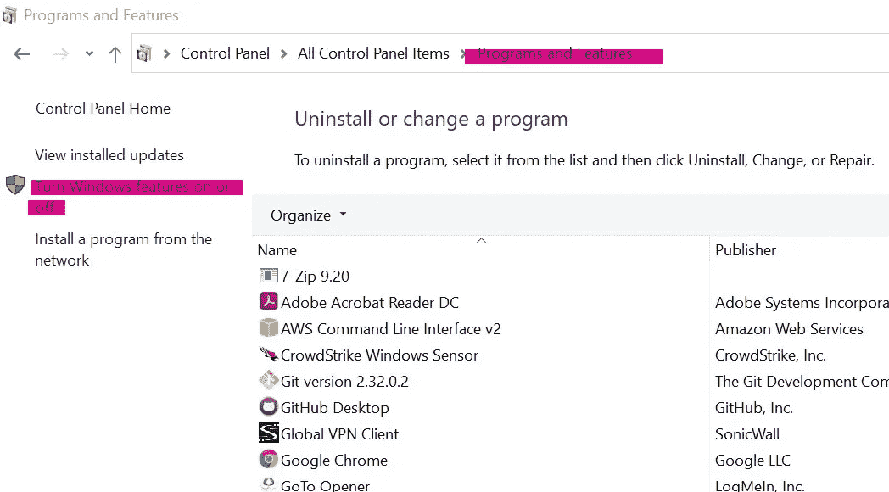
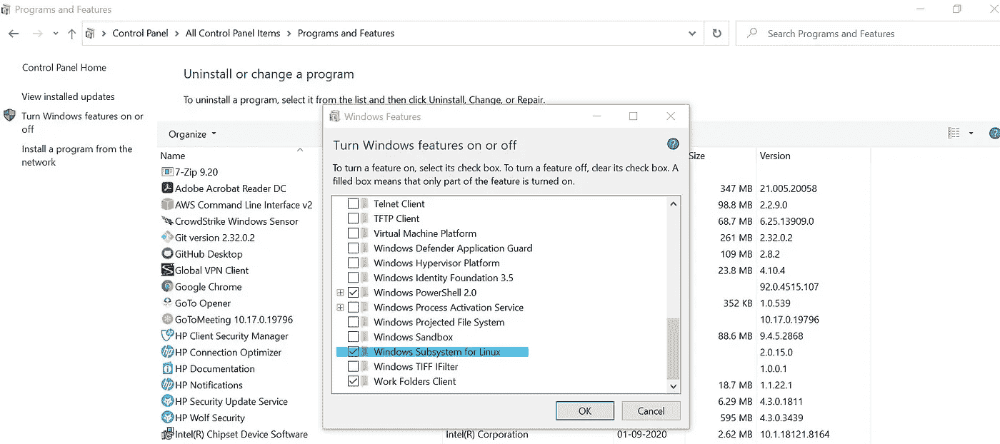
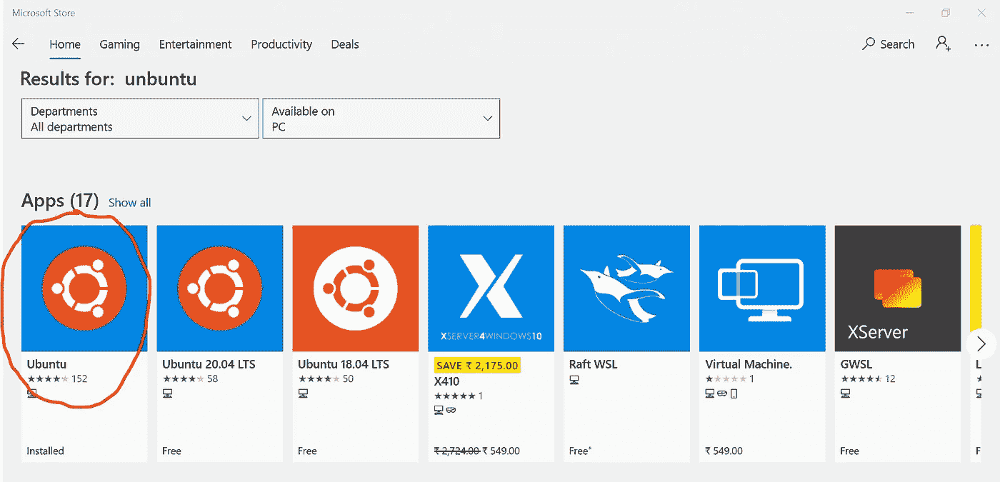
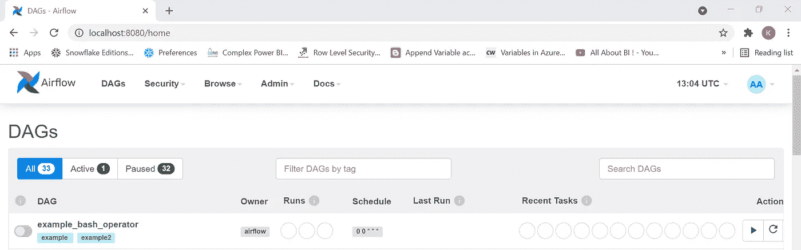

# 在没有 Docker 的 Windows 10 上安装 Apache Airflow

> 原文：<https://medium.com/analytics-vidhya/data-engineering-installing-apache-airflow-on-windows-10-without-docker-93635c3819c3?source=collection_archive---------2----------------------->

**什么是气流？**

Apache Airflow 是一个用于创作、调度和监控工作流的开源平台。Airflow 帮助您使用 Python 编程语言创建工作流，并且可以使用它轻松安排和监控这些工作流。Airflow 提供了与几种云技术的连接，如雪花、Google Big Query、Apache pig、Apache Sqoop 等等。

**如何在 Windows 10 上安装 airflow？**

Airflow 只在 Unix 系统上运行，所以为了让它在 windows 上工作，我们使用了 windows 子系统。Linux 的 Windows 子系统允许开发人员直接在 Windows 上运行 GNU/Linux 环境，包括大多数命令行工具、实用程序和应用程序，无需修改，没有传统虚拟机或双引导设置的开销。

**第一步**:在你的 windows 机器上启用【Linux 的 Windows 子系统

转到你的*控制面板*。选择*程序和功能*。点击*打开或关闭 Windows 功能*

为 Linux 启用' *Windows 子系统*

*注意:这可能需要行政许可*

**第二步**:去你的*微软商店*和安装 *Ubuntu*

第三步:从你的开始菜单启动 Ubuntu。运行以下命令以安装和更新 PIP

sudo apt-get 安装软件-属性-通用

sudo apt-add-repository 宇宙

sudo apt-get 更新

sudo apt-get 安装 python3-pip

**第四步:**安装气流—按以下指令顺序运行

export SLUGIFY _ USES _ TEXT _ UNIDECODE = yes

sudo pip3 安装 Apache-气流

第五步:我们需要初始化数据库。为了执行下面的运行命令

气流数据库初始化

**步骤 6:** 在气流上运行调度程序

气流调度程序

**第七步:**下一步是启动 airflow webserver。对于相同的“在下面运行”命令。

气流网络服务器-p 8080

**步骤 8:** 创建一个管理员用户，用于登录 airflow 服务器

airflow 用户创建—角色管理—用户名管理—电子邮件管理—名字管理—姓氏管理—密码管理

Airflow webserver 准备就绪-'[http://localhost:8080/](https://www.youtube.com/redirect?event=video_description&redir_token=QUFFLUhqbjN2Ump6dUJzTUd6VWJtbWJGZnlsTDBkM2FzUXxBQ3Jtc0tsU2dyVzJrelJUVkMzTjZ4SWctbVoxclUtcDJIal9ibGpHdTZKeHRZb3l3b2ZQUW1ISVp0WHRGdEVGeUR6MXhTWVZMYUdONEc0d05hT1FvUFdmSmkzbFJEN3VMXzFRbVgtMG5FWG5nS0VGQTFXTTA1WQ&q=http%3A%2F%2Flocalhost%3A8080%2F)'！

您现在可以设计您的数据了！！享受使用 airflow 创建数据管道和调度的乐趣。