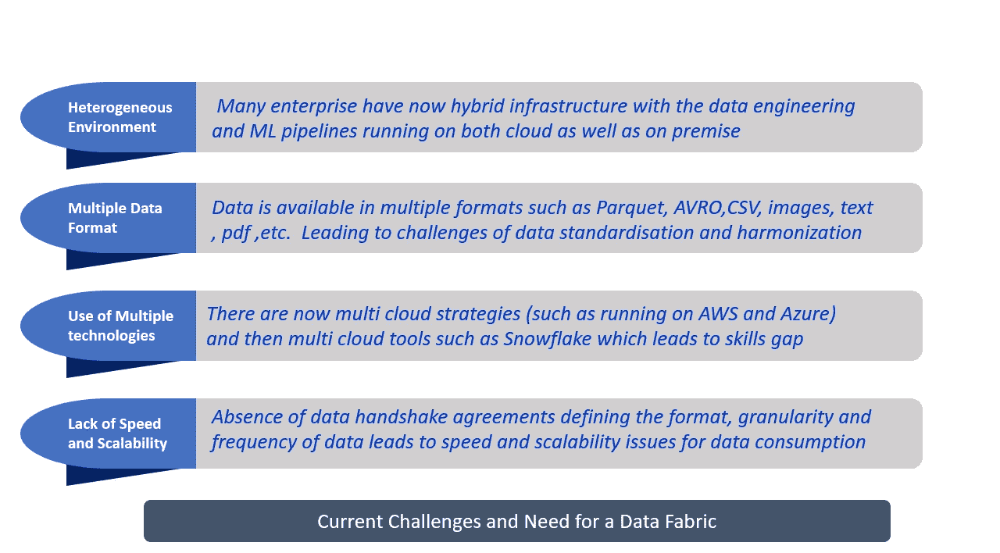
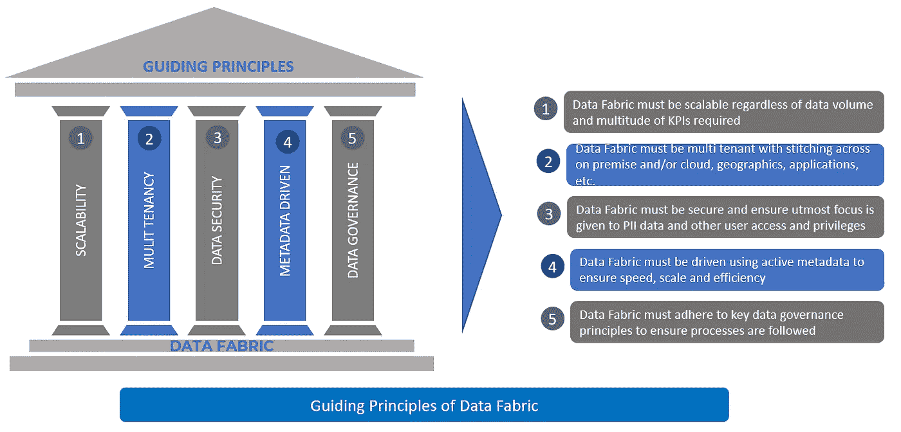

# 数据结构:加速后 COVID 时代的企业数字化转型利用“数据结构”

> 原文：<https://medium.com/analytics-vidhya/data-fabric-41633636fb84?source=collection_archive---------15----------------------->

COVID 疫情加速了(在某些情况下)许多大型企业的数字化进程，以节省成本和提高运营效率。许多数据落后的组织已经开始了解数据的商业价值，以及只有当他们知道如何使用数据并及时从中获得洞察力时，数据才是一种资产。

**谁需要数据结构？**上午 8 点，我与一位客户进行了需求收集电话会议，虽然我们希望从常规的探查性问题开始，以了解业务问题，但在几分钟内，电话会议像滚雪球一样变成了讨论燃眉之急，当他有机会发言时，我们的客户开始谈论这个问题:他有 30 年的经验&他惊讶地发现，在 2021 年，他有一个由 10 名数据科学家组成的团队，他们 90%的工作时间仍然花在数据争论、数据映射和等待来自多个来源的数据等方面。他买了一个自助式企业 AI 产品，是一个已知的低码无码平台。他自信地说，他的团队非常了解这个领域，他们可以在 2-3 天内大量产生 100 个关键 KPI，这是回答业务用例并获得洞察力所必需的，但有一个问题，即数据。数据格式不正确，或者在某些情况下缺少关键属性，或者没有正确的粒度，等等。考虑到我们已经做了功课，与当地的人们交谈过，我们明白问题出在哪里。我们提供了一个解决方案来加速他想要的解决方案——“数据结构”，它减少了在分布式环境中共享数据的摩擦。

**什么是数据结构？**

Data Fabric 是一种**数据设计**，它指导组织采用**统一架构**，尤其是当企业架构分布在内部和云上，许多组织利用利用不同工具的多语言解决方案时，从而加速数据转换并实现跨分布式数据环境的无摩擦数据共享。

**当前的挑战和对数据结构的需求**

许多组织现在正处于数字化转型的**高速增长周期**，我们已经看到**对数据产品**的需求不断增长，以满足多种复杂的业务需求。为了支持这些数据产品，需要集成来自多个工具、本地环境、云和多个地理位置的数据。要做到这一点，以下是人们面临的常见挑战以及为什么需要数据结构:

**构建数据结构的指导原则**

数据产品和数字化转型之旅的目标应该是构建一个数据结构，以提供一个更加集成安全的数据设计，并利用统一的架构以速度和可扩展性向客户提供数据。以下是构建数据结构时需要牢记的关键指导原则:

总的来说，将**数据结构实施为数据设计**的最终结果是，它通过处理云和内部的多种环境来加速数据管理，通过使用预定义的连接器连接数据来提高数据质量、数据转换和治理能力，以最少的编码缝合数据，并允许数据消费者进行无摩擦的数据消费！