# 数据洞察(第 4 部分):超级市场分店销售的 POWER BI 仪表板和报告

> 原文：<https://medium.com/analytics-vidhya/data-insights-part-4-power-bi-dashboard-and-report-for-supermarket-sales-db2332747ea9?source=collection_archive---------2----------------------->

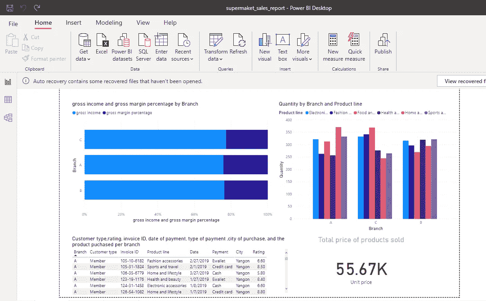

超市分店销售的 Powerbi 桌面报告

# **简介**

**数据集描述:**在大多数人口密集的城市中，超市的增长正在增加，市场竞争也很激烈。该数据集是超市公司的历史销售额之一，记录了 3 个不同分支机构 3 个月的数据。数据分析方法很容易应用于该数据集。

**数据集属性信息** : **发票 id** :电脑生成的销货单发票标识号，**分支**:购物中心分支(有 A、B、C 三个分支)。**城市**:购物中心所在地，**客户类型**:客户类型，使用会员卡的客户由会员记录，无会员卡的为正常。**性别**:客户性别类型。**产品线**:一般商品分类组——电子配件、时尚配件、食品和饮料、健康和美容、家居和生活方式、运动和旅行。**单价**:每件产品的价格，单位为美元。数量:客户购买的产品数量。**税**:客户购买的 5%税费。**合计**:含税总价。**日期**:购买日期(2019 年 1 月至 2019 年 3 月有记录)。**时间**:购买时间(上午 10 点到晚上 9 点)。**付款**:客户购物时使用的付款方式(有现金、信用卡和电子钱包三种方式)。**销货成本**:销货成本。****毛利率**:毛利率。**总收入**:总收入。**评级**:客户对其整体购物体验的分层评级(从 1 到 10)**

****下载数据集:**【https://www.kaggle.com/aungpyaeap/supermarket-sales **

****目标:**这个项目包含一个超市销售的详细报告和仪表板，对于超市的分店，我们回答一些关于分店销售的问题以获得数据洞察力。我们还为分支机构 A 超市的销售创建了一个仪表板。**

# ****学过的概念****

> ***(一)如何在 Power BI 桌面制作报表并发布到 Power BIcloud。***
> 
> ***(二)如何钉住 Power BI 仪表盘。***
> 
> ***(三)如何在 Power BI 中创建可视化效果***

# ****概要****

> ***1。在 Powerbi 桌面上制作报告***
> 
> ***2。将报告发布到 Powerbi cloud***
> 
> ***3。在 Powerbi cloud 中锁定仪表板***

1.  ****在 Power BI 桌面上制作报告****

**什么是 Powerbi 桌面？**

**Power BI Desktop 是一个免费的应用程序，安装在本地计算机上，可以连接、转换和可视化数据。使用 Power BI Desktop，您可以连接到多个不同的数据源，并将它们组合(通常称为建模)到一个数据模型中。**

**什么是 Power BI service 或者Power BI cloud？**

**Power BI cloud 在互联网上运行，允许有效访问 Power BI 报告、仪表盘等。大多数从事商业智能项目的用户使用 Power BI Desktop 创建报告，然后使用 *Power BI 服务*与其他人共享他们的报告。**

**超市销售报告包含三张表，显示了超市分支 A、B 和 C 的不同分析和可视化。**

****第 1 页报告****

**(I)三个分支机构的总收入和毛利率是多少？**

**注意:要在 powerbi desktop 中选择可视化工具，只需单击包含不同图表的右侧窗格，然后选择适当的数据字段。**

**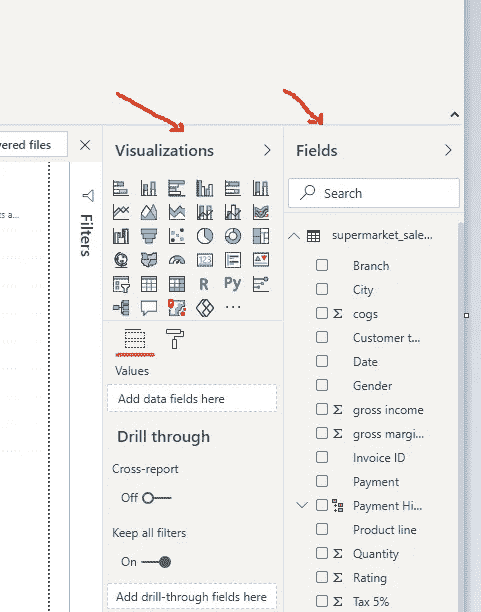**

**powerbi desktop 中的可视化和数据字段窗格**

**我们可以使用堆叠条形图来显示三个分支机构的总收入和毛利润。**

**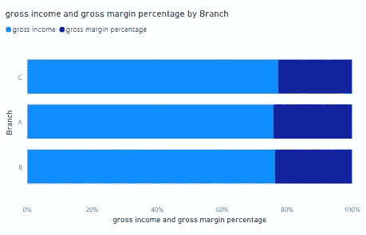**

**堆叠条形图以直观显示总收入和毛利润**

**(ii)三个分公司销售的产品线数量是多少？**

**这里使用的是簇状柱形图。**

**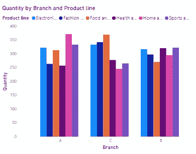**

**聚类柱形图，直观显示三个分支机构的产品线销售数量**

**(iii)每个分行的客户类型、评级、发票 ID、付款日期、付款类型、购买城市和购买的产品是什么？**

**数据透视表最适合这种表示**

**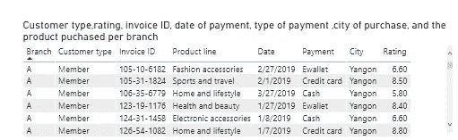**

**客户类型、评级、发票 ID、付款日期、付款类型、城市的数据透视表**

**(iv)三家分公司销售的产品总价是多少？**

**我们可以简单地用一张卡片来表示。**

**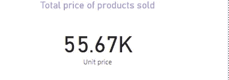**

**三家分店销售产品总价卡**

**(v)第 1 页的完整报告**

**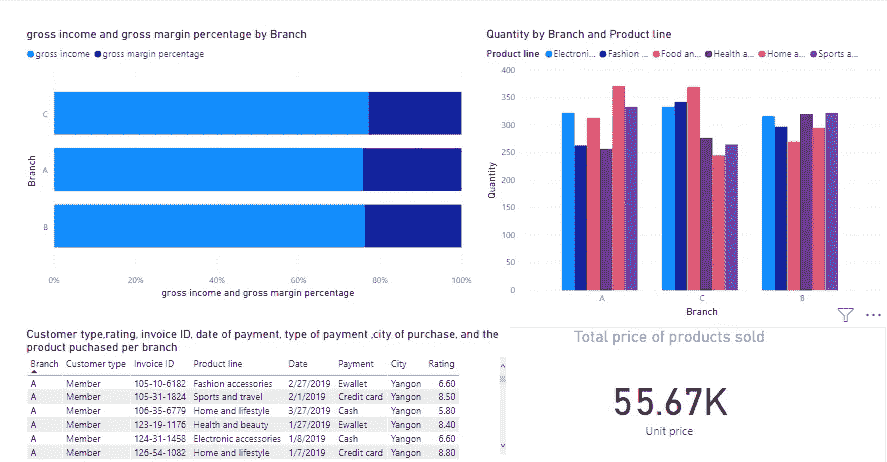**

**完成表 1 的报告**

****第 2 页报告****

**(一)在三家分公司购买的 5%税产品数量？**

**我们可以简单地用折线图和簇状柱形图来表示这一点。**

**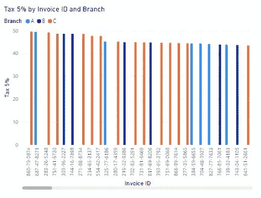**

**表示在三个分支机构购买的产品的 5%税收的线形和簇状柱形图**

**(ii)客户对每种产品的评价如何？**

**使用折线图**

**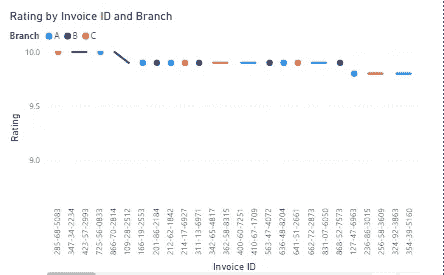**

**显示客户购买的每个产品的评级的折线图**

**(iii)总收入、毛利百分比、商品成本(COG)和含税总价的总数是多少。**

**使用卡片**

**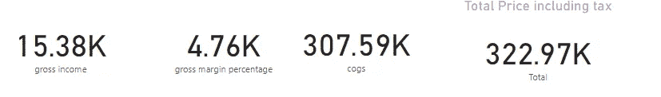**

**显示总收入总数、毛利百分比、商品成本(COG)和含税总价的卡片**

**(iv)完成表 2 报告**

**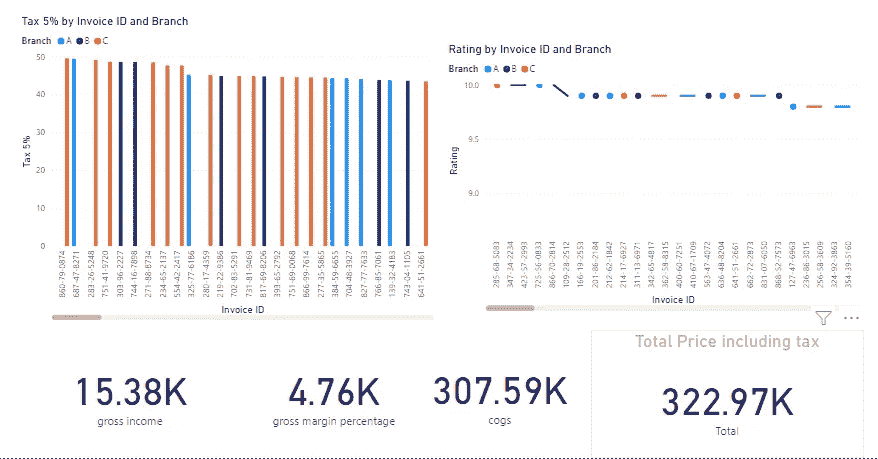**

**完成工作表 2 报告**

****表 3 报告****

**(I)每个分支机构的产品总数是多少？**

**用一个圆环图来表示。**

**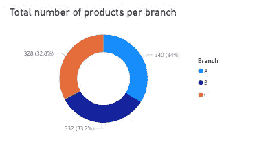**

**显示每个分支机构产品总数的圆环图**

**(ii)每个城市和分支机构的产品数量和总数是多少？**

**在这里使用地图。**

**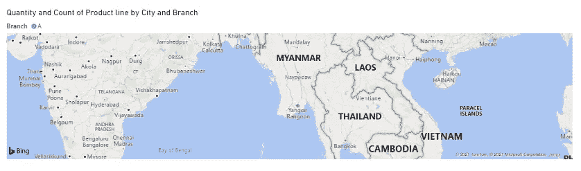**

**显示每个城市和分支机构的产品数量和总数的地图？**

**(iii)添加一个简单的 QnA 对话(可选)**

**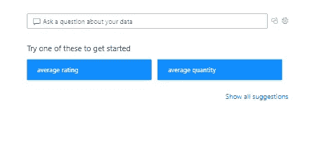**

**问题和答案字段**

**(iv)完成表 3 报告**

**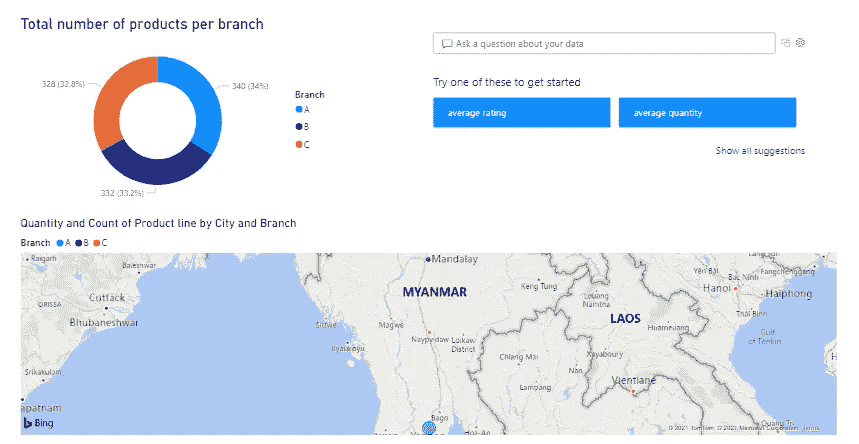**

**完成表 3 报告**

****2。将报告发布到 Powerbi cloud****

**现在，我们可以将此报告发布到 Power BI cloud，这样我们就可以与每个人共享，还可以从中锁定一个控制面板。**

**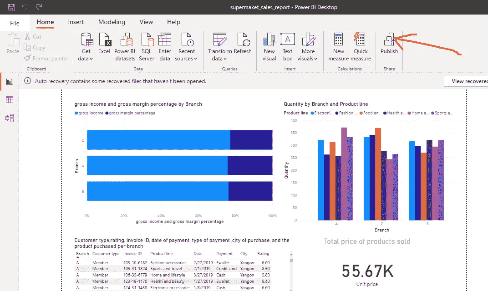**

**点击 powerbi desktop 中的发布**

**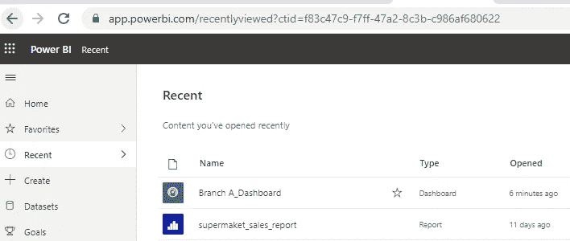**

**登录 powerbi cloud 查看发布的报告**

****3。在 powerbi cloud 中锁定仪表板****

**我们可以很容易地从我们发布的报告中锁定一个仪表板，以查看超市销售的信息。单击控制面板时，它会打开主报告以获取更多信息。**

**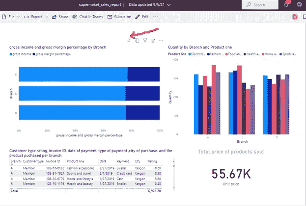**

**突出显示分支 A，并单击锁定图标来锁定分支 A 的仪表板**

**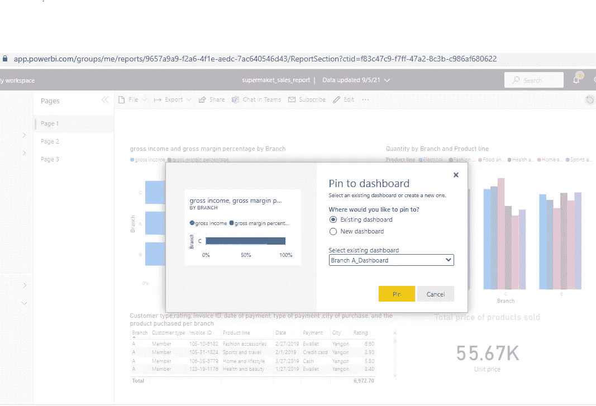**

**添加仪表板的名称**

**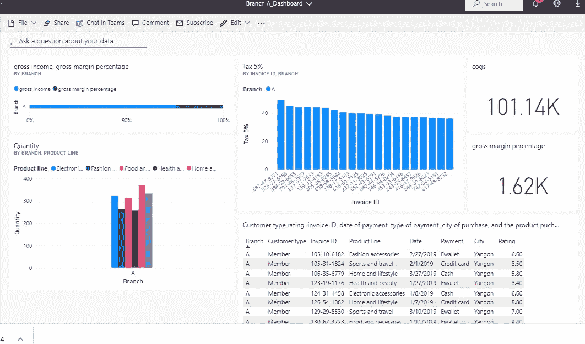**

**仅包含分支机构 A 中超市销售信息的仪表板。**

# ****结论****

**这篇文章展示了如何从超市销售数据中获得洞察力，并用适当的图表表示它，以及如何构建 powerbi 仪表板和报告。**

****编剧** : OLUYEDE SEGUN。(小)**

****使用的资源(参考资料)和进一步阅读:****

** [## 什么是 Power BI 桌面？-电源 BI

### Power BI Desktop 是一个免费的应用程序，您可以安装在本地计算机上，让您连接、转换和…

docs.microsoft.com](https://docs.microsoft.com/en-us/power-bi/fundamentals/desktop-what-is-desktop) 

**下载 Powerbi 文件的链接:**[https://projectsss . S3 . us-east-2 . amazonaws . com/super maket _ sales _ report . pbix](https://projectsss.s3.us-east-2.amazonaws.com/supermaket_sales_report.pbix)

**链接到数据洞察系列第一部分**:[https://juniorboyboy 2 . medium . com/data-insights-Part-1-using-k means-clustering-to-classify-data-into-groups-4a 467 c 36 fa](https://juniorboyboy2.medium.com/data-insights-part-1-using-kmeans-clustering-to-classify-data-into-groups-4a467c3c36fa)

**领英简介**:[https://www . LinkedIn . com/in/oluyede-segun-ade deji-Jr-a 5550 b 167/](https://www.linkedin.com/in/oluyede-segun-adedeji-jr-a5550b167/)

推特简介:[https://twitter.com/oluyedejun1](https://twitter.com/oluyedejun1)

**标签**:# power bi #报告#仪表板#可视化#数据洞察**