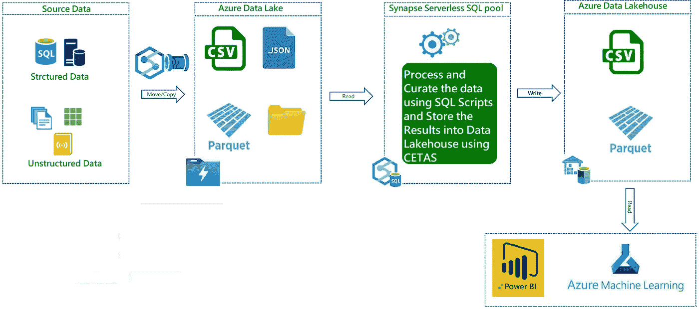

# 数据湖库架构— Azure Synapse 无服务器 SQL 池

> 原文：<https://medium.com/analytics-vidhya/data-lakehouse-architecture-azure-synapse-serverless-sql-pools-78a7a142ca37?source=collection_archive---------9----------------------->

数据湖屋是当前数据分析领域的新术语。

如今，大多数企业都依靠数据来做出更明智的业务决策，这些数据来自各种来源、各种形式、各种规模和各种频率。公司希望超越传统数据仓库架构的限制，对所有这些数据进行高级分析、数据科学和机器学习。Data Lakehouse 就是这样一种架构，它解决了许多传统数据仓库架构的局限性。

现在让我们看看如何使用 Azure 提供的服务构建一个数据湖库架构。

无服务器 SQL 池支持查询各种数据源(数据湖文件、Spark 表和 Cosmos DB ),而无需提取、转换和加载数据到另一个数据存储中。这消除了保存精选数据的额外数据存储。

# *数据流*

1.  使用 Synapse 管道将所有结构化、非结构化和半结构化数据(日志、文件和媒体)汇集到 Azure 数据湖存储。
2.  使用无服务器 SQL 池清理和转换无结构数据集，并使用 CETAS 将它们存储到数据湖库。
3.  使用无服务器 SQL pool endpoint 连接到 Power BI 并创建美丽的视觉效果
4.  使用可扩展的机器学习/深度学习技术，使用 Python、Scala 或。NET，用 Apache Spark pool 体验笔记本。

# 成分

*   **Azure Synapse Pipelines** 允许您创建、调度和编排您的 ETL/ELT 工作流。
*   **Azure Data Lake** 是可大规模扩展且经济高效的存储，适用于任何类型的非结构化、半结构化和结构化数据，
*   **Azure Synapse 无服务器 SQL Pools** 是一个自动扩展的计算环境，它使用 T-SQL 直接查询数据湖(无需将数据复制或加载到专门的存储中)。无服务器 SQL 池是无服务器的，因此不需要设置基础架构或维护集群。每个 Azure Synapse 工作区中都提供了该服务的默认端点，因此一旦创建了工作区，您就可以开始查询数据
*   **Azure Data Lakehouse** 一个使用无服务器 SQL 池构建在 Azure Data Lake 存储之上的逻辑数据仓库。这允许查看来自不同系统的数据，而无需移动或转换
*   **Power BI** 是一套业务分析工具，可为您的整个组织提供洞察。连接到数百个数据源，简化数据准备，并推动计划外分析。制作精美的报告，然后发布供您的组织在 web 和移动设备上使用。
*   **Azure Machine Learning** 是一个基于云的服务，用于创建和管理机器学习解决方案。它旨在帮助数据科学家和机器学习工程师利用他们现有的数据处理和模型开发技能&框架

就这样了，伙计们！！希望你喜欢这篇文章。在我的下一篇文章中再见( ***如何使用无服务器 SQL 池构建数据湖库)*** 直到那时保持健康和快乐的学习。

