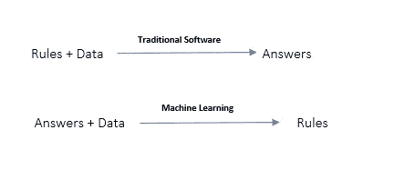
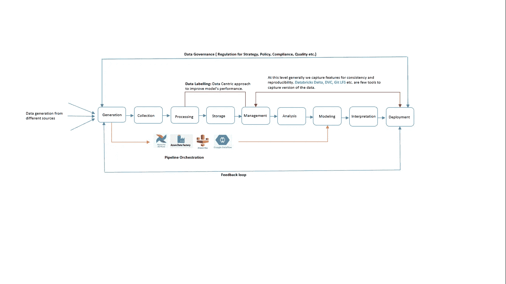

# 机器学习项目的数据生命周期

> 原文：<https://medium.com/analytics-vidhya/data-lifecycle-of-machine-learning-project-83b2e656911d?source=collection_archive---------0----------------------->

托尔加·乌尔坎在 [Unsplash](https://unsplash.com?utm_source=medium&utm_medium=referral) 上拍摄的照片

在我的一篇 [**文章**](/analytics-vidhya/managing-machine-learning-life-cycle-with-mlflow-3bea291d771b)**中，我描述了为什么机器学习(ML)项目很难，并且解释了如何使用 MLFlow 来管理模型。在那篇博客中，我已经解释了很多关于模型管理的内容，但是在这里，我将介绍 ML 应用程序的数据生命周期。**

**ML 的范例不同于传统的软件开发。通常，在传统软件中，我们用代码(我们最喜欢的编程语言)编写规则，这些规则作用于数据以给出预期的结果，但在机器学习中，规则是由数据控制的。数据和答案作为输入，使用的算法预测输出(规则)。预测的结果完全取决于提供的数据。如果数据以任何方式出错，由于中的**垃圾和**垃圾出**原理，算法无法按预期执行。****

****

**在机器学习中，数据是至关重要的，吴恩达也认识到了这一点，他发起了一场以数据为中心的[****方法****](https://www.deeplearning.ai/wp-content/uploads/2021/06/MLOps-From-Model-centric-to-Data-centric-AI.pdf) **的普遍意识和运动，以改善模型的性能，因为改善数据比超参数化对性能的影响要小得多。他实际上强调通过更加以数据为中心而不是以模型为中心，将更多的注意力放在数据上，以提高模型的性能和准确性。****

****在以数据为中心的方法中，数据是一等公民。但是只有数据是不够的，除非它被很好地策划和管理。数据生命周期涉及到数据质量、数据管理及其从生成、消费和预测的遍历。****

****数据生命周期侧重于捕获、存储、处理、分析和管理用于所有数据应用程序(包括 ML)的数据的各种挑战。它还关注面向行业的工具和技术，通过降低数据风险、数据质量、数据一致性和手动流程来促进端到端数据流中的不同服务。****

****下图概念化了数据流及其不同阶段，以及一个反馈循环，以验证所提供的数据是否如预期的那样执行和足够好。接下来，我们将简要介绍每个阶段的定义和功能。****

********

****ML/AI 项目中的典型数据流****

## ******数据生成******

****在这个数字世界中，我们每时每刻都在产生数字足迹。福布斯 [**的一篇文章**](https://www.forbes.com/sites/bernardmarr/2018/05/21/how-much-data-do-we-create-every-day-the-mind-blowing-stats-everyone-should-read/?sh=6bee470460ba) 称，每天有 2.5 万亿字节的数据产生。未来，随着物联网、社交媒体和其他数字创新的进一步发展，这一趋势只会加速。****

## ******数据收集******

****生成的数据太多。在数据收集过程中，我们关注完整且具有统计意义的数据。我们还处理是否应该捕获所有数据或一些时间片数据来训练我们的模型，很多时候这取决于业务选择和其他实际原因。****

****在开始收集数据之前，我们应该问自己一些相关的问题，这些问题可以帮助我们找到合适的工具、技术和平台****

> ****我们是对所有数据感兴趣还是对数据的子集感兴趣？****
> 
> ****我们将遵循什么样的模式？****
> 
> ****我们能容忍松散的数据点吗？****
> 
> ****这个数据足够准确可靠吗？****
> 
> ****利益相关者如何获得这些数据？****
> 
> ****通过组合多个数据源，可以实现哪些功能？****
> 
> ****这些数据可以实时获得吗？****
> 
> ****这个过程在时间和资源上要花费多少？****
> 
> ****一旦部署了模型，数据将如何更新？****
> 
> ****使用模型本身会降低数据的代表性吗？****
> 
> ****是否存在必须隐藏或匿名的个人身份信息(PII )?****
> 
> ****有没有一些特征，比如性别，在法律上不能用于这种商业环境？****

## ******数据处理******

****数据处理总是比生成和消费慢，因为它需要验证和转换，然后才能用于任何有意义的洞察。几个不同特征的数字表示以及将它们输入到用于训练的模型中是资源密集型和迭代的过程。为了使数据处理和算法快速高效，我们需要首先了解我们需要什么样的方法。****

*   ****单台机器上的所有内核****
*   ****使用 GPU****
*   ****分布式计算，例如 MLib 和 Spark。****

****每种方法都有自己的优点和缺点。同样值得注意的是，并不是所有的事情都可以并行化。例如，数据预处理和转换可以并行进行，但是将预处理的数据提供给算法取决于算法的类型。有些算法有，有些没有。****

****然而，对于并行处理，这些工具可能是有用的(下面不是所有并行框架的完整列表，而是一些流行的)****

*   ****[火花& MLib](https://spark.apache.org/mllib/)****
*   ****[费尔斯凯尔](https://fairscale.readthedocs.io/en/latest/what_is_fairscale.html)——py torch 的延伸。****
*   ****[Elephas](https://github.com/maxpumperla/elephas)——Keras 的延伸。****
*   ****[TensorFlowOnSpark](https://github.com/yahoo/TensorFlowOnSpark)—[tensor flow](https://www.tensorflow.org/)深度学习框架带 [Apache Spark](http://spark.apache.org/) 和 [Apache Hadoop](http://hadoop.apache.org/) 。它支持 Spark 簇上的分布式张量流训练和推理。****
*   ****[Mesh tensor flow](https://github.com/tensorflow/mesh)—Mesh tensor flow(MTF)是一种用于分布式深度学习的语言，能够指定一大类分布式张量计算。****

## ******数据存储******

****存在各种数据，并且根据业务用例，需要不同种类和数量的数据来训练模型。这些数据可能是结构化的(表格数据)，也可能是非结构化的(图像、音频、视频),从海量到少量，对于 it 部门来说，绝对关系型数据库可能不太合适，因为它的成本非常高。对于托管云，这些存储提供了廉价的成本和数据复制以避免任何数据丢失，例如 SaaS 存储— Azure BLOB、Azure、ADLS)、S3 (AWS)和 IaaS 存储— HDFS( Hadoop 分布式文件系统)。****

## ******数据管理******

******正如**我已经提到的，机器学习根据提供的数据及其特性进行学习和预测。如果数据和特征发生变化，模型的输出也会发生变化。而且，如果我们的模型投入生产，我们无法承受这种行为。因此，维护数据版本并确定正确的来源、数据质量和总体治理非常重要，这属于数据管理的范畴。通过查看所有过去的行为，数据管理有助于审计、调试、跟踪以及实现新的变更的再现性。这是一个相当大的话题，如果有人更有兴趣了解更多细节，那么**[**他的研究论文**](https://thodrek.github.io/CS839_spring18/papers/p1717-kumar.pdf) 可能会有用。******

## ******数据分析******

****数据分析是数据科学的核心。我们经常听到“数据科学家将 80%的时间花在数据准备上”的说法，这句话很好地概括了数据分析的过程。没有它，我们就无法确认和推断特征及其对模型的影响。出于同样的原因，数据科学家将 80%的时间花在获取数据、清理数据、聚合数据、重塑数据以及使用探索性数据分析和数据可视化来探索数据上。****

****适当的数据分析可以告诉我们关于数据的所有好的和坏的方面。统计技术用于数据分析，以识别隐藏模式、新特征和数据完整性。这一步对于建立对模型的信心也是至关重要的。数据可视化也是数据分析的一部分，它也在产品中使用。****

## ******模特培训******

****最后，我们已经达到了这样一个水平，即我们用迄今为止收集和整理的数据来训练我们的模型。****

****此时，评估模型的性能也很重要。一般来说，我们使用不同的集成技术，并试图找到参数和超参数的最佳组合。但是在**以数据为中心的方法**中，验证输入数据、特征以及最重要的正确标签非常重要。模型的精度和准确度取决于这个问题— ***我们的模型有质量(和标注)的数据吗？*** 如果没有，那么在我们继续下一步之前，我们需要首先关注这一点。这个过程必须在数据收集后的最开始就开始，通过让主题/领域专家参与，我们可以解决这个问题。以下几点可以作为提高数据质量的一般准则(由吴恩达在他的 [**课程**](https://www.coursera.org/learn/introduction-to-machine-learning-in-production/home/welcome) 中提出)****

******对于小数据-******

*   ****干净的标签至关重要。****
*   ****可以通过数据集和固定标注进行手动检查。****
*   ****可以为数据贴标签机设定一个约定的规则。****

******大数据—******

*   ****强调数据处理。****
*   ****大数据还可能有一个罕见事件的长尾，这些事件最终会变成大数据中的小数据挑战。****

******针对非结构化数据—******

*   ****可能有也可能没有大量未标记的例子。****
*   ****人类可以标注更多的数据。****
*   ****数据扩充/合成数据生成更可能有用。****

******对于结构化数据—******

*   ****更难获得更多的数据。ML 模型通常需要每个类至少 100 个示例来学习对该类进行分类。所以如果你有大量的类，比如 500 个，你至少需要 50，000 个例子。当一些类很少时，数据收集可能特别困难。当你有大量的类时，很可能其中一些是稀有的。****
*   ****在一些用例中，我们需要专业的领域知识和技能来确定实际的事实，人为标记可能是困难的。****

## ******解读******

****在这个层次上，我们需要对特性和模型的解释。这是至关重要的一步，为了让它更可靠，我们需要理解偏见、数据行为和人工智能伦理。数据和模型的可解释性非常重要，如果处理不当，会严重影响决策过程。通过在开发人员和用户之间进行可理解的、健康的对话，可以建立一个共同点来使数据和模型变得可解释。例如，这些问题对双方都有帮助****

****对于决策/建议，用户可能会问****

> ****你干嘛这样？****
> 
> ****为什么不是别的？****
> 
> ****你什么时候成功或者失败？****
> 
> ****我怎么能相信你？****
> 
> ****我如何纠正错误？****

****如果对话(模型的可解释性和上述任何问题的推理)已经建立，那么这些问题就不会打扰用户。****

****要了解更多关于可解释性的内容，请参考这个 [**博客**](/analytics-vidhya/interpretability-of-machine-learning-models-9787cf8a3789) 。****

## ****数据编排****

****我们已经分别介绍了所有阶段，但是为了共同发挥作用，它们必须相互通信。这些阶段需要一个编排工具将它们粘合并执行在一起。幸运的是，有许多这样的工具，根据我们为应用程序选择的平台，我们可以决定哪一个最适合。这里有他们中几个人的推荐信****

*   ****[阿帕奇气流](https://airflow.apache.org/)****
*   ****[Kubeflow](https://www.kubeflow.org/docs/components/pipelines/introduction/)****
*   ****凯德罗****
*   ****[蔚蓝机器学习](https://azure.microsoft.com/en-us/services/machine-learning/#product-overview)****
*   ****[亚马逊 SageMaker](https://aws.amazon.com/sagemaker/)****

## ****监控和反馈回路****

****这是验证并持续检查模型相关性的步骤。模型监控工具使我们能够了解生产中发生的事情，并使我们能够采取适当的措施来改善反馈回路。集中日志记录和监控有助于我们通过测量数据漂移、概念漂移和其他参数/超参数来跟踪性能并对模型采取纠正措施。易于集成、监控功能、警报和成本可能是选择正确工具的参数。下面是几个例子。****

*   ****[显然是](https://github.com/evidentlyai/evidently)。****
*   ****[Mlflow](https://mlflow.org/)****
*   ****[Azure Monitor](https://docs.microsoft.com/en-us/azure/azure-monitor/logs/log-analytics-tutorial) 和 [Azure 机器学习套装](https://azure.microsoft.com/en-us/services/machine-learning/#product-overview)****
*   ****[AWS SageMaker](https://aws.amazon.com/sagemaker/)****
*   ****[提琴手](https://www.fiddler.ai/ml-monitoring)****

# ****数据生命周期中的挑战****

****从数据生成到模型训练以及这些过程之间的其他相关元数据生成的数据流需要良好的管理。如果管理不当，很难复制这种模式并建立信任。以下是数据之旅中需要注意的典型挑战。****

## ****缺乏高质量的数据****

****在大数据时代，Peta 和 Zeta 字节的数据正在生成，拥有高质量的数据仍然是一个挑战。吴恩达认识到了这一事实，并引入了以数据为中心的方法。他建议将重点放在标签(输入-输出数据映射)和数据质量上，而不是大数据上。数据质量、领域和主题专家以及数据管理员是可以指导组织为其分析和决策团队生成高质量数据的人。****

******数据标记**是数据质量领域的另一个挑战。根据数据是小/大还是结构化/非结构化，人工贴标机和合成数据扩充/生成工具可能对这种情况有用。****

## ****数据漂移****

****数据漂移是一种现象，其中预测开始以意想不到的方式表现(也有概念漂移-当目标的统计属性发生变化时)，因为带下划线的数据和特征发生了变化。数据漂移可能有两个主要原因****

*   ******样本选择偏差，**训练样本不代表总体。例如，如果决策倾向于某个群体和种族，那么建立一个评估招聘计划有效性的模型就会有偏差。****
*   ******非平稳环境，**从源人群收集的训练数据不代表目标人群。这种情况经常发生在依赖于时间的任务中，如预测用例，具有强烈的季节性效应，在给定的一个月学习一个模型不会推广到另一个月。****

****为了避免这种情况，我们需要一个更好的监控系统来跟踪为模型提供的数据。使用 [**单变量统计检验**](https://en.wikipedia.org/wiki/Univariate_analysis) 对数据进行定期检查可以解决这种情况。****

## ****数据安全和隐私****

****安全和隐私包括机密性、完整性、可用性、认证、加密、数据屏蔽和访问控制。当数据从几个步骤流出时，所有这些情况都很难控制，在这些步骤中，我们通常使用工具和服务的组合。为了更好地控制这种情况，多项数据隐私法被引入，以确保数据以合法的方式被使用。虽然遵守所有这些法律仍然很大程度上依赖于使用个人数据的组织，但为了创造一个更美好的世界，我们需要遵守这些法律和数据道德。****

## ****数据共享****

****数据共享在可访问性方面很重要。该系统的所有组件和模块都使用数据共享技术。数据生命周期管理的目的是为了各种目的重用数据，并且应该在应用程序的模块之间共享数据。因此，系统中的每个组件都监视不同的数据(结构化、非结构化和半结构化数据)。它经过不同的位置、系统、工作环境，并由不同的平台访问。它有助于在适当的时候提供有意义的数据。****

## ****元数据管理****

****元数据管理是组织真正实现数据驱动的过程。有效的元数据使数据能够被用户、系统或 AI/ML 应用程序发现，而没有它，就需要一个手动且耗时的过程来物理地解释任何可用的数据，并决定它是否相关。这也使我们能够在模型开始降级之前及时采取行动，因为我们可以通过监控数据和工作流的元数据来解决问题。除此之外，它有助于审计、事实的来源、比较不同工件的性能，并有助于再现性。然而，端到端地管理元数据是一项艰巨的工作，如果以正确的方式完成，它可以增强组织进一步对其自己的数据执行分析的能力。****

## ****数据谱系****

****跟踪数据从生成到部署的过程(包括反馈循环)非常重要，这样才能升级和利用管道以获得最佳性能。几乎每个组织都在努力解决这个问题。有些人正在维护它的一部分，有些人正在处理它。但是，有几个工具，例如[**Talend Data Catalog**](https://www.talend.com/products/data-catalog/)[**IBM DataStage**](https://www.ibm.com/in-en/products/datastage)[**Data meer**](https://www.datameer.com/)[**Spark Delta**](https://docs.delta.io/latest/quick-start.html)**(作为开源的一个很好的选择，也有一个称为[**Data bricks Delta**](https://databricks.com/session_na20/machine-learning-data-lineage-with-mlflow-and-delta-lake)的专有产品)等**。**可以使用，但实施并不总是一帆风顺的，因为在整个数据生命周期中，我们使用不同的堆栈来解决问题，并且连接每个点是一项艰巨的任务。******

# ******结论******

****数据是 ML/AI 应用程序的核心，在每个阶段处理数据在很大程度上决定了所有数据应用程序的成功。实际上，在实现中存在几个挑战，做出关于相关服务和工具的决策以创建健壮的数据流是一项具有挑战性的任务，但是如果流程设计和架构正确，大多数挑战都可以轻松缓解。 [**全球数据管理**](https://www.dama.org/cpages/home) 社区确实是一个参考数据管理最佳实践的好地方，但我们需要有所保留地采取所有步骤，因为 ML/AI 的数据操作有点不同，并且在快速发展。****

******感谢您抽出时间阅读本文**💕****

# ****参考****

****[https://www . science direct . com/science/article/pii/s 1877050920315465](https://www.sciencedirect.com/science/article/pii/S1877050920315465)****

****[https://www.youtube.com/watch?v=06-AZXmwHjo](https://www.youtube.com/watch?v=06-AZXmwHjo)****

****[https://www.dama.org/cpages/books-referenced-in-dama-dmbok](https://www.dama.org/cpages/books-referenced-in-dama-dmbok) Chip Huyen 著——设计机器学习系统:生产就绪应用的迭代过程****