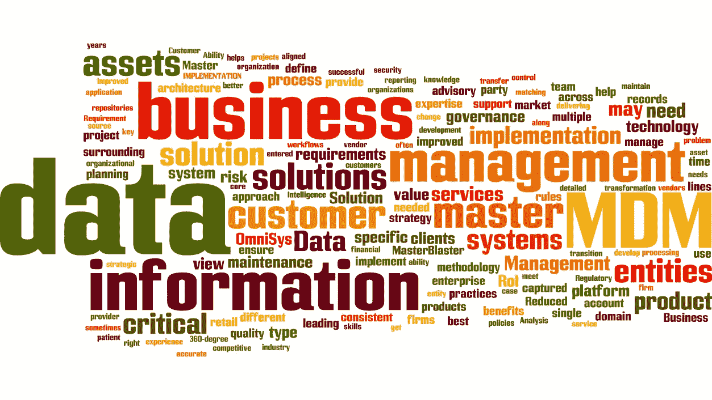
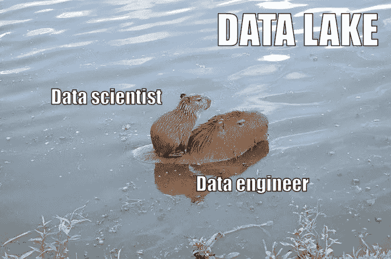
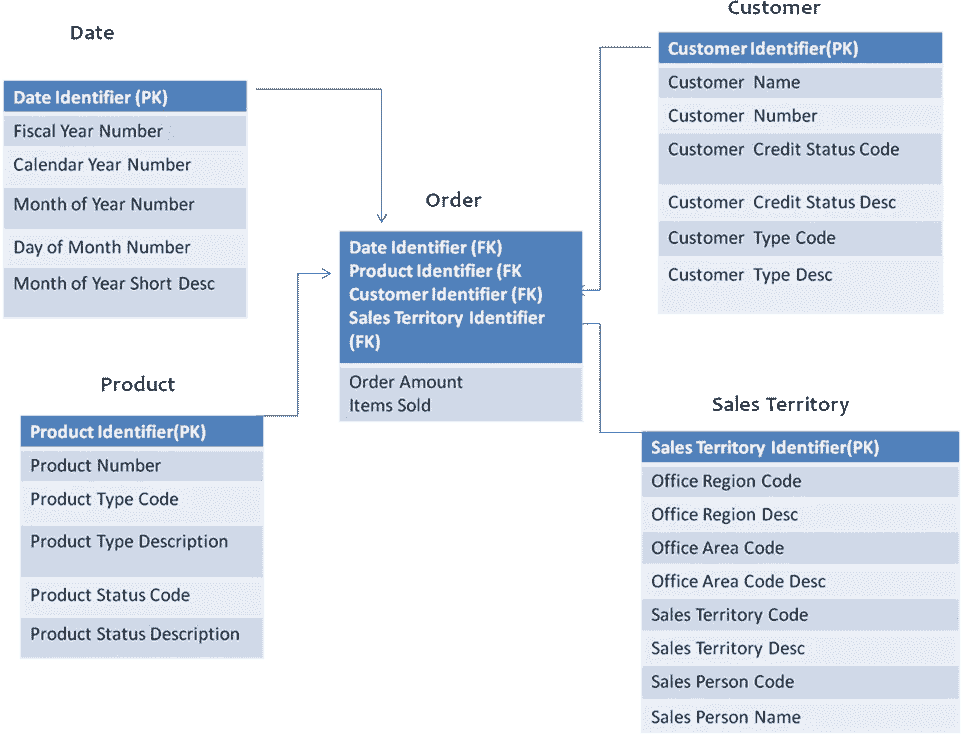
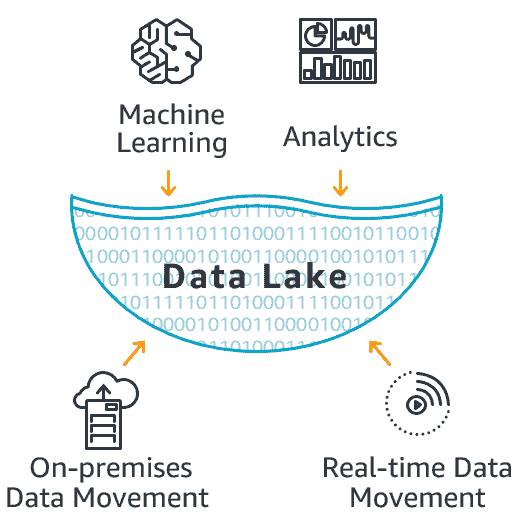
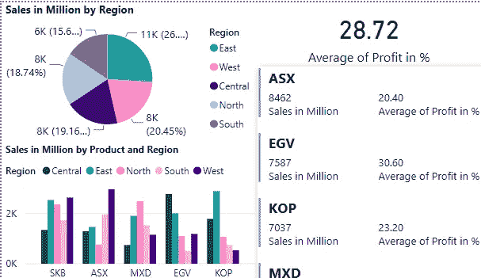

# 数据管理术语解释！

> 原文：<https://medium.com/analytics-vidhya/data-management-jargons-explained-669d92609b7b?source=collection_archive---------1----------------------->

> “世界是一个大数据问题”
> 
> 安德鲁·麦卡菲

取自 alamy.com

自 web 2.0 以来，随着数据的增长，产生了不同的方法来管理和掌握数据。各行各业都在争先恐后地存储和利用数据的巨大力量。这导致了几种策略和工具的发展，以从不同的来源提取数据，并从中获得适当的意义。

对于任何新手来说，围绕数据的不同方面似乎非常令人困惑。现在让我们讨论几个术语，并通过简单的类比来理解它们。我也将分享我的实际经验，以便读者可以很容易地找到症结所在。我还指定了在特定领域中使用的某些流行工具的名称，这样，如果您对某个领域产生了浓厚的兴趣，您就有了一些背景。

**数据目录:**数据来自组织中的不同来源。可能有多个领域的过多来源。因此，IT 工程师或分析师很难理解大量隐藏的数据。这就需要像描述产品目录一样描述数据。现在让我们假设你是一名开发人员，你必须开发一个过程来生成一些报告。您可以使用数据目录工具检查数据的详细信息，现在就开始利用它。提供数据目录服务的一些工具有 *Alteryx、Collibra、Cloudera、Informatica Enterprise Data Catalog、Oracle Cloud infra structure Data Catalog 和 SAP Data Intelligence* 。事实上，GCP 也为企业提供数据目录服务。

数据工程:工程这个术语表达了一种设计、建造和使用引擎、机器和结构的想法。数据工程与此类似，其目标是开发、设计和构建从多个来源收集数据的过程，根据您的要求对其进行转换，然后将其加载到其他地方以供进一步使用。一个合适的例子是从不同的数据库获取数据，并为业务目的制作报告。作为一名数据工程师，我必须在 Azure 中规划和开发管道，以便从不同的来源(如文件和 API)中提取数据，然后在经过一些转换或修改后将它们存储到数据仓库中。下面这个迷因很好地说明了数据工程师的重要性。我应该说，数据工程师苦干数据源，有时是数据湖，只为数据科学家提供他们所必需的东西。数据工程的主要步骤之一是*数据集成*，这是一个有趣的术语，用于从不同类型的来源收集数据，然后将其转换为所需的形式并加载到目标中。这个过程也被称为 *ETL* 或*提取转换和加载*。我使用 *Informatica power center 在这方面做了大量工作。*其他一些在业界广泛使用的 ETL 工具还有 *Alteryx、Abinitio、Azure Data Factory 和 Talend* 。

取自 reddit.com/r/TheInsaneApp

**数据质量:**有没有见过一个领域，同样的东西被不同的人用不同的格式表示？例如，有些人把我所在城市的名字写成 KOLKATA，而有些人写成 Kol 对于日期格式，一些写在 DD-MM-YYYY 格式，而一些写在 MM-DD-YYYY 格式。对一个老练的人来说，它们是一体的，但对一台计算机来说，它们是不同的。数据质量来了。因此，数据质量专家确保数据没有不需要的值，并且具有一致性。为了完成它，数据质量工具提供了许多不同的包。两个流行的数据质量工具是 *Informatica 数据质量和从头开始 DQE。因此，数据质量开发人员构建管道来确保流入的数据符合要求的质量。*

数据仓库:数据仓库非常类似于传统的仓库。那么传统仓库做什么呢？它在一个地方储存了大量的存货以备将来之需。对吗？类似地，数据仓库的目的是存储一个组织的所有历史数据。接下来的问题是为什么需要数据仓库？

让我们考虑一下银行的例子。如果他们分析你的财务报表，他们会很容易向你提供有益于你、符合你消费习惯的服务和产品。因此，数据仓库存储历史数据，以便从中开发相关的洞察力。

数据仓库只是一个数据库，但它的建模方式稍有不同，以便于生成报告。数据仓库中的表被称为*事实*和*维度*。这些事实和维度的方向有不同的名称，如星形*模式、雪花模式*和*事实星座模式*。

数据仓库首选的一些 RDBMS 是 Oracle、MS SQL Server 或 IBM DB2。还有一个广为人知的基于云的数据仓库，被许多公司使用，称为*雪花。*

典型的数据仓库(取自 tutorialspoint.com)

**数据集市:**数据集市只是一个数据仓库，但是它所拥有的数据属于一个特定的主题。例如，商店数据仓库将包含与商店相关的所有数据，如销售、采购、雇佣、预算、账目等。但是，如果我们只是想对销售数据进行一些分析，并创建一个单独的数据仓库，其中只有销售相关的数据，那么我们将把它作为一个销售数据集市。

**大数据:**大数据只是大量数据的术语。例如，在脸书，每分钟有 136，000 张照片被上传，510，000 条评论被发布，293，000 条状态更新被发布(Monnappa，2021)。你认为如何处理这些数据以从中获得一些重要的见解？让我们以前面讨论中的销售数据为例。如果销售数据只有几千兆字节，那么任何类型的计算都不是问题，但是太字节和太字节的数据就很难管理和处理了。获取数据并让你的程序对其进行计算的通常方法需要花费很长时间。这就需要一个可以划分数据和计算的生态系统。这个生态系统叫做 **Hadoop。**在这个生态系统中，为了进行任何计算，都需要一个计算引擎。流行的计算引擎是 Map Reduce 和 Spark。举个非常简单的例子，你可以把 Hadoop 看作一个教室，把计算引擎看作学生。这不是一个非常准确的类比，因为还有其他一些概念，如映射器、缩减器、分区、节点。尽管如此，我将在下一篇博客中更深入地探讨它们。

**数据湖**:我们刚刚讨论了大数据。这是非常大的数据量。所以下一个问题是如何储存这些海量的数据。数据湖提供了保存大量数据的能力。不仅可以存储大量数据，还可以存储各种非结构化数据。您可以存储图像、视频、文本、日志等。它保存原始格式的数据。它充当许多系统的数据仓库或分析的来源。这意味着来自数据湖的数据可以被提取、转换，然后存储在数据仓库中，或者可以被直接提取、转换并用于分析。不同的云提供商有自己的数据湖实施方案。*三角洲*湖泊**蔚蓝**就是这样一个例子。

数据湖的流入和流出(取自 aws.amazon.com/big-data/what-is-a-data-lake/)

**数据治理:**了解了数据湖之后，是时候提出一个重要的问题了。如果数据湖允许各种类型的数据存储在其中，难道不会有大量冗余和无用的数据吗？答案是肯定的。如果流入数据存储的数据得不到控制，那么它很快就会变成一个*数据沼泽。*

数据湖和数据沼泽(取自 indellient.com/blog/2019-the-year-of-the-data-lake-revamp/)

为了治理数据，使用了一些*流程、角色、策略、标准和指标* ，这就是所谓的数据治理。因此，如果有一天流向报告的数据被发现是错误的，我们可以回溯它，并通过信息的角色找到利益相关者，并寻求理由。一些流行的数据治理框架由 *Collibra、Talend 和 Informatica 提供。*

**元数据管理:**元数据的含义是关于数据的数据。在前面的段落中，我们确实暗示了一点当报告中的数据不正确时的情况。在这种情况下，几乎不可能追溯错误的来源并解决问题。那么，应该做些什么来使这种回溯变得容易呢？如果我们记录下数据流动的每一步会怎么样？是的，这种跟踪数据移动或与数据正在经历的所有转换相关的信息的方法称为元数据管理。这一领域的一些工具有 *Informatica 元数据管理器、Erwin、Collibra、Oracle 企业元数据管理*。

**主数据管理:**现在让我们来探讨一个缩写相同但含义截然不同的概念。比如让我们再拿我们的商店数据仓库来说。这个商店数据仓库有 3 个表，包含来自不同来源的客户信息。假设一个来自 POS(销售点)；一个来自反馈；一个来自营销漏斗。相同的客户信息存在于 3 个不同的表中。如果这些记录被提取并整合到一个主数据中，这就是所谓的主数据管理。但这并不容易，假设 3 个表中没有一个包含所有信息，或者地址不同，或者联系电话号码因营销漏斗中的数据而改变。你会怎么处理？在这种情况下，您需要根据业务需求定义规则。所有这些都属于主数据管理，其中最广泛使用的工具是 *Informatica MDM。*

**数据分析:**这一数据分支主要关注于分析数据，搅动数据，并以图形和图表的形式呈现数据，以便业务用户可以从中获得重要的见解。这就是这个领域也被称为商业智能或 BI 的原因。对于 BI，我们需要通常从数据集市或数据仓库获得的数据。数据分析所需的一些工具和技术有 *Power BI、Tableau、Cognos、Qlik Sense。*

典型的商务智能报告(educba.com/power-bi-report/)

**数据科学:**最后，让我简单解释一下最热门的术语。人们认为的只是应用数据进行预测和预报。然而，它也在很大程度上强调了*为分析准备数据、清理、聚合和操纵数据以执行高级数据分析的活动。*然后，分析应用程序和数据科学家可以审查结果以发现模式，并使企业领导能够获得明智的见解。

如果你喜欢这个博客，并希望查看我的一些其他内容，你可以查看我的 youtube 频道[这里](https://www.youtube.com/channel/UCr7kzB4aGqegSEQNaMAUzVQ)

## 参考

蒙纳帕，2021 年。*脸书如何使用大数据:好的、坏的和丑陋的。*【在线】
可在:[https://www . simpli learn . com/how-Facebook-is-using-big-data-article](https://www.simplilearn.com/how-facebook-is-using-big-data-article)
【2021 年 01 月 18 日访问】。