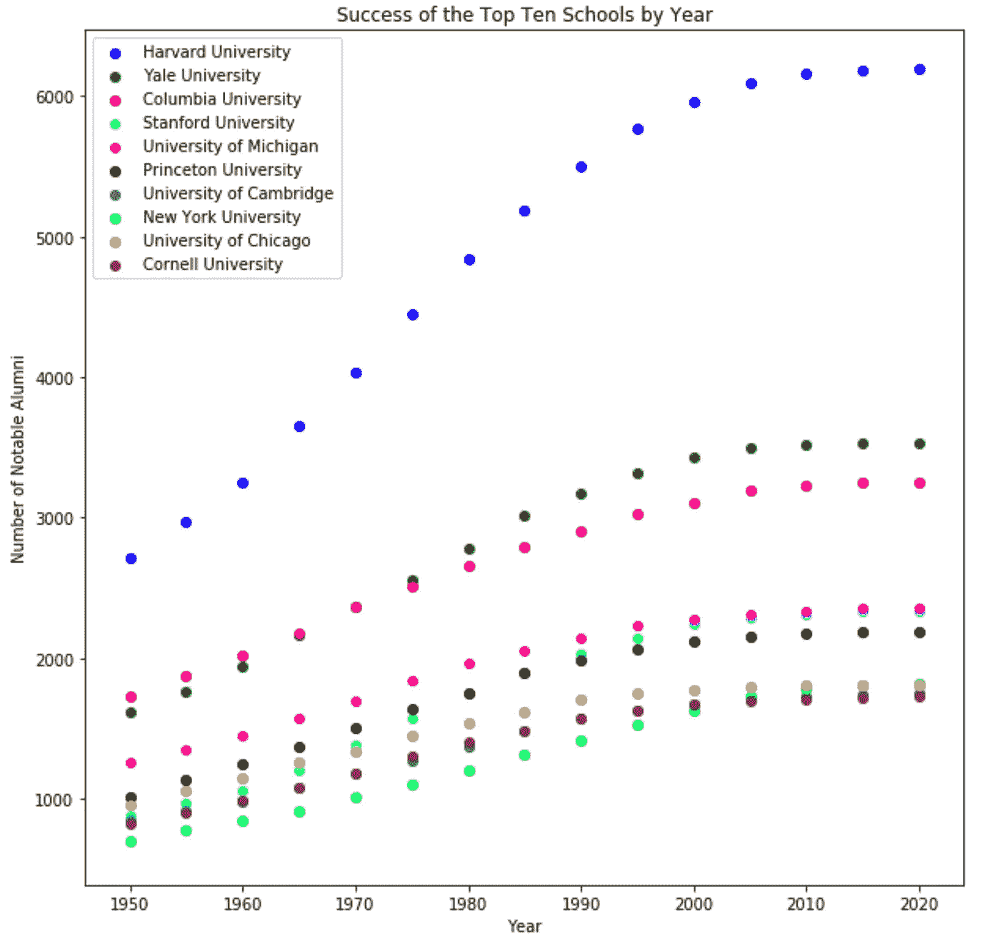
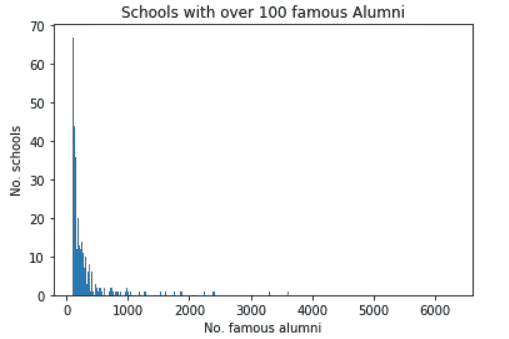
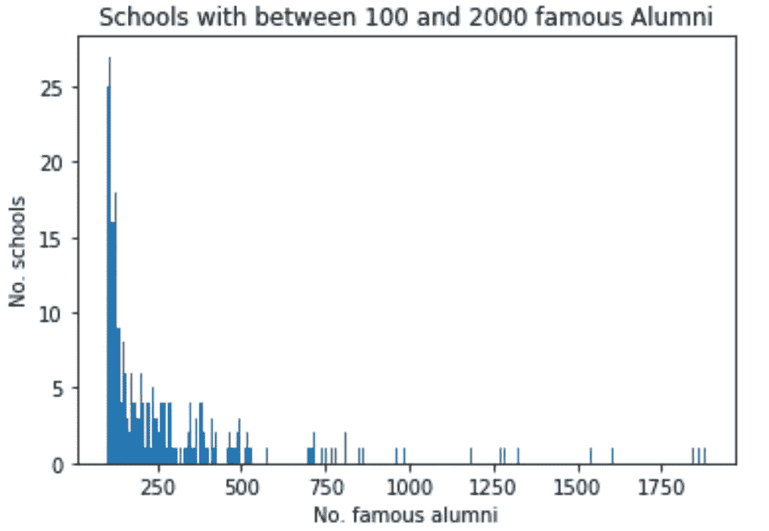
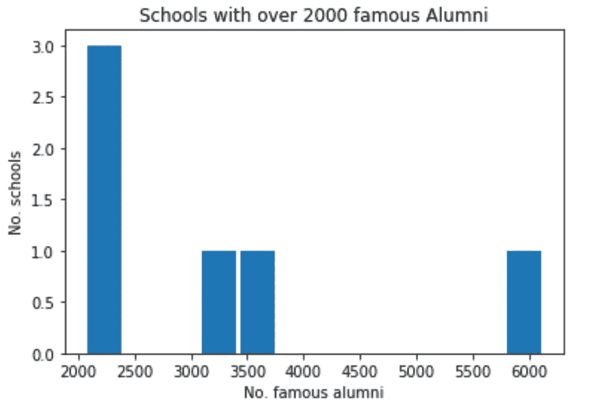
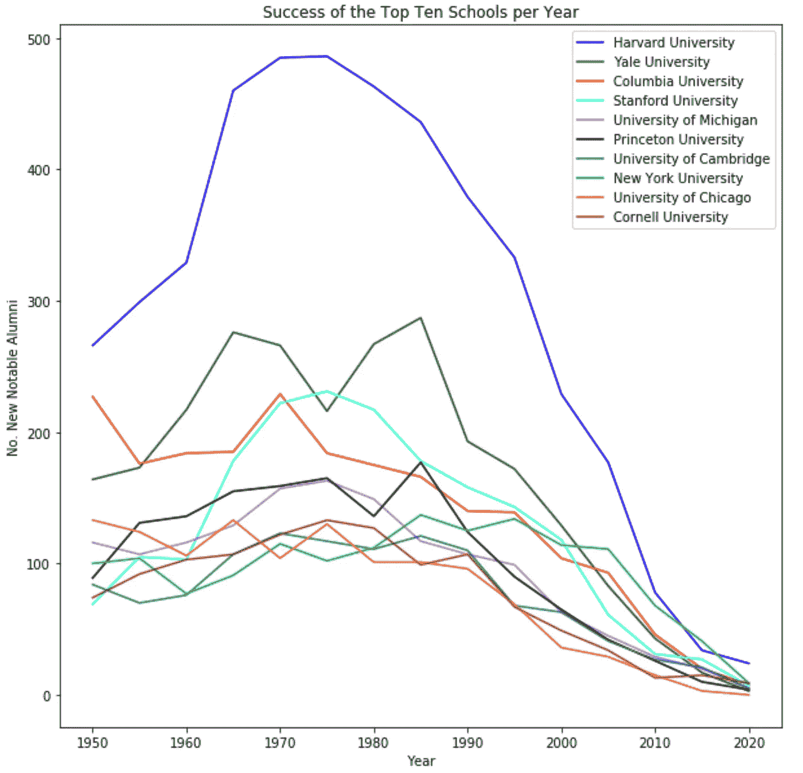
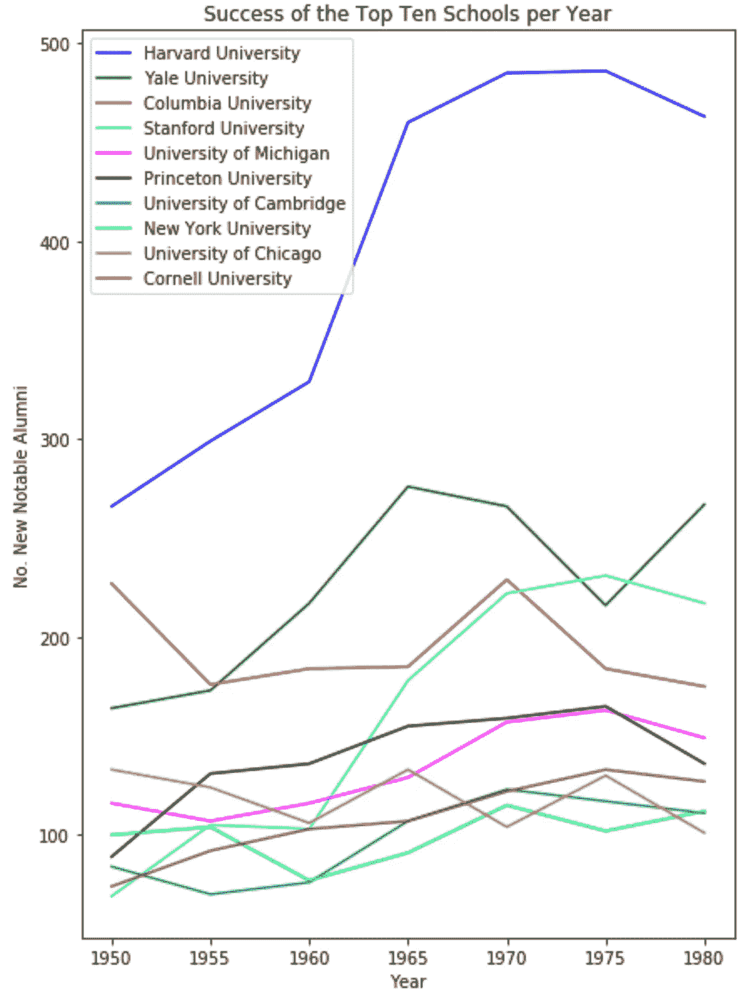

# 最成功大学的数据挖掘维基百科

> 原文：<https://medium.com/analytics-vidhya/data-mining-wikipedia-for-the-most-successful-colleges-a1e03c18067c?source=collection_archive---------22----------------------->

## 对英语世界的名望和顶尖大学的分析冒险。

你总是在网上看到那些排名，告诉你今年排名前十的大学。所有的榜单都大同小异，只是略有不同，人们总是不清楚他们是如何创造排名的。

我决定用维基百科来做我自己的排名:基于维基百科上某所大学的人数。不出所料，许多常春藤和其他名校榜上有名。哈佛处于领先地位，但并不是每个参赛队都如预期的那样。值得注意的是，密歇根大学最终成为世界上第五成功的大学，远远超过了达特茅斯学院、UChicago 学院和我的母校康奈尔大学。

# **名校**

为了创建这个排名，我首先从[维基媒体](https://dumps.wikimedia.org/backup-index.html)下载了一个维基百科转储。然后我遍历了每一页，选择了那些有“*学历*或“*母校*”字段的页面。我迭代了每一个，每个著名校友的大学数加 1。

在我寻找最著名和最成功的大学的过程中，我做了一个所有拥有 100 名或更多著名校友的大学的柱状图:

有很多。为了更深入地了解发生了什么，我把它分成了拥有 100 到 2000 名著名校友的学校和拥有超过 2000 名著名校友的学校。

正如我们可能已经预料到的，著名校友的图表有一个长尾指数下降。

猜猜谁在 6000 名著名校友的现场？

是啊，是啊，你得到了它。那是哈佛。

# **十大最成功大学**

那么，哪些学校进入了我们的十大名单呢？嗯，这就是:

1.  哈佛大学
2.  耶尔锁
3.  哥伦比亚
4.  斯坦福
5.  密歇根大学
6.  普林斯顿
7.  剑桥大学
8.  纽约大学
9.  芝加哥大学
10.  康奈尔(姓氏)

看起来我们这些科内利亚人刚刚设法溜到了那里。

# **历年排名前十的学校**

随着时间的推移，这个排名发生了怎样的变化？为了回答这个问题，我查看了维基百科上所有的名人，以及他们在某一年是否已经毕业。为了简单起见，我通过在他们的出生年份上加 22 来近似这个数字。这给出了以下结果。

在过去的 70 年里，所有的学校似乎都有一条相似的曲线。耶鲁大学在 1970 年左右领先于哥大，NYU 大学在 2000 年左右迅速崛起，但总的来说，这十所大学似乎都在以相似的速度增长。有趣的是，大约在 1990 年，增长看起来是凹下的，而不是向上的。

我认为值得注意的是，不仅哈佛的著名校友人数是其下一个竞争对手耶鲁和哥伦比亚的两倍，而且哈佛在 1950 年的著名校友人数大约相当于耶鲁和哥伦比亚现在在 T2 的著名校友人数。根据这一标准，哈佛无疑是最好的大学。甚至和其他九个机构都不在一个档次。

但这可能不是衡量学校的最佳指标。毕竟，自 1636 年*以来，哈佛一直在培养著名的校友。这些其他学校赶上来的时间少得多！*

# **每年新的著名校友**

一个略有不同的指标是看一所学校每年有多少新的著名校友。

这些曲线的形状是有意义的。当我们接近今年时，有许多新毕业生还不出名:2020 年的点是尽管刚刚毕业但已经出名的人。我的假设是，在 2000 年左右会有一个低谷，因为校友们需要 20 年左右的时间来“成名”。从数据来看，下降似乎更多发生在 1980 年左右。图表中的这一转折仅仅是因为这种*发现名声*效应，还是有其他因素在起作用？你可能会认为 1980 年左右毕业的人现在已经成名了，如果他们想成名的话。但仍然有很多人在那个年龄成名，所以这可能不是那么遥不可及。

这是同一张限于 1980 年的图表，试图消除*成名*效应。

在对这张图表做了简单的线性回归后(考虑到哈佛的曲率，这可能不是一个准确的衡量标准)，我发现哈佛、耶鲁和斯坦福的增长率最高。哥伦比亚大学和 UChicago 大学的著名校友人数实际上在减少。

# 结论

那么这个排名能告诉我们什么呢？这些是世界上最好的学校吗？

这种计算大学排名的方法有一些限制。首先，一些相对较新的学校没有时间培养著名校友，因此无法进入这个名单。

此外，我所衡量的东西的性质可能会让某些职业比其他职业更有优势。例如，演员和表演者可能比其他人更经常出现在维基百科上。这可以解释密执安大学和 NYU 大学在这份名单上的位置——这两所学校是百老汇剧院最具代表性的学校。密歇根和 NYU 也是更大的学校，这是我们排名系统奖励的另一个特点。

最后，维基百科杂乱无章的本质意味着一些标签可能会导致数据从缝隙中溜走。特别是，牛津大学的学生，他们所在大学的学院被列入了他们的母校。因此，牛津的学生分散在各个系，因此永远无法与其他著名的机构竞争。如果维基百科的数据更有条理的话，也许它和其他类似的机构会出现在名单上。

尽管有这些限制，我仍然认为这是一个可靠的大学排名方法。我将我的排名与其他在线排名进行了比较，虽然名单从不相同，但所有出现在这里的大学也会出现在一些在线排名中。

所以下一次你和别人谈论最好的大学时，用最著名的大学来支持你的观点吧！

**参考文献**

你可以在这里找到该项目的更深入版本:[https://github . com/quill key/Famous-Colleges-Data-Mining/blob/main/Final % 20 report . ipynb](https://github.com/QuillKey/Famous-Colleges-Data-Mining/blob/main/Final%20Report.ipynb)

其他参考:

 [## 维基媒体下载

### 请注意，我们有速率限制的下载者，我们将每个 ip 连接的数量限制为 2。这将…

dumps.wikimedia.org](https://dumps.wikimedia.org/backup-index.html) 

[https://www . playbill . com/article/big-10-the-10-the-10-the-most-presented-colleges-on-the-Broadway-in-the-2018-2019-season](https://www.playbill.com/article/big-10-the-10-most-represented-colleges-on-broadway-in-the-2018-2019-season)