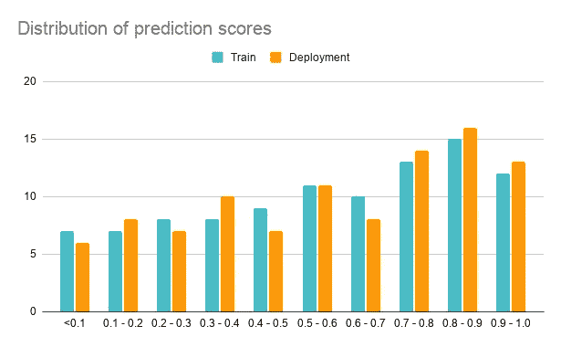
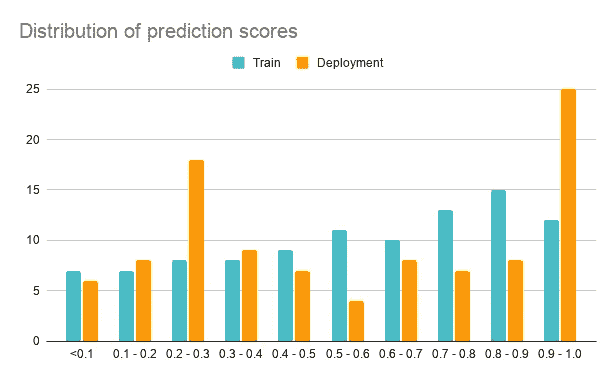
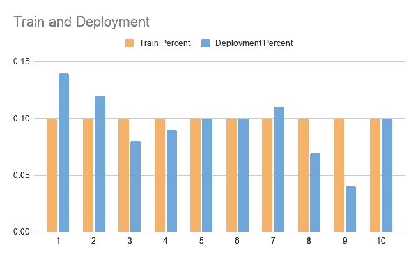
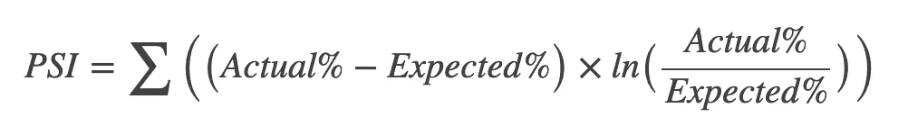

# 数据监控及其重要性

> 原文：<https://medium.com/analytics-vidhya/data-monitoring-and-its-importance-44b5495f4731?source=collection_archive---------31----------------------->

在训练机器学习模型时，我们总是希望根据我们正在解决的问题最大化(AUC，Precision，Recall，F1 score)或最小化(log loss)我们的评估指标。我们稍后将在测试数据集上评估该模型，以确保该模型没有过度拟合，并且按照预期工作。

一旦这个阶段完成，模型部署到生产中，我们如何知道模型是否过度拟合，或者模型在实际中的表现如何？在这些情况下，我们没有预先构建的测试数据集来判断模型的实际性能。因此，为了处理这种情况，我们通常会构建数据监视器来监视模型的性能，并在我们看到模型的行为发生突然变化时向我们发送警报。

## 这些数据监视器是如何工作的？

数据监视器的主要工作是每天、每周或每月查看预测得分，并检查预测得分的分布是否在生产和培训期间保持不变。如果分布中有任何差异，那么我们需要分析是什么特征导致了预测分数分布的漂移。在下图中，您可以看到在培训和部署阶段，预测得分的分布在任何时段的变化都不超过 2%。这意味着模型的训练数据和模型在生产中的得分数据非常相似，不存在重大偏差。

训练和部署阶段预测分数的分布

另一方面，在下图中，您可以看到桶 0.9–1.0 和 0.2–0.3 的预测分数分布急剧增加(> 8%)，而桶 0.5–0.6 的预测分数分布急剧减少(> 5%)。这意味着模型在生产中评分的数据发生了很大变化，因为分数的分布发生了变化。因此，我们需要研究是什么特征导致了模型分数的显著漂移。

## **检测特征漂移**

根据上面的预测得分分析，我们得出一个结论，即一个或多个特征发生了漂移。现在，如何找出导致漂移的特征？我们可以使用不同的技术来检测特征漂移。首先，让我们看看检测单变量特征漂移的最常见技术。

***概率稳定指数(PSI):***

PSI 值将是一个特征在一段时间内或在两个不同样本中的分布变化的指标。这只适用于数值和单变量特征。以下是 PSI 计算的步骤。

对于每个数字特征，

1.  对于训练数据集(在模型被训练之后)，将数据分成 10 个相同大小的分位数。例如，如果值的范围在 0 和 1 之间。这 10 个存储桶在每个存储桶中有 10%的值，如下所示。

2.获取生产过程中的每日、每周或每月数据，计算每个铲斗的分布，并查看生产过程中的分布情况

3.使用以下公式为 10 个铲斗的每个特性计算 PSI 值。实际是指训练数据集值，预期是指生产数据集。

**释义:**

*   **PSI < 0.1** :没有显著的人口变化
*   **PSI < 0.2** :适度的人口变化
*   **PSI > = 0.2** :显著的人口变化

如果 PSI > =0.2，则特征存在显著漂移，我们可能需要根据影响程度重新训练模型。

**关注点:**

由于这仅适用于数字特征，因此很难处理分类特征。我们需要进行一次热编码，并将该热编码特征视为二进制，并在这些情况下计算 PSI 索引。

***多元数据:***

当我们需要检测特征组合是否漂移时，我们必须建立另一个机器学习模型来检测特征漂移。该模型可以是神经网络或 KNN 算法。

## **结论:**

数据监控器对于生产中的任何 ML 模型都非常重要。我们可以有多个用于不同目的的数据监视器，并同时使用它们。我们想要构建的数据监视器的类型取决于应用程序的类型。

感谢您阅读博客！希望对你有用。请在下面留下您的评论或通过 [LinkedIn](https://www.linkedin.com/in/madhu-ramiah-a66a4b48/) 联系我。