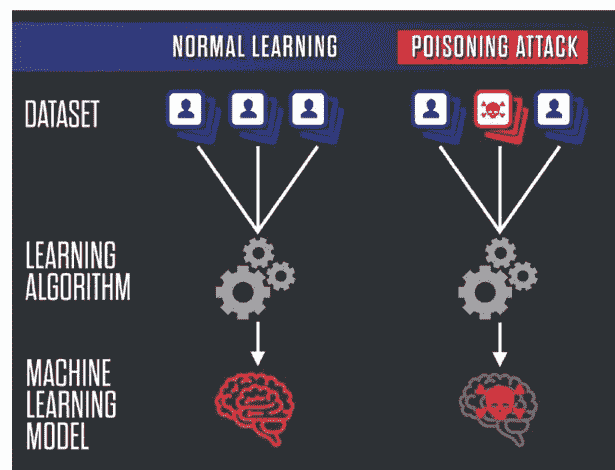

# 数据中毒:当人工智能和机器学习变成胭脂

> 原文：<https://medium.com/analytics-vidhya/data-poisoning-when-artificial-intelligence-and-machine-learning-turn-rouge-d8038f423922?source=collection_archive---------14----------------------->

组织害怕勒索软件，为了避免这种风险，许多商业组织依赖 AI 和 ML 作为他们的防御机制。然而，在不断演变的威胁环境中，攻击者总是能找到伤害您的方法。数据中毒就是这样一种攻击方法，黑客通过人工智能和人工智能发起攻击

# 为什么 AI 和 ML 有风险

像任何其他技术一样，人工智能是一枚双面硬币。每个人工智能模型在得出“最佳猜测”之前都会处理大量数据。

“黑客已经使用人工智能攻击认证和身份验证，包括语音和可视化黑客攻击企图，”YouAttest 首席执行官 Garret Grajek 说。这种“武器化的人工智能”是攻击的关键媒介。

“对抗性数据中毒是对机器学习的有效攻击，通过将中毒数据引入训练数据集中来威胁模型的完整性，”康奈尔大学的研究人员解释道。

那么，通过 AI 和 ML 的攻击与典型的“系统中的错误”攻击有什么不同呢？

马库斯·科米特尔在为哈佛大学贝尔弗科学和国际事务中心撰写的一篇[论文](https://www.belfercenter.org/publication/AttackingAI)中说，算法中存在无法修复的固有限制和弱点。

因此，很明显，人工智能和人工智能技术严重依赖数据和某些算法来对抗网络威胁。这使得他们能够有效地识别问题。另一方面，这是一个真正的威胁，因为攻击者可以毒害数据。人工智能和人工智能的兴起直接导致了数据中毒的[潜伏威胁](https://securityintelligence.com/articles/sleeper-threats-mean-time-to-detect/)。

# 人为错误的影响

我们已经知道威胁参与者使用 AI 和 ML 作为攻击媒介，但他们是如何做到的呢？让我们清楚地了解一下他们所扮演的角色。

任何一个组织的 CISO 都会承认，对组织数据最大的威胁是人性。不，员工并不想成为网络风险，但他们毕竟是人，人是可以分散注意力的。

他们错过了今天的威胁，而这种威胁在昨天或明天就很容易识别。有人急于赶在截止日期前完成任务或搜索重要文档，最终可能会无意中点击受感染的附件。

攻击者知道这一点，他们总是寻找这样一个进入网络和数据的简单途径——无论听起来多么过时，网络钓鱼仍然是一种非常有效的攻击手段。

# 数据中毒:简要说明

数据中毒有两种方式。

一种是将垃圾信息注入系统，导致“垃圾进，垃圾出”。

给算法下毒似乎并不十分困难，因为 AI & ML 只知道人类教给它们的东西。想象一下，你在教一个识别山羊的算法。在这个过程中，你向它展示了数百张黑山羊的图片(位置不同)。与此同时，你正在通过向算法展示白狗的照片来教它识别狗。

现在，当一只黑狗溜进数据集时，算法会将其识别为一只山羊。对算法来说，黑色的动物是山羊。只有人类才能分辨出这种差异，但机器无法分辨，除非你告诉算法狗也可以是黑色的。

同样，如果威胁参与者可以访问训练数据，他们可以操纵您的 AI 和 ML 设置，将良好的软件数据视为恶意数据。

威胁参与者利用训练数据的第二种方式是生成一个后门。

“黑客可能会使用人工智能来帮助选择最有可能值得利用的漏洞。因此，恶意软件可以被放置在企业中，其中恶意软件自己决定攻击的时间以及最佳攻击媒介。这些攻击从设计上来说是可变的，使得检测起来更加困难，时间也更长。”格拉杰克说。

现在，让我们更深入地研究这个主题。

AI 和 ML 技术实际上都检测模式并分析某些用户行为。在此过程中，该技术会检测到奇怪的行为，并在这些行为成为威胁或问题之前采取措施阻止它们。

例如，ML 算法可以跟踪员工的典型工作日/小时，或者他们击键或鼠标移动的节奏模式。如果出现任何差错，它会向相关部门发出警报。

诚然，它不是 100%完美的，因为有人可能会在正常工作时间之外工作，以满足严格的截止日期，或者有人的击键模式可能会因受伤而改变。然而，ML 工具被设计来捕捉一些不寻常的东西(人类可能无法捕捉)，例如使用被盗凭证的威胁参与者。

另一方面，人工智能技术更适合保护感染组织网络的勒索软件攻击。AI 可以通过识别无人监管的计算机或网络上的恶意文件来检测这种攻击。AI 还可以检测影子 IT，并洞察组织通常使用的端点数量。

# 攻击者如何使用数据中毒

我们已经知道数据中毒有几种方式。

这里需要注意的一个重要因素是，威胁参与者需要访问数据培训计划。所以，你可以确定你正在对付的是一个内部攻击或者是一个了解你业务的商业对手。

美国国防部一直在寻找如何最好地保护其网络和数据免受数据中毒的方法。

布鲁斯·德雷珀博士[写道](https://www.darpa.mil/program/guaranteeing-ai-robustness-against-deception#:~:text=Bruce%20Draper,the%20potential%20for%20new%20vulnerabilities.&text=Currently%2C%20ML%20defenses%20tend%20to,effective%20only%20against%20particular%20attacks.)关于 DARPA 的一个研究项目，保证人工智能对欺骗的鲁棒性。“虽然对抗性人工智能领域相对年轻，但已经提出了数十种攻击和防御，目前缺乏对 ML 漏洞的全面理论理解。”

数据中毒的另一种方式是让恶意软件变得更聪明。攻击者使用这种恶意软件通过克隆短语来欺骗编码算法，从而危害电子邮件。这现在延伸到生物识别，威胁行为者阻止合法用户并潜入。

# 数据中毒和 Deepfakes:它们相关吗？

Deepfakes 只是数据中毒的一种变体，预计将成为下一波数字犯罪浪潮。视频、图像和录音被篡改，普通人无法识别。

攻击者已经开始使用这种技术进行勒索、骚扰或商业间谍活动。

假新闻也属于数据中毒的范畴。流行的社交媒体算法要么在技术上很弱，要么已经损坏，无法识别假新闻。我们经常看到用户新闻订阅中错误信息的增加，取代了真实的新闻。

# 如何阻止数据中毒？

坦率地说，网络防御专家仍在学习如何以最佳方式防御数据中毒攻击。Pentesting 和攻击性安全测试可能会导致漏洞，因为它们为外人获得培训模型铺平了道路。

一些网络安全专家还提出了第二层人工智能和人工智能算法，以查明数据训练中的错误。讽刺的是，我们仍然需要人类来检查和测试这些算法！

持续实时的权限提升监控对于帮助缓解此类攻击至关重要。