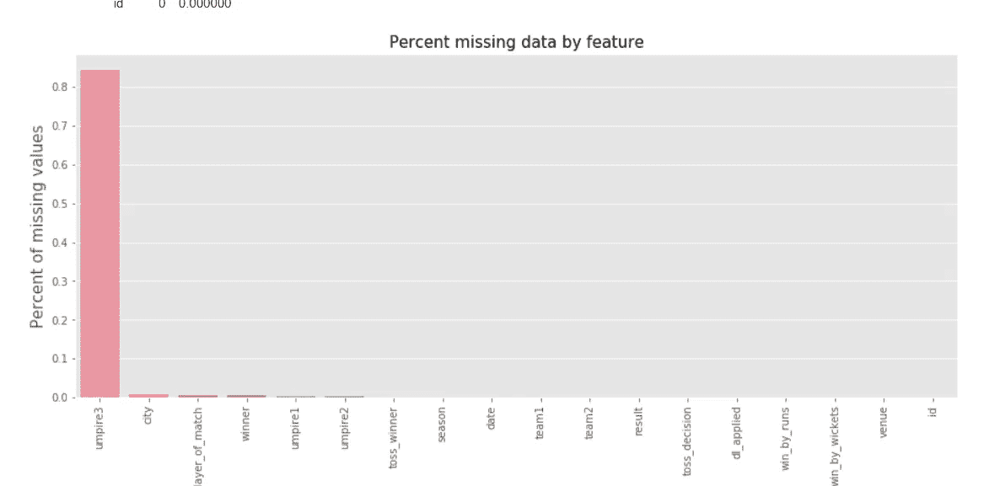

# 数据预处理:分步指南

> 原文：<https://medium.com/analytics-vidhya/data-pre-processing-a-step-by-step-guide-eeb1c26301bd?source=collection_archive---------21----------------------->

在开始数据建模之前，进行充分的分析和特征工程是非常重要的。人们经常面临数据处理的问题，尤其是当数据是高维的时候。


来源: [Pinterest](https://www.pinterest.ca/pin/585608757769156534/?lp=true)

在这篇文章中，让我们来看看数据预处理的不同步骤。

## 1.用什么编码平台？

虽然 [Jupyter Notebook](https://jupyter.org/) 是一个很好的起点，但 Google [Colab](https://colab.research.google.com/notebooks/intro.ipynb) 永远是协作工作的最佳选择。在这篇文章中，我将使用 Google Colab 来展示数据预处理步骤。

# 2.如何为进一步的分析准备原始数据？

数据收集是机器学习问题的第一步。其次是理解和加载笔记本中的数据。数据可以有多种格式,大多数问题中最常见的格式是 csv(逗号分隔值)。

```
## Import required libraries
import numpy as np
import pandas as pd## Upload dataset
from google.colab import files
uploaded = files.upload()
```

## 2.1 选择要上传的文件

```
## Read a .csv file to pandas dataframe
df = pd.read_csv(uploaded['data.csv'])## Read a .json file to pandas dataframe
df = pd.read_json(uploaded['data.json'])## Read an excel file to pandas dataframe
df = pd.read_excel(uploaded['data.xlsx'])
```

# 3.描述数据有哪些不同的方式？

## 3.1 数据的维度

```
df.shape 
# df is the dataframe object name whose dimension we want to obtain
# it returns a tuple with (no.of rows,no. of columns) 
```

## 3.2 检查并删除数据集中的任何重复项

```
df.duplicated().sum() #returns the duplicated rows in our data
df.drop_duplicates(inplace=True)
```

`inplace=True`确保 dataframe 对象被修改，但不创建其副本。如果您需要返回数据帧的副本，请使用`inplace=False`来代替。

## 3.3 每个数字列的描述

```
df.describe()  #returns only the numerical columns stats #to get all columns' stats use
df.describe(include='all') 
```

`describe()`通过最小值和最大值以及平均值、中值、标准偏差&等几个值，帮助获得数据集的基本信息。

## 3.4 获取数据集的第一行或最后几行

```
df.head(5) # returns first '5' rows of the dataframe
df.tail(5) # returns last '5' rows of the dataframe
```

## 3.5 检查列的数据类型和每列中的条目数:

```
df.info()
```

## 3.6 列名

如果数据集包含大量的要素(列)，它有助于获取整个要素列表。使用`df.columns`以描述性格式返回数据帧中所有列的名称。

```
df.columns #deliveries.csvOutput:
Index(['id', 'season', 'city', 'date', 'team1', 'team2', 'toss_winner','toss_decision', 'result', 'dl_applied', 'winner', 'win_by_runs','win_by_wickets', 'player_of_match', 'venue', 'umpire1', 'umpire2', 'umpire3'],
      dtype='object') 
```

## 3.7 检查数据集中的常量列:

```
const_col=[c **for** c **in** df.columns **if** df[str(c)].nunique()==1]
```

常量列是只包含一个唯一值的列。删除它们是有意义的，因为它们不会给我们的最终模型增加任何价值

## 3.8 删除数字列中的特殊字符

现在，在几个实例中，包含数字数据的列可以具有“对象”数据类型。由于缺少数据点，一些特殊字符如`**?**`或`space`可能出现在连续变量中。在这种情况下，我们将检查唯一条目，以删除它们并更改数据类型:

```
for col in ['names of each column containing object datatype with numeric data points']:
  uni_val_col = df[col].unique()
  print ('The unique values in ' , col , 'are ', uni_val_col)## Convert string datatype to float wherever required and change special characters to NaN
for col in ['names of each column containing object datatype with numeric data points']:
  df[col] = pd.to_numeric(df[col], errors='coerce')
```

这会将数字列中的特殊字符转换为“NaN”值，然后转换为*数字*类型。

## 3.9 从分类列中删除特殊字符

我们应该在分类列中检查类似的特殊字符(如 3.8 节所述)，并用适当的值替换它们。

```
df.replace(to_replace=["?", ";"], value=np.nan)
```

## 3.10 创建独立的连续和分类数据框架

```
## Create a dataframe with continuous columns 
df_cont = df.select_dtypes(include = ['int64','float64'])## Create a dataframe with categorical columns
df_cat = df.select_dtypes(include = ['object'])
```

# 4.缺失值处理

大多数情况下，数据集会丢失值，真实世界的数据从来都不是完美的，并且包含很高百分比的丢失数据。缺失值可能是因为在大型数据集的情况下，收集每个数据值非常困难。

没有最好的方法来估算缺失数据，这取决于问题的类型。可能有许多方法来进行估算，但是这里我们将集中讨论几种方法。

## 4.1 查找缺失值百分比

在这里，我们可以看到如何获得我们在第 3 节中创建的连续数据帧中缺失值的百分比。

```
# Percentage of missing values in each dataframe along with visualization
total_missing = df.isna().sum()#percentagepercent_mising=df.isna().mean()*100missing_data = pd.concat([total_missing, percent_mising], axis=1, keys=['Total', 'Percent'])f, ax = plt.subplots(figsize=(15, 6))
plt.xticks(rotation='90')
sns.barplot(x=missing_data.index, y=missing_data['Percent'])
plt.xlabel('df_cont', fontsize=15)
plt.ylabel('Percent of missing values', fontsize=15)
plt.title('Percent missing data by feature', fontsize=15)missing_data
```


输出:



## 4.2 缺失值的插补

## 数字数据框架

任何列的缺失值都可以通过均值、中值或众数进行估算。如果列中的数据点没有太大的偏差，对于连续数据点，中值比平均值更适合用于替换空值。

```
df_cont.'columnname'.fillna(df_cont['columnname'].median(), inplace=True)
```

估算值的最简单方法是使用**简单估算器**估算来处理缺失值。还有其他的[方法](https://scikit-learn.org/stable/modules/impute.html)也是为了获得更好的结果。

```
from sklearn.impute import SimpleImputer
imputer = SimpleImputer(missing_values=np.nan, strategy='mean') 
df_data = imputer.fit_transform(df_cont)## Creating a new dataframe of the imputed data
df_num = pd.DataFrame(df_data, columns = df_cont.columns ) 
```

## 4.2.2 分类数据框架

在分类数据点的情况下，我们可以用模式来代替它

```
## Replacing NaN with mode for a column
df_cat.'catName'.replace({'NaN':df_cat.'catName'.mode()} , inplace =True)
```

# 5.数据分布

## 5.1 数字数据帧的图形表示

```
## Plotting bar plots for categorical data columns
for col in df_cat.columns:
    plt.figure()
    sns.countplot(x=col, data=df_cat)
    plt.xticks(rotation=90,fontsize=15) 
```

# 6.异常值的处理

## 6.1 异常值百分比和其他描述性统计措施

异常值是可能影响也可能不影响模型的任何特征的极值。要获得每个数值或分类属性中异常值的百分比，我们可以使用-

```
# Use the appropriate dataframe in place of "dataframe_name" in the code below, i.e. in this case **df_num** and **df_cat**df_outliers = pd.DataFrame(index=dataframe_name.columns, columns=['outliers', 'outliers%']) for col in dataframe_name.columns:if any(x in str(dataframe_name[col].dtype) for x in ['int', 'float']):df_outliers.loc[col, 'count'] = len(dataframe_name)
df_outliers.loc[col, 'q1'] = dataframe_name[col].quantile(0.25)
df_outliers.loc[col, 'q3'] = dataframe_name[col].quantile(0.75)
df_outliers.loc[col, 'iqr'] = df_outliers.loc[col, 'q3'] - df_outliers.loc[col, 'q1']
df_outliers.loc[col, 'lower'] = df_outliers.loc[col, 'q1'] - (3 * df_outliers.loc[col, 'iqr'])
df_outliers.loc[col, 'upper'] = df_outliers.loc[col, 'q3'] + (3 * df_outliers.loc[col, 'iqr'])
df_outliers.loc[col, 'min'] = df[col].min()
df_outliers.loc[col, 'max'] = df[col].max()
df_outliers.loc[col, 'outliers'] = ((dataframe_name[col] < df_outliers.loc[col, 'lower']) | (df[col] > df_outliers.loc[col,'upper'])).sum()
df_outliers.loc[col, 'outliers%'] = np.round(df_outliers.loc[col,
'outliers'] / len(dataframe_name) *100)df_outliers
```

我们也可以对每个特征使用箱线图来获得相同的图形表示。

## 6.2 异常值的处理

有不同的方法来处理异常值，z-score 是一种简单的方法。

```
from scipy import statsz_scores = stats.zscore(dataframe_name)
abs_z_scores = np.abs(z_scores)
entries = (abs_z_scores < 3).all(axis=1)
dataframe_name = dataframe_name[entries]
```

这就完成了我们最初的数据预处理！我们现在可以从可视化和特征工程开始，使我们的数据集模型就绪。