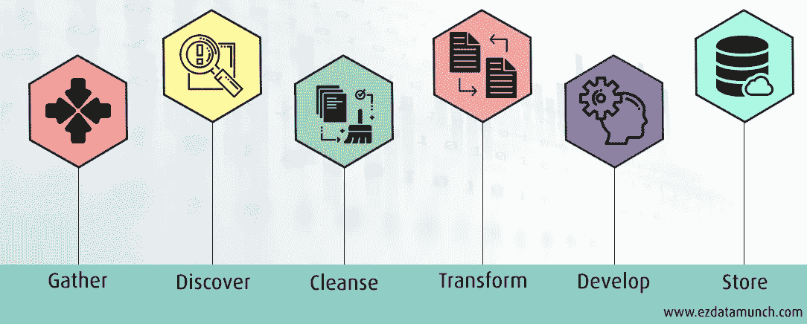

# 数据准备:机器学习的关键阶段

> 原文：<https://medium.com/analytics-vidhya/data-preparation-a-crucial-phase-in-machine-learning-b78126b0eebb?source=collection_archive---------21----------------------->

[图像来源](https://newslit.org/)

**..所以我们先来回答为什么，为了动力！😊**

# **我们为什么需要数据准备？**

> 大多数行业专家认为，世界上 80%到 90%的数据是非结构化的，其中大约 90%是在最近两年内创建的。在这些大得不可思议的商店中，只有 0.5%被分析和使用。

我们不能将原始的非结构化数据直接输入到可视化中，希望得到近乎精确的结果。我们的分析或机器学习模型只会和我们使用的数据一样好。

我们可以访问数百个呈指数级增长的原始非结构化数据，但只有不到 1%的数据得到了利用。俗话说，

> 没有数据是干净的，但大多数是有用的。~院长阿博特

能够将原始数据转换成有用的东西是数据准备发挥作用的地方。一份 [**调查**](https://www.forbes.com/sites/gilpress/2016/03/23/data-preparation-most-time-consuming-least-enjoyable-data-science-task-survey-says/?sh=3730ccca6f63) 由吉尔出版社陈述的*，数据准备约占数据科学家工作的 80%。*这是可以理解的，因为数据准备是准确分析和建立机器学习模型的基础。

现在我们已经看到了数据准备的重要性，让我们开始理解它的含义以及我们如何获得有用的数据。

# 目录

1.  什么是数据准备？
2.  资料准备涉及哪些步骤？
3.  有没有用于数据准备的工具？
4.  结论

# **什么是数据准备？**

简而言之，数据准备是将原始数据转换成可用于分析和训练 ML 模型的形式的过程。这涉及许多分散的任务，如收集、格式化、清理和整合数据。

# **资料准备涉及哪些步骤？**

数据准备步骤(图片中提到的来源)

1.  **收集数据**

一旦你有了问题陈述，你就会对设计你的模型所需要的数据有所了解。利用这些信息，尝试进行逆向工程，并从各种来源(如数据库、文件、网页等)收集数据。

第一步总是至关重要的，试着为你的目标找到合适的数据。

2.**数据发现** & **剖析**

在这一步中，您将需要收集所收集数据的统计数据，并仔细检查以发现模式和异常。概要分析将通过汇总缺失值、重复值、异常值和其他不一致的数据来帮助您了解数据的质量。

3.**数据清理**

对数据进行分析后，您应该清理数据。

*   删除所有冗余数据
*   通过用观察到的模式填充丢失的值来处理它
*   移除数据中的异常值
*   移除两个高度相关特征中的一个
*   缩放所有不同的要素，以获得相同数量的数据
*   屏蔽所有个人信息以保护隐私

清理后，必须测试数据集是否有任何明显的错误。

4.**数据转换**

这一步着重于标准化要素的变量类型和变量概率分布。有必要将分类数据(如性别、月份等标签值)转换成数字格式，因为建模将包括数学公式。

纠正分析中遗漏的任何错误。这一步确保了数据的结构化和高质量。

5.**数据开发**

数据开发是一个可以根据需要改变数据集大小的过程。如果数据集太小，无法训练模型，请执行数据扩充。否则，如果数据集很大，则执行数据采样。

*   **数据扩充**

数据扩充是在不实际收集新数据的情况下使数据多样化的过程，意味着从现有数据中合成新数据。有各种各样的技术，如裁剪、填充、翻转等。

*   **数据采样**

数据采样是选择和操作代表数据集的子集的过程。

6.**存储/发布数据**

此时，您的数据已准备好存储在目标系统中，该系统可以是用于数据分析的第三方商业智能工具。

如果您使用数据来训练机器学习模型，则执行将数据分成训练数据集和测试数据集的预先步骤。

# **有没有用于数据准备的工具？**

你现在可以放松了！😄有一些很棒的工具，如 [Altair](https://www.altair.com/) 、 [AWS Glue DataBrew](https://aws.amazon.com/glue/features/databrew/) 、 [Trifacta](https://www.trifacta.com/) 、 [Talend](https://www.talend.com/) 等，它们是交互式的、可视化的。

虽然有需要技术知识但高度可定制的自助式数据准备工具，但也有不需要先前技术知识的全服务数据准备工具，它们对业务用户分析数据最有用。

存储在数据库中的数据的数据准备也可以使用 SQL 工具来处理，您可以参考 [cheatsheet](https://pdfhost.io/v/xF6KaMWqi_Data_Preparation_in_SQL_Cheat_Sheet.pdf) 。

# **结论**

> “资料就这些了。这是昨天的礼物，你今天收到它是为了让明天更美好。”
> —乔恩·阿科夫

随着数据量与日俱增，这对 it 部门来说既有利也有弊。这意味着数据准备可能变得更加耗时和详尽，但却是数据世界中最重要的阶段。

准备充分的数据对于卓有成效的分析和获得模型的准确预测至关重要。在培养✨方面，总有更有效的工具

# **参考文献**

 [## 了解数据准备路线图| Akira AI

### 数据准备在人工智能系统中起着至关重要的作用。人工智能系统根据历史数据进行预测。因此它是…

www.akira.ai](https://www.akira.ai/blog/understanding-data-preparation-roadmap/)  [## 解释数据准备流程:步骤、优势和工具

### 数据和分析正在塑造非黑即白的未来。未来承诺更高的可见性，消除风险…

dataintegrationinfo.com](https://dataintegrationinfo.com/data-preparation-process/)  [## 机器学习的数据准备-机器学习掌握

### Python 中机器学习数据清理、特征选择和数据转换的数据准备...那么什么是…

machinelearningmastery.com](https://machinelearningmastery.com/data-preparation-for-machine-learning/) 

附:请随时留下您的评论，我一定会考虑您的建议并即兴创作博客。干杯！