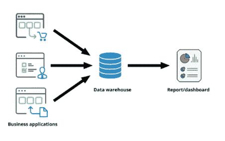
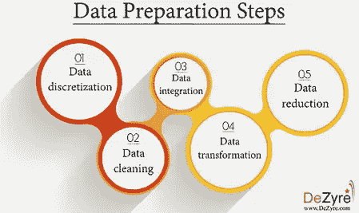
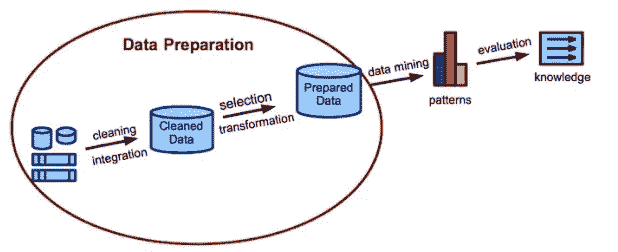
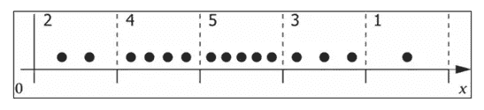

# 数据科学中的数据准备

> 原文：<https://medium.com/analytics-vidhya/data-preparation-in-data-science-16f9311760?source=collection_archive---------2----------------------->

**数据准备:-**

数据准备是在处理和分析之前清理和转换原始数据的过程。这是处理之前的一个重要步骤，通常涉及重新格式化数据、对数据进行更正以及合并数据集以丰富数据。

对于数据专业人员或业务用户来说，数据准备通常是一项漫长的任务，但它是将数据放在上下文中以将其转化为见解并消除因数据质量差而产生的偏差的必要前提。

数据准备过程通常包括标准化数据格式、丰富源数据和/或移除异常值。

数据准备是收集、清理数据并将其整合到一个文件或数据表中的过程，主要用于分析。

**为什么要准备数据？**

我们需要准备数据有几个原因。

通过准备数据，我们实际上准备了挖掘器，以便当使用准备好的数据时，挖掘器更快地产生更好的模型。

好的数据对于生成任何类型的高效模型都是必不可少的。

数据应根据所需的软件工具进行格式化。

对于给定方法，需要使数据足够。

现实世界中的数据是脏的。

**数据不完整**:有些数据缺少属性值，缺少感兴趣的某些属性，或者只包含聚合数据。

例如，名= " "或姓= " "

**嘈杂**:部分数据包含错误。

例如，年龄= -10

**不一致**:部分数据编码和名称不一致

例如，年龄= 56，出生日期= ' 04–05–1995 '

**数据准备的好处:**

数据准备帮助:

**快速修复错误** —数据准备有助于在处理之前发现错误。当数据从其原始来源中删除后，这些错误变得更加难以理解和纠正。

**生成高质量的数据** —清理和重新格式化数据集可确保分析中使用的所有数据都是高质量的。

**做出更好的业务决策** —能够更快、更高效地处理和分析的高质量数据会带来更及时、高效和高质量的业务决策。

**数据准备步骤:**

数据准备过程的细节因行业、组织和需求而异，但框架基本保持不变。

数据准备的主要任务如下:

1)数据离散化

2)数据清洗

3)数据集成

4)数据转换

5)数据简化

让我们详细了解每一步。

**1)**数据离散化:

它是数据简化的一部分，对数值数据尤其重要。

**2)** **数据清理:**

手动数据准备容易出错、耗时且成本高昂。商业决策依赖于分析。但是，如果数据不准确或不完整，您的分析会导致错误的业务决策。糟糕的分析意味着糟糕的商业决策。Altair Monarch 编程有超过 80 个预建的数据准备功能，以加速艰巨的数据清理项目。

**3)** **数据整合:**

从任何来源访问数据—无论来源、格式或叙述，并将它们集成在一起。Monarch 擅长智能地、自动地从复杂的非结构化和半结构化数据源(如 pdf)中提取数据。增加对数据的访问意味着您的组织可以减少手动工作、获得更快的洞察力并更快实现价值。

**4)** **数据转换:**

能够快速更改数据汇总和呈现的方式，使业务分析师和高管能够快速考虑不同的数据视角和视图。Monarch 使您可以轻松打包干净的混合数据，以获得有洞察力的报告，并可以放心地与组织的其他成员共享。

**5)** **数据还原:**

它在体积上获得简化的表示，但产生相同或相似的分析结果。

**数据准备示例:**

通常有多个值用于表示病毒。像新冠肺炎这样的病毒可以用“SAR-Cov2”、“Corona”、“COVID”或“新冠肺炎”来表示。

在这种情况下，可以使用数据准备工具来识别不正确数量的唯一值(在病毒的情况下，如果唯一计数大于 covid 的合适数量，将会产生一个标志，因为只有少数名称与病毒一致)。然后，这些值需要标准化，以便在每一行中只使用缩写或完整拼写。

# 宁滨数据

**宁滨:-**

数据宁滨，分桶是一种数据预处理方法，用于最小化小观测误差的影响。原始数据值被分成称为箱的小间隔，然后被为该箱计算的一般值所取代。这对于输入数据具有平滑效果，并且在小数据集的情况下还可以减少过度拟合的机会。

有两种方法将数据划分到仓中。

**等频宁滨:**仓有等频。

**等宽宁滨:**面元等宽，每个面元的范围定义为[min + w]，[min + 2w] …。[min + nw]其中 w =(max-min)/(箱数)。

**宁滨数据的重要性:-**

宁滨用于减少连续和离散数据的基数。

宁滨将相关值组合在一起，以减少不同值的数量。

宁滨可以显著提高资源利用率和模型构建响应时间，而不会显著降低模型质量。

宁滨可以通过加强属性之间的关系来提高模型质量。

监督宁滨是智能宁滨的一种形式，其中使用数据的重要特征来确定容器边界。

在受监督的宁滨中，柱边界由单预测器决策树识别，该决策树考虑了与目标的联合分布。监督宁滨可用于数值属性和分类属性。

**数据平滑的优势(优点)**

数据平滑清除了数据集中不同重要隐藏模式的可理解性。

数据平滑可以用来帮助预测趋势。预测对于在正确的时间做出正确的决定非常有帮助。

数据平滑有助于从数据中获得准确的结果。

**数据平滑的缺点**

数据平滑并不总是对数据中的模式提供清晰的解释。

关注其他数据点可能会忽略某些数据点。

**参考资料:** [**Dezyre**](https://www.dezyre.com/article/apache-spark-makes-data-processing-preparation-faster/225%20https://asq.org/quality-resources/histogram) ，[**bigdatanalyticsnew**](https://bigdataanalyticsnews.com/data-preparation-why-is-it-important/)，[**unite foresight**](http://www.uniteforsight.org/research-methodology/module5)**。**