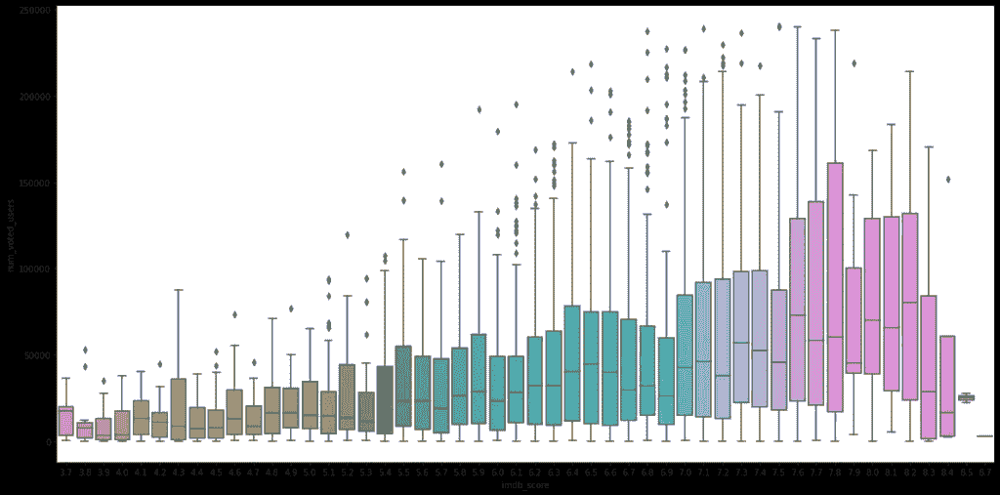
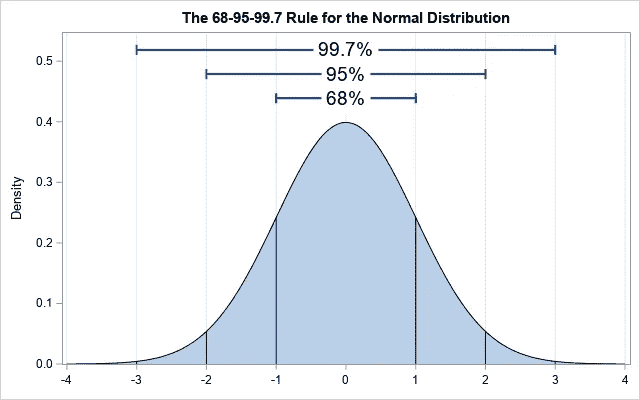

# 机器学习的数据预处理和探索性数据分析。

> 原文：<https://medium.com/analytics-vidhya/data-preprocessing-and-exploratory-data-analysis-for-machine-learning-75b8a6468b72?source=collection_archive---------7----------------------->

**什么是探索性数据分析？**

探索性数据分析(EDA)是一个术语，指的是用数据集完成的某些类型的初始分析和发现，通常是在分析过程的早期。一些专家将其描述为“瞥一眼”数据，以了解更多关于它代表什么以及如何应用它的信息。探索性数据分析通常是其他类型的统计和数据工作的先导。

学分:Edvicer

**预处理:**

在 EDA 中，我们将对数据进行预处理，对数据进行分类或数值分析，将它们可视化，并做出一些统计决策。

我们来详细看看，

首先，让我们从导入和加载数据集开始

让我们通过使用 info 来检查数据类型。该代码将给出数据集的数据类型和维度以及数据集的描述。

**分类变量:**

包含姓名、性别、地址、公司、工作角色等细节的变量称为分类变量。

*数据类型:分类，对象*

**数值变量:**

包含 id、薪水、班级等详细信息的变量称为数字变量。

*数据类型:整型、浮点型*

上图帮助你决定你有什么样的变量

让我们通过编码将分类变量和数字变量分开

**一、数值数据:df . select _ dtypes(NP . number)**

**二。分类数据:df.select_dtypes(object)**

拆分变量后，将它们放在一边以备将来使用

再来对付 df。

现在检查空值:df。Isnull()。总和()

上面的代码将以列的方式给出数据中存在的空值，如果在给定的数据中存在空值，您应该填充空值以获得良好的输出。在某些情况下，如果数值变量有空值，则用平均值或中值替换它们，如果分类变量有空值，则用模式替换它们。

**为数字列填充空值:**

df[列名]= df[列名]。fill na(df[列名]。均值())

**为分类列填充空值:**

df[列名]= df[列名]。fill na(df[列名]。mode())

或者有些人使用 KNNImputer，但它更可能是用于机器学习目的。

**离群值:**

异常值是指与其他点相距异常远的一段数据。换句话说，它是位于集合中其他值之外的数据。发现异常值的方法有很多，最常用的技术是可视化箱线图。

也就是说，使用箱线图后，我们现在可以看到数据集中存在大量异常值。

这张图片解释了箱线图，其中包含了数学原理。

**异常值按编码处理:**

*Q1 = df .分位数(. 25)*

*Q3 = df .分位数(. 75)*

*IQR = Q3-Q1*

*df = df[~((df<(Q1–1.5 * IQR))|(df>(Q3+1.5 * IQR))。任意(轴=1)]*

上面的代码将帮助您删除离群值

**总体与样本数据:**

总体是整个数据，样本是总体的子集。在抽样过程中，没有必要获得总体的全部特征。

填充空值后，使用 distplot 并移除异常值，让我们看到数据的正态性

为此，您必须使用 df.skewness()，这段代码将告诉您您的代码是正态分布还是偏态分布

下图显示了数据是如何分布的:

右偏斜(正偏斜)

左偏斜(负偏斜)

所以现在我们可以开始研究数据可视化。

**柱状图:**

将点估计值和置信区间显示为矩形条。条形图用每个矩形的高度表示数值变量的集中趋势估计值，并使用误差线提供该估计值周围不确定性的一些指示。

**历史图:**

直方图很可能是同一个条形图，但两个条形图之间没有距离间隙。

**热图:**

热图分析是审查和分析热图数据以收集关于页面上用户交互的洞察的过程。这种数据分析可以改进网站设计，降低跳出率，减少掉线，提高页面浏览量和转换率。热图基本上与相关值一起工作，因此它也用于各种变量之间的相关性。

多个变量之间的相关性(热图)

上图显示了各种变量之间的相关性，高相关性区域为深蓝色，低相关性区域为乳白色。

**成对绘图:**

要在数据集中绘制多个成对二元分布，可以使用 pairplot()函数。这将数据帧中变量的(n，2)组合的关系显示为图的矩阵，对角线图是单变量图

配对图

**散点图:**

散点图是一种使用笛卡尔坐标来显示一组数据的典型的两个变量的值的图或数学图表。示例散点图如下所示。

散点图和为电影投票的用户数量之间的关系是粗略的，imbd_score 是分开的。

T21

LMplot 与散点图相同，但回归线模型适合面网格。该图主要用于监督学习中的机器学习目的，以查看最佳拟合。

最佳拟合线下的毛预算

**距离图:**

distplot 与 Kdeplot 和 histplot 的组合相同。

**接合图:**

Jointplot 在页边距中显示两个变量(双变量)和 1D 剖面(单变量)之间的关系。这个 plot 是一个包装 JointGrid 的便利类。

总额和预算之间的关系用联合图表显示

seaborn 和 matplotlib 中有越来越多的可视化绘图可用，但这些是可视化领域中使用最广泛的绘图。另外，我在 Github 上附上了我的 jupyter 笔记本看看。

[https://github . com/Anand-lab-172/Data _ Preprocessing _ and _ explorative _ Data _ Analysis _ for _ Machine _ Learning](https://github.com/anand-lab-172/Data_Preprocessing_and_Exploratory_Data_Analysis_for_Machine_Learning)

感谢阅读。:)

而且，💙如果这是一本好书。尽情享受吧！