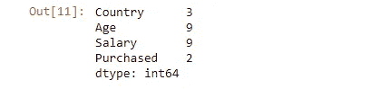

# 数据预处理:在你认为自己准备好之前就开始…

> 原文：<https://medium.com/analytics-vidhya/data-preprocessing-begin-before-you-think-youre-ready-8f090987425e?source=collection_archive---------3----------------------->


照片由[像素](https://www.pexels.com/photo/black-claw-hammer-on-brown-wooden-plank-209235/?utm_content=attributionCopyText&utm_medium=referral&utm_source=pexels)的[皮克斯拜](https://www.pexels.com/@pixabay?utm_content=attributionCopyText&utm_medium=referral&utm_source=pexels)拍摄

D 数据预处理是所有机器学习模型建立的基础，也就是说，为了获得最佳结果，我们的数据完整性最好比混凝土更强。

这并不是说它是大计划中的一个重要“步骤”，但是，它更多的是对机器学习算法的语言的解释，语言既可以是障碍，也很可能是障碍的打破者，请放心，数据预处理是后者。

简而言之，为了让我们的算法工作，我们需要以一种可以计算的格式输入数据，就像计算机用二进制语言操作一样，这有点像我们要做的，把不利类型的数据变成 1 和 0，我的朋友……1 和 0。
这还不是全部，还需要替换或删除缺失值，将数据拆分为训练和测试，最后，仅在拆分后扩展功能。

*在这篇文章结束时，你将已经清理了一个数据集，为进一步的分析做好了准备……*

# **我们从导入先决条件库开始…**

```
import numpy as np
import pandas as pd
```

[NumPy](https://numpy.org/doc/) ，这样我们就可以使用数组， [Pandas](https://pandas.pydata.org/docs/) ，这样我们就可以导入数据集并使用特征矩阵和目标变量。

## 导入数据集和第一印象…

```
df = pd.read_csv('Data.csv')
df
```


```
df.info()
```


```
df.nunique()
```



```
df.describe()
```


我们可以立即注意到“国家”特性不是一个数值，有 3 个唯一的国家(编码)。
purchased 变量也是如此，它也是我们的目标变量，二进制输出，但仍然是字符串。
特征“年龄”在 27–48 的范围内，而“薪水”在 48000–83000 的范围内(特征缩放)。
还有最明显的一个，NaN 值(缺失值)。

# **分离从属和独立特征…**

```
X = df.iloc[:, :-1].to_numpy() # to_numpy for further operations
y = df.iloc[:, -1].to_numpy()print(X)print(y)
```


打印(x)


打印(y)


因此，通过 [iloc []](https://pandas.pydata.org/pandas-docs/stable/reference/api/pandas.DataFrame.iloc.html) 方法，我们要求捕获除最后一行之外的所有行和所有列，将它们全部转换为 NumPy 数组，并将其存储在变量“X”中。

类似地，“y”包含所有行，只包含最后一列。

# **现在我们填补空白……(缺失值)**

在训练机器学习模型时，缺失值不是好兆头，就像，根本不是(除了朴素贝叶斯和基于树的算法)，所以我们必须以某种方式处理它们。

我们*可以*通过使用 [dropna ()](https://pandas.pydata.org/docs/reference/api/pandas.DataFrame.dropna.html) 方法简单地删除那些困扰我们的行，但是有时候你可以通过用合适的有意义的东西替换丢失的值来充分利用数据。

我们可以使用 [fillna ()](https://pandas.pydata.org/pandas-docs/stable/reference/api/pandas.DataFrame.fillna.html) 或[插值](https://pandas.pydata.org/pandas-docs/stable/reference/api/pandas.Series.interpolate.html)函数，甚至一个外部库来实现这一点，只要选择一个最适合你的方法，并坚持下去。

外部库方式听起来很有趣，我们就这样吧…

```
from sklearn.impute import SimpleImputer
```

因此，我们正在从估算模块的 [sklearn](https://scikit-learn.org/stable/) (Scikit learn)库中访问一个名为[simple input](https://scikit-learn.org/stable/modules/generated/sklearn.impute.SimpleImputer.html)的类。

```
impute_er = SimpleImputer(missing_values = np.nan, strategy = 'mean')
```

就像它在面向对象编程中的工作方式一样，我们制作了一个 SimpleImputer 类的实例/对象。
第一个自变量是目标，第二个自变量是替代。

目前，我们使用相应值的平均值，其他选项包括最频繁、常数和中值，这些都是不言自明的。

```
X[:, 1:3] = impute_er.fit_transform(X[:, 1:3])
print(X)
```

拟合方法将连接到要素矩阵，而变换方法将替换这些值。
输出如预期，感觉内容多一点。


# **语言障碍……**

我们知道我们为什么要这样做(因为机器学习模型不能处理字符串)，但事情是这样的，如果我们用 0 代表法国，1 代表西班牙，2 代表德国对“国家”特征进行编码，模型将“认为”德国与其他国家相比具有更大的价值，这根本不是真的，除非我们谈论的是足球(德国 4 次世界杯，法国 2 次，西班牙 1 次)。

前面提到的方法被称为标签编码，当有一个层次结构时，如高级>初级>助理，这种方法很有用。

一个热编码将帮助我们解决当前的困境，它可以生成与类别数量一样多的独立列，在我们的例子中，这意味着 3 列，每列表示 0 代表假，1 代表真。

> 附注…我们将删除三列中的一列，以避免[多重共线性](https://www.investopedia.com/terms/m/multicollinearity.asp#:~:text=Multicollinearity%20is%20the%20occurrence%20of,in%20a%20multiple%20regression%20model.&text=In%20general%2C%20multicollinearity%20can%20lead,independent%20variables%20in%20a%20model.)。

一种方法是使用 [pd.get_dummies()](https://pandas.pydata.org/docs/reference/api/pandas.get_dummies.html) 方法，它可以直接在数据框上工作，但我们将继续使用一些外部库( [ColumnTransformer](https://scikit-learn.org/stable/modules/generated/sklearn.compose.ColumnTransformer.html) )来处理我们的特征矩阵。

```
#Class
from sklearn.compose import ColumnTransformer
from sklearn.preprocessing import OneHotEncoder#Object
CT_obj = ColumnTransformer( transformers = [('encoder', OneHotEncoder(drop = 'first'), [0])], remainder = 'passthrough')# Connecting and replacing
X = np.array(CT_obj.fit_transform(X))print(X)
```


*drop = "first"* ，删除由“Country”特征构成的三列中的一列，以避免多重共线性，以及，
*remainder = " pass through "*参数，以保留我们未对其执行热编码的其余特征。
至于我们的目标特性，让我们使用标签编码器，只是为了获得其代码的要点…

```
#Class
from sklearn.preprocessing import LabelEncoder#Object
LE_obj = LabelEncoder()# Connecting and replacing
y = LE_obj.fit_transform(y)print(y)
```


## 何时使用 LabelEncoder 或 OneHotEncoder。

底线，在处理序数特征(层次结构)时使用 LabelEncoder，有很多类别(我们在一个二进制特征上使用它来熟悉代码)。

OneHotEncoder 当没有层次结构但我们还是想把那些类分开，而类的数量又太少的时候。

# **将数据分为训练和测试…**

为什么？…以便我们可以评估模型的性能，并且更容易确定模型估计值的接近程度。

```
from sklearn.model_selection import train_test_split
X_train, X_test, y_train, y_test = train_test_split(X, y, test_size = 0.2)print(X_train)
```


```
print(X_test)
```


```
print(y_train)
```


```
print(y_test)
```


# **特征缩放**

并非所有的机器学习模型(如多元线性回归)都需要这一点，但有时我们需要相同尺度上的所有特征(如 KNN 等基于距离的算法)，以便我们可以避免少数特征优于其他特征，或者换句话说，少数特征在最终结果中具有更大的权重，从而导致忽略较小尺度上的特征。

你必须明白的是，我们只在数据的训练/测试分割之后**进行缩放是有原因的。**

*两种主要的特征缩放技术*


因此，假设我们使用的是[标准化](https://scikit-learn.org/stable/modules/preprocessing.html)方法，“X”将是数据集中的值，“平均值(X)”和“标准差(X)”是不言自明的，即它将是特定列(特征)的平均值和标准差。

测试集应该是全新的值，用于预测我们已经知道答案的结果。

“全新”是关键词，所以当我们扩展特性时，我们不可能包括测试集，因为标准差的值会不同。
这就是为什么我们只在训练测试分裂后才缩放我们的特征

一般来说，标准化工作得很好，其值大约在-3 到+3 的范围内。
[归一化](https://scikit-learn.org/stable/modules/generated/sklearn.preprocessing.normalize.html)在大多数特征呈正态分布(钟形曲线)时效果很好，并且输出在-1 到 1 的范围内。

> 另外，如果你想知道，我们没有对 One hot encoded 列应用功能缩放，因为这将使它失去作为特定类(德国、法国、西班牙)的指示器的价值。

```
from sklearn.preprocessing import StandardScalerscale_obj = StandardScaler()X_train[:, 2:] = scale_obj.fit_transform(X_train[:, 2:])X_test[:, 2:] = scale_obj.transform(X_test[: , 2:])print(X_train)print(X_test)
```


打印(X_train)


打印(X _ 测试)

你会注意到我们只应用了*。使用测试集转换*,如果我们在测试集上使用 *fit_transform* ,定标器值会有所不同，即测试集值的标准偏差会被使用，而不是训练集的标准偏差，我们需要为我们的模型保持相同的定标器，这就是为什么只有*。转换*我们也使用训练集的定标器来转换测试集中的值。

# **结论**

数据预处理是一门艺术，真正的数据科学家的价值不仅在于解决扔给你的业务问题，还在于知道何时使用什么工具，并为有意义的叙述准备一个序幕。