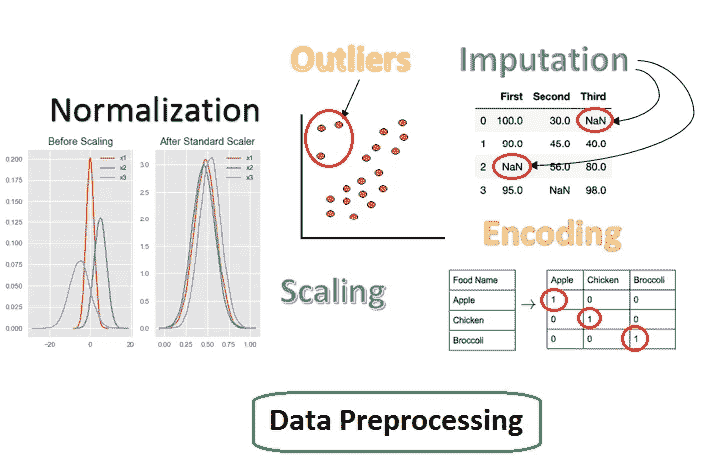
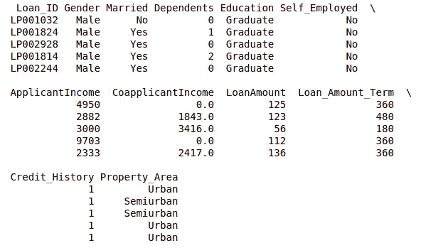
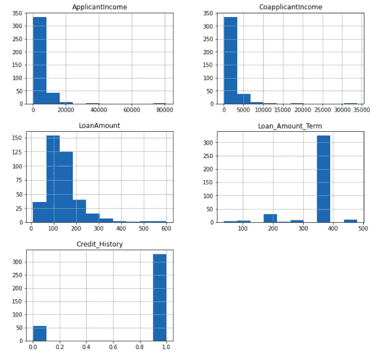
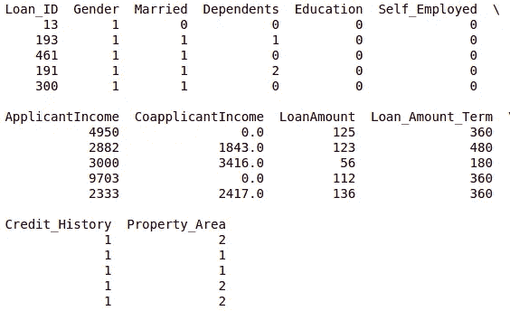
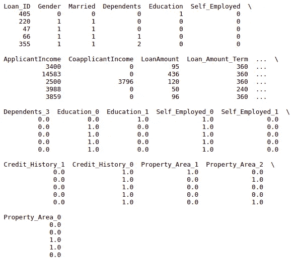

# 使用 Sklearn 进行数据预处理

> 原文：<https://medium.com/analytics-vidhya/data-preprocessing-using-sklearn-2c6fe013f594?source=collection_archive---------1----------------------->

[来源](https://towardsai.net/p/data-science/data-preprocessing-concepts-with-python)

在这个世界上，你永远不会找到一个完美的现成可用的数据集，可以直接应用于任何机器学习算法。为了应用机器学习算法，我们必须执行某些数据预处理以适应模型。

这篇文章背后的动机是解释整个数据预处理周期，这是任何机器学习项目的基础。

# 目录

1.  特征缩放
2.  标准化
3.  编码
4.  [数]离散化
5.  处理缺失值

那么，我们开始吧。

我将使用 loan_prediction 数据集来解释数据预处理概念。您可以在此 下载 [*的数据集。*](https://www.analyticsvidhya.com/wp-content/uploads/2016/07/loan_prediction-1.zip)

让我们加载数据集。

数据集将看起来像这样。

资料组

让我们进入文章的实际内容。

# 1.特征缩放或标准化

要素缩放是一种缩放技术，在这种技术中，值被移动和重新缩放，以便它们最终的范围在 0 和 1 之间，或者每个要素的最大绝对值被缩放到单位大小。

对连续变量执行特征缩放。让我们画出所有变量的分布图。

连续变量的分布

通过理解该图，申请人收入和共同申请人收入在相同范围内，即 0-50，000，而贷款金额在 0-600 美元范围内。

Loan_Amount_Term 的情况与其他变量完全不同，因为它的单位是月，而其他变量的单位是美元。

如果我们将任何基于距离的方法直接应用于该数据，那么具有较高值范围的变量将占主导地位，因此其他一些重要的变量将变得不重要，因此在这种情况下，我们的准确度将较低。

让我们直接把 KNN 应用到这个变量上，看看会有什么结果。

在不缩放数据的情况下应用 knn

通过在没有缩放值的情况下对该数据应用 knn，我们获得了 61%的准确度。

现在，让我们先缩放数据，让我们应用特征缩放技术。

在 sklearn 中，我们可以通过两种方式扩展数据

## 1.最小最大缩放器

最小最大缩放器将数据点重新缩放到 0 到 1 的范围内。

最小最大标量公式

X_std = (X — X.min(轴=0)) / (X.max(轴=0) — X.min(轴=0))

X_scaled = X_std *(最大值—最小值)+最小值

应用最小最大缩放器

应用 MinMaxScaler 后，我们将获得大约 75%的准确性。所以，MinMaxScaler 帮助我们吹嘘我们模型的准确性。

让我们看看，如果我们将 MaxAbsScaler 应用于这些变量会怎么样。

## 2.MaxAbsScaler

MaxAbsScaler 类似于 minmax scaler，但它通过除以每个要素中的最大值来缩放[-1，1]范围内的值。它适用于已经以零或稀疏数据为中心的数据。

应用 MaxAbsScaler

通过应用 MaxAbsScaler，我们获得了 70.83%的准确率。所以，在这种情况下，minmax scaler 更好。

换句话说，应用 MinMaxScaler 或 MaxAbsScaler 就是将数据置于某个基于值的范围的中心。

需要注意的是，在执行基于距离的方法时，我们必须尝试缩放数据，以便重要性较低的特征不会由于其较大的范围而最终支配目标函数。

现在的问题是，将空间数据居中会破坏数据中的稀疏结构，因此很少是明智的做法。但是，缩放稀疏输入是有意义的，尤其是在要素处于不同比例的情况下。

MaxAbsScaler 是专门为缩放稀疏数据而设计的，建议采用这种方式。

现在，如果我们应用算法而不是基于距离的算法呢？让我们试试逻辑回归。

通过在缩放数据之前应用逻辑回归，我们得到 61.46%的准确度，并且在缩放数据之后，我们得到 63.54%的准确度。

这里要注意的是，在 knn 的情况下，我们的准确率从 61%大幅提高到 75%，但在逻辑回归的情况下，我们没有得到这样的提升。那么，问题是什么？

这个问题的答案是，在逻辑回归中，每个特征被分配一个权重或系数(Wi)。因此，如果有一个范围相对较大的特征，并且它在目标函数中不重要，那么逻辑回归本身将为其系数分配一个非常低的值，从而抵消该特定特征的主要影响，而基于距离的方法(如 KNN)没有这种内在策略，因此它需要缩放。

但是，在逻辑回归的情况下，我们如何提高精确度呢？

标准化来了。

# 2.标准化

标准化(Z 值归一化)是对要素进行重新缩放的过程，以便它们具有均值为 0、标准差为 1 的标准正态分布的属性。

样本的标准分数(z 分数)可以计算为

z =(X-平均值)/标准偏差

现在，我们获得了 75%的准确率，这与缩放后使用 knn 获得的准确率相同。这证明标准化输入确实有助于提高预测模型的准确性。

其他算法如 KNN、神经网络、SVM、LDA、PCA 对标准化数据表现更好。

在本内容中，我必须明确的一点是，一般来说，标准化有 3 种技术:

1.  **最小-最大正规化，我们已经看到的最小最大规模**
2.  **平均或均值归一化，即最小标度**
3.  **Z 分数标准化，也称为标准化**

我希望我已经消除了你对正常化的困惑。

现在，采访中最受欢迎的问题之一是，什么时候应用规范化，什么时候应用标准化？

为此，深入研究数据和理解数据是必须的。您也可以两者都执行，并根据您的问题找出哪一个更好。

这里有一些选择合适方法的提示。

1.  当您知道数据的分布不符合高斯分布时，可以使用归一化。这在不假设任何数据分布的算法中很有用，例如 K-最近邻和神经网络。
2.  另一方面，在数据遵循高斯分布的情况下，标准化会有所帮助。然而，这并不一定是真的。此外，与标准化不同，标准化没有边界范围。因此，即使您的数据中有异常值，它们也不会受到标准化的影响。

关于标准化和规范化的更多细节，您可以访问这篇文章。

> **我们对连续数字特征进行了预处理。但是，我们的数据集也有其他特点，如性别，已婚，家属，自营职业者和教育。所有这些分类特征都具有字符串值，例如，性别具有值男性或女性。我们都知道计算机只理解数字，不理解其他任何东西，所以我们需要一种方法来将这些特征表示成数字特征。这个概念被称为标签编码。**

# 3.编码

我们可以用 Sklearn 以两种方式执行编码

## 1.标签编码

标签编码可以通过 sklearn 中的 LabelEncoder 来完成。标签编码器对特征中的每个唯一值进行可变分类。

例如，男性==> 1，女性==> 0

应用 LabelEncoder 后的数据。

应用 LabelEncoder 后的数据

应用 LabelEncoder 后，我们得到了 73.96%的准确率。因此，在这种情况下，通过添加分类特征，我们的准确性会降低。因此它没有太大的意义。

让我们也尝试对数据应用 OneHotEncoding。

## 2.OneHotEncoding

应用 OneHotEncoding 后的数据

在应用 OneHotEncoding 之后，我们获得了 75%的准确率，这与我们之前在添加分类变量之前获得的准确率相同。

现在出现了另一个问题，即使用 LabelEncoder 还是 OneHotEncoder？

这通常取决于数据集和您希望应用的模型。但是，在为您的模型选择正确的编码技术之前，仍然有几点需要注意。

在以下情况下，我们可以应用一键编码:

1.  分类特征是**而不是顺序**(就像上面的国家)
2.  分类特征的数量较少，因此可以有效地应用一键编码

我们在以下情况下应用标签编码:

1.  分类特征是**序数**(比如 Jr. kg，Sr. kg，小学，高中)
2.  类别的数量非常大，因为一键编码会导致高内存消耗

你可以在 [*这篇*](https://www.analyticsvidhya.com/blog/2020/03/one-hot-encoding-vs-label-encoding-using-scikit-learn/) 文章中阅读更多关于 LabelEncoder vs One-HotEncoder 的内容。

# 4.[数]离散化

数据离散化是通过分组将连续数据转换为离散桶的过程。离散化也因数据的易维护性而闻名。用离散数据训练模型比用连续数据训练模型更快、更有效。

离散化，也称为量化或宁滨，将连续要素划分为预先指定数量的类别(箱)，从而使数据离散。

离散化的主要目标之一是显著减少连续属性的离散区间数。因此，为什么这种转换可以提高基于树的模型的性能。

Sklearn 提供了一个 KBinsDiscretizer 类来处理这个问题。您唯一需要指定的是每个要素的条柱数量(n_bins)以及如何对这些条柱进行编码(序号、一个热或一个热密集)。可选策略参数可以设置为三个值:

1.  统一，其中每个要素中的所有条柱都具有相同的宽度。
2.  分位数(默认)，其中每个要素中的所有条柱都具有相同的点数。
3.  k 均值，其中每个条柱中的所有值都具有相同的 1D k 均值聚类的最近中心。

小心选择策略参数很重要。例如，使用统一策略对异常值非常敏感，会使您最终得到只有几个数据点的条柱，即异常值。

让我们转向我们的例子来进行一些澄清。导入 KBinsDiscretizer 类，并创建一个具有三个容器、序号编码和统一策略的新实例(所有容器都具有相同的宽度)。然后，拟合并转换我们所有原始的、缺失的指标和多项式数据。

现在，我们在 ML 项目中普遍面临的另一个问题是处理缺失值。

# 5.处理缺失值

在应用任何 ML 算法之前，我们必须查看是否有任何值丢失。

有许多方法可以处理丢失的值。

## 1.删除所有缺少的值

丢弃值会删除许多观察值，如果这些信息非常有用，那么数据将会丢失。

## 2.归罪

标识数据集中缺失的值并用数值替换它们。这被称为数据估算，或缺失数据估算。

一种简单而流行的数据插补方法是使用统计方法从现有的值中估计出某一列的值，然后用计算出的统计值替换该列中所有缺失的值。

它很简单，因为统计数据计算起来很快，它之所以受欢迎，是因为它经常被证明非常有效。

计算的常见统计数据包括:

*   列平均值。
*   列中值。
*   列模式值。
*   一个常量值。

让我们使用 Titanic 数据集来完成这个任务，因为它有很多缺失值。

在本文中，我们已经介绍了许多关于数据预处理的信息，我希望我已经消除了您对数据预处理的许多疑虑。

感谢阅读这篇文章。😃

对于类似的数据科学相关内容，请在 medium 上关注我。

## 参考

1.  [https://scikit-learn.org/stable/modules/preprocessing.html#](https://scikit-learn.org/stable/modules/preprocessing.html#)
2.  [https://www . analyticsvidhya . com/blog/2016/07/practical-guide-data-预处理-python-scikit-learn/](https://www.analyticsvidhya.com/blog/2016/07/practical-guide-data-preprocessing-python-scikit-learn/)
3.  [https://towards data science . com/data-normalization-in-machine-learning-395 fdec 69d 02](https://towardsdatascience.com/data-normalization-in-machine-learning-395fdec69d02)
4.  [https://medium.com/r/?URL = https % 3A % 2F % 2fwww . analyticsvidhya . com % 2f blog % 2f 2020% 2f 04% 2f 特征-缩放-机器-学习-标准化-标准化%2F](https://www.analyticsvidhya.com/blog/2020/04/feature-scaling-machine-learning-normalization-standardization/)
5.  [https://machine learning mastery . com/statistical-attraction-for-missing-values-in-machine-learning/](https://machinelearningmastery.com/statistical-imputation-for-missing-values-in-machine-learning/)