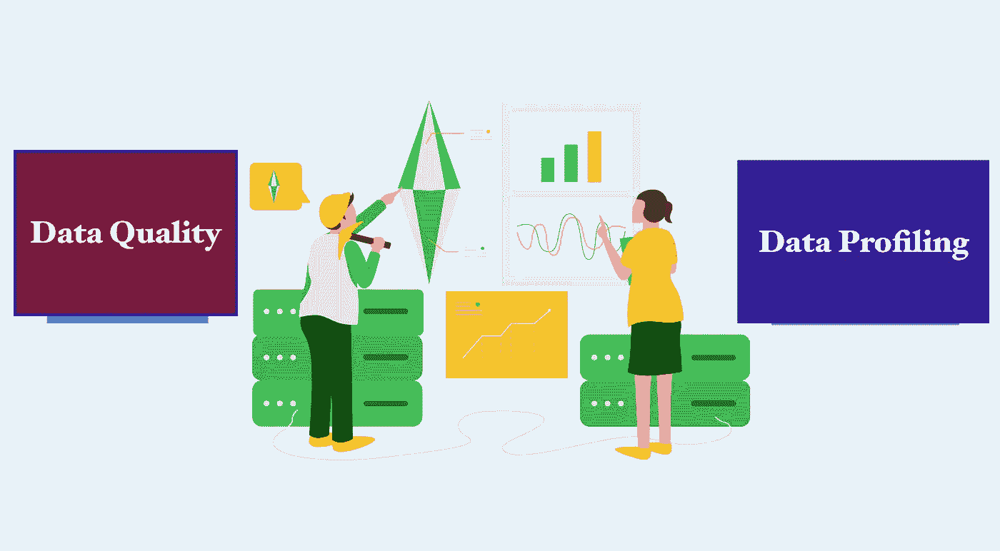

# 如何对 Spark-Big Data 中的数据进行数据分析/质量检查(带可插拔代码)？

> 原文：<https://medium.com/analytics-vidhya/data-profiling-data-quality-in-spark-big-data-with-pluggable-code-a75fbff9865?source=collection_archive---------1----------------------->

**来源** : [分析报告](https://analyticsindiamag.com/data-mining-vs-data-profiling-what-makes-them-different/)

数据工程师经常忙于迁移数据或建立数据管道，以至于忽略了数据分析和数据质量。这会导致数据质量差、缺少列、意外的量，从而导致不可靠的分析！