# 满怀期望的数据质量保证和 Kubeflow 管道

> 原文：<https://medium.com/analytics-vidhya/data-quality-assurance-with-great-expectations-and-kubeflow-pipelines-d83449fbaa81?source=collection_archive---------0----------------------->

# 介绍

数据质量验证在机器学习中的重要性怎么估计都不为过。然而，主要的 ML 平台仍然缺乏建立数据质量保证过程的工具。最近，[provetus](https://provectus.com/)对 Kubeflow 知识库做出了贡献，它将允许 ML 工程师使用 Great Expectations 组件测试和验证 Kubeflow 管道内部的数据。在本文中，我们将讨论它是什么，并展示如何使用它来检查 ML 管道的数据。

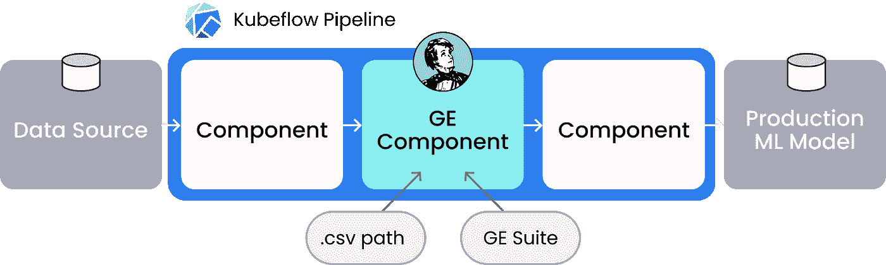

Kubeflow Pipeline 包含用于数据验证的远大前程组件

# ML 数据质量的提高

在 ML 模型生命周期中缺乏数据质量保证总是会产生成本和反效果。您可以拥有您想要的所有一流的 MLOps 工具和高质量模型，但是如果您的数据是垃圾，这些都不重要。毫无准备的数据会湮灭它们的价值。

可用的研究年复一年地继续证实这一点。

例如，最近的 2020 年 Gartner 调查发现，组织估计数据质量差的平均成本为每年 1280 万美元，随着业务环境变得越来越复杂，这一数字可能会上升。

为错误的事情进行优化的风险一直很高，没有人能够忽视模型和基于它们的产品的测试数据。无论您使用什么框架来编排您的 ML，拥有适当的数据保证是消除有效 ML 和公司预算的头号敌人:坏数据的必要条件。在 Provectus，我们通过将数据质量保证作为我们所有端到端 [ML 和数据基础设施](https://provectus.com/machine-learning-infrastructure/)解决方案的一部分来解决这个问题。

[**kube flow Pipelines**](https://www.kubeflow.org/docs/components/pipelines/overview/pipelines-overview/)，一个流行的开源端到端 ML 编排平台，也不例外。当您使用 Kubeflow Pipelines 作为在 Kubernetes 上构建和管理 ML 工作流的首选工具时，您需要有数据质量保证。您肯定希望消除 GIGO(“垃圾输入，垃圾输出”)情况，并获得第二张图片:

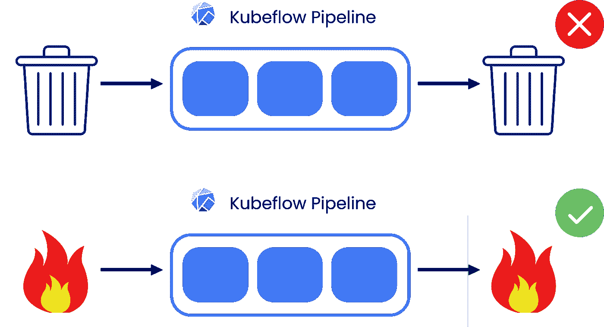

数据质量保证是有效数据管道的必要条件。图片作者。

尽管数据质量保证的需求已经被 ML 社区广泛认可，但数据质量工具仍处于起步阶段，并且在许多主要的 ML 平台中基本上不存在，包括 Kubeflow Pipelines。直到最近，Kubeflow 用户还不能建立一个适当的流程来确保他们的数据在训练他们的模型之前得到测试和验证。

在 Provectus，我们决定解决这个问题，并提交了一个 pull 请求，将一个[Great expects 数据验证组件](https://github.com/kubeflow/pipelines/tree/master/components/great-expectations/validate)添加到 Kubeflow 存储库中。从现在开始，您可以将 GE 组件添加到您的 Kubeflow 管道中进行测试和验证。csv 数据集与您在 Expectations Suite 中设置的规则进行比较。如果数据集无效，该组件将停止管道执行。如果它是有效的，您知道您的数据是健康的，并且管道继续执行。GE 组件还输出一个 HTML 数据文档，其中包含每个场景中的验证报告。

# 什么是远大前程

[Great Expectations](https://greatexpectations.io/) 是一个用 Python 编写的开源数据验证框架，允许您测试、描述和记录数据，以在 ML 管道的任何阶段测量和维护其质量。这是避免不一致记录和数据管道问题的好方法。

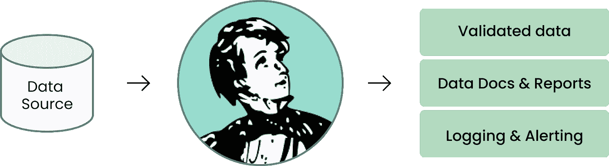

Great Expectations 测试和验证数据，生成报告，并提供日志记录和警报。图片作者。

例如，当您从各种外部数据提供者接收数据，并需要在将 ETL 添加到数据库之前检查其输出时。比方说，你正在为一家医疗企业做 ML，并且不断地从保险公司获得数据集。这些数据通常质量很低，并且存在一些典型的问题，如与字典不匹配、数据类型不正确、格式错误、重复、值分布偏移等。

为了验证数据，您必须编写所谓的预期——描述数据集理想状态的断言。期望基本上是你的数据将被运行的单元测试。你可以从内置的[期望词汇表](https://docs.greatexpectations.io/en/latest/reference/glossary_of_expectations.html#expectation-glossary)中选择断言，也可以自己编写。

# 远大前程如何融入你的 MLOps？

ML 模型生命周期包括三个主要阶段:

1.  **数据准备。**收集、清理、组织和丰富数据，为后续阶段做准备。
2.  **模型开发。模型被设计、构建、训练、测试和微调，为部署做准备。**
3.  **部署&操作。**经过微调的模型被打包并部署到生产中，然后对其质量和可靠性进行监控。

你认为在 ML 生命周期的哪个阶段数据需要质量保证？

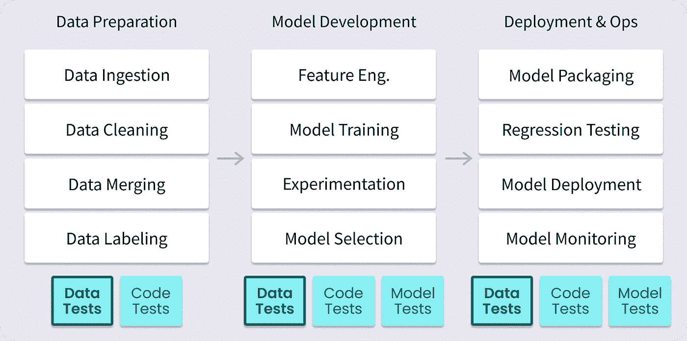

ML 模型生命周期的三个主要阶段。图片作者。

没错:就像代码和模型一样，每个 ML 阶段的数据都应该被测试覆盖。

Great Expectations 是一个工具，可用于每个阶段的数据测试，我们将它引入 Kubeflow Pipelines 正是为了做到这一点。

根据您构建 MLOps 的方式，您的 Kubeflow 管道可以包含所有或部分这些块。数据 QA 属于其中的几个。以下是您可能希望在 ML 管道中安装数据 QA 来验证数据的地方:

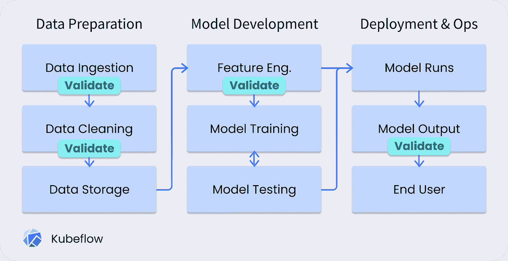

ML 生命周期中需要数据验证的步骤,“远大前程”组件可以提供帮助。图片作者。

Great Expectations 对于在摄取、数据清理、特征工程或模型输出阶段检查数据非常有帮助。在下面我们看到的用例中，图表上显示的前三个验证步骤适合第一个组件。让我们直入主题，看看如何开始使用 Kubeflow Pipelines 中的 GE 组件。

要了解更多有关远大前程如何融入 MLOps 生命周期的信息，请查看远大前程博客上的这篇文章:

[远大前程如何融入 MLOps？](https://greatexpectations.io/blog/ml-ops-great-expectations/)

# **快速入门:对 Kubeflow 管道寄予厚望**

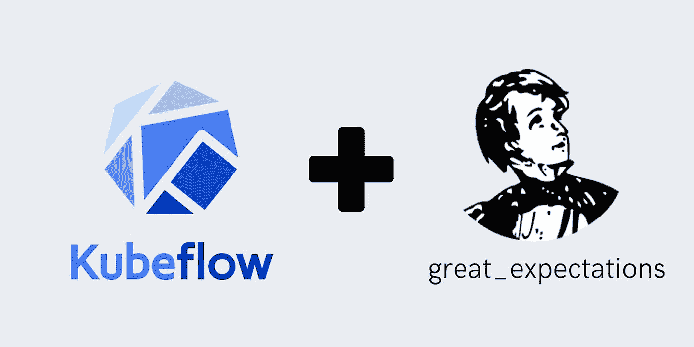

对 Kubeflow 寄予厚望。作者图片

通过 Kubeflow 管道设置和使用 Great Expectations 是一件轻而易举的事情。除了先决条件之外，您还需要几个步骤来开始:

1.  加载 GE 组件定义( **component.yaml** )
2.  将**期望套件**文件添加到管道中
3.  **将通用电气组件集成到管道中**

之后，您将能够在 Kubeflow 工作负载中利用巨大的期望。

# 0.先决条件

对于本教程，您需要:

1.  一个 **Kubeflow 集群**。要在 AWS 上启动并运行 Kubeflow 生产基础设施，您可以使用 Swiss Army Kube——一个创建 GitOps 部署的简单蓝图。点击这里查看快速入门: [SAKK 快速入门](https://github.com/provectus/sak-kubeflow/blob/init/QUICKSTART.md)。
2.  一个 [**期望套件**](https://docs.greatexpectations.io/en/stable/reference/core_concepts/expectations/expectations.html#reference-core-concepts-expectations-expectation-suites) —一个 JSON 文件，包含您对数据集的规则(期望)。搭建一个样板文件并编辑它，按照官方指南定义你的期望:[如何使用套件搭建创建一个新的期望套件](https://docs.greatexpectations.io/en/stable/guides/how_to_guides/creating_and_editing_expectations/how_to_create_a_new_expectation_suite_using_suite_scaffold.html)。或者，您可以创建自定义期望:[如何创建自定义期望](https://docs.greatexpectations.io/en/stable/guides/how_to_guides/creating_and_editing_expectations/how_to_create_custom_expectations.html)。
3.  或者，您可能希望获得一个云帐户来存储 Expectation Suite——在 S3、云存储、Azure 或 Pandas 支持的任何其他位置(例如静态 HTTP 位置)。

# 用例

让我们以下面的 Kubeflow 管道为例。它实现了一个 ML 工作流，该工作流训练一个模型来预测客户为一次出租车旅行支付的小费金额:

一个示例分类 ML 模型，确定负责芝加哥出租车行程的公司。

该管道使用 Kubeflow Pipelines SDK 提供的默认组件存储(下一节将详细介绍)。

编译并上传到 Kubeflow 后，管道应该是这样的(还没有 GE 组件):

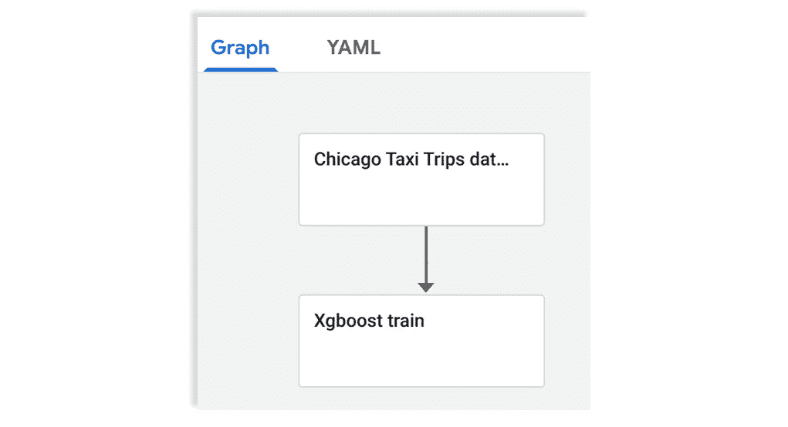

Kubeflow 管道示例。图片作者。

# 1.加载远大前程组件

## 1.1 通过 Kubeflow ComponentStore 加载定义文件

首先加载 GE 组件定义文件 [**component.yaml**](https://github.com/kubeflow/pipelines/blob/master/components/great-expectations/validate/CSV/component.yaml) 。最简单的方法是使用由 [Kubeflow Pipelines SDK](https://www.kubeflow.org/docs/components/pipelines/sdk/sdk-overview/) 提供的默认组件库。从 kfp 加载组件存储，组件:

商店创建在 Kubeflow Pipelines SDK 库的[主分支](https://github.com/kubeflow/pipelines/tree/master/components)中定义的组件。您可以创建自定义存储来修复存储库版本:

然后，您可以使用存储来加载组件定义:

```
validate_csv_step = store.load_component(“great-expectations/validate/CSV”)
```

## 1.2 通过 URL 或从文件加载定义

另一种方式是加载 [**component.yaml**](https://github.com/kubeflow/pipelines/blob/master/components/great-expectations/validate/CSV/component.yaml) 文件是通过其 URL 使用 [load_component_from_url](https://kubeflow-pipelines.readthedocs.io/en/latest/source/kfp.components.html#kfp.components.ComponentStore.load_component_from_url) 函数:

或者，您可以将定义保存到文件中，并从该文件中加载组件:

```
validate_csv_step = load_component_from_file(ge_component_path)
```

# 2.将期望套件添加到数据管道中

GE 组件需要一个期望套件作为文件传递给它。它可以通过从云存储中加载或注入到管道定义中来传递。

例如，您有一个存储在 AWS S3 的期望套件。要从 S3 加载它，您需要创建一个组件来完成加载。在. yaml 文件中编写加载组件的组件定义:

使用 Python 加载它:

```
load_from_s3_step = load_component_from_file(load_from_s3_component_path
```

根据其他云存储的基础架构需求，可以为其实现类似的组件。

最后，将这个步骤添加到管道中以加载套件:

```
expectation_suite = load_from_s3_step(expectation_suite_uri).output
```

或者，您可以在本地存储期望套件，并将其直接添加到管道中:

```
with open(‘expectation_suite.json') as file:expectation_suite = file.read()
```

# 3.将 GE 组件集成到数据管道中

集成是通过将数据和期望套件的路径传递给 GE 组件来完成的:

```
validate_csv_step(csv=csv_path, expectation_suite=expectation_suite)
```

这里，“**CSV _ path”**需要是将数据接收到管道中的组件的输出(例如，从 S3 读取数据集)，而“**expectation _ suite”**需要是文件或管道组件的输出。

# 4.编译管道并上传到 Kubflow

在步骤 1–3 之后，我们将拥有以下管道代码，假设 Expectation Suite 保存在本地的同一文件夹中(我们在步骤 1–3 中添加的代码以粗体显示):

在 Kubeflow 接口中，带有 GE 组件的管道将如下所示:

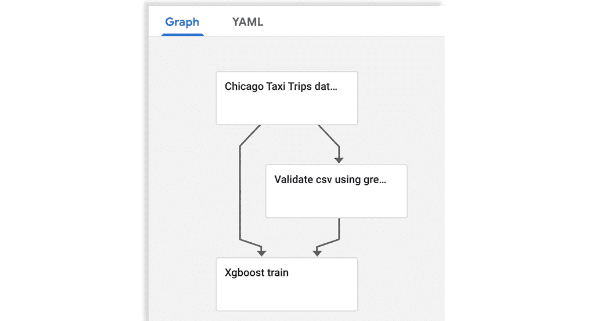

具有远大期望组件的 Kubeflow 管道示例(“使用远大期望验证 csv”)。图片作者。

# 5.满怀期望地检查您的数据

现在，您有了一个包含 GE 组件的管道，可以利用它来验证进入该管道的数据集。如您所见,“Validate CSV”GE 组件现在是“Xgboost train”和“Chicago Taxi”的依赖项之一。

每次运行管道时,“Validate CSV”组件都会根据 Expectations Suite 中的规则检查数据集。如果它成功地验证了数据，其余的管道将运行，并且它的所有步骤将变成绿色(1)。如果 GE 步骤检测到数据问题并失败，它将终止管道中的进一步执行并变为红色(2)。

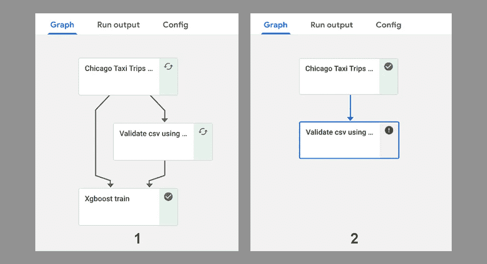

1—GE 组件的验证成功通过，2—GE 组件的验证失败，并终止管道中的进一步执行。图片作者。

## **数据文件**

执行后，GE 组件还会创建一个数据文档:一个用于数据验证的 HTML 报告。要打开它，请在 Kubeflow UI 的输入/输出面板中单击 Validate 步骤的输出工件部分下的链接:

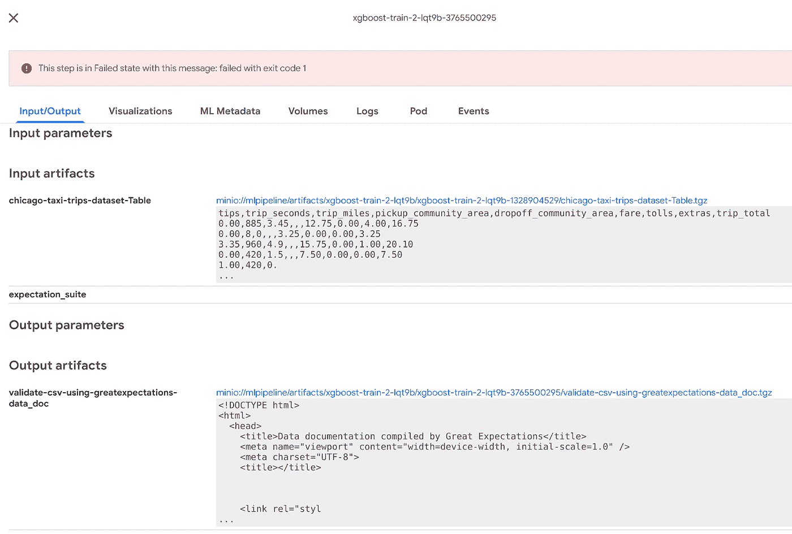

单击输出工件链接打开数据文档报告。图片作者。

这是报告的样子:

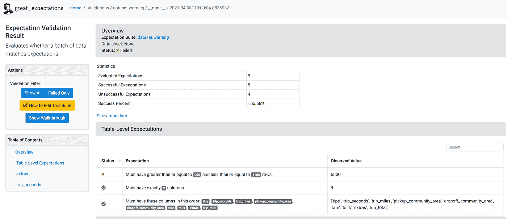

由 Kubeflow 中的远大前程组件生成的数据文档报告。图片作者。

数据文档显示可用的期望套件、验证结果、通过和未通过期望的统计数据，并允许数据团队向下钻取值。在这里，您可以看到在期望套件中定义的每个检查的状态和值。

# 结论

在本文中，我们简要介绍了机器学习管道的数据质量的重要性，以及如何在 Kubeflow 管道中使用新的 Great Expectations 组件来确保数据质量。关键要点:

*   **在构建强大的 ML 管道时，数据质量是第一要务**。
*   **谨记 GIGO** 原则——如果不首先测试和验证数据，就不可能有健壮的管道和 ML 模型。
*   **模型训练前的测试数据**——用不正确的数据运行管道成本很高，所以在上游尽早测试。
*   **Great Expectations component 是确保 Kubeflow 管道中数据质量的首选工具**，也是目前唯一的 kube flow DQ 工具。
*   **数据文档有助于**与其他数据团队成员合作，分析和管理 Kubeflow 管道的数据质量。

# **特别感谢**

感谢安东·基舍列夫和雅罗斯拉夫·贝希塔为 Kubeflow 开发和贡献了“远大前程”组件。

# 词汇表

**期望套件**是对数据集的描述。它存储为一个 JSON 文件。有几种方法可以创建一个期望套件:搭建一个样板文件并编辑它来构建你的规则(期望)你的数据集。csv 将根据进行验证。或者从头开始创建一个期望套件。

**GE 组件定义**是一个 Kubeflow 组件的定义，在 **component.yaml** 文件中以规范格式描述给 Kubeflow 管道。根据这个预定义的组件规范。yaml，[**componentstore . load _ components**](https://kubeflow-pipelines.readthedocs.io/en/latest/source/kfp.components.html#kfp.components.ComponentStore.load_component)自动创建一个 [**组件 op**](https://cloud.google.com/solutions/machine-learning/architecture-for-mlops-using-tfx-kubeflow-pipelines-and-cloud-build#kubeflow-piplines-components) ，允许调用 Kubeflow 管道中的组件。将 **component.yaml** 加载到 **ComponentStore** 中，让它创建一个**组件 op** 以允许在 Kubeflow 管道中使用该组件。

**期望**是您在 JSON 格式的期望套装文件中定义的需求。它们充当数据的单元测试。“远大前程”将通过对照您的期望检查数据集来验证您的数据集。为了创建期望，你可以从内置的[期望词汇表](https://docs.greatexpectations.io/en/latest/reference/glossary_of_expectations.html#expectation-glossary)中选择断言，或者从头开始编写自己的断言。

[**期望词汇表**](https://docs.greatexpectations.io/en/latest/reference/glossary_of_expectations.html#expectation-glossary) —所有内置期望的列表。

[**数据文档**](https://docs.greatexpectations.io/en/stable/reference/core_concepts/data_docs.html) —由远大前程为您的数据集编制的结构化格式验证报告，以期望和验证为特色。数据文档的一个例子是 HTML 文档。

[**kube flow Pipelines**](https://www.kubeflow.org/docs/components/pipelines/overview/pipelines-overview/#:~:text=Kubeflow%20Pipelines%20is%20a%20platform,workflows%20based%20on%20Docker%20containers.)是一个基于 Docker 容器构建和部署可移植、可扩展的机器学习(ML)工作流的平台。

[**kube flow Pipelines SDK**](https://www.kubeflow.org/docs/components/pipelines/sdk/sdk-overview/)—[kfp 包](https://kubeflow-pipelines.readthedocs.io/en/stable/source/kfp.html) —一组 Python 包，可用于指定和运行您的 ML 工作流(定义和操作管道和组件)。

**Pipeline** —对 ML 工作流的描述，包括组成工作流中各个步骤的所有组件，以及这些组件如何相互交互。

XGBoost(Extreme Gradient Boosting)是一个开源库，为 C++、Java、Python、R、Julia、Perl 和 Scala 提供了高效的梯度增强实现。

[**GIGO**](https://en.wikipedia.org/wiki/Garbage_in,_garbage_out) **原理** —一个有缺陷的、低质量的“垃圾”数据产生有缺陷的、低质量的输出(“垃圾”)的概念。