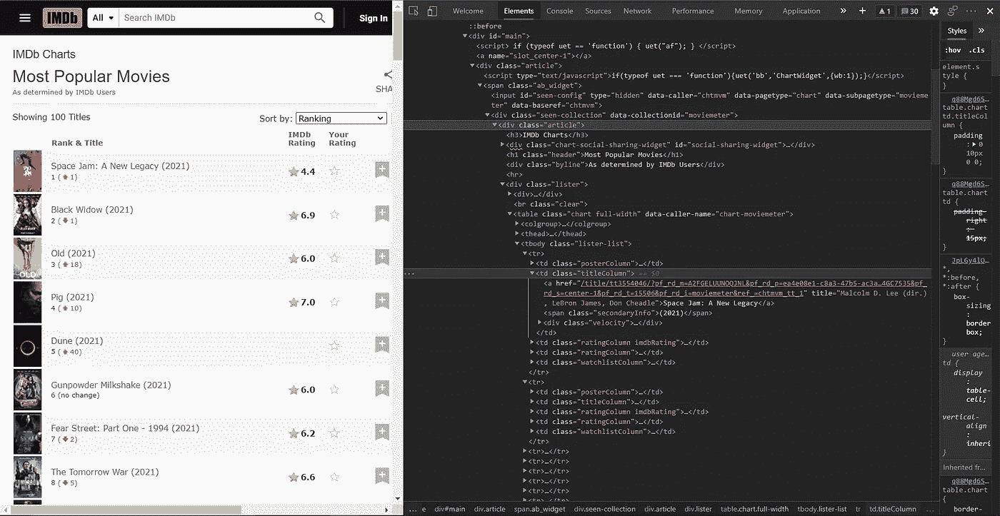
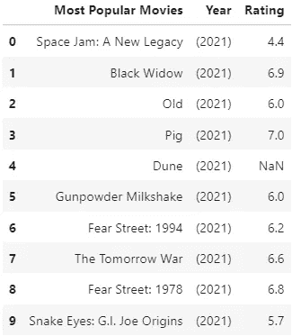

# 数据科学 101:-网络搜集

> 原文：<https://medium.com/analytics-vidhya/data-science-101-web-scraping-67c3615dbbc4?source=collection_archive---------3----------------------->

使用 python 通过 web 报废收集数据


# 介绍

你好。数据科学只有在有数据的情况下才有可能，而在现实世界中，数据并不容易获得。你必须去追求它。这就是为什么网络抓取对数据科学非常重要。

本文将介绍如何利用 Python 库，如 [**【美汤】**](https://www.crummy.com/software/BeautifulSoup/bs4/doc/) 和[**pandas**](https://pandas.pydata.org/) 从 web 上获取相关信息并执行 Web 抓取。对于那些想要完整代码的人，我在文章末尾添加了 GitHub 资源库链接。


# 什么是网页抓取？

与漫长而繁琐的手动获取数据的过程不同，Web 抓取使用智能自动化方法在更短的时间内获取数千甚至数百万的数据集。它为您提供了一种自动访问结构化 web 数据的技术。

网页抓取的过程可以大致分为三个步骤:

1.  理解并检查网页，找到与我们想要的信息相关的 HTML 标记。
2.  使用 Beautiful Soup、Selenium 和/或其他 Python 库来抓取 HTML 页面。
3.  处理收集到的数据，使其成为我们需要的形式。

> ***用于网页抓取的库***

为了用 Python 实现 web 抓取，必须包含以下几个库

1.  **美汤**:用于将 HTML 和 XML 文件中的数据拉出来。它从页面源代码中创建了一个解析树，可用于以层次化和可读性更强的方式提取数据。
2.  **Pandas:** Pandas 允许从各种文件格式导入数据，如逗号分隔值、JSON、SQL、Microsoft Excel。Pandas 允许各种数据操作，如合并、整形、选择、数据清理和数据辩论功能。
3.  **请求:**它允许你轻松发送 HTTP/1.1 请求，并且不需要手动添加查询字符串到你的 URL，或者对你的文章数据进行格式编码。

# 先说我们的例子。

准备执行网页抓取。按照步骤获取您的数据。

# 步骤 1:选择您想要从中抓取数据的 URL

在这里，我将抓取 IMDb 网站，提取最受欢迎的电影，它们的名称，年份和 IMDb 评级。同样的网址是[https://www.imdb.com/chart/](https://www.imdb.com/chart/tvmeter/?ref_=nv_tvv_mptv)电影计量器。

# 步骤 2:检查页面

这一步包括调查网页的 HTML。要检查哪些标签包含我们的信息，请在浏览器中右键单击该元素，然后选择“Inspect”。数据通常嵌套在标签中。因此，我们检查页面，找出所需数据嵌套在哪个标签下。

# 步骤 3:找到要提取的数据

在这个例子中，我将提取最受欢迎的电影的标题、上映年份和 IMDb 评分。在这种情况下，表中的相关信息与标签`<td>`相关联。使用标签，我们的主要抓取库可以在整个抓取过程中有效地定位和解析信息。



# 步骤 4:编写 python 代码

让我们从创建一个 Python 文件开始。在这里，我使用了谷歌 Colab。您可以使用任何 Python IDE。

导入所需的 python 库:

```
import requests
from bs4 import BeautifulSoup
import pandas as pd
```

创建空数组来存储抓取的数据。

```
Title=[]  #List to store title of most popular movies
Year=[]   #List to store releasing year of each movies
Rating=[] #List to store ratings of each movies
```

现在，打开 URL 并从网站中提取数据。使用请求库，向网页发出请求并获取其 HTML。上面的代码将网页的 HTML 内容存储到一个`BeautifulSoup`对象中。使用 Beautiful Soup 的 Find 和 Find All 函数，我们可以很容易地将所需的信息存储在变量中。最后，将数据追加到先前创建的空数组中。你完了！

```
url = "[https://www.imdb.com/chart/moviemeter](https://www.imdb.com/chart/moviemeter)"#Make a request to the web page and gets it's HTML
content = requests.get(url).content#Store the HTML page in 'soup', a BeautifulSoup object
soup = BeautifulSoup(content, "html.parser")for i in soup.find("tbody", {"class":"lister-list"}).find_all("tr"):
    h = i.find("td",{"class":"titleColumn"})
    title = h.find("a", href=True)
    year = i.find("span",{"class":"secondaryInfo"})
    rating = i.find("td",{"class":"ratingColumn imdbRating"})

    Title.append(title.text) 
    Year.append(year.text)
    Rating.append(rating.text.strip("\n"))
```

# 第 5 步:以逗号分隔的值存储抓取的数据(CSV 格式)

现在，使用导入的 Pandas 库，创建一个数据帧，其中的数据以结构化的方式存储，并导出为所需的文件格式。在这里，我已经导出了数据。csv 格式。

```
df = pd.DataFrame({'Most Popular Movies' : Title,'Year' : Year,'Rating' : Rating})
df.to_csv('IMDb.csv', index=False, encoding='utf-8')#read the data stored in IMBd.csv file
data = pd.read_csv('IMDb.csv')
```

# 步骤 6:运行您的代码

您可以在 IMDb.csv 文件中查看所有抓取的数据，如下所示。



存储在 IMDb.csv 文件中的抓取数据

> ***结论:***

我们可以通过使用 web scrapping 库(如 beautiful soup、scrappy 等)从网页中获取任何数据。在转换成 pandas 后，我们可以对该数据应用所有 Pandas 函数。

更多关于**熊猫**功能[在这里。](https://pandas.pydata.org/pandas-docs/stable/reference/general_functions.html)

更多关于**美汤** [在这里。](https://beautiful-soup-4.readthedocs.io/en/latest/)

就是这样。希望这篇博客对你有所帮助。查看我的 [GitHub](https://github.com/d2001patel/Data-Science) 档案中的全部代码。

> **领英:**

[](https://www.linkedin.com/in/darshil-patel-80a728199/) [## Darshil Patel -软件工程师实习生-scan point Geomatics Ltd | LinkedIn

### 查看达尔希尔·帕特尔在全球最大的职业社区 LinkedIn 上的个人资料。达尔希尔有 2 份工作列在…

www.linkedin.com](https://www.linkedin.com/in/darshil-patel-80a728199/)