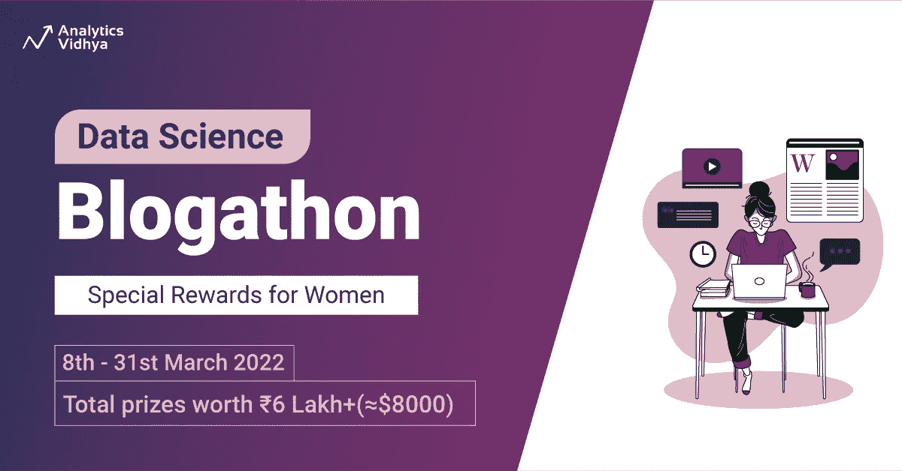
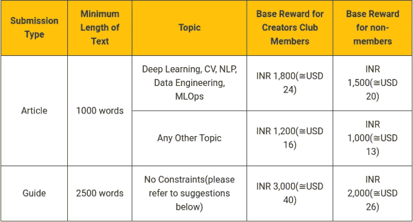
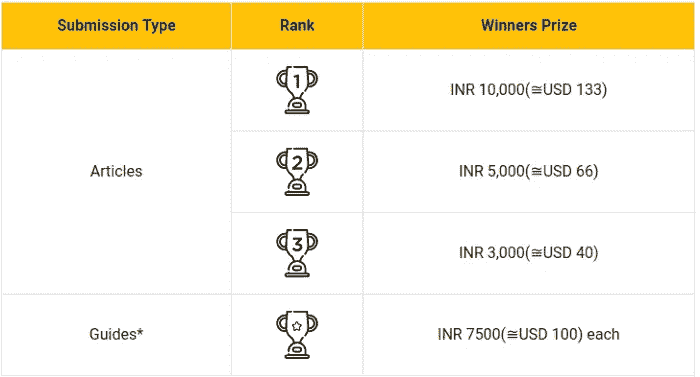
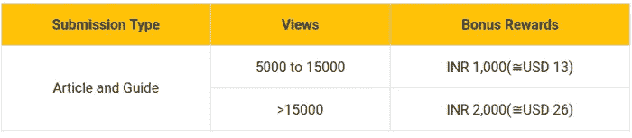

# 数据科学博客 18 现已上线！

> 原文：<https://medium.com/analytics-vidhya/data-science-blogathon-18-is-live-now-cd8228c438?source=collection_archive---------0----------------------->

## 总奖金价值 68000 lakh(≅usd 卢比)

## 分析 Vidhya 带着另一个版本的 Blogathon 回来了，现在已经上线了！点击[这里](https://datahack.analyticsvidhya.com/contest/data-science-blogathon-18/?utm_source=medium&utm_medium=announcement_article&utm_campaign=blogathon)注册！

700 多位作者，2000 多篇文章，还在继续！

> "最大的痛苦莫过于背负一个不为人知的故事."—玛娅·安杰洛

数据科学博客一开始的使命是建立一个社区，让我们的数据科学家爱好者能够与世界分享他们的知识。我们的社区每个月都在增长，每个月都在增加有价值的作者和读者！我们已经成功地出版了大约 **2000 篇文章**。我们知道我们的数据科学家总是兴奋地分享他们的故事，通过计算代码建立不同的模型。你猜怎么着？分析 Vidhya 通过奖励那些令人兴奋的故事使它变得更有趣。

**我们这个月庆祝女性，我们很高兴地分享，Blogathon 18 为女性设立了一个特殊的奖励类别。挺住，多读书！**

# 你为什么要参加 Blogathon？

你可能想知道——写一个数据科学博客对你有什么好处？嗯，好处多多！

1.  **学习并掌握概念**——学习和写作齐头并进。当我们为考试做笔记时，我们更容易记住它们。不是吗？一旦你开始写一篇关于任何概念的文章，你不仅会学到一个新概念，还会掌握为特定主题做“研究”的艺术。
2.  **提高你讲故事的技巧** —我在这里和你分享一个小秘密。伟大的数据科学家的两个最重要的特征是讲故事的技巧和结构化的思维模式。这不是一种固有的品质，而是通过密切关注问题陈述而形成的。写博客可以提高这两种品质。
3.  **建立你的简历** —写数据科学博客的最大优势之一是它能让你脱颖而出。你们大多数人已经知道，Analytics Vidhya 的 Blogathon 系列是世界上第二大的。因此，你的文章被全球的读者阅读，这不仅给你反馈，读者群，也帮助你建立你的简历和 LinkedIn。
4.  **在社区中获得关注和社交机会** —虽然通过写博客获得知识很重要，但获得与行业领袖和志同道合者交流的机会是无价的。Analytics Vidhya 每月有 250 万用户，包括一些知名人士，因此很有可能接触到潜在的人和雇主。
5.  赢得现金奖励 —所有这些都很棒，但我们都渴望为自己的努力获得回报。不是吗？别担心，价值上千的现金大奖等着你。请继续阅读，了解所有奖励。

# 你怎么能参加博客呢？

你只需要在[链接](https://datahack.analyticsvidhya.com/contest/data-science-blogathon-18/?utm_source=medium&utm_medium=announcement_article&utm_campaign=blogathon)上注册就可以参加比赛。这个链接将带你到所有需要的关于 Blogathon 的细节。一旦你注册，你将被带到我们的编辑器平台，在那里你可以开始你的写作之旅！如果您面临任何问题或需要帮助，请直接通过此电子邮件联系我们，以便更快地沟通:[【电子邮件保护】](https://www.analyticsvidhya.com/cdn-cgi/l/email-protection)

# 你知道吗？

> 根据 WEF 的全球性别差距报告，女性仅占所有数据科学专业人员的大约 15%至 22%。

分析 Vidhya 的目标是尽自己的一份力量，通过这个博客来弥合这一差距。**当我们在这个博客上庆祝女性的时候，我们会给前 10 名女作家增加 1500 印度卢比的奖金。**

# 有什么奖品？

以下是你在博客上发表的每一篇文章能赢得的东西:

1.  无论你获得多少次浏览，都有基本奖励！

发表 3 篇以上文章成为创作者俱乐部会员:[https://www.analyticsvidhya.com/creators-club/](https://www.analyticsvidhya.com/creators-club/)

**所有国际支付将通过 Paypal 进行*

2.利润丰厚的获奖者奖品除了以上！

禁止发表文章和与职业相关的文章

3.随着您在排行榜上的攀升，您将获得额外的奖励！

你可以在博客上发表任意数量的文章，越多越好！

这是一个不容错过的机会，可以把你的作品展示给超过 100 万的机器学习爱好者，并在这个过程中赢得令人敬畏的奖项。

# 一个特殊奖项——赢取新 iPad！

你没看错——你甚至有机会赢得新 iPad！博客中的每个作者都有资格通过抽奖赢得新 iPad，抽奖将选出一名获奖者！

**立即报名:** [**数据科学 Blogathon-18**](https://datahack.analyticsvidhya.com/contest/data-science-blogathon-18/?utm_source=medium&utm_medium=announcement_article&utm_campaign=blogathon)

# 重要日期和截止日期

我们不想让你错过任何机会。所以，请确保你不会错过以下任何一个日期:

如果你想看看我们的博客，这里有[链接](https://www.analyticsvidhya.com/blog/)。

那都是乡亲们！请访问注册页面，了解更多详细信息以及您必须遵守的一些重要条款和条件。我们很高兴您能参与并为我们的社区做出贡献！