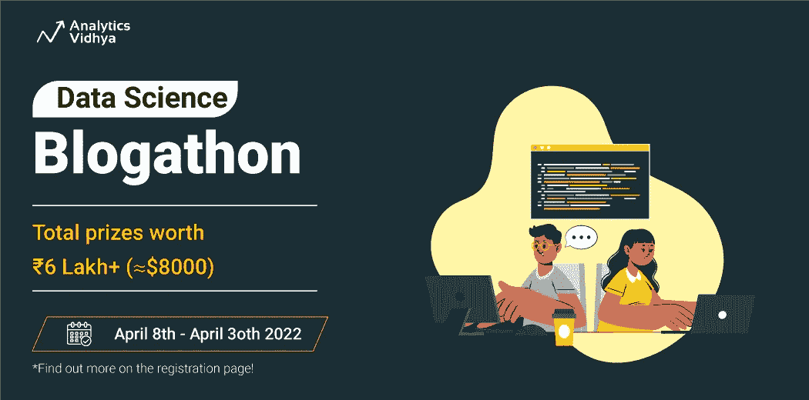
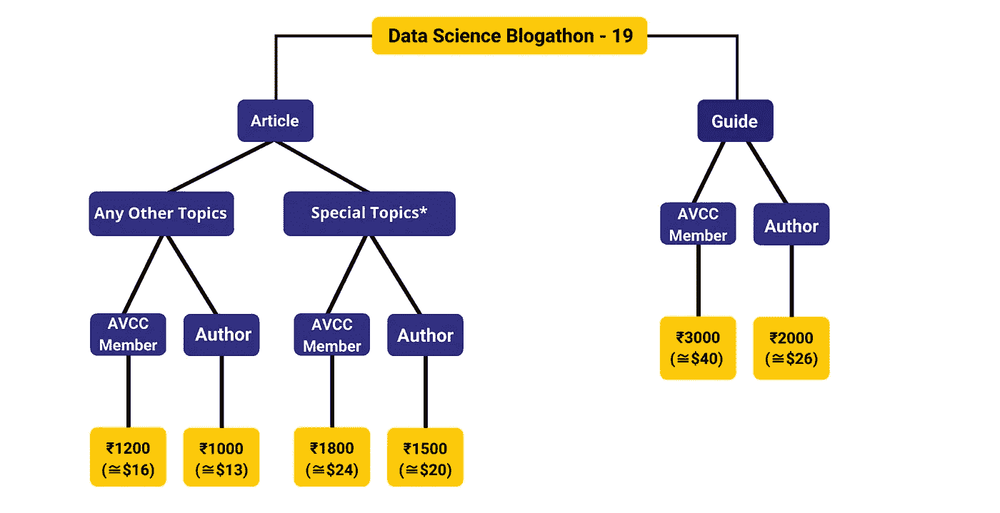
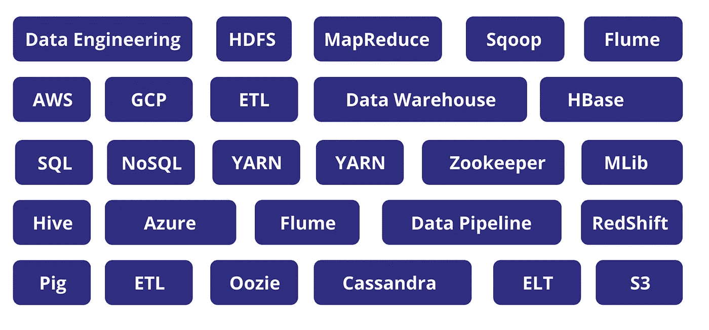
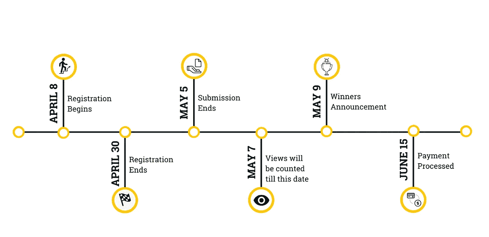

# 数据科学博客 19-介绍推荐计划

> 原文：<https://medium.com/analytics-vidhya/data-science-blogathon-19-introducing-referral-program-7b58bea7aa24?source=collection_archive---------5----------------------->

## 免费注册！

亲爱的读者们:

我们很高兴地宣布，我们的数据科学博客第 19 版已经上线。[现在注册](https://datahack.analyticsvidhya.com/contest/data-science-blogathon-19/?utm_source=medium&utm_medium=newsletter_article&utm_campaign=blogathon)！

数据科学 Blogathon by Analytics Vidhya 从一个简单的使命开始:汇集一个大型的数据科学爱好者社区，与世界分享他们的知识。我们拥有超过 4000 篇关于各种主题的文章，如数据科学、机器学习、深度学习、数据湖和数据工程，由来自全球各地的 700 多名数据科学爱好者、学生、专业人士和研究人员发表。我们带来了数据科学博客的第 19 版，这一次是一个新的奖励系统。

# 有什么奖品？

## 底价

为每篇已发布的文章选择您想要创建和赢取的数据科学内容。

基本奖励

不同类别有各种令人兴奋的奖品和奖励。前往[注册页面](https://datahack.analyticsvidhya.com/contest/data-science-blogathon-19/?utm_source=medium&utm_medium=newsletter_article&utm_campaign=blogathon)了解更多信息！

# 对你有什么好处？

本月的数据科学博客通过我们的特别推荐计划为您带来更多奖励。没错！

## 介绍作者推荐计划！

是的，你没看错！推荐并鼓励你的朋友在最新的博客和**上发表文章，你们都有机会赢得额外的奖金。**

## 谁可以参与推荐计划？

这个项目只对我们现有的所有作者开放。

## 报酬

*   推荐一个朋友，如果推荐人发表了一篇文章，那么推荐人和推荐人均将获得 300 印度卢比。
*   推荐一个朋友，如果推荐人发表了 3 篇或更多的文章，那么推荐人和推荐人均可获得 1300 印度卢比。

**如何？**

*   推荐代码通过邮件与现有作者共享
*   与你的朋友分享你的推荐代码(只有第一次在 Analytics Vidhyas 的博客上发表文章的新作者才有资格获得代码)。
*   告诉他们在注册时提交代码

## 专题:数据工程

这一次，我们将数据工程下的所有主题视为特殊主题，并有资格为[Analytics vid hya Creators Club](https://www.analyticsvidhya.com/creators-club/)成员和非成员提供巨额现金奖励。以下是一些建议的主题:

# 重要的日期和截止日期！

确保你不会错过任何令人兴奋的机会！所以，在你的日历上做个标记。

我们有称为“指南”的特殊类别和一些令人兴奋的奖品，有机会赢得一台 iPad！更多详情，请前往[注册页面](https://datahack.analyticsvidhya.com/contest/data-science-blogathon-19/?utm_source=medium&utm_medium=newsletter_article&utm_campaign=blogathon)！