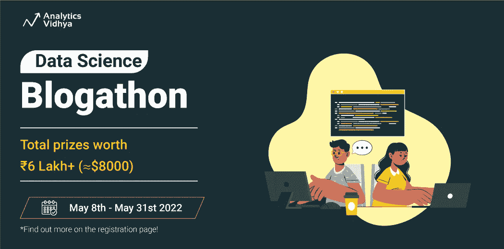
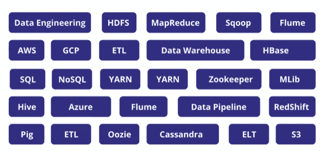
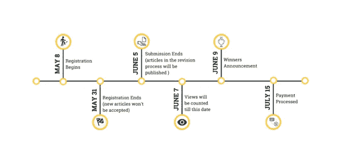

# 数据科学博客第 20 版

> 原文：<https://medium.com/analytics-vidhya/data-science-blogathon-20th-edition-d4d94c628a8?source=collection_archive---------1----------------------->

[免费注册](https://datahack.analyticsvidhya.com/contest/data-science-blogathon-20/?utm_source=medium&utm_medium=announcement_article&utm_campaign=blogathon)！

亲爱的作者们:

我们很高兴为您带来另一个激动人心的数据科学博客大赛。数据科学 Blogathon by Analytics Vidhya 从一个简单的使命开始:汇集一个大型的数据科学爱好者社区，与世界分享他们的知识。

我们拥有超过 4000 篇关于各种主题的文章，如数据科学、机器学习、深度学习、数据湖和数据工程，由来自全球各地的 700 多名数据科学爱好者、学生、专业人士和研究人员发表。我们为您带来第 20 版数据科学博客。点击此处[立即注册](https://datahack.analyticsvidhya.com/contest/data-science-blogathon-20/?utm_source=medium&utm_medium=announcement_article&utm_campaign=blogathon)！

# 介绍作者推荐计划！

是的，你没看错！推荐并鼓励你的朋友在当前的博客上发表文章，你们都有机会赢得额外的奖金。赶快[注册](https://datahack.analyticsvidhya.com/contest/data-science-blogathon-20/?utm_source=medium&utm_medium=announcement_article&utm_campaign=blogathon)自己动手写吧！

## 报酬

*   推荐一个朋友，如果推荐人发表 1 篇文章，推荐人和推荐人均可获得 300 印度卢比。
*   推荐一个朋友，如果推荐人发表了 3 篇或 3 篇以上的文章，那么推荐人和推荐人均可获得 1300 印度卢比。

## 怎么会？

*   推荐代码通过邮件与现有作者共享。
*   与你的朋友分享你的推荐代码(只有第一次在 Analytics Vidhyas 的博客上发表文章的新作者才有资格获得代码)。
*   告诉他们在注册时提交代码。

## 专题:数据工程

这一次，我们将数据工程中的所有主题作为一个特殊的类别来考虑。以下是一些建议的主题:

## 新的提交类别—指南！

如上所述，我们继续发布“指南”。指南旨在成为数据工程、机器学习和相关主题中特定主题的一站式资源。由于我们收到多个指南条目，每个主题只会发布一个指南。

# 重要日期和截止日期

# 结论

那还等什么呢？准备您的工作空间，收集您的零食，更新您的知识，并准备好参加世界上最大的数据科学博客之一，学习令人惊叹的知识。

看看我们发表的文章，收集所有的动力。前往我们的[博客](https://www.analyticsvidhya.com/blog/)。前往[注册页面](https://datahack.analyticsvidhya.com/contest/data-science-blogathon-20/?utm_source=medium&utm_medium=announcement_article&utm_campaign=blogathon)了解更多详情！