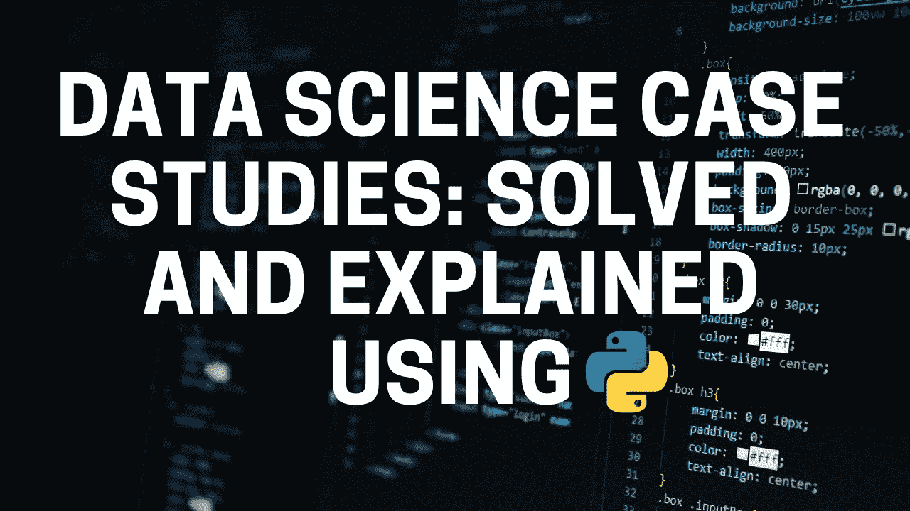
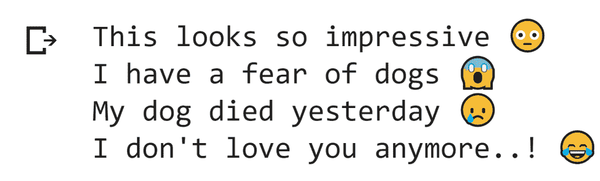
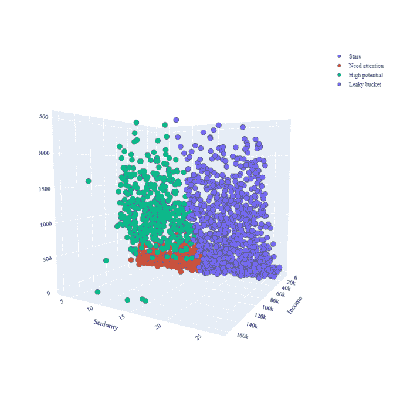

# 数据科学案例研究:解决和解释

> 原文：<https://medium.com/analytics-vidhya/data-science-case-studies-solved-and-explained-7b077dc24531?source=collection_archive---------0----------------------->

## 使用 Python 解决和解释的数据科学案例研究。

解决数据科学案例研究意味着深入分析和解决问题陈述。解决案例研究将帮助您在投资组合中展示独特而令人惊叹的数据科学用例。在本文中，我将向您介绍使用 Python 解决和解释的 3 个数据科学案例研究。

# 数据科学案例研究

如果你通过参加课程或认证项目学习了数据科学，你仍然没有那么容易找到工作。你的数据科学面试最重要的一点是展示你如何在真实的用例中使用你的技能。以下是 3 个数据科学案例研究，将帮助您了解如何分析和解决问题。下面提到的所有数据科学案例研究都是使用 Python 解决和解释的。

## 案例研究 1: [文本情感检测](https://thecleverprogrammer.com/2021/02/19/text-emotions-detection-with-machine-learning/)

如果你是其中一个对自然语言处理感兴趣的人，那么这个用例就适合你。这个想法是训练一个机器学习模型，根据输入文本生成表情符号。然后，这个机器学习模型可以用于训练人工智能聊天机器人。

***用例:*** 一个人可以用任何形式表达自己的情绪，比如面部、手势、言语和文字。文本情感的检测是一个基于内容的分类问题。检测一个人的情绪是一项困难的任务，但使用一个人写的文本来检测情绪甚至更困难，因为人类可以以任何形式表达他的情绪。

从一个人写的文本中识别这种类型的情感在诸如聊天机器人、客户支持论坛、客户评论等应用中起着重要作用。所以你要训练一个机器学习模型，通过根据输入文本呈现最相关的表情符号来识别文本的情感。

文本情感检测的输出

> *解决方案:* [*关于文本情感检测的机器学习项目*](https://thecleverprogrammer.com/2021/02/19/text-emotions-detection-with-machine-learning/) *。*

## 案例研究 2: [酒店推荐系统](https://thecleverprogrammer.com/2021/02/13/hotel-recommendation-system-with-machine-learning/)

酒店推荐系统通常基于协同过滤工作，该系统根据用户寻找产品时同一类别的其他客户给出的评级进行推荐。

***用例:*** 我们都计划旅行，计划旅行的第一件事就是找酒店。有很多网站为我们的旅行推荐最好的酒店。酒店推荐系统旨在预测用户最有可能从所有酒店中选择哪家酒店。因此，建立这种类型的系统，这将有助于用户预订最好的酒店。我们可以通过顾客评论来做到这一点。

例如，假设您要出差，那么酒店推荐系统应该向您显示其他客户认为最适合出差的酒店。因此，这也是我们的方法，建立一个基于客户评论和评级的推荐系统。因此，使用与用户属于同一类别的客户给出的评级和评论，并建立一个酒店推荐系统。

酒店推荐系统的输出

> *解决方案:* [*关于酒店推荐系统的数据科学项目*](https://thecleverprogrammer.com/2021/02/13/hotel-recommendation-system-with-machine-learning/) *。*

## 案例分析 3: [客户个性分析](https://thecleverprogrammer.com/2021/02/08/customer-personality-analysis-with-python/)

客户分析是在基于产品的公司工作的数据科学家必须做的最重要的工作之一。因此，如果你想加入一家以产品为基础的公司，那么这个数据科学案例研究最适合你。

***用例:*** 客户性格分析是对一家公司的理想客户进行详细的分析。它帮助企业更好地了解其客户，并使他们更容易根据不同类型客户的特定需求、行为和关注点来修改产品。

你必须做一个分析，帮助企业根据不同类型客户群的目标客户修改产品。例如，不用花钱向公司数据库中的每个客户推销新产品，公司可以分析哪个客户群最有可能购买该产品，然后只在该特定客户群中推销该产品。

客户个性分析

> *解决方案:* [*关于客户个性分析的数据科学项目*](https://thecleverprogrammer.com/2021/02/08/customer-personality-analysis-with-python/) *。*

# 摘要

所以这三个数据科学案例研究都是基于现实世界的问题，从第一个开始；文本情感检测，完全基于自然语言处理和你训练的机器学习模型，将用于训练一个 AI 聊天机器人。第二个用例；酒店推荐系统，也是基于 NLP 的，但是在这里你会明白如何使用协同过滤生成推荐。最后一个用例；客户个性分析，是基于某人想要专注于分析的部分。

所有这些数据科学案例研究都是使用 Python 解决的，以下是解决和解释这些用例的资源:

1.  [***文字情感检测***](https://thecleverprogrammer.com/2021/02/19/text-emotions-detection-with-machine-learning/)
2.  [***酒店推荐系统***](https://thecleverprogrammer.com/2021/02/13/hotel-recommendation-system-with-machine-learning/)
3.  [***客户个性分析***](https://thecleverprogrammer.com/2021/02/08/customer-personality-analysis-with-python/)

我希望您喜欢这篇关于使用 [Python](https://www.python.org/) 编程语言解决和解释的数据科学案例研究的文章。欢迎在下面的评论区提出你有价值的问题。