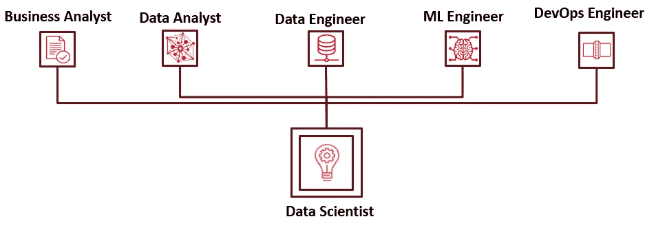

# 数据科学的现状和未来

> 原文：<https://medium.com/analytics-vidhya/data-science-current-and-future-landscape-43c233657e75?source=collection_archive---------0----------------------->

由 [Ales Krivec](https://unsplash.com/@aleskrivec?utm_source=medium&utm_medium=referral) 在 [Unsplash](https://unsplash.com?utm_source=medium&utm_medium=referral) 上拍摄的照片

进入 2022 年，数据科学的需求现已被广泛接受，并在各个领域得到采用，以通过信息的发现、分析、预测和推荐来解决从决策到自动化的各种问题。

据 Gartner 称，未来的数据和分析趋势是:

*   动态讲故事
*   增强的数据管理
*   普适云管理
*   数据和分析平台的融合

因此，塑造和加速技术和软件世界，帮助企业在最短时间内做出最佳决策的主要因素有:

*   人工智能
*   云计算
*   网络/移动应用
*   敏捷框架

几乎所有公司，从初创公司到大型企业，都已经认识到需要数据科学和/或人工智能来解决他们面临的问题。正在创建大量 POC/MVP，并向客户展示结果。

因此，下一个重要的业务问题是 ***值*** *和* ***影响*** 从这些数据科学项目来看，这是许多数据科学团队正在努力解决的问题。商业价值可以以不同的形式实现，例如:

*   *运营/生产/维护效率*
*   *美元金额收益和/或节约*
*   *自动化*
*   *劳动力、时间、资金和技术方面的优化*
*   *通过研究开发新能力*

> 数据科学项目需要从 POC/MVP 阶段发展到生产阶段，即从笔记本电脑转移到业务/用户正在积极使用的实时生产部署，并整合他们的反馈。

所以重要的问题是如何实现这个 ***价值和成熟度*** ？

对于这一点，仅仅说“*数据驱动*”或“*人工智能优先*”是不够的。试验、参与和推动的*主动性或意愿*应该积极地来自*业务方*，而不仅仅是*技术方*。改变思维方式,*你正在解决一个业务问题，而不是技术问题(对使用的重要性超过准确性)*或者更确切地说*通过技术解决业务问题。*这种思维模式有助于更加重视企业或实际用户的需求。此外，数据科学团队应该由 ***多面手*** 和 ***专家*** 组成。

*专家*是对特定技术和工具具有 ***垂直/深入*知识**的角色。*数据工程师、业务分析师、ML 工程师、DevOps 工程师*是专家角色。

而*通才*更多的是 ***横向*角色**，也称为 ***T 形*角色**其中一个人需要拥有跨流程不同方面的知识，以及某个工具/流程的深厚知识。*数据科学家*是一个多面手/ T 型角色，涵盖数据科学业务计划的各个方面，因为数据科学的目标不是执行，而是学习和开发深刻的新业务能力。数据科学家将与数据工程师合作，从 Datalake/RDBMS 获取数据，在业务分析师的帮助下了解领域/业务需求，在 ML 工程师的帮助下调整准备用于生产的原型模型，并在 DevOps 工程师的帮助下在生产中部署模型。

每天都有新的数据科学工具、技术和方法发布，或者是开源的，或者是私有的，这使得 ML 工作流 ***民主化和抽象化*** 。因此 ***知道何时以及为何使用什么*** 工具/方法对于数据科学家来说非常重要。

随着越来越多地采用 ***敏捷框架*** ，数据科学家必须与所有这些专家协同工作，或者在某些情况下单独扮演所有这些角色，以执行整个数据科学工作流，从而实现成功的项目交付和影响。根据客户和企业的法规和政策，最好在数据科学工作流程的每一步都使用 ***开源工具*** ，而不是另起炉灶。

数据科学家，T 型角色

总之，以下几点通过 ***效率和美元收益*** 和/或 ***节约、自动化或新功能*** 定义了数据科学项目的成功、价值和影响:

*   从 **MVP 过渡到生产**的**心态对业务影响**的需求
*   数据科学是关于**解决业务问题**而不仅仅是使用/创建复杂的深度学习模型。有时，即使是简单的数据探索、仪表板或决策树/回归也能提供所需的价值。
*   ***的重要性建模*** 前后发生的事情，即**业务/数据理解、MLOps、监控和反馈**
*   尽可能使用**开源工具**
*   **T 形**数据科学的方法，除非一个研究项目

在这个系列中，接下来我们将讨论[数据科学工作流程](/@sourabhpotnis/data-science-workflow-35a4a17b1180)及其在 uber 级别的步骤。