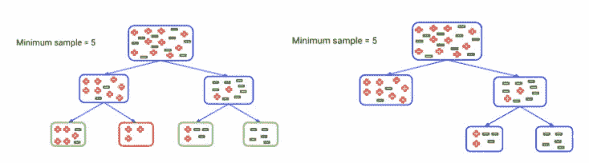
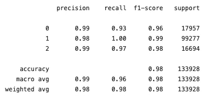

# 网络安全数据科学—密码强度计

> 原文：<https://medium.com/analytics-vidhya/data-science-for-cybersecurity-password-strength-meter-b933b96bff32?source=collection_archive---------3----------------------->

随着网络威胁的不断演变，网络安全可能是一项复杂的任务。由于成功的网络攻击有利可图，网络罪犯的战术变得越来越复杂。但是网络安全的定义到底是什么？


照片由[弗兰克](https://unsplash.com/@franckinjapan?utm_source=medium&utm_medium=referral)在 [Unsplash](https://unsplash.com?utm_source=medium&utm_medium=referral) 上拍摄

根据维基百科，**计算机安全**、[、**网络安全**、](https://en.wikipedia.org/wiki/Computer_security)、或**信息技术安全** ( **IT 安全**)是保护[计算机系统](https://en.wikipedia.org/wiki/Computer_system)和[网络](https://en.wikipedia.org/wiki/Computer_network)免受信息泄露、窃取或破坏其[硬件](https://en.wikipedia.org/wiki/Computer_hardware)、[软件](https://en.wikipedia.org/wiki/Software)或[电子数据](https://en.wikipedia.org/wiki/Data_(computing))

总之，网络攻击甚至会对最有弹性的公司造成重大破坏和损害。受影响的公司将失去资产、声誉和业务，并面临罚款和补救成本。因此，网络安全是作为一种解决方案而产生的。


照片由[privesics](https://unsplash.com/@privecstasy?utm_source=medium&utm_medium=referral)在 [Unsplash](https://unsplash.com?utm_source=medium&utm_medium=referral) 上拍摄

密码是系统安全的重要组成部分。尽管访问控制有许多密码的替代方案，但在许多应用中，密码是更具说服力的身份认证。密码强度指示器提供简单、即时的视觉反馈，说明什么是强密码。当设置新帐户或更改密码时，一个小指示器会显示建议密码的强度。但是，密码强度计有多大用处呢？

[根据加州大学伯克利分校、不列颠哥伦比亚大学和微软研究员的研究，](https://www.microsoft.com/en-us/research/publication/does-my-password-go-up-to-eleven-the-impact-of-password-meters-on-password-selection/?from=https%3A%2F%2Fresearch.microsoft.com%2Fpubs%2F192108%2Fchi13b.pdf)密码强度仪在某些情况下肯定可以产生更强的密码。

密码的显著弱点在于它们的性质。作为用户，我们一直被告知，如今密码对于保护个人数据至关重要。没有多少技术知识或技能的未经授权的人有许多方法来学习合法的用户密码。基于长度、复杂性和不可预测性的密码强度指标衡量密码在抵抗猜测和暴力攻击方面的有效性。第一个因素是由密码的长度决定的，复杂性是基于它是从多大的一组字符或符号中提取的，不可预测性是基于密码是随机创建的还是通过更可预测的过程创建的。

因此，组织需要识别密码面临的漏洞，并制定强有力的政策来管理密码的创建和使用，以确保此类漏洞不会被利用。如果使用正确，密码计可以帮助用户选择更多的防破解密码，长度比数字和特殊字符更能有效地产生强密码。那些禁止或惩罚常用词的法律提供了更好的指导。

有几种方法可以创建安全系统，即密码强度计，其中一种最常见的方法是基于由人类程序员使用条件 if、else、elif 或 use regex 指定的规则。因此，它将需要所有条件精确参数，这种方法被认为是相当复杂的，需要相当多的复杂脚本代码。然而，这种传统的方法只关注于对过去数据的分析。

有一种方法可以解决这些问题。答案是使用机器学习。机器学习基于最初由人类程序员编写的函数。此外，它使用模糊逻辑来近似决策，因此可以开发更复杂的系统，而不像传统的方式那样使用基于规则的方法。最重要的是机器学习专注于用新数据做预测。

在预测密码的强度时，我们将使用我们的数据科学知识，即机器学习。这项工作将创建一个密码强度预测模型作为分类任务和监督机器学习技术。

需要什么:

*   资料组
*   Python IDE
*   机器学习和统计软件包
*   丰富的数据科学概念知识

# 机器学习和统计软件包

让我们从导入我们打算使用的任何包开始。

```
import pandas as pd
import numpy as np
import seaborn as sns
import warnings
warnings.filterwarnings('ignore')
import pickleimport random
from sklearn.feature_extraction.text import TfidfVectorizerfrom sklearn.model_selection import train_test_splitfrom sklearn.linear_model import LogisticRegression
from sklearn.naive_bayes import MultinomialNB
from sklearn.ensemble import RandomForestClassifierfrom sklearn.metrics import confusion_matrix,accuracy_score
```

# 数据准备

机器学习模型非常依赖数据。这是使算法训练成为可能的最关键的方面。在机器学习中，数据准备是为算法的训练、测试和实现准备数据的过程。这一步在我们的机器学习模型的整体质量中起着重要的作用，因为它们相互建立，以确保模型按照预期执行。

我们在这个问题上使用的数据集来自 [Kaggle](https://www.kaggle.com/bhavikbb/password-strength-classifier-dataset) 。该数据集中使用的密码来自在线提供的`000webhost leak`。佐治亚理工大学*有一个叫`PARS`的工具，*里面集成了所有的商业密码米。该数据集由在线收集的 670，000 个密码唯一值组成。它有三级(0，1，2)密码强度，0 表示弱，1 表示中，2 表示强。根据，密码的强度

*   它的长度
*   大写字母与所有字符的比率
*   一个数与所有字符的比率
*   特殊字符(`;`、`,`、`[`等)占所有字符的比例

我们需要通过以下方式加载并查看数据:

```
#read the document
data = pd.read_csv('data.csv', error_bad_lines=False)
```


现在我们有了数据和下一步，我们可以探索，清理和理解数据。我们希望使用 seaborn countplot 函数来查看我们的密码强度级别的分布。

```
sns.countplot(data['strength'])
```

从图中，我们可以看到我们有一个多项式分类问题。对于当前的密码强度，我们有离散和有限的输出。

## 将我们的全部数据转换成 NumPy 数组的格式

用 Python 开发机器学习模型经常需要使用 NumPy 数组。NumPy 数组是处理 Python 中的数据的有效数据结构，像 scikit-learn 库中的机器学习模型和 Keras 库中的深度学习模型都希望输入数据采用 NumPy 数组的格式，并以 NumPy 数组的格式进行预测。为了转换我们的数据，我们像这样使用`np.array()`函数:

```
password_tuple = np.array(data)
```

从现在起，从这个数组中，我们可以很容易地以从属和独立特征的形式获取数据。在从数据中提取独立和相关特征之前，我们将对数据进行洗牌，以提供模型的鲁棒性。因为在将用于训练目的的数据传递给任何机器学习模型之前，如果我们传递混洗数据，它将为我们的模型提供鲁棒性。所以，让我们从`import random`模块开始，然后调用一个函数`random.shuffle()`到我们的`password_tuple`，它将洗牌我们的数组。

```
import random
random.shuffle(password_tuple)
```

因此，现在，从这个数组中，我们必须提取相关以及我们的独立特征。对于独立数据，我们创建第一个索引的列表，这在 python 中意味着`[0]`，然后我们将整个数据存储在`X`变量中。而从属数据在第二索引装置中`[1]`

```
x = [labels[0] for labels in password_tuple]
y = [labels[1] for labels in password_tuple]
```

# TF-IDF(术语频率-逆文档频率)


[https://www . fine xtra . com/news article/35053/自然语言处理是自动化的下一步](https://www.finextra.com/newsarticle/35053/natural-language-processing-is-the-next-step-to-automation)

## 为什么选择 TF-IDF？

由于我们的数据集中有一个字符串，所以我们通常使用的机器学习算法是自然语言。它的算法通常处理数字，而自然语言是文本。所以我们需要将文本转换成数字，也就是所谓的文本矢量化。这是机器学习中分析数据的基本步骤，不同的矢量化算法将极大地影响最终结果，因此我们需要选择一种能够提供我们希望的结果的算法。

一旦我们以机器学习算法可以理解的方式将单词转换成数字，就可以将 **TF-IDF** 分数输入到分类算法中，如逻辑回归、随机森林、朴素贝叶斯等，从而大大改善单词计数等更基本方法的结果。

## 什么 TF-IDF？

在我们跳到代码实现之前，让我们从什么是 **TF-IDF** 开始。 [**TF-IDF**](https://en.wikipedia.org/wiki/Tf%E2%80%93idf) ，词频-逆文档频率的简称，是一种数值统计，意在反映一个词对集合或语料库中的文档有多重要。TF-IDF 值随着单词在文档中出现的次数成比例地增加。它被包含该单词的语料库中的文档数量所抵消，这有助于调整，因为某些单词通常出现得更频繁。TF-IDF 是当今最流行的术语加权方案之一。

## TF-IDF 是如何计算的？

文档中的单词或字符的 TF-IDF 通过乘以两个不同的度量来计算:第一个计算归一化的**词频(TF)，**也称为单词在文档中出现的次数，除以该文档中的单词总数；第二个是**逆文档频率(IDF)** ，计算为语料库中文档数量的对数除以特定术语出现的文档数量。

**—词频(TF)**

TF(术语频率)是术语在相关文档中出现的频率。它随着该单词在文档中出现的次数的增加而增加。每个文档都有自己的 TF。


[https://www.freecodecamp.org/](https://www.freecodecamp.org/)

**—逆文档频率(IDF)**

IDF(逆文档频率)是对相关文档集合中广泛分布的术语的计算。IDF 显示了术语在所有文档中的可用性之间的关系。包含相关术语的文档数量越少，IDF 值越大。它由下面的等式给出


[https://www.freecodecamp.org/](https://www.freecodecamp.org/)

**—词频-逆文档频率(TF-IDF)**

将这两者相乘，我们得出语料库中文档中某个单词的 TF-IDF 得分(w)。它是 TF 和 IDF 的产物:


[https://www.freecodecamp.org/](https://www.freecodecamp.org/)

其中:


[https://www.freecodecamp.org/](https://www.freecodecamp.org/)

分数越高，该词在特定文档中的相关性就越强。

# 对数据应用 TF-IDF

现在，我们将对我们的数据执行 TF-IDF。但是，首先，我们必须确保我们拥有的数据必须是某种形式的字符。所以，我们要定义一个函数，基本上将参数分解成字符

```
def word_split(inputs):
    character=[]
    for i in inputs:
        character.append(i)
    return character
```

结果是这样的

```
word_split('kzde5577')
```

> 输出:['k '，' z '，' d '，' e '，' 5 '，' 5 '，' 7']

现在我们正在使用 sklearn 软件包中的`TfidfVectorizer`来应用我们的 TF-IDF。

```
from sklearn.feature_extraction.text import TfidfVectorizervectorizer = TfidfVectorizer(tokenizer=word_split)
X = vectorizer.fit_transform(x)
```

如果我们想看到矢量变量的所有特性，我们可以使用`get_feature_names()`函数。现在，让我们看看每个角色的 TF-IDF 得分:


```
first_vector_document = X[0]
first_vector_document.T.todense()
tf_idf = pd.DataFrame(first_vector_document.T.todense(), index=vectorizer.get_feature_names(), columns=['TF-IDF'])
tf_idf.sort_values(by=['TF-IDF'], ascending=False)
```

> 我们有 129 个不同角色

# 建立分类机器学习模型

## 拆分为训练和测试数据集

我们将把我们的数据分成训练集和验证/测试集，在以前从未见过的数据上进行验证。经典的做法是做一个简单的 80%-20%的分割。我们用`train_test_split from sklearn.`分解数据

```
from sklearn.model_selection import train_test_splitX_train, X_test, y_train, y_test = train_test_split(X, y, test_size=0.2)
```

## 训练第一个模型

一旦我们准备好了输入和输出，现在我们将创建和定义我们的分类模型。我们将为我们的第一个模型实现逻辑回归。

**逻辑回归**是一种基本的分类技术。它属于一组线性分类器，有点类似于多项式和线性回归。逻辑回归快速且相对简单，便于我们解释结果。尽管它本质上是一种二元分类的方法，但它也可以应用于多类问题。

现在我们将用类`LogisticRegression`的实例来表示它:

```
from sklearn.linear_model import LogisticRegressionclf = LogisticRegression(random_state=0, multi_class='multinomial')
clf.fit(X_train, y_train)
```

上面的语句创建了一个`LogisticRegression`的实例，并将其引用绑定到变量`clf`。`LogisticRegression`有几个定义模型和方法行为的可选参数。

*   `**random_state**`是一个整数，是`numpy.RandomState`或`None`(默认)的实例，用于定义要使用的伪随机数发生器。
*   `**multi_class**`是一个字符串(默认为`'ovr'`，它决定了处理多个类的方法。其他选项有`'multinomial'`和`'auto'`。

## 评估模型

为了评估我们的第一个模型，我们将使用准确性。**准确性**衡量成功预测的标签数量。我们将使用`sklearn`包中的`metrics`。

```
from sklearn import metricsaccuracy = metrics.accuracy_score(y_test, y_pred)
print('Accuracy: '+str(round(accuracy*100,2))+'%')
```

> 我们第一个模型的准确率是 81.85%

## 模拟实验

在机器学习中，有一种叫做“没有免费的午餐”的东西，这意味着没有一种算法能很好地解决所有问题。这在预测模型中广泛适用，在预测模型中，我们根据算法训练数据集，然后使用训练好的模型对新数据进行预测。

因此，我们将尝试其他不同的算法来解决我们的分类问题，同时使用一个坚持不懈的数据“测试集”来评估性能并选择最佳或获胜者。

现在，我们将创建一个分类器字典，并迭代不同的分类模型来评估准确性，并查找最高的准确性得分。

```
models = {
'Logistic Regression': LogisticRegression(random_state=0, multi_class='multinomial'),
'Naive Bayes': MultinomialNB(),
'Decision Tree': DecisionTreeClassifier(criterion='entropy', max_depth=3, random_state=42),
'Random Forest': RandomForestClassifier(criterion = 'entropy', random_state = 0)
}for model_name, clf in models.items():
    clf.fit(X_train, y_train)
    y_pred = clf.predict(X_test)

    print("Evaluate model: {}".format(model_name)) accuracy = metrics.accuracy_score(y_test, y_pred)
    print("Accuracy: "+str(round(accuracy*100,2))+'%')
```


模拟实验的结果

从我们的输出中可以清楚地看到,**随机森林**在这个问题上胜过了逻辑回归、朴素贝叶斯和决策树，成为预测我们问题的最佳算法。

**随机森林**是一个集成工具，它采用一个观察子集和一个变量子集来构建决策树。它构建多个这样的决策树，并将它们合并在一起，以获得更准确和稳定的预测。这是这样一个事实的直接结果，即通过独立评委小组的最大投票，我们得到的最终预测比最好的评委更好。

我们通常将随机森林视为一个黑匣子，它接收输入并给出预测，而不用太担心后端正在进行什么计算。这个黑盒本身有一些我们可以利用的杠杆。这些杠杆中的每一个都对模型的性能或资源-时间平衡有一些影响。

## 超参数调谐

另一种找到使我们的模型具有最佳性能的值的方法是进行超参数搜索。在随机森林的情况下，超参数包括森林中决策树的数量以及分割节点时每棵树考虑的特征的数量。(随机森林的参数是用于分割在训练期间学习的每个节点的变量和阈值)。Scikit-Learn 为所有模型实现了一组[合理的默认超参数](https://arxiv.org/abs/1309.0238)，但这些参数并不能保证对某个问题是最优的。最好的超参数通常不可能提前确定，而调整模型是机器学习从科学转向基于试错的工程的地方。超参数调整更多地依赖于实验结果而不是理论，因此确定最佳设置的最佳方法是尝试许多不同的组合来评估每个模型的性能。

**我们将看到的随机森林超参数:**

*   随机森林中一棵树的`**max_depth**` 定义为根节点和叶节点之间的最长路径。


[最大深度插图](https://www.analyticsvidhya.com/blog/2020/03/beginners-guide-random-forest-hyperparameter-tuning/)

使用这个超参数，我们可以限制随机森林中每棵树的生长深度。随着决策树的 max_depth 增加，模型在训练集上的性能将增加。

*   `**min_samples_leaf**` 是拆分一个节点后，前导节点中应该出现的最小样本数。



[min_samples_leaf 插图](https://www.analyticsvidhya.com/blog/2020/03/beginners-guide-random-forest-hyperparameter-tuning/)

左边的树代表不受约束的树。这里，标有绿色的节点满足条件，因为它们至少有 5 个样本。因此，它们将被视为叶节点或终端节点。

然而，红色节点只有 3 个样本，因此它不会被认为是叶节点。它的父节点将成为叶节点。这就是为什么右边的树表示当我们将终端节点的最小样本设置为 5 时的结果。

因此，我们通过为终端节点设置最小样本标准来控制树的增长。您可能已经猜到，与上面提到的两个超参数类似，这个超参数也有助于防止随着参数值的增加而过度拟合。

*   `**min_samples_split**`默认值被指定为 2。这意味着，如果任何终端节点有两个以上的观察值，并且不是一个纯节点，我们可以将其进一步分成子节点。


[min_samples_split 插图](https://www.analyticsvidhya.com/blog/2020/03/beginners-guide-random-forest-hyperparameter-tuning/)

通过增加`min_samples_split`的值，我们可以减少决策树中发生的分裂数量，从而防止模型过度拟合。

*   `**n_estimators**` **:** 随机森林模型是决策树的集合，我们可以定义森林中决策树的数量。额外的决策树通常会提高模型准确性，因为预测是基于来自不同树的大量“投票”做出的，但是，大量的树在计算上是昂贵的。

```
from sklearn.model_selection import RandomizedSearchCV#List of Hyper-parameters will be tested
hyperparameters = dict(
    n_estimators = [int(x) for x in np.linspace(start = 100, stop =     200, num = 5)], # Number of subtrees
    max_depth = [int(x) for x in np.linspace(10, 110, num = 5)]+[None],  # Maximum depth of each subtree
    min_samples_split = [2, 10, 15, 30],
    min_samples_leaf = [2, 10, 15, 30]
)# Initclf = RandomForestClassifier(criterion = 'entropy', random_state=123)
clf_tuned = RandomizedSearchCV(clf, hyperparameters, cv=3, random_state=12, scoring='f1_micro', n_iter=4)
clf_tuned.fit(X_train, y_train)# Predict & Evaluation
y_pred = clf_tuned.predict(X_test)accuracy = metrics.accuracy_score(y_test, y_pred)
print("accuracy: "+str(round(accuracy*100,2))+'%')
```

寻找最佳超参数

```
for key, value in hyperparameters.items() :
print(key+':', clf_tuned.best_estimator_.get_params()[key])
```

输出

```
n_estimators: 125 
max_depth: 110 
min_samples_split: 15 
min_samples_leaf: 2
```

使用默认超参数值时，随机森林模型通常表现良好，但是，为了实现最大精度，优化技术可能是值得的。还有额外的超参数可供调整，可以提高模型精度和计算效率。要了解关于调整随机森林模型的更多信息，请参见 scikit-learn 的文档[这里](https://scikit-learn.org/stable/modules/generated/sklearn.ensemble.RandomForestClassifier.html)。

# 估价

现在，我们将使用机器学习工具箱中的一个基本工具，即交叉验证。它将允许我们更好地利用我们的数据。



测试数据集的分类报告


训练数据集分类报告

如果我们检查上面的分类报告，我们可以得出结论，我们的模型的性能是好的，而不是过度拟合。这可以从当模型应用于训练数据(已经看到的数据)和测试数据(新数据，从未看到的数据)时产生的准确度值的差异中看出，准确度值没有显著差异。所以我们设法找到了表现最好的模型。

从最佳模型中，我们想预测一个新的数据:

```
predict_data = np.array(['123@#ghhgj'])
prediction = vectorizer.transform(predict_data)clf.predict(prediction)
```

> 输出:数组([2])

# 结论和未来工作

既然我们已经完成了建模、调整和数据分析。对于这个密码强度计问题，我们可以用机器学习来解决。用于标记化的最佳算法是 TF-IDF，而用于分类的最佳模型是随机森林。

该模型可用于预测密码强度，而无需使用基于规则或 inf else 的条件。我们可以向网络安全部门以及任何其他计划进行类似项目的数据科学家或数据分析师提出建议。我们可以使用另一种技术来构建密码强度计。因为随机森林模型不关注密码序列，所以在未来，强烈建议使用像递归神经网络这样的深度学习进行建模。

未来的数据科学家做类似的项目。获取更多的数据，增加类的数量，增加模型的复杂度，正则化。这有助于解决我在这个项目中遇到的数据过度拟合的问题。了解不平衡分类问题。这样可以引出你解决问题的主要方向。

你可以通过我的 GitHub 账户查看完整的源代码:

[](https://github.com/dwiknrd/password-strength-api) [## dwiknrd/密码强度 api

### 密码强度 API。在 GitHub 上创建一个帐户，为 dwiknrd/password-strength-api 开发做贡献。

github.com](https://github.com/dwiknrd/password-strength-api)