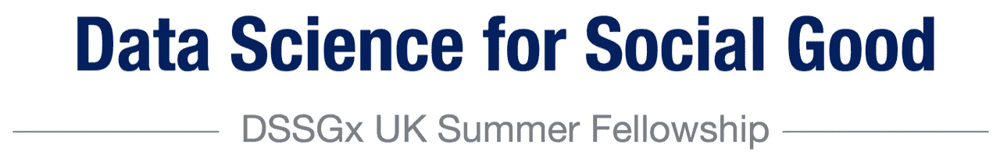
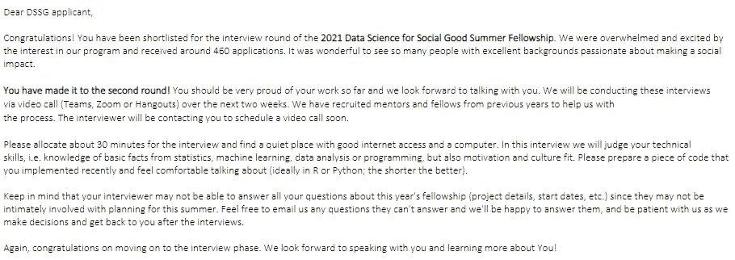
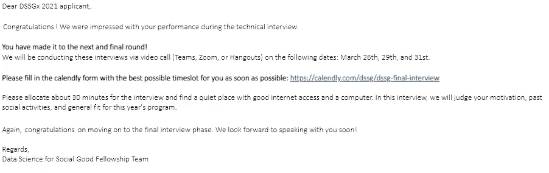
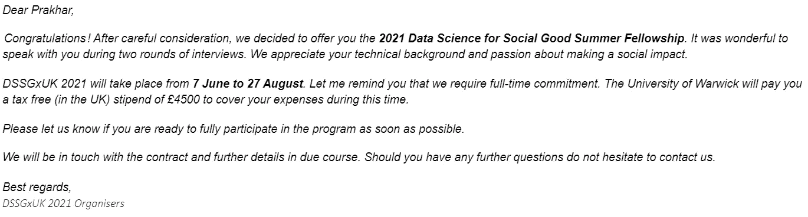
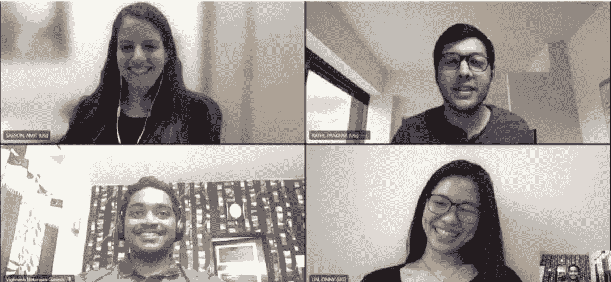

# 社会公益数据科学暑期奖学金

> 原文：<https://medium.com/analytics-vidhya/data-science-for-social-good-summer-fellowship-270f783ae402?source=collection_archive---------2----------------------->

徽标鸣谢:DSSGx UK

## 为希望通过数据科学对社会做出积极改变的人提供的暑期奖学金

数据科学是发展最快的领域之一，预计将成为未来十年最受欢迎的技能之一。它改变了我们获取信息和解决问题的方式。它为全球许多企业创造了价值，但数据科学的好处并没有平均分配。这是因为并非所有组织都拥有所需的资源或专业知识来利用数据的力量来实施计划。非常重要的是，旨在改善人民生活的政府组织和非政府组织也能够利用数据实现更多目标，以促进其社会事业。这就是为社会公益的数据科学的用武之地，这也是我这个夏天所做的。

# 目录

1.  [关于联谊](#1bb2)
    -[DSSG 历史](#9836)
2.  [关于 DSSGx 联谊](#66c2)
3.  [申请流程](#0de8)
    - [申请表](#7d8e)-
    -[技术面试](#6cfe)-
    -[最终面试](#f168)
4.  [工作经历](#76e6)
    - [数据科学工作流程](#db61)
    - [与项目合作伙伴一起工作](#a105)
    - [公开讲座与深度潜](#97c0)
    -[Socials](#9d82)
    -[团队合作](#9d82)
5.  [结论](#ec9b)
6.  [致谢](http://b06f)
7.  [参考文献](#ci5c)

# 什么是 DSSG 奖学金？

数据科学造福社会(DSSG)奖学金是一项全日制暑期项目，旨在培训数据科学家从事现实世界的项目，这些项目有可能对数百万人的生活产生积极影响。DSSG 研究员应用他们的数据科学技能，与政府和非营利组织(称为伙伴组织)密切合作。研究员致力于寻找教育、公共政策、经济发展、卫生、能源等领域复杂问题的解决方案。

通过这一方案，伙伴组织可以发掘利用数据支持其改善公众生活使命的潜力，而研究员可以磨练和应用其分析技能，并向来自工业界和学术界的全职导师学习。

## DSSG 历史

DSSG 基金会的核心夏季奖学金是由前奥巴马总统首席科学家[莱伊德·加尼](http://www.rayidghani.com/)于 2013 年设立的。美国奖学金始于芝加哥大学，现在位于卡内基梅隆大学。从那以后，从核心团契分支出来了多个类似的项目——其中之一是 [**DSSGx 英国团契**](https://warwick.ac.uk/research/data-science/warwick-data/dssgx/) ，这是本文的重点。2019 年，华威大学与艾伦·图灵研究所合作，将 DSSG 带到了英国。它于 2019 年在华威大学举办，并因新冠肺炎疫情而于 2020 年和 2021 年在线举办。

# 关于 DSSGx 英国暑期奖学金

今年夏天，我作为数据科学促进社会公益奖学金(DSSGx)的研究员，该奖学金由华威大学与 DSSG 基金会 DSSGx 英国分会合作举办。这是一个在六月和八月之间进行的为期 12 周的联谊活动，由于疫情，这是一个完全在线的活动。这是一个全日制项目，研究员在整个研究期间都有生活补贴。

在这篇文章中，我讲述了我在奖学金期间的经历，并提供了一个详细的选拔过程。

# 应用进程

申请过程是一个很好的方式，让你更深入地了解你的工作和技能，并真正思考为什么社会公益数据科学对你很重要。这个过程旨在更好地了解你，看看你是否适合这个项目。以下部分给出了该过程的详细概述和预期结果。

## 申请表

奖学金的申请于 1 月初开始**，你可以在[项目网站](https://warwick.ac.uk/research/data-science/warwick-data/dssgx/)上找到申请表的链接。该表格非常全面，要求申请人尽可能详细地解释他们过去在该领域的工作，以及他们成为该计划一部分的动机。有些问题会询问你的**个人背景、编程经验、数据科学经验、利用数据科学为社会做贡献的动机**等等。如实全面的回答这些很重要。该应用程序还要求您对某些工具和技能进行自我评价。在这里，你也应该诚实，但也要对自己的能力有信心。请记住，在接下来的几轮中，你会被问到关于你在申请表中所写内容的问题。在 word 文件中写下所有的问题并在提交之前检查它们可能会有所帮助。你还需要提交你的成绩单。我不知道我的成绩有多重要，但是如果你在你的第一/第二年读到这篇文章，它可能对你的成绩有所帮助。**

申请截止日期大约是一月底，我记得在截止日期的前一天提交了申请。这可能是因为我多次查看答案，以符合字数限制，但也传达了尽可能多的信息。我认为多轮审查确实帮助我提高了应用程序的质量。

***Pro 提示:*** *完成所有答案的初稿，然后经过一周的间隙再复习。这会给你一个新的视角，你会发现可以改进的地方。*

在我看来，申请过程是一次非常棒的学习经历，因为它要求我真正思考对我来说什么是重要的，为什么我非常适合这个项目，以及我在数据科学之旅中缺少什么。

差不多过了 25 天，我收到了入围邮件。我真的很高兴(也有点惊讶)，但旅程才刚刚开始。

第一封入围邮件！

## 技术面试

正如你可能在邮件中看到的，下一轮是技术轮(或代码演练)，我们接受了组委会成员的采访。我应该马上提到，我对面试真的很紧张，主要是因为我在印度面试的经历，那里的面试都是关于击败候选人并在他们身上找到缺点，但这次非常不同。我的面试官 Florian 真的很好，他确保我在面试前感觉很舒服，没有让我觉得他在评估我。没有“陷阱问题”(阅读:leetcode)会让我犯错误，给他拒绝我的理由。这纯粹是为了更多地了解我，我的工作和过去的项目。老实说，这是面试过程中最棒的部分之一，因为我看到了一种新的面试方式，两个人可以互相学习。由于这是一次代码演练，我解释了我是如何构建我的项目的，他一直问我一些问题，比如为什么我使用了一个特定的模型，或者我是如何解决一个潜在的问题的。还有一个关于 NLP(因为它与我的项目有关)和反事实解释(可能是因为我们都在可解释的 ML 方面做了一些研究)的额外讨论。快结束时，我问了几个关于这个程序和 mlr3 包的问题(我对 R 比较陌生)。

我对这一轮的建议是，彻底完成你已经建立的任何项目。只要你能解释为什么以及如何构建这个项目，你使用什么框架或语言并不重要。此外，我的一些同事谈到了一个算法实现，因为他们来自一个更加数学化的背景。我展示了一个全栈项目，因为我有很强的编程背景。

虽然我认为我的互动进行得很好，但我仍然不确定我是否能进入下一轮。接下来的 20 天，我无比焦虑，等待结果。最后，我收到了一封邮件，通知我我进入了最后一轮！

最终面试电子邮件

## **最终面试**

我在 22 号收到了最后的面试选择邮件，并预订了 29 号的面试时间，这是我的第一个空闲时间。这个面试更适合这个项目的文化。面试官想知道你是否会成为这个项目的一个好的补充，以及你如何为 DSSG 的目标做出贡献。有关于你的动机和过去经历的问题。

我收到了一个博士生发来的关于面试的邮件，但当我加入电话时，我有点惊讶。我以为只有一个面试者，但他们有两个人，其中一个是项目主任于尔根教授，他是华威商学院的资深教授和研究员。我想我明显感到惊讶和紧张，但两位面试官都很友好，希望我能感到舒适。他们做了自我介绍，让我做自我介绍，谈谈我加入这个项目的动机。接下来的 30 分钟用来更好地了解我和向我更好地解释这个项目。我和我的团队记得的一些有趣的问题是:

1.  告诉我们你过去与团队合作的经历，尤其是在偏远地区。在团队中，你喜欢扮演什么样的角色？
2.  如果你要为一个数据科学项目挑选自己的团队，你会怎么做？
3.  你过去参与过任何社会公益项目吗？给我们讲讲他们中的任何一个。
4.  我们会举行社交会议，会上研究员们会介绍一些关于他们祖国的有趣的事情。你知道你想展示什么吗？*(我讲过* [*胡里节*](https://en.wikipedia.org/wiki/Holi) *，印度的一个节日)*
5.  你在申请表里提到你喜欢法律。你能谈谈与数据科学相关的一个法律问题吗？
6.  你喜欢使用哪些远程工作工具，为什么？
7.  你有跨专业团队合作的经验吗？你的角色和贡献是什么？

最后，我问了几个关于奖学金和未来项目的问题。采访到此结束。我对我的面试非常满意，4 月 2 日，我收到了该项目的录取通知书！我喜出望外，真的很激动，要踏上 2021 年夏天的新征程。

接受电子邮件

我希望这个申请过程演练将有所帮助。不管结果如何，如果你正在读这篇文章，你应该申请这个项目，因为申请过程本身就是一次非常棒的经历。它将帮助你反思你的工作和你追求数据科学的动机。

# 工作经历

如果我不谈论我在团契期间的经历，这个博客将是不负责任的。该项目于 6 月 7 日启动，16 名学员来自不同的背景和国家。这是团契最大的好处之一。我能够与世界各地的人见面并成为朋友。研究员被分成 4 个小组，在[的 4 个不同项目](https://warwick.ac.uk/research/data-science/warwick-data/dssgx/projects_2021/)上工作。我的团队由来自以色列、台湾和印度的人组成，我们与德国联邦经济事务和能源部(BMWi)合作。他们代表德国负责经济事务和经济政策的主要政府机构。我们的项目合作伙伴希望提出一个解决方案来预测德国县级失业率。你可以在这里阅读详细的问题陈述和解决方案[。我想在这一部分更多地谈论体验和工作流程，而不是问题陈述。](https://github.com/DSSGxUK/bmwi)

 [## GitHub - DSSGxUK/bmwi:数据科学时期为 bmwi 打造的失业率预测工具…

### 你可以在这里找到这个项目的所有相关链接:-这个项目是德国联邦部…

github.com](https://github.com/DSSGxUK/bmwi) 

## 数据科学工作流程

很多人可能会认为，由于大学和研究机构的参与，因此，该计划会有点松散。然而，事实远非如此。正如我前面提到的，我们与来自工业界和学术界的人合作。每个团队都被指派了项目经理和技术导师。我们的项目经理确保我们在整个项目中遵循敏捷的工作流程，这意味着我们遵循了你在任何科技公司都会看到的所有标准实践。每周一，我们都会进行“冲刺计划”，讨论并敲定一周内要做的事情，并为任务分配[个故事点](https://www.atlassian.com/agile/project-management/estimation)。它是高度组织化的，每个成员都知道他们将要做什么。除此之外，我们每天早上(对我来说实际上是下午，因为我们在英国工作时间工作)见面，更新前一天的进展和当天的计划。这使我们能够对团队负责，并讨论我们可能面临的任何障碍。我团队中的每个成员都非常乐于助人，这意味着如果我遇到问题，我只需寻求帮助，就会有人或其他人与我一起解决问题。如果我们仍然停滞不前，我们可以联系技术导师，或者与合作伙伴讨论，或者在周五的深度潜水中讨论(我很快会谈到这些)。周五还有一个叫做“回顾会”的周总结会，在那里我们会评估我们一周的进展，并客观地评价冲刺的进展。这让我们深入了解了在下一次冲刺中哪些做得好，哪些可以做得更好。

因此，任何可能认为这是一次研究实习，你不会获得行业经验的人，你会惊讶于我们的工作与一家科技公司有多么相似。

## 与项目合作伙伴合作

然而，它并不完全像一家科技公司，因为它专注于社会公益方面。DSSGx 旨在通过与政府和非政府组织合作解决社会公益问题，这两者都对人们的生活产生直接的积极影响。正如我提到的，我们的项目*合作伙伴*是 BMWi。我之所以强调“伙伴”这个词，是因为我们是如何一起工作的。该组织希望与我们一起解决问题*，而不希望我们为他们解决问题*。我认为，这是与在一家公司工作的一个重要区别，在这家公司，客户只是给你一个问题，并希望你拿出一份演示文稿来为他们解决所有问题(从经验来看，这可能不完全通用，但很常见)。我们每周与合作伙伴会面，讨论我们的进展，并向他们解释我们的解决方案(或部分解决方案)。在每周讨论的基础上，我们将计划下周的工作，然后再次展示我们的发现。通过这种方式，我们的工作得到了持续的反馈，我非常感谢他们抽出时间与我们一起解决这个问题。我觉得这是我们解决方案成功的一个重要方面。**

*由于 DSSG 相信研究的可重复性和开放的科学，我们的解决方案在这里[是公开的](https://github.com/DSSGxUK/bmwi)。我们与 BMWi 的项目的另一个积极方面是，他们体验了数据科学对其组织的影响，并愿意探索更多数据驱动的解决方案来解决他们现有的其他问题。这意味着本组织将有更高标准的数据库维护和数据科学方法的应用。我认为这是一个巨大的成功！*

## *公开讲座和深度潜水*

*DSSGx 也致力于我们的学习，这超越了我们正在进行的项目。这是通过每周五的公开讲座实现的。这些演讲是由在数据科学领域拥有丰富经验的知名教授、研究人员和行业中坚分子进行的。这些讲座是脱离日常工作并了解更多有关数据科学界当前面临的挑战的好方法。我从每一次演讲中学到了很多，也与演讲者进行了互动，否则这是不可能的！我们参加的公开讲座的清单可以在这里找到。*

*公开讲座之后，我们进行了本周最期待的活动——深度潜水。这是所有团队谈论他们每周进展和下周计划的机会。我喜欢这些会议，因为我们可以向教授、技术导师和来访的客人提出任何问题。由于每个人都来自不同的背景，我们几乎总是有多种方法来解决我们面临的特定问题。这真的很有帮助。此外，我们能够与其他研究员互动，了解他们的项目和经验，这非常有趣。*

*总的来说，这是学习和合作解决问题的一天。因为一个接一个的多节课，有时会很紧张，但这是一次很好的学习经历，因为这些课我们取得了很大的进步。*

## *社会*

*然而，公开讲座和深度潜水并不是周五发生的唯一事情！经过一周的辛苦工作，所有的伙伴都放松下来，参加社交活动。这些活动由其中一个团队每周组织一次，这是一个与团队以外的人交谈并更好地了解他们的好方法。我喜欢所有这些会议！*

**

*Gartic 电话标志*

*我们玩了许多不同的游戏(任何可能的在线游戏),包括 Skribbl、神秘狩猎、奥运主题问答、小组活动等等。我个人最喜欢的是 [Gartic 电话](https://garticphone.com/)！*

*星期五绝对是我最喜欢的一天！它充满了学习和乐趣，这无疑让我期待着周一，这样我们就可以重新开始工作。我想在奖学金之前，我从来没有期待过星期一。*

## *协力*

*如果我不谈论我的神奇团队，我的团契经验甚至不会有十分之一完整！我可以花几个小时谈论我和他们在一起的美好经历，但让我先介绍一下他们:*

1.  *[Amit Sasson](https://www.linkedin.com/in/amit-sasson-data/)——特拉维夫大学统计学硕士毕业，*
2.  *[Cinny Lin](https://www.linkedin.com/in/cinny-lin/)——数据科学，NYU 2012 年，*
3.  *Vighnesh N Ganesh——印度 BITS Pilani 大学大三学生，主修计算机科学工程，*
4.  *最后是我自己，Prakhar -计算机科学，SNU 22 级。*

**

*DSSGx 2020 团队*

*一个好的团队是一个成功项目的最重要的方面，我有幸与一些最优秀的人一起工作。我们非常不同的背景被证明是我们项目成功的主要因素之一。我们的团队中有人对机器学习算法有着丰富的知识，有人可以像写什么都不是一样写复杂的管道，有人可以构建 BMWi 使用的工具，有人可以通过有效的可视化来解释甚至最复杂的结果。这一点，再加上他们每个人都随时准备互相帮助，使我们一起工作非常富有成效。我可以自信地说，这是我与一些最好的团队成员一起工作的最好经历之一。*

**

*BMWi 团队的独角兽被评为最佳独角兽！*

*我们团队合作的一个例子是由一位技术导师举办的独角兽绘画比赛，这是一次有趣的团队建设活动。我们必须在有限的时间内通过在谷歌电子表格的方框中着色来制作独角兽。它不是梵高的作品，但我们仍然为它感到骄傲。我们的独角兽被主办方宣布为最佳独角兽！*

*虽然我们非常努力，但这不是我们唯一做的事情。我认为我们也绝对是最健谈的团队。我们总是愿意了解彼此的文化、语言和学术背景。我对以色列、台湾和印度南部了解得更多，以至于我可能会赢得一场知识竞赛。*

*就像我说的，我可以花几个小时谈论我们作为一个团队有多快乐，但是博客已经太长了，但是我很高兴你已经阅读了。*

# *结论*

*这个夏天对我来说是一次启迪之旅。我成长为一名数据科学家，也成长为一个人，这都要感谢这个伙伴关系。在过去的几个月里，我学到了很多新的技能，我可以将这些技能应用到其他项目中。我还能够与学术界和业内人士建立联系，这也是我的目标之一。*

*我向初露头角的数据科学家和学者推荐这项奖学金，他们希望将自己的技能应用到重要的问题上，并在这个过程中学到很多东西。*

**

*弗兰基·查马基在 [Unsplash](https://unsplash.com?utm_source=medium&utm_medium=referral) 上拍摄的照片*

## *确认*

*如果没有我的团队成员之一 Cinny Lin 的帮助，这篇文章是不可能完成的。她也写关于数据科学和技术的文章。查看她的博客[这里](https://cinnylin.medium.com/)！我还从华威大学的于尔根·布兰克教授和科尔姆·康诺顿教授那里得到了非常有益的意见，他们在奖学金期间也与我们密切合作。我的队友 Amit 和 Vighnesh 也提供了非常有用的意见。*

# *参考*

1.  *【https://www.dssgfellowship.org/ *
2.  *[https://warwick . AC . uk/research/data-science/warwick-data/dssgx/](https://warwick.ac.uk/research/data-science/warwick-data/dssgx/)*
3.  *[https://warwick . AC . uk/research/data-science/warwick-data/dssgx/FAQ/](https://warwick.ac.uk/research/data-science/warwick-data/dssgx/faq/)*