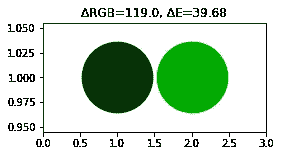

# 街头艺术的数据科学

> 原文：<https://medium.com/analytics-vidhya/data-science-for-street-art-7d11cb23dc81?source=collection_archive---------3----------------------->

我的爱好之一是绘画，随着时间的推移，我对街头艺术和涂鸦产生了兴趣。最近在我的家乡城市塔林有很多合法绘画的机会——所以我喜欢观察城市空间如何变得更加丰富多彩，并不时地参与其中。

隐藏在视野之外的是你在规划一幅新壁画时需要做的所有准备工作——想出一个概念，画一个(通常是数字的)草图，规划预算和资源——最重要的是，绘画。创建数字作品时，您可以从数百万种颜色和任何画布尺寸中进行选择。当用喷漆画一幅真正的壁画时，你必须从市场上大约 200 种颜色中选择——越少越实用——并且知道该买多少。

那么必须做些什么呢？

*   计算出颜色的数量——如果你有渐变，这并不容易。
*   计算每种颜色所占的面积——大多数教程都展示了令人讨厌的巫术，在 Photoshop 中用直方图来计算每种颜色的像素比率。
*   App stores 有工业画师的 App，但我见过的那些都不处理不规则和多色的形状。
*   一幅甚至带有大胆的平面颜色的数字草图会有来自绘画、导出时的压缩、发送信使的伪像——这产生了带有随机颜色的像素。
*   最后，最好不仅能知道图片上有哪些颜色，还能知道哪些油漆(喷漆罐)与它们最匹配。

我决定为此开发一个应用程序。结果发现这里面有有趣的复杂性。


我为自己和朋友创建的应用程序。

# 数颜色

让我们首先导入我们将使用的所有内容。您可能需要安装软件包。

让我们加载上图中看到的图像，看看它有多大:

```
Width: 4000 / Height: 934
Pixels: 3736000
RGB pixel sample:
[[ 36 182 169]
 [ 27 173 160]
 [ 20 166 153]]
```

第一个想法是检查像素(矩阵中的行)并计算唯一的计数。让我们试一试。

```
Unique RGB colors: 149521
```

结果我们会得到 15 万种独特的颜色！这就是在 Procreate/Photoshop 中用画笔绘画，导出到 JPG 并发送 Facebook Messenger 对你的图片所做的事情。不是一条路可走。


大多数颜色占用一个像素。

# 使聚集

让我们试着去掉大部分颜色。为此，我们需要进行某种聚类。该任务的理想选择是 DBSCAN 算法，它不需要预先知道簇的数量，而是自己发现它。它要求的是什么组成一个聚类(最小点数)和打破一个聚类(点之间的最大距离)。

DBSCAN 的缺点，或者至少是它的 scikit-learn 实现，是它在大型数据集上非常慢(O(n))。所以我们先试着修整一下像素阵列。

*   让我们去掉太小的颜色(小于总面积的 0.001)
*   此外，让我们删除重复项，因为如果我们将每个聚类的最小点数设置为 1，它会显著减小数据集的大小，而不会影响 DBSCAN 的性能。

因此，最终我们只剩下一组足够重要的独特 RGB 颜色(≥0.1%)。

```
Min pixels per color: 3736
Unique significant colors: 61
```

与我们之前拥有的 15 万种颜色相比，只有 61 种颜色听起来已经是一种福气了。但还是太多了，还是把太相似的颜色聚类在一起吧。

让我们使用 3D 空间中 R、G、B 点之间的欧几里德距离作为邻近度量来对颜色进行聚类。结果就是你在下面看到的 11 种颜色。


现在让我们通过使用 [Delta-E CIELAB2000](https://en.wikipedia.org/wiki/Color_difference#CIEDE2000) 作为距离度量来尝试对颜色进行聚类。CIELAB2000 是一个颜色空间，旨在描述人类如何感知颜色和颜色变化。Delta-E 是一个相当复杂的函数，它计算空间中颜色之间的距离。多年来，它经历了多次修改，被认为是人类感知差异的最准确的表达。

结果就是你在原图上看到的 9 种颜色。对于不同的图像(例如，有或没有梯度)，你应该调整阈值，我们在这里设置为 12。


# RGB 上为什么用 Delta-E CIE2000 而不是欧几里得？

对于简单的情况，仅仅计算 3D RGB 空间中的欧几里德距离就足以获得颜色之间的近似差异。但是对于像为绘画选择正确的色调这样微妙的用例，您很快就会不可避免地发现，这种差异不是您的人类感知所希望的。


颜色感知的非线性

让我们用一个例子来说明:



我们看到两幅图像的欧几里德 RGB 大致相同，但第一幅图像的 delta-E 要大得多。为什么？因为红色和绿色色调之间的感觉差异大于较暗和较亮的绿色色调之间的感觉差异。如果你想一想，那么当你画一件艺术品时，你可能会被原谅把暗绿色和浅绿色误认为是树，但是画红色的树会很奇怪。


另一个例子，同样的欧几里德 RGB 距离，但显然很难注意到两种黑色(深灰色)的区别，但如果你把蓝绿色换成蓝绿色，效果就会很明显。


一小部分蒙大拿 MTN-94 系列喷漆

如果你有许多相似的色调，这些细微的差别就变得特别重要，比如我们用作例子的那幅画——你需要从油漆供应商提供的油漆中选择最匹配的油漆。

至于我的应用程序，我想添加的下一件事可能是一个自适应距离阈值，也可以有效地处理复杂梯度的图像。总的来说，有趣的是，即使是像从图片中计算颜色这样简单的任务，也可能涉及科学和数学理论——并最终成为许多人已经在解决的问题。