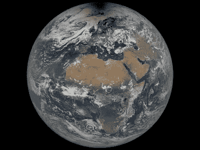
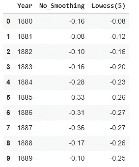
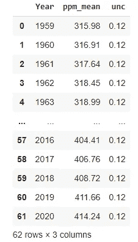
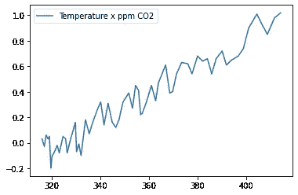
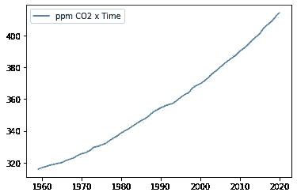
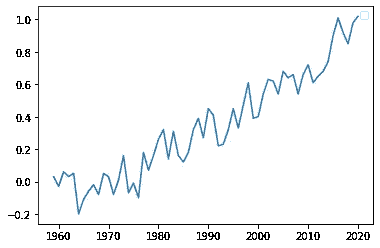
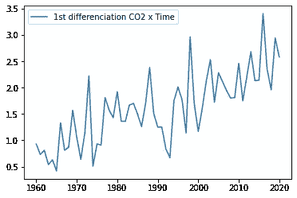
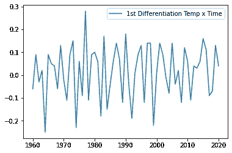
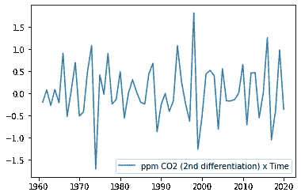
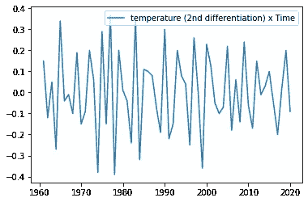

# 气候变化中的数据科学

> 原文：<https://medium.com/analytics-vidhya/data-science-in-climate-change-7ba2dd948aa7?source=collection_archive---------4----------------------->



我们的蓝色大理石

**简介**

气候变化是当今的热门话题。科学界的共识是，大气中的二氧化碳排放导致全球气温上升，这种上升对环境(包括人类)来说是灾难性的。然而，在广泛的社区中，这不是一个平静的话题:虽然环保主义者同意并支持这一共识，但也有一些部门质疑关于数据的结论。

在本文中，我们将使用数据科学技术来验证或反驳气候变化理论，虽然这个话题有政治偏见，但我将尝试遵循一种中立的方法:从现在起，我们不会对全球变暖做出任何假设，我们的结论将基于数据。

**编程语言和依赖关系**

在这个分析中，我们选择的编程语言将是 Python，然而，这里使用的所有库可能都有相应的 r。

如果读者试图复制这个练习，他/她将需要导入以下库:

```
import pandas as pdimport matplotlib.pyplot as pltfrom statsmodels.tsa.stattools import adfullerfrom scipy.stats import spearmanrfrom statsmodels.tsa.stattools import grangercausalitytests
```

**数据**

我们将在这项研究中使用关于温度和大气 CO2 的数据。对于温度，我们将使用美国宇航局的温度异常时间序列，它包括给定年份的平均温度减去 1951-1980 年期间的平均温度之间的差异，假设为基线。它包含两列:平滑版本和非平滑(蛮)版本，我们将继续我们的分析与非平滑

该数据集可在以下位置找到:[https://Data . giss . NASA . gov/GIS temp/graphs/graph _ Data/Global _ Mean _ Estimates _ based _ on _ Land _ and _ Ocean _ Data/graph . txt](https://data.giss.nasa.gov/gistemp/graphs/graph_data/Global_Mean_Estimates_based_on_Land_and_Ocean_Data/graph.txt)

对于二氧化碳，我们将选择 NOAA 的数据:它包括在莫纳罗亚天文台获得的大气二氧化碳的年平均测量值。测量单位是百万分之一。

该数据可在[https://GML . NOAA . gov/web data/ccgg/trends/CO2/CO2 _ ann mean _ mlo . txt](https://gml.noaa.gov/webdata/ccgg/trends/co2/co2_annmean_mlo.txt)上获得

```
df_temp=pd.read_csv("https://data.giss.nasa.gov/gistemp/graphs/graph_data/Global_Mean_Estimates_based_on_Land_and_Ocean_Data/graph.txt",sep="     ",skiprows=4, error_bad_lines=False)df_temp=df_temp.reset_index(drop=False).rename(columns={'level_0':"Year",'level_1':"No_Smoothing","----------------------------":"Lowess(5)"})df_temp.head(10)
```

它返回给我们以下数据帧:



接下来，我们将导入二氧化碳数据:

```
df_CO2=pd.read_csv(“https://gml.noaa.gov/webdata/ccgg/trends/co2/co2_annmean_mlo.txt",sep=' ‘,skiprows=56)df_CO2=df_CO2.drop(axis=1,columns=”unc”)df_CO2=df_CO2.rename(columns={“# year”:”Year”,” mean”:”ppm_mean”,”Unnamed: 2":”unc”})df_CO2.head(100)
```



正如我们所看到的，这个数据集比第一个数据集开始得早:直到 1959 年才进行了 CO2 的测量，我们感兴趣的列是“ppm_mean”，它显示了每百万“空气分子”中大气中 CO2 分子的数量(在“引号”中，因为空气由一种以上的分子组成)。

“unc”一栏包含测量的不确定性，因为与“ppm_mean”的变化相比，它较低，所以不予考虑。

接下来，我们将连接两个数据帧:

```
df=df_CO2.merge(df_temp,left_on="Year",right_on="Year")
```

并绘制一张 CO2 x 温度的图表(matplotlib 现在很方便):

```
plt.plot(df["ppm_mean"],df["No_Smoothing"],label="Temperature x ppm CO2")plt.legend()plt.show()
```



然而，在推断变量之间的任何关系之前，我们可以很容易地看出它们之间的相关性，让我们分别绘制出它们与时间的关系:

```
plt.plot(df["Year"],df["ppm_mean"],label="ppm CO2 x Time")plt.legend()plt.show()
```



```
plt.plot(df["Year"],df["No_Smoothing"])plt.legend()plt.show()
```



正如所料，二氧化碳和温度都随着时间的推移而上升。然而，这意味着我们有两个非平稳的时间序列。时间序列有一些特殊的性质，需要进一步分析才能推断出相关性或因果关系。我们现在将更深入地探讨这个话题。

**时间序列分析**

时间序列是数据科学中一个非常有趣但经常被忽视的话题。虽然对时间序列使用机器学习(包括深度学习)是完全可能的，但必须小心谨慎，以免陷入虚假的关系。

在谷歌中快速搜索“虚假相关性”会得到一系列数据，尽管这些数据完全相关，但没有任何有意义的完整关系。例如，在美国太空支出和上吊自杀之间可以看到 99%的相关性(见 https://tylervigen.com/old-version.html)。这种关系是由于这两个因素都随着时间的推移而增长(因此是时间序列)，但原因却完全互不相关。

这种现象在非平稳时间序列，即平均值不恒定的时间序列中很常见。当两个时间序列具有恒定的平均值时，测量它们之间的关系变得更容易，因为可用的统计工具能够在这种情况下得出结论。

领域知识也可以用于推断关系是否虚假，在我们的方法中，我们将是数据驱动的，而不依赖于任何气象/气候概念。

处理非平稳时间序列的一种常用方法是 box-jenkins 方法:它包括对时间序列进行微分(更多细节见下文),并检查平稳性。如果时间序列是平稳的，我们可以继续进行分析，如果不是，我们重复这个过程。

我们将在本文中使用的平稳性检验是扩展的 Dick-Fulley 检验:ADF 检验有一个零假设，即一个时间序列有一个单位根(因此不是平稳的)，因此，在这个检验中的低 p 值意味着我们可以拒绝零假设，并假设我们有平稳性。

必须小心，因为无论何时我们进行区分，我们都会丢失一个数据点，所以“过度区分”可能会导致我们的数据太小而无法得出任何有意义的完整结论。

**回数据**

也就是说，我们是否应该对 ppm_mean 进行扩展的 Dick-Fulley 测试:

```
adfuller(df["ppm_mean"])
```

我们得到了结果:

```
(5.599381171565086,  1.0,  2,  59,  {'1%': -3.5463945337644063,   '10%': -2.5936515282964665,   '5%': -2.911939409384601},  68.93026071443612)
```

第一个结果是测试值，而字典包含指定 p 值的临界值。对于平稳时间序列，ADF 测试值应该是高度负值，这里我们有一个正值，这意味着它肯定是非平稳的，正如我们在图表中看到的那样。

对温度重复该过程:

```
adfuller(df["No_Smoothing"])
```

结果是:

```
(1.693313729607132,  0.998112188876265,  9,  52,  {'1%': -3.562878534649522,   '10%': -2.597393446745562,   '5%': -2.918973284023669},  -84.50687492983371)
```

因此，我们必须对数据进行区分，得出与 CO2 类似的结论:

微分，在于取每两个数据点之间的差，它类似于导数的概念(对于熟悉微积分的读者)，其中我们计算给定特征的函数的变化率。对于 CO2 数据，第一次微分导致大气中 CO2 的变化速度(类似于物理学中的汽车速度)，第二次微分包括大气中 CO2 浓度的加速度(速度变化率)。对于温度也可以进行类似的推理。

如果有必要，可以进行进一步的微分，它们将意味着先前微分的变化率。然而，如上所述，应该避免过度分化。

在蟒蛇熊猫中，区别很简单:

```
df['ppm_mean_1st_diff']=df["ppm_mean"].diff()
df['No_Smoothing_1st_diff']=df["No_Smoothing"].diff()
```

下一步，我们可以可视化数据:

```
plt.plot(df.dropna()["Year"],df.dropna()["ppm_mean_1st_diff"],label="1st differenciation CO2 x Time")plt.legend()plt.show()
```



```
plt.plot(df.dropna()["Year"],df.dropna()["No_Smoothing_1st_diff"],label="1st Differentiation Temp x Time")plt.legend()plt.show()
```



并对差异数据运行 ADF 测试:

```
print(adfuller(df.dropna()["ppm_mean_1st_diff"]))(0.733379134935783, 0.8379131362306149, 6, 54, {'1%': -3.55770911573439, '5%': -2.9167703434435808, '10%': -2.59622219478738}, 77.14673018996123)print(adfuller(df.dropna()["No_Smoothing_1st_diff"]))(-3.841475910786161, 0.002510356190042097, 8, 52, {'1%': -3.562878534649522, '5%': -2.918973284023669, '10%': -2.597393446745562}, -83.7697836134268)
```

图表和数据都表明温度在分化后变得稳定。另一方面，二氧化碳没有，也就是说，它的变化速度不是恒定的(在这种情况下，是正加速度:我们现在排放的二氧化碳比过去多)。在这种情况下，我们将重复相同的步骤:

```
df['ppm_mean_2nd_diff']=df["ppm_mean_1st_diff"].diff()
plt.plot(df.dropna()["Year"],df.dropna()["ppm_mean_2nd_diff"],label="ppm CO2 (2nd differentiation) x Time")plt.legend()plt.show()
```



```
df['No_Smoothing_2nd_diff']=df["No_Smoothing_1st_diff"].diff()plt.plot(df.dropna()["Year"],df.dropna()["No_Smoothing_2nd_diff"],label="temperature (2nd differentiation) x Time")plt.legend()plt.show()
```



作为 ADF 测试:

```
¬print(adfuller(df.dropna()["ppm_mean_2nd_diff"]))print(adfuller(df.dropna()["No_Smoothing_2nd_diff"]))(-5.668746983182228, 9.024037096079651e-07, 5, 54, {'1%': -3.55770911573439, '5%': -2.9167703434435808, '10%': -2.59622219478738}, 75.28592084184274)(-5.484290191540704, 2.248028760817303e-06, 8, 51, {'1%': -3.5656240522121956, '5%': -2.920142229157715, '10%': -2.598014675124952}, -72.11272164726171)
```

我们现在已经达到了这个数据的平稳性，置信度大大高于 99%。现在我们可以进行有意义的全面相关分析。在这里，我们将使用 spearman 的等级来衡量关系强度(与 pearson 不同，它衡量的是线性度):

```
spearmanr(df.dropna()['ppm_mean_2nd_diff'],df.dropna()['No_Smoothing_2nd_diff'])SpearmanrResult(correlation=0.30972627483673754, pvalue=0.016031150802216298)
```

我们的 p 值为 0.016，这意味着这个变量之间存在 98.4%显著性的相关性，即 CO2 和温度确实存在正相关关系。

**因果关系测试**

然而，我们还没有完成，因为即使非平稳的时间序列也可能(尽管很少)产生虚假的相关性，为了避免这种虚假的相关性，我们将继续进行格兰杰因果检验。

统计学的一个推论是，相关性并不意味着因果关系。格兰杰因果关系检验试图通过分析两个变量及其滞后之间的相关性来证明因果关系:变量及其滞后之间的相关性应允许我们检验因果关系。

python 中的格兰杰因果检验可以写成:

```
grangercausalitytests(df.dropna()[['ppm_mean_2nd_diff','No_Smoothing_2nd_diff']],maxlag=2,verbose=True)
```

结果是:

```
Granger Causality
number of lags (no zero) 1
ssr based F test:         F=18.7398 , p=0.0001  , df_denom=56, df_num=1
ssr based chi2 test:   chi2=19.7437 , p=0.0000  , df=1
likelihood ratio test: chi2=17.0310 , p=0.0000  , df=1
parameter F test:         F=18.7398 , p=0.0001  , df_denom=56, df_num=1

Granger Causality
number of lags (no zero) 2
ssr based F test:         F=5.8721  , p=0.0050  , df_denom=53, df_num=2
ssr based chi2 test:   chi2=12.8522 , p=0.0016  , df=2
likelihood ratio test: chi2=11.6089 , p=0.0030  , df=2
parameter F test:         F=5.8721  , p=0.0050  , df_denom=53, df_num=2{1: ({'lrtest': (17.030981611191905, 3.677485397108516e-05, 1),
   'params_ftest': (18.739773684053855, 6.251860451764658e-05, 56.0, 1.0),
   'ssr_chi2test': (19.743690131413885, 8.855357721056133e-06, 1),
   'ssr_ftest': (18.73977368405386, 6.251860451764658e-05, 56.0, 1)},
  [<statsmodels.regression.linear_model.RegressionResultsWrapper at 0x7fc051653b90>,
   <statsmodels.regression.linear_model.RegressionResultsWrapper at 0x7fc0490535d0>,
   array([[0., 1., 0.]])]),
 2: ({'lrtest': (11.60889393523263, 0.003014121198877576, 2),
   'params_ftest': (5.872136774242954, 0.004971351181394592, 53.0, 2.0),
   'ssr_chi2test': (12.852223883248705, 0.0016187323409778665, 2),
   'ssr_ftest': (5.872136774242942, 0.004971351181394645, 53.0, 2)},
  [<statsmodels.regression.linear_model.RegressionResultsWrapper at 0x7fc0511a78d0>,
   <statsmodels.regression.linear_model.RegressionResultsWrapper at 0x7fc0511a7c50>,
   array([[0., 0., 1., 0., 0.],
          [0., 0., 0., 1., 0.]])])}
```

因此，对于滞后 1 和 2，我们的显著性 p 值小于 0.001(大于 99.9%)，表明 CO2 和温度之间存在因果关系

**结论**

我们以一个符合科学共识的结论来结束这篇文章:二氧化碳排放与气温上升相关，可以从中推断出因果关系。即使在所有这些测试之后，我们也不能 100%确定这些结论——毕竟，统计学处理的是不确定性，而不是确定性——但我们可以非常确定地肯定，地球正在变暖，二氧化碳排放是原因。

**参考文献:**

[https://Data . giss . NASA . gov/GIS temp/graphs/graph _ Data/Global _ Mean _ Estimates _ based _ on _ Land _ and _ Ocean _ Data/graph . txt](https://data.giss.nasa.gov/gistemp/graphs/graph_data/Global_Mean_Estimates_based_on_Land_and_Ocean_Data/graph.txt)

[https://GML . NOAA . gov/web data/ccgg/trends/CO2/CO2 _ ann mean _ mlo . txt](https://gml.noaa.gov/webdata/ccgg/trends/co2/co2_annmean_mlo.txt)

[](https://blog.ms-researchhub.com/2019/10/26/spurious-regression-with-stationary-time-series/) [## 平稳时间序列的虚假回归

### 如果统计概要表明两个变量是相同的，那么这种虚假的关系就发生了

blog.ms-researchhub.com](https://blog.ms-researchhub.com/2019/10/26/spurious-regression-with-stationary-time-series/) 

Browlee，Jason 使用 Python 进行时间序列预测

[https://www.nasa.gov/topics/earth/images/index.html](https://www.nasa.gov/topics/earth/images/index.html)