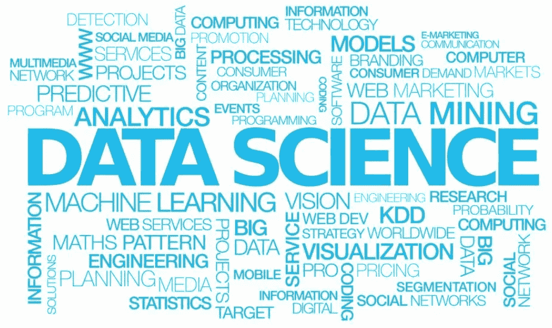
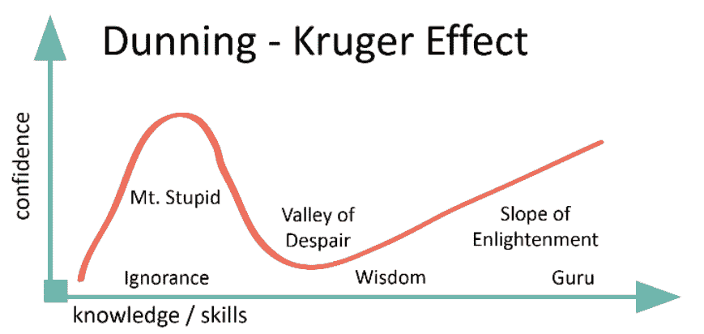

# 数据科学学习资源—面向初学者

> 原文：<https://medium.com/analytics-vidhya/data-science-learning-resources-for-beginners-38d37ccd9844?source=collection_archive---------22----------------------->

## 一篇关于我前 12 个月数据科学学习之旅的半结构化思考，以及一些课程建议。

大约 12 个月前，我决定尝试一下 Python——最初我只是想学习如何编码，并且我听说对于那些从高中开始就没有接触过编程语言的人来说，Python 是一个很好的起点。

我经常处理数据，并且刚刚提高了我的 SQL 技能来帮助我作为一名反欺诈者的工作，想象一下当我发现 Python 可以将这种对数据流畅性的追求提升到一个全新的有用水平时我有多惊讶。就这样开始了我对网络课程的痴迷。

# 从哪里开始？

我一头扎进了一堆专注于数据科学的 Udemy Python 课程，不要误会，其中一些课程非常棒(下面会提到)，但它们确实倾向于掩盖一些绝对的基础知识。当然，你可以通过模仿老师的做法来达到目的，但是你真的明白发生了什么吗？

> 为什么这家伙这里用方括号，那里用花括号？什么是迭代器？什么？！

## [1。Python 培训简介](https://stackskills.com/p/introduction-to-python-training)

作为一个完全的 Python 和编程初学者，这确实为我具体化了许多绝对的基础知识。这是一个一般性的 Python 介绍(不专注于数据科学)，它假设你对编程一无所知*，，这对我来说再好不过了。讲师讲的很清楚，也很透彻，一天后我对 Python 基础的理解就被锁定了。*

*无论是这门课程还是其他课程，我都强烈建议你在尝试使用这门语言做任何事情之前，先了解一下这门语言的基础知识。*

## *[2。Python 中的数据操作:熊猫速成班](https://www.udemy.com/course/data-manipulation-in-python/)*

*Samuel Hinton 是一名澳大利亚天体物理学家，精通多种编程语言，是公认的天才，他和你想象中的那种人一样古怪。*

*除了这门课之外，还有很多关于熊猫的课程值得你去学(比如何塞·波尔蒂利亚的 Python 数据科学课程)，但是这门速成课真的帮我锁定了一些我很难记住的概念。这也是超级数据科学会员所包含的内容的一部分，该会员以非常合理的年费拥有大量的课程。*

> *如果你像我一样，你会发现自己正在上第 20 门迷你课程，并意识到当你完成课程内容时，你想解决一些现实世界的问题，突然之间你就从愚蠢山的斜坡上滚了下来；*

**

*邓宁-克鲁格曲线。Img 来源[市场需求](https://www.marketcalls.in/trading-lessons/the-dunning-kruger-effect-what-differentiates-novice-and-expert-traders.html)*

## *[3。Udacity 数据分析师 Nanodegree](https://www.udacity.com/course/data-analyst-nanodegree--nd002)*

*Udacity Nanodegrees 有点贵，他们的模式与许多 MOOCs 不同，但如果我诚实地说，成本和时间限制确实有助于我的动机*(更不用说他们经常以高达 75%的价格出售)*。他们是我第一次遇到自己独立完成的实际项目，虽然这不是你在大学里能得到的，但你确实有一个真正的人给你反馈，在问答部分有一群非常活跃的“导师”,还有一个非常活跃的学生社区。*

*特别是数据分析师 Nanodegree 非常有用，它将我推到了可以在日常工作中使用 Python 的地步——结构良好的课程，其数据集开始接近现实世界中的数据集(而不是堆积着 *numpy.random.randint* 值的数据帧——唉)。*

> *在一些更注重分析的课程中，你会发现关于机器学习的章节非常少。我想知道更多，你可能也想知道。*

## *[4。机器学习 A-Z:数据科学中的实践 Python&R](https://www.udemy.com/course/machinelearning/)*

*这是课程规则*

*不要误会我的意思，完成这门课程后，你不会成为一名机器学习工程师，但对于第一次与 ML 约会来说，这是一门非常棒的课程。基里尔·叶列缅科和哈德林·德·庞特维斯无疑是我遇到的最好的 MOOC 讲师，这门课程充满了关于最常用的 ML 算法的内容(Python 和 R ),以及数据预处理和模型本身的模板。*

*它们还包括超级方便的“直觉”部分，解释每个算法的概念，而不会陷入数学和技术细节。*

# *待续:*

*这篇文章可能会永远继续下去，所以我现在会用下面的列表来结束这篇文章，这些列表是我发现的以某种方式有用或鼓舞人心的许多网站、人物和资源。向我错过的人道歉！*

*我还在学习，我学到的最有力的一课是，每个人，甚至大师们都还在学习，永远不会停止。*

***资源:***

*   *[分析 Vidhya —课程](https://courses.analyticsvidhya.com/collections)*
*   *[数据由凯特·斯特拉赫妮提供](https://datacated.com/)*
*   *[超级数据科学](https://www.superdatascience.com/)*
*   *[Kaggle 课程](https://www.kaggle.com/learn/overview)*
*   *【Danny 的数据—严肃的 SQL*
*   *[fast.ai](https://www.fast.ai/)*

***LinkedIn 上的传奇人物:***

*   *埃里克·韦伯*
*   *[悟空莫汉达斯](https://www.linkedin.com/in/goku/)*
*   *凯特·斯特拉奇尼*
*   *Moez Ali*
*   *[马得](https://www.linkedin.com/in/datawithdanny/)*
*   *杰里米·哈里斯*
*   *格雷格·科奎洛*
*   *特伦斯·申*
*   *安德烈亚斯·克雷茨*