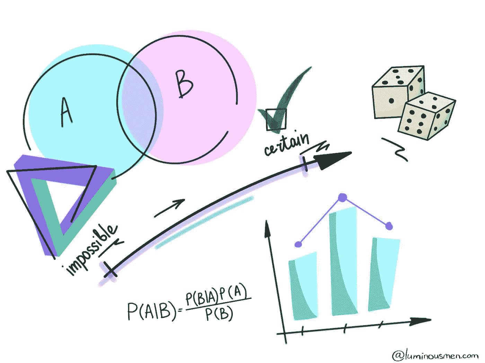

# 数据科学。措施

> 原文：<https://medium.com/analytics-vidhya/data-science-measures-73d4f7cc5800?source=collection_archive---------14----------------------->

## 如何使用描述性统计来查看数据显示的内容

有很多工程师从未涉足统计学或数据科学领域。但是，为了构建数据科学管道或者将数据科学家产生的代码重写为适当的、易于维护的代码，工程方面会出现许多细微差别和误解。对于那些数据/ML 工程师来说…