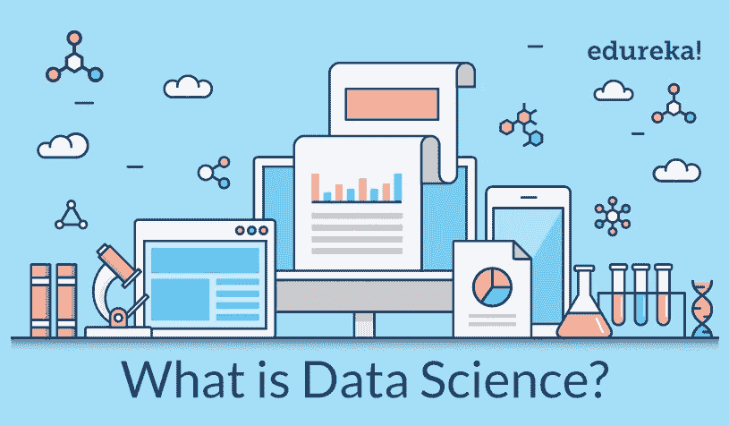
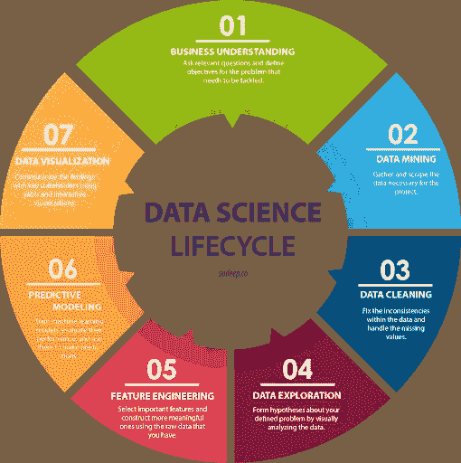
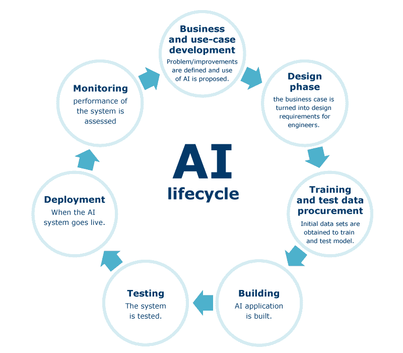

# 数据科学或人工智能

> 原文：<https://medium.com/analytics-vidhya/data-science-or-ai-9bfc84f8f046?source=collection_archive---------14----------------------->

数据科学流程->人工智能开发流程->满足客户需求

## 如今，人们经常争论哪个领域更重要，因为人工智能和数据科学都是如今在高中、大学和工作场所使用的热门词汇。

## 我会告诉你每个领域的主要区别，以及你可以从这些领域中选择什么样的职业道路。

数据科学广义感知

## 什么是数据科学？

数据科学基本上是对数据及其能力和当前行为的研究。解释这一点的更正式的方式是，它研究数据模式，并从中得出商业用例以及技术进步甚至战略制定的见解。

## 数据科学是用来做什么的？

数据科学是一个跨学科领域，专注于从通常很大的数据集中提取知识，并应用提取的知识，将其转换为可操作的见解，以解决各种应用领域的问题。

该领域包括准备用于分析的数据、制定数据科学问题、分析数据、开发数据驱动的解决方案，以及在广泛的应用领域中展示调查结果以提供高层决策。因此，它结合了计算机科学，统计学，信息科学，数学，信息可视化，数据集成，图形设计，系统管理，通信和商业规划的技能。

人类行为向数字世界的转变

## AI 是什么？

人工智能正在给计算机器编程，使其能够与人类的思维能力相匹敌，并且还能代替具有相同思维能力的人类执行任务。它可以被描述为在计算机中编码人类的思维。

## AI 是用来做什么的？

像数据科学一样，人工智能在其开发和执行过程中也与许多其他领域相关联。在二十一世纪，随着计算能力、大量数据和概念理解的同步发展，人工智能技术经历了一次复兴；人工智能技术已经成为技术行业的重要组成部分，有助于解决计算机科学、软件工程和运筹学中的许多挑战性问题。

# 数据科学生命周期

数据科学领域内任何项目的生命周期

因此，我们可以看到，我们从理解手头的业务问题开始，这涉及到对行业的研究分析，并以包括预测在内的数据可视化结束

# 用于理解的示例案例研究

让我们在这里说，我们采取了一个项目与美国国家航空航天局作出预测，对他们的空间探索，以预测有多少行星可以存在于每个新的太阳系，他们的卫星可以发现。为此，我们必须执行以下步骤:

1.  与天体物理学家和卫星通信专家合作，了解数据用途以及数据如何通过数据管道生成。
2.  从卫星上提取数据并将其转换成可读格式。
3.  将数据加载到所需的软件上，例如 Visual Studio、Jupyter Lab、Apache Spark、SAS。
4.  我们查看并理解数据，找出所有特征之间的关系。举例说明部署的卫星类型与在外层空间发现的恒星数量之间的关系。
5.  我们清除数据中所有可能影响其准确性的记录错误，如空值或数据集上记录的不正确值。
6.  我们询问 NASA 团队领导或特定任务管理部门，他们希望他们的预测估计在视觉上看起来是什么样的，以及根据他们的分析师的计算，他们当前的估计是什么。
7.  然后，我们为预测器选择正确的机器学习算法，例如随机森林分类器、主成分分析等，并选择和调整正确的超参数，例如随机搜索和交叉验证，例如 K-fold。
8.  我们最终将给定的数据与预测一起可视化，并显示它们之间的预期关系，使用 Flask 等工具将其部署到 NASA 的数据库中，并将发现结果传达给 NASA 的团队，并告诉他们预测显示了什么，以及他们将在太阳系中发现多少个行星。
9.  我们还将告诉他们如何将这些预测与他们当前的空间探索活动联系起来，以及他们应该投资哪些新的基础设施或系统来提高数据准确性，或者投资哪些对他们来说可能更有利可图或更有资金吸引力的新的空间探索活动。

# 人工智能生命周期

在人工智能领域做任何项目的生命周期

# 用于理解的示例案例研究

让我们在这里说，我们采取了一个项目，与美国国家航空航天局作出一个互动的人工智能系统，对他们的航天器通信，给他们的信息，从他们的数据库上简单的语音命令。为此，我们必须执行以下步骤:

1.  坐下来与 NASA 的 it 和卫星通信部门以及他们的数据专家一起了解 NASA 的数据库结构。
2.  从 NASA 的服务器或云数据库中提取数据，并确保其格式清晰可读。
3.  决定使用哪种编程语言，例如 Java、c++或 Python，并训练算法。
4.  将数据加载到所需的软件示例张量流，IBM Watson。
5.  决定数据输入和输出需要监督学习还是非监督学习。
6.  进行类似黑盒烟雾**测试**的测试。基于 AI 的功能尝试各种类型的输入。
7.  使用**测试**数据的样本在生产服务器上验证**模型**指标。并且确保你的白盒测试通过。
8.  将人工智能模型部署在美国宇航局的云数据库或物理服务器上，确保其完全可访问，并仔细检查是否有任何数据泄漏。
9.  询问 NASA 团队领导或特定任务管理部门，他们是否对人工智能系统的性能完全满意，以及他们是否需要任何其他算法来输入未来数据。

# 数据科学领域的工作类型

以下是一些拥有高等学位的人可以从事的领先的数据科学职业。(来源:东北大学)

# 1.数据科学家

平均工资:[【139840 美元](https://www.glassdoor.com/Salaries/data-scientist-salary-SRCH_KO0,14.htm)

**典型的工作要求:**为公司寻找、整理和组织数据。数据科学家将需要能够分析大量复杂的原始和处理过的信息，以找到有利于组织并有助于推动战略业务决策的模式。[与数据分析师](https://www.northeastern.edu/graduate/blog/data-analytics-vs-data-science/)相比，数据科学家更具技术性。

# 2.机器学习工程师

平均工资:[【114，826 美元](https://www.glassdoor.com/Salaries/machine-learning-engineer-salary-SRCH_KO0,25.htm)

**典型工作要求:**机器学习工程师创建数据漏斗，交付软件解决方案。他们通常需要强大的统计和编程技能，以及软件工程知识。除了设计和构建机器学习系统，他们还负责运行测试和实验，以监控此类系统的性能和功能。

# 3.机器学习科学家

平均工资:[【114，121 美元](https://www.glassdoor.com/Salaries/machine-learning-scientist-salary-SRCH_KO0,26.htm)

**典型工作要求:**研究新的数据方法和算法，用于自适应系统，包括监督、非监督和深度学习技术。机器学习科学家通常被称为研究科学家或研究工程师。

# 4.应用架构师

平均工资:[【113757 美元】](https://www.glassdoor.com/Salaries/applications-architect-salary-SRCH_KO0,22.htm)

典型的工作要求:跟踪企业内部使用的应用程序的行为，以及它们之间以及与用户之间的交互方式。应用程序架构师还专注于设计应用程序的架构，包括构建用户界面和基础设施等组件。

# 5.企业架构师

平均工资:[【110，663 美元](https://www.glassdoor.com/Salaries/enterprise-architect-salary-SRCH_KO0,20.htm)

**典型的工作要求:**企业架构师负责将组织的战略与执行其目标所需的技术结合起来。为此，他们必须完全了解业务及其技术需求，以便设计满足这些需求所需的系统架构。

# 6.数据架构师

平均工资:[【108278 美元](https://www.glassdoor.com/Salaries/data-architect-salary-SRCH_KO0,14.htm)

**典型工作要求:**确保为多个平台的性能和设计分析应用程序构建数据解决方案。除了创建新的数据库系统之外，数据架构师还经常想办法改进现有系统的性能和功能，并努力为数据库管理员和分析师提供访问权限。

# 7.基础设施架构师

平均工资:[【107309 美元](https://www.glassdoor.com/Salaries/infrastructure-architect-salary-SRCH_KO0,24.htm)

**典型工作要求:**监督所有业务系统以最佳状态运行，并能支持新技术和系统需求的开发。一个类似的职位是云基础设施架构师，负责监督公司的云计算战略。

# 8.数据工程师

平均工资:[【102864 美元](https://www.glassdoor.com/Salaries/data-engineer-salary-SRCH_KO0,13.htm)

**典型工作需求**:对采集和存储的数据进行批处理或实时处理。数据工程师还负责构建和维护数据管道，这些管道在组织内创建了一个强大的互联数据生态系统，使数据科学家可以访问信息。

# 9.商业智能(BI)开发者

平均工资:[【81514 美元】](https://www.glassdoor.com/Salaries/bi-developer-salary-SRCH_KO0,12.htm)

典型的工作要求: BI 开发人员设计和开发策略，以帮助业务用户快速找到做出更好的业务决策所需的信息。他们非常精通数据，使用 BI 工具或开发定制的 BI 分析应用程序来帮助最终用户了解他们的系统。

# 10.统计员

平均工资:[【76884 美元](https://www.glassdoor.com/Salaries/statistician-salary-SRCH_KO0,12.htm)

**典型的工作要求:**统计员的工作是收集、分析和解释数据，以确定趋势和关系，从而为组织决策提供信息。此外，统计人员的日常职责通常包括设计数据收集流程、向利益相关方传达调查结果以及为组织战略提供建议。

# 11.数据分析师

平均工资:[【62453 美元](https://www.glassdoor.com/Salaries/data-analyst-salary-SRCH_KO0,12.htm)

**典型的工作要求:**转换和操作大型数据集，以适应公司所需的分析。对于许多公司来说，这个角色还可以包括跟踪网络分析和分析 A/B 测试。数据分析师还通过为组织领导准备报告来帮助决策过程，这些报告有效地传达了从他们的分析中收集的趋势和见解。

# 人工智能领域的工作类型

以下是人工智能领域的一些工作。

来源:(简单学习，upgrad，KD 掘金，东北大学，payscale 和作者知识)

# 1.人工智能研究

平均工资:106732 美元

计算机科学和人工智能研究人员的职责将根据他们的专业或他们在研究领域的特定角色而有很大的不同。有些人可能负责推进与人工智能相关的数据系统。其他人可能会监督新软件的开发，发现该领域的新潜力。其他人可能仍然负责监督这类工具的创建所带来的道德和责任。然而，不管他们的专业是什么，担任这些角色的个人将致力于发现这些技术的可能性，然后帮助在现有工具中实现改变，以实现这种潜力。

# 2.人工智能专家

平均工资:120，584 美元

人工智能专家将分析什么样的人工智能系统有利于什么样的业务，并指导团队的人工智能发展方向。

# 3.软件工程

平均工资:104721 美元

软件工程师是数字程序或系统的整体设计和开发过程的一部分。在人工智能的范围内，担任这些角色的个人负责开发产品的技术功能，这些产品利用机器学习来执行各种任务。

# 4.自然语言处理开发者

平均工资:123，974 美元

由于自然语言处理有许多应用，这一领域的专家的职责会有所不同。然而，一般来说，担任这些角色的个人将利用他们对语言和技术的复杂理解来开发系统，通过这些系统，计算机可以成功地与人类进行交流。

# 5.NLP 分析师

平均工资:82429 美元

这些分析师将分析适合 NLP 处理的数据，并进一步为利益相关者和开发团队可视化数据，以了解在其上构建什么。

# 6.人工智能用户体验专家

**平均工资:**:124916 美元

一般来说，用户体验专家负责理解人类如何使用设备，因此计算机科学家如何将这种理解应用到更高级软件的生产中。在人工智能方面，UX 专家的职责可能包括理解人类如何与这些工具互动，以便开发更好地满足人类需求的功能。

# 7.具有人工智能(AI)技能的数据科学家/分析师

**平均工资:**:113860 美元

数据分析师和科学家需要对数据本身有扎实的理解，包括管理、分析和存储数据的实践，以及通过可视化有效沟通所需的技能。埃德蒙兹说:“拥有数据是一回事，但能够向其他人报告数据是至关重要的。”。

# 8.人工智能顾问

平均工资:122560 美元

他们将为开发聊天机器人和系统的团队提供指导，并听取业务利益相关者的意见，并简要说明他们对人工智能系统的要求，以供技术团队进一步开发。

# 9.聊天机器人专家

平均工资:72701 美元

这种工作现在在几乎每个科技公司都很常见，因为这些工作包括处理客户信息的开发人员和顾问，以及制作虚拟助理以满足客户需求。

# 10.人工智能游戏开发者

平均工资:76100 美元

(来源: [becominghuman.ai](https://becominghuman.ai/) )

多年来，人工智能一直是视频游戏的一个不断增长的资源。大多数视频游戏——无论是赛车游戏、射击游戏还是策略游戏——都有各种由人工智能控制的元素，如敌人的机器人或中性角色。即使是那些看起来不太活跃的模糊角色，也会被设计成给游戏增加更多的深度，并给你下一步该怎么做的提示。

# 11.人工智能工程师

**平均工资:**11 万美元及以上

AI engineer 使用 **g** 机器学习算法和深度学习神经网络建立人工智能模型，以得出商业见解，这些商业见解可用于做出影响整个组织的商业决策。

# **结论**

我希望我的文章对你在这两者中选择职业道路有所帮助，你能为自己的未来做出正确的选择，并在安拉的指引下取得成功。我还想强调的是，如果你对商业和统计更感兴趣，那么你应该考虑数据科学职业，如果你对编程和使用新技术更感兴趣，那么考虑人工智能开发领域的职业，并始终记住数学逻辑是这两种职业道路的基础，就像它是任何基于 STEM 的职业一样。当你进入这些职业道路时，你甚至可以加强你的数学逻辑和知识，如果你之前在这方面很弱的话，但你必须愿意为此投入大量精力和努力。

请关注我更多关于数据科学、商业专业知识、机器学习、人工智能系统和社会科学的信息。