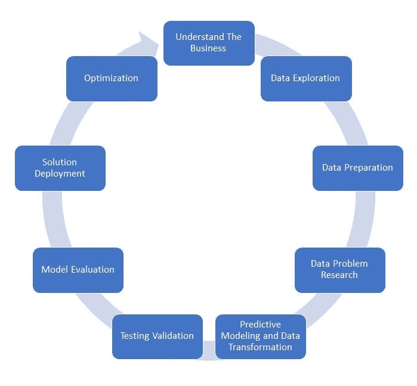

# 数据科学项目生命周期

> 原文：<https://medium.com/analytics-vidhya/data-science-project-life-cycle-7b1ab993cc02?source=collection_archive---------1----------------------->

## 规划您的数据科学项目

在这篇博客中，我们将看到如何规划你的数据科学项目。一个伟大的计划可以节省你的时间和金钱。这个博客不是技术指南，而是一幅全景图，一个开始你的数据科学项目并定义其生命周期的方向。

*作者图片*

1.  了解业务

清楚地定义你的业务，记下你正在解决的问题。对提供数据解决方案是否会为您的客户和公司增加价值进行基本分析。

2.数据探索

你有足够的数据吗？—没有数据就问这个问题，不要浪费时间和金钱做模型，评估—别说了。很多数据科学项目都没有盈利。先收集数据，建立结构化数据收集的长期管道。去进行数字化改造，加入数字化数据采集等。这是一项长期投资。

收集您的数据，并尽全力保护它。自我数据收集是一座金矿，只有你有，别人没有。

3.数据准备

现在你有了你的数据，准备它，清理它，适当地存储它，更新它，并且当它准备好时以一种有意义的方式安排它。

4.数据问题研究

定义你的数据问题，看看是否有现成的解决方案，由服务提供商提供，如 Google Cloud、AWS 或 Azure，或任何其他 API 服务。尽量不要通过构建一些通用模型，如推荐系统、ocr 等，来重新发明轮子。这些现在可以以即插即用的方式获得，并且非常便宜，比你开发一个半精确模型所花费的时间、精力、金钱和计算能力更便宜。

5.预测建模和数据转换

现在快速拿出简单的模型。注意，并非所有解决方案都需要机器学习或深度学习。基于规则的模型同样适用，有时甚至更好。基于您选择的模型转换数据。在第一次迭代中，尝试所有的简单模型并决定一个基准。

6.测试验证

根据您的业务问题定义一个评估指标，并在这个指标中测试您的简单模型。这一标准将成为我们前进的基准。

7.模型评估

根据您的验证，从第 6 步开始重新构建您的模型，并重新计算评估指标，看看您是否能比基准做得更好。一个简单的模型可能会解决你的问题，但这种情况很少见。

从第 5 步和第 6 步中你会得到的另一个洞见是你的数据是否足够。那么你可能需要在第二步和第三步上花更多的时间。

8.解决方案部署

既然您对评估感到满意，并且这个模型解决了您的问题，那么就根据您的用例部署这个模型。消费模型的最佳方式是围绕它构建一个 API，并将其集成到解决方案中。

如果可能，使用 Docker 部署您的模型。停靠将有助于轻松部署。围绕您的模型开发一个 API 将有助于您在不停机的情况下升级。

部署主要取决于您希望如何使用模型。

9.最佳化

优化是最后一步，也可能是最关键的一步，当你收集更多数据时，你应该升级你的模型，看看它是否能恰当地解决你的目的。它解决了第一步的业务问题了吗？如果不是！重新开始。

我希望这些步骤能为您提供一个坚实的框架，帮助您完成并简化您的数据科学项目。