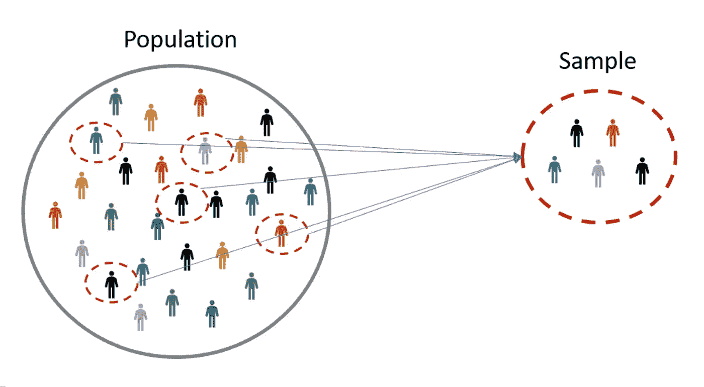
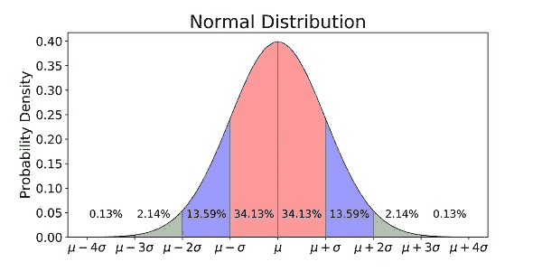
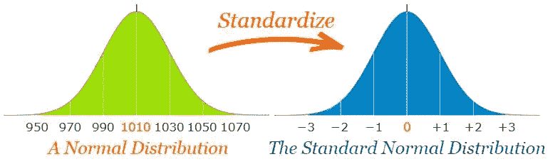
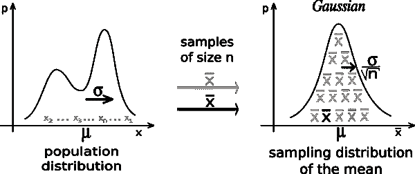
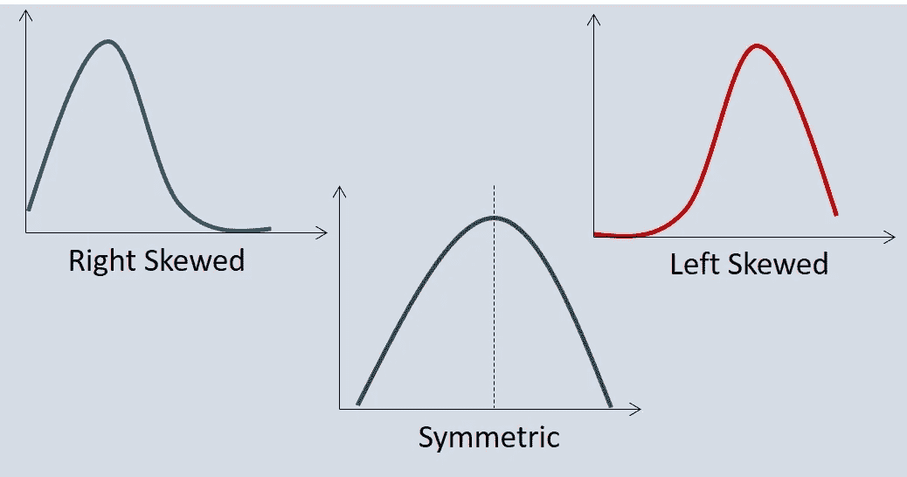
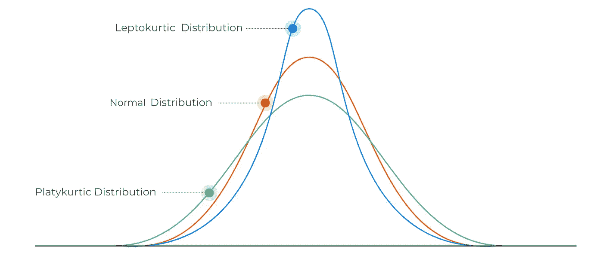
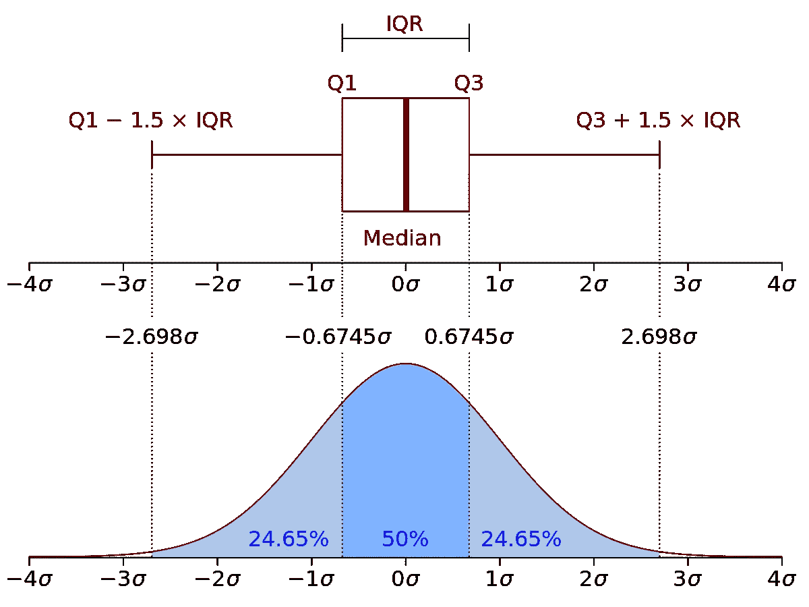

# 数据科学:统计基础

> 原文：<https://medium.com/analytics-vidhya/data-science-statistical-basics-b32a5e842325?source=collection_archive---------7----------------------->

> 按照维基百科的说法:“*数据科学是一个“统一* [*统计*](https://en.wikipedia.org/wiki/Statistics)*[*数据分析*](https://en.wikipedia.org/wiki/Data_analysis)*[*信息学*](https://en.wikipedia.org/wiki/Informatics) *及其相关方法”的概念，以便用数据“理解和分析实际现象”。***

****

**资料来源:pexels.com**

**如果你听说过数据科学，我相信你已经知道统计学是这个美丽领域的重要基础。因此我决定写这篇博客来展示一系列基本概念。**

**我的数学家头脑让我以一种结构化的方式思考，我希望我的博客遵循类似的模式，在这种模式下，你可以找到大量的图像、例子，并且理解概念，而不必阅读太多的文字。也就是说，让我们开始…**

****指数**:**

1.  ****人口和样本****

****2。平均值、中值、众数和范围****

****3。分配****

*   ***正态分布***
*   ***标准化正态分布***

****4。中心极限定理****

****5。可变性测量****

*   ***差异***
*   ***标准偏差***
*   ***协方差***
*   ***相关系数***

****6。异常值测量****

*   ***偏斜度***
*   ***峰度***
*   ***IQR 方法***

# ****人口和样本****

**一个**群体**是你想要得出结论的整个群体。而**样本**是您将从中收集数据的特定组。它是人口的一个子集。**

****

**资料来源:Omniconvert.com**

# **平均值、中值、众数和范围**

**它们表示集中趋势的度量。它们以不同的方式告诉我们数据集中的什么值是典型的或代表数据集的。**

****平均值**与数据集的**平均值相同。****

****中位数**是数据集的**中心数**。**

****模式**是数据集中出现频率最高的**数字**。**

****范围**是最低值和最高值之间的**差值。****

***举例:7，3，4，1，7，6***

*   ***均值:(7+3+4+1+7+6)/6 → 4.66***
*   ***中位数:1，3，4，6，7，7 → (4+6)/2=5***
*   ***模式:7，3，4，1，7，6 → 7***
*   ***范围:7–1→6***

> ****发行****

# **正态/高斯分布**

**它是真实随机变量的一种**连续概率分布**。**

**可以只用两个参数来描述，**表示**和**标准差**。**

****

**来源:迈克尔·加拉尔尼克**

****属性**:**

*   **平均值、众数和中位数都是相等的。**
*   **曲线在中心对称(即围绕平均值)。**
*   **正好一半的值在中心的左边，正好一半的值在右边。**
*   **曲线下的总面积为 1。**
*   **偏斜度和峰度。**

****在机器学习中的应用:****

*   **满足正态分布的数据有利于建模。它让数学变得更容易。**
*   **使用正态分布的算法:逻辑回归、线性回归等。，是根据正态分布的假设显式计算的。因此，我们需要在应用一些机器学习算法之前将数据标准化。**

****为什么它很重要？****

*   ****在自然现象中发现的**:是统计学中最重要的概率分布，因为它符合许多自然现象，如年龄、身高、考试分数、智商分数、两次掷骰子的总和等等。**
*   **数学原因:**中心极限定理**。**
*   ****数学中的简单性**。也就是说，它的均值、中值和众数都是相同的。整个分布可以仅使用两个参数来指定:平均值和标准偏差。**
*   **与许多其他在变换时改变其性质的分布不同，**高斯倾向于保持为高斯**(两个高斯的乘积是高斯，高斯与另一个高斯的卷积是高斯)。**

***现实生活中的正态分布:***

*   *****高度*** *。特定人群中的大多数人都是中等身高。比平均身高人高和矮的人数几乎相等，极少数人要么极高，要么极矮。***
*   *****掷骰子*** *。在一个实验中，人们发现当骰子滚动 100 次时，得到“1”的变化是 15–18 %,如果我们滚动骰子 1000 次，得到“1”的变化也是一样的。***
*   *****智商*** *。人口中大多数人的智商在正常范围内，而其余人的智商在偏离范围内。***
*   *****技术面股市*** *。外汇汇率、价格指数和股票价格回报的对数值的变化通常形成一条钟形曲线。对于股票回报，标准差通常被称为波动性。如果回报是正态分布的，则超过 99%的回报预计会落在平均值的偏差范围内。***
*   ***还有很多(鞋码，生日体重，经济中的收入分配等。)***

# **标准正态分布**

**标准正态分布是正态分布的特殊情况，其中**平均值为 0** ，而**标准差为 1** 。这个过程叫做**标准化**。**

**正态分布可以取任何值作为其平均值和标准差。在标准正态分布中，**均值和标准差总是固定的**。**

**每个正态分布都可以通过将单个数值转化为*z*-分数来转化为标准正态分布。**

**N(μ，σ) →标准法线 Z∞N(0，1)**

****

**资料来源:mathisfun.com**

**经验法则:68/95/99.7**

*   **68%的观察值在平均值±标准偏差范围内。**
*   **95%的观察值在平均值的±2 标准偏差范围内。**
*   **99.7%的观察值在平均值的±3 标准偏差范围内。**
*   **±3 stedv 之外的值占观察值的不到 0.3%，并且根据情况，可以被认为是异常值或信号噪声。**

**我们将正态分布转换为标准正态分布有几个原因:**

*   **求分布中高于或低于给定值的观察值的概率。**
*   **找出样本均值与已知总体均值显著不同的概率。**
*   **比较具有不同平均值和标准差的不同分布的分数。**

# **中心极限定理**

**上下文介绍:“*假设我们要研究中国整个人口的平均年龄。由于中国的人口非常多，获得每个人的年龄数据将是一项繁琐的工作，并且将花费大量的时间进行调查。因此，我们可以从中国不同地区收集样本，并尝试做出推断，而不是那样做。* ***为了处理样本，我们需要一种近似理论，它可以简化计算整个人口平均年龄的过程。这里* ***中心极限定理*** *进入画面。”*****

****定义**:从任意分布中抽取一批数据，取每批数据的平均值。那么平均值的分布将类似于高斯分布— *无论人口分布的形状如何。***

****

**来源:维基百科**

> ****可变性测量****

# **方差(**σT5)****

****定义**:平均值的方差的平均值。**

**缺点:它以更大的单位表示(例如平方米)**

# **标准差(***【σ】)*****

****定义**:衡量数字分布的程度。这表示数据集偏离样本平均值的程度。**

**优势:以与原始值相同的单位表示(例如，米)**

# **协方差**

****定义**:测量两个变量之间的**方向关系。****

**在独立变量的情况下，协方差为零，因为变量不一定一起移动。**

**缺点:**

*   **范围: **-∞和+∞****
*   **受到尺度变化的影响。**

# **相关系数**

****定义**:测量两个变量之间关系的**强度。它是协方差的归一化度量。****

**独立运动对总相关性没有贡献。完全独立的变量之间的相关性为零。**

**优势:**

*   **范围:-1 到+1**
*   **不受缩放的影响。**

> ****异常值度量****

# ****偏斜度****

**偏斜度是衡量随机变量的概率分布偏离正态分布的程度。这对于异常值检查是有用的。它**测量数据分布中的对称性缺失**。**

**有两种类型的偏斜度:**

*   ****正偏斜度**。分布右侧的尾部更长或更胖。**模式<中值<表示**。**
*   ****负偏度**。分布左侧的尾部更长或更胖。**表示<中值<模式**。**

****

**图片:Sigmamagic.com**

**为什么重要？**

**尾部区域可以作为统计模型的异常值，我们知道异常值会对模型的性能产生不利影响，尤其是基于回归的模型。因此有必要将偏斜的数据转换成足够接近高斯分布。**

# **峭度**

**峰度是一种统计度量，它定义了分布的尾部与正态分布的尾部的差异程度。换句话说，它识别在给定的分布中尾部是否包含极值。**

**峰度有三种类型:**

*   ****正常峰度。正态分布的峰度为 3。****
*   ****高峰值(> 3)。**分布越长，尾部越肥。表示数据有异常值。如果有一个高峰值，那么，我们需要调查为什么我们有这么多的离群值。**
*   ****低峰度(< 3)。**分布比正态分布更短，尾部更细。是数据缺乏异常值的指标。如果我们得到低峰度(好得难以置信)，那么我们也需要调查和修剪不需要的结果的数据集。**

****

**资料来源:Analystprep.com**

# **IQR 方法**

****四分位距是 Q3 和 Q1 的差值。****

**属性:**

*   ****中值是数据的中心点**，也称为第二个四分位数(数据是有序的)。**
*   **Q1 是数据的第一个四分位数，也就是说 **25%的数据位于最小值和 Q1** 之间。**
*   **Q4 是数据的第三个四分位数，也就是说 **75%的数据位于最小值和 Q** 3 之间。**

****

**来源:维基百科**

**为了使用这种方法检测异常值，我们定义了一个新的范围，位于该范围之外的任何数据点都被视为异常值并进行相应的处理。范围如下所示:**

*   ****下限** : Q1 = -1.5 * IQR**
*   ****上限** : Q3 = 1.5*IQR**

****为什么是“1.5”？****

**其余 0.28%的数据位于平均值(μ)的三个标准决策( **> 3σ)** 之外。这部分数据被认为是异常值。第一和第三个四分位数 *Q1* 和 *Q3* 分别位于均值的 **-0.675σ** 和 **+0.675σ** 。**为了得到精确的 3σ，我们需要采用*标度****=*= 1.7，但是 1.5 比 1.7 更“对称”，我们总是更倾向于对称。**

# **感谢您读到这里！**

**我希望您发现这很有见地，并对您的数据科学事业有所帮助:)如果您喜欢这些内容，请务必关注我的 Medium。一如既往，我祝你学习一切顺利！**

**纳西斯·特奥多罗尤**

*   **你觉得这篇文章有趣吗？跟我上 [***中***](/@narcis.teodoroiu) ***。*****
*   *****如果你对人脉感兴趣，那就上***[***LinkedIn***](https://www.linkedin.com/narcis-gabriel-teodoroiu/)***连线吧。*****