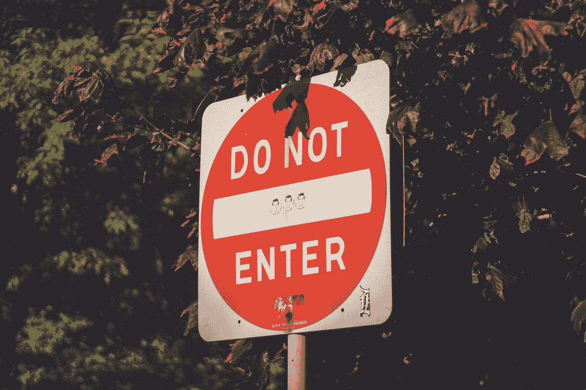
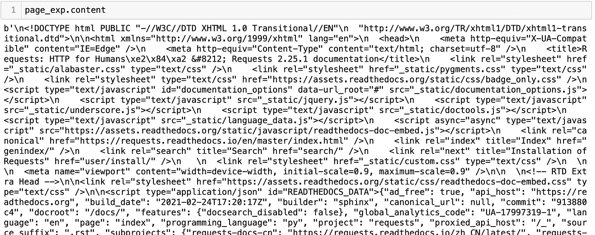

# 法律中的数据科学家:网络抓取合法吗？

> 原文：<https://medium.com/analytics-vidhya/data-scientist-in-law-is-web-scraping-legal-8434c7c4315d?source=collection_archive---------8----------------------->

我们的世界充满了用于研究的信息和数据。对于数据科学家来说，每项知识都有助于他们的项目。我们可以从互联网上下载大量数据，或者收集我们的数据集。通常，公司提供 CSV 格式的数据集或通过[应用编程接口](https://en.wikipedia.org/wiki/Application_programming_interface) (API)提供访问。但有时，我们需要来自网页的数据，却没有方便的下载选项。我们如何收集它们？



[马克·罗汉](https://unsplash.com/@wackomac007?utm_source=medium&utm_medium=referral)在 [Unsplash](https://unsplash.com?utm_source=medium&utm_medium=referral) 上的照片

## 什么是网页抓取？

> 网络抓取是一种使用软件或脚本从网站自动提取数据的技术。

网页抓取将数据结构化为更方便的格式，这需要你的工作。我们知道，每次网站访问都是对网络服务器的请求。我们的浏览器发送查看信息的请求，web 服务器发回文件，告诉浏览器如何为我们呈现页面。
它的定义非常简化。幕后发生了很多事情。但是我们只需要网页的主要内容。通常，这些信息集中在 HTML 文件中，web 抓取从其中提取数据。

> 在这里你可以找到关于超文本标记语言的主要信息

***进入网页抓取的简单步骤:***

1.  导入库，有助于下载整个页面。在 Python 中，这个库被称为[请求](https://requests.readthedocs.io/en/master/index.html)。

```
**import** requests
```

2.获取此页面并将其保存到变量中。所有浏览器都向 web 服务器发送一个`GET`请求来获取网页，请求库使用相同的命令。

```
page = requests.get("***<add link to site for web scraping>***")
```

现在你已经有了网页的所有 HTML 内容，并且可以打印出来了:

```
page.content
```



我们如何能看到这是许多不必要的信息。要求给我们一个完整的网页描述与所有的 HTML 标签。

3.正在解析页面。更好的方法是使用 [BeatifulSoup](https://www.crummy.com/software/BeautifulSoup/) 库。

```
**from** bs4 **import** BeautifulSoup
```

这个库允许我们一次一级地浏览 HTML 结构。

```
***#c******reate an instance of the*** ***BeautifulSoup*** ***class to parse our document***
soup = BeautifulSoup(page.content, 'html.parser')
```

## 网络抓取合法吗？

这个问题的答案没那么简单。*没有人能说是或不是，如今，我们看到的是一个复杂且不断发展的法律领域。如果我们创建一个频谱，并把一方良性网页抓取和另一方网页抓取吸引麻烦。然后我们在中间的某个地方找出所有的网络抓取。*

****为什么会这样？****

*   *通常，网站不会提供关于如何使用网页信息的明确指导。在刮之前，我们应该检查条款和条件页。有时候他们提供刮擦规则，我们要遵守。*
*   *Web 抓取会消耗主机网站的服务器资源。这意味着它会耗费企业的时间和金钱。为潜在客户打开网站所浪费的时间会给公司带来收入损失。这给了他们与网络抓取斗争的理由。*
*   *刮的原因:科研或商业原因。我们在 2019 年底有过先例，当时美国上诉法院驳回了 LinkedIn 阻止一家分析公司收集其数据的请求。但这仍是一起涉及公共信息的案件。*
*   *仅在登录名下可用的信息可以具有成本和具有版权的原始所有者。例如，脸书规则禁止登录的网络爬虫下载用户数据。*
*   *所有国家和州都有不同的互联网法律。那么，你在加利福尼亚还是佛罗里达的什么地方？或者俄罗斯？*

*我们可以看到，当你使用网络抓取时，细节很重要。*

> *合法抓取网页的规则:细节很重要。*

*   ***不要过于频繁地抓取同一个网站或网页(你可以根据信息更新创建一个时间表)；***
*   ***不要在每次运行代码时都抓取相同的内容(可以对数据使用缓存)；***
*   ***不要在太短的时间内用太多的请求让服务器不堪重负(你可以使用一个特殊的函数暂停你的代码一会儿)。***

# ***摘要***

****网页抓取总是不好吗？*让我们记住搜索引擎索引网页内容或各种商店的价格比较服务，以节省您的资金。他们都使用网络搜集，给我们提示和建议。对我来说，就像一个数据科学家，网络抓取有助于为项目收集数据。例如，政府网站为公众提供数据，这些数据通常可以通过 API 获得。但是有些工作的规模出乎意料的大，你不能手工完成。网页抓取来帮助这里！***