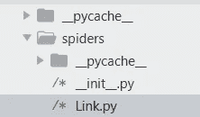
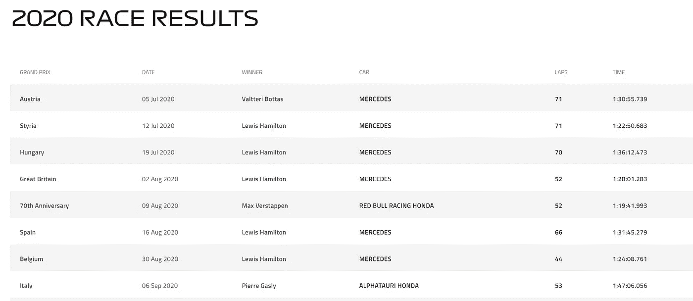
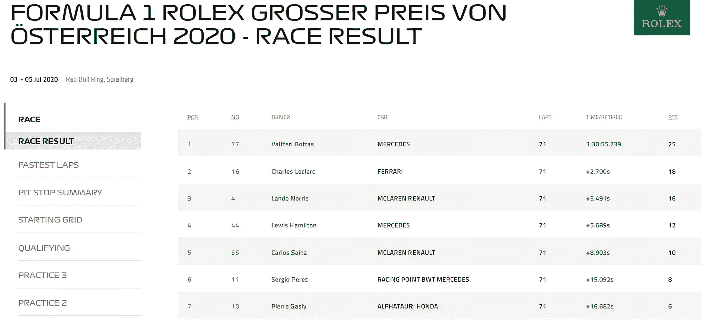
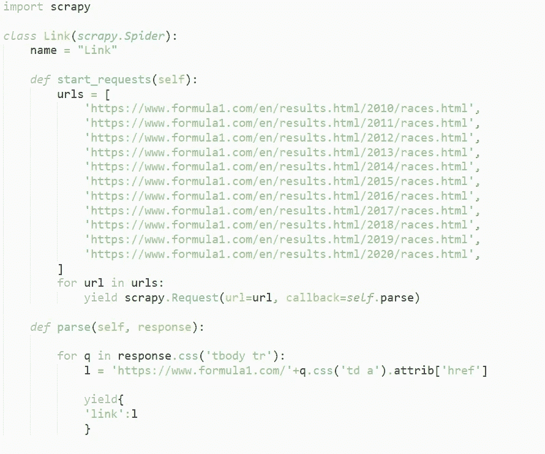
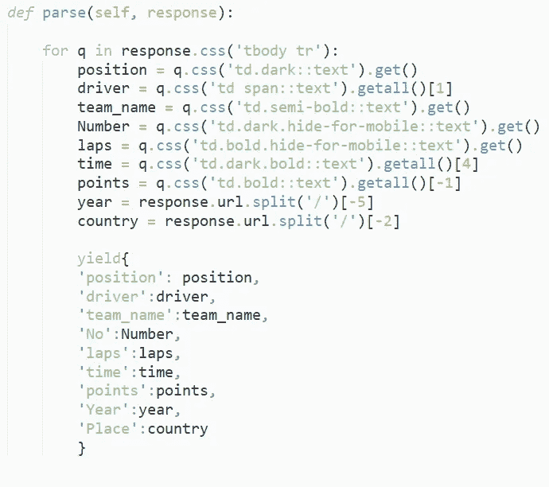

# 使用 Scrapy 进行数据收集

> 原文：<https://medium.com/analytics-vidhya/data-scraping-ae8f94a592d7?source=collection_archive---------10----------------------->

今天我要讨论一个非常有趣的话题。

使用 Scrapy 进行数据抓取。

因此，我们的任务是删除 2010 年至 2020 年间 F1 比赛的相关数据。

你可以看一下网站-

*所以首先，我们需要在你的系统中安装 Scrapy。*

*使用*

*>> !pip 安装 Scrapy 来安装它，一旦你安装了它，你可以进一步移动。*

*现在你必须开始这个项目，命令是-*

*> > scrapy startproject<name_of_the_project></name_of_the_project>*

**

*在目录中导航，并在 spiders 目录中创建新文件。*

*Ex- Link.py*

*一旦你有了你的文件，你就可以开始写代码了。*

*但是，但是在此之前，让我们看一下我们将要废弃的数据。请注意，这是一个重要的步骤，需要非常小心地执行。*

*所以，*

**

*这样的东西会出现在你面前。你可以观察到我们每年都有一些比赛，如果你点击任何特定的比赛，你会看到类似这样的结果。*

**

*注意-我们需要 2010-2020 年期间每场比赛的数据。*

*现在我们的第一个任务是提取每场比赛的链接，为此我们需要废弃每场比赛的链接的第一页。*

**

*这几行代码将帮助您提取 2010 年至 2020 年间发生的每场比赛的链接。*

*让我先向您介绍一下代码。*

*首先你必须导入 Scrapy 并给类和变量命名。注意从命令行运行代码时将使用该名称。*

*现在你有了一组 url，由于网站的限制，我手动抓取了这些 URL。*

*所以在提取 10 个链接后，我把它们放在我的 URL 中。此后，我开始了一个循环，一次删除一页。*

*我们定义了一个函数 parse 来帮助我们提取数据，因此通过使用选择器，我们提取了 2010 年至 2020 年之间发生的每个比赛页面的链接。*

*现在，在代码之后，您需要执行这个命令来抓取链接。*

*> > scrapy 爬网链接-o links.json*

*这个命令将抓取您的数据并保存在 json formate 中。*

*有了所有的链接之后，现在是提取实际数据的时候了。*

**

*剩余的代码将和以前一样，但你必须添加所有的爬行链接。*

*现在再次使用选择器，您可以选择您想要抓取的特定数据，并将数据保存在您的机器中。*

*>>刺儿头爬行 <name>-o <name_1>。json</name_1></name>*

*这将抓取我们的目标数据。*

*注意—*

1.  *在抓取之前，你必须对 HTML 和 css 有一点了解，因为这将有助于你使用选择器。*
2.  *>>刺儿壳<link>*

*这个命令是一个救命符，因为它帮助您使用选择器，并且将帮助您只提取相关的数据。*

*雅皮士，你已经抓取并保存了你想要的数据。*

*所以，在这篇文章中，我用 Scrapy 带你浏览了网络爬行。*

*如果你没有得到这个，请不要感到沮丧，你需要先在一个简单的网站上试试你的手，然后再回来你会得到它。在这个例子中，我们首先抓取链接，然后抓取那些页面上的数据。*

*我试图在一篇精确而简短的文章中解释网络爬行，如果你有进一步的疑问，你可以参考 Scrapy 的文档。*

*谢谢你读出来，如果你喜欢这个帖子，你可以激励我一些👏。*

*文档链接-[https://docs.scrapy.org/en/latest/](https://docs.scrapy.org/en/latest/)*