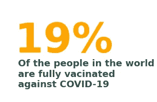

# 数据讲故事，帮助您进行分析

> 原文：<https://medium.com/analytics-vidhya/data-storytelling-to-help-in-your-analysis-2da96811d91?source=collection_archive---------0----------------------->

在这篇文章中，我想展示一下《用数据讲故事》这本书如何帮助我构建图表，以便将复杂的数据集转化为文本、数字和图形。

你有两个图形在下面展示这本书如何让我跳出思维定势。第一个是我在阅读之前做的图形，第二个是在阅读之后做的。


图 1。截至 2021 年 3 月，新冠肺炎死亡人数最多的五个国家。作者塑造的形象


图 2。截至 2021 年 12 月 8 日，新冠肺炎死亡人数最多的五个国家。作者塑造的形象。

这本书的理念带来了如何传递数据集中的信息更直接和毫不费力地给观众，干净和清晰的图表。

书中有一节解释了**视知觉的格式塔原理**，它们是:

*   **邻近度**
*   **近似值**
*   **相似度**
*   **连续性**
*   **关闭**
*   **连接**

将这些概念应用到图表中，将有助于观众更有效地理解信息并专注于所展示的内容。

**用数据讲故事**也让我们想到了如何将数据表达到不同的图表中，比如下图中的折线图，我在其中比较了新冠肺炎新增病例数对巴西和世界的影响:


图 3。折线图。作者塑造的形象。

另一个非常有助于表达数据的概念是使用数字和文本来传递信息，而不是使用图表，如下图所示:



图 4。数字作为传递数据的方式。作者制作。

所以我们可以看到，这本书回报了所做的投资，这本书带给我的其中一个想法就是把数字和图表混合在一起。
如图 5 所示，想法是表达 2021 年 12 月 8 日前接种疫苗的总人数，接下来是显示每个月全部接种疫苗的人的发展情况。


图 5。仪表板上显示的是截至 12 月 8 日的全部接种人数和该月的全部接种人数。作者制作。

现在是时候解释数据集并制作一些图表了。我使用的数据集来自[我们的数据世界](https://github.com/owid/covid-19-data)的 GitHub 页面，在那里你可以找到关于数据集中存在的所有变量(列)的解释。现在有了明确的答案，让我们来看看我做的关于 2021 年 12 月 8 日之前全球新冠肺炎局势的项目。

在展示构建图 5 中的图形的脚本之前，我们首先必须调用库来帮助提取、加载和转换数据，然后，探索数据集对我们来说是什么。

```
*# Calling the libraries*
**import** pandas **as** pd
**import** matplotlib.pyplot **as** plt
**import** seaborn **as** sns

*# configuring the graphics*
**%**matplotlib inline
sns**.**set_style()*# DataFrame until 08/12/2021*
PATH **=** "https://raw.githubusercontent.com/owid/covid-19-data/master/public/data/owid-covid-data.csv"
df_w **=** pd**.**read_csv(PATH)
df_w **=** df_w[df_w**.**date **<=** '2021-12-08']
*# The first five data*
df_w**.**head()
```

之后，我看到了数据框和我拥有的数据类型，并做出了必要的更改。然后，在项目的下一步，我首先建立了一个初步的分析，例如建立了关于新冠肺炎新病例数和总死亡数最高值的国家的平滑移动平均图表和条形图，这些都是数据集提供的。

现在，要构建如图 5 所示的图表，我需要首先理解可变大陆，比如我在该列中拥有的大陆，为此，我以这种方式开始脚本:

```
*# What are the entries in the continent column*
df_w['continent']**.**unique()
```

结果是:

```
array(['Asia', nan, 'Europe', 'Africa', 'North America', 'South America',
       'Oceania'], dtype=object)
```

之后，我必须导入库 **DateTime** 来构建一个列 month，在该列中，我只有列日期的月份。

```
*# import the library datetime*
**import** datetime **as** dt
*#get a month from the column date and put this into the dataframe*
df_w['month'] **=** df_w['date']**.**dt**.**month
```

完成这两个步骤后，我只需要获得每个大洲完全接种疫苗人数的数据。为此，我使用了函数 groupby()。

```
*# Total number of people who received full vaccinated for each continent*

df_w**.**groupby(['continent'])**.**people_fully_vaccinated**.**sum()**.**sort_values(ascending **=** **False**)
```

结果是:

```
continent
Asia             1.043767e+11
Europe           6.021483e+10
North America    5.600873e+10
South America    2.705435e+10
Africa           4.168491e+09
Oceania          2.053342e+09
Name: people_fully_vaccinated, dtype: float64
```

通过数据提取、转换和加载，现在我只需要将我在《用数据讲故事的 T2》一书中学到的所有概念应用到 Matplotlibrary 中:

```
*# Dashboard for the number of people fully vaccinated for each continent*
sns**.**set_style('ticks')
fig, (ax, ax1) **=** plt**.**subplots(nrows **=** 1, ncols **=**2, figsize**=**(18,6))

*# Remove the horizontal gap between the subplots*
plt**.**subplots_adjust(wspace**=** **-**.50)

*# Text figure*
ax**.**text(0.0,0.900, s **=** 'South America', size **=** 30,color **=** 'DarkSlateGray',weight **=**'bold')
ax**.**text(0.0, 0.40, s **=**'26 billions',size **=** 65, color **=** 'DarkOrange', fontweight **=** 'bold')
ax**.**text(0.0,0.250, s **=** ' of people fully vaccinated until December \n 8th of 2021', size **=** 18,color **=** 'DarkSlateGray', weight **=** 'bold')

sns**.**despine(left **=** **True**, bottom **=** **True**)
ax**.**xaxis**.**set_visible(**False**)
ax**.**yaxis**.**set_visible(**False**)

*# The variable pf_v will be  the values for the data at the bar plot*
pf_v **=** (df_w**.**loc[(df_w**.**continent **==** 'South America') **&** df_w**.**continent**.**notnull()]**.**sort_values(by **=**'people_fully_vaccinated', ascending **=** **False**))**.**copy()

*# the barplot*
pf_plot **=** sns**.**barplot(x **=** 'month', y **=** 'people_fully_vaccinated', data **=** pf_v, ax **=** ax1, color **=** 'DarkOrange', ci **=** **None**)

*#ax1.set_title("Total people vaccinated in South America in 2021 \n", loc = 'left', size = 20, color = 'DarkSlateGray')* 
ax1**.**set_xlabel([], color**=**'white')
ax1**.**set_ylabel([], color**=**'white')
ax1**.**set_xticklabels(["Jan","Feb","Mar","Apr","May","Jun","Jul", "Aug","Sep",'Oct',"Nov",'Dec'],{'fontweight':'bold','fontsize': 12})
ax1**.**set_yticklabels([],color **=** 'white')
sns**.**despine(left**=True**, bottom**=True**)

plt**.**tight_layout()
```


图 6。仪表板到南美。由作者制作

因此，我使用了一些步骤和代码来将我的数据转换成一些图形中的 CSV 文件，以便直接传递信息。

你必须点击这个[链接](https://github.com/heitor-eng/H_Data_Science/blob/master/Data_Science_Projeto_2_Covid19_.ipynb)才能看到整个项目以及我用这个数据集对这个主题所做的所有分析。如果你想看我到目前为止完成的其他项目，你可以访问我的 [GitHub 个人资料](https://github.com/heitor-eng/Heitor_Profile)页面，如果有任何反馈，你可以在我的 [LinkedIn](https://www.linkedin.com/in/heitor-campos-02770734/) 页面上联系我。