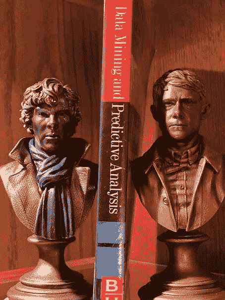
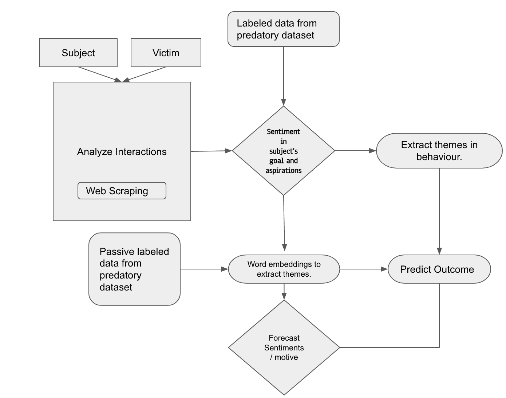
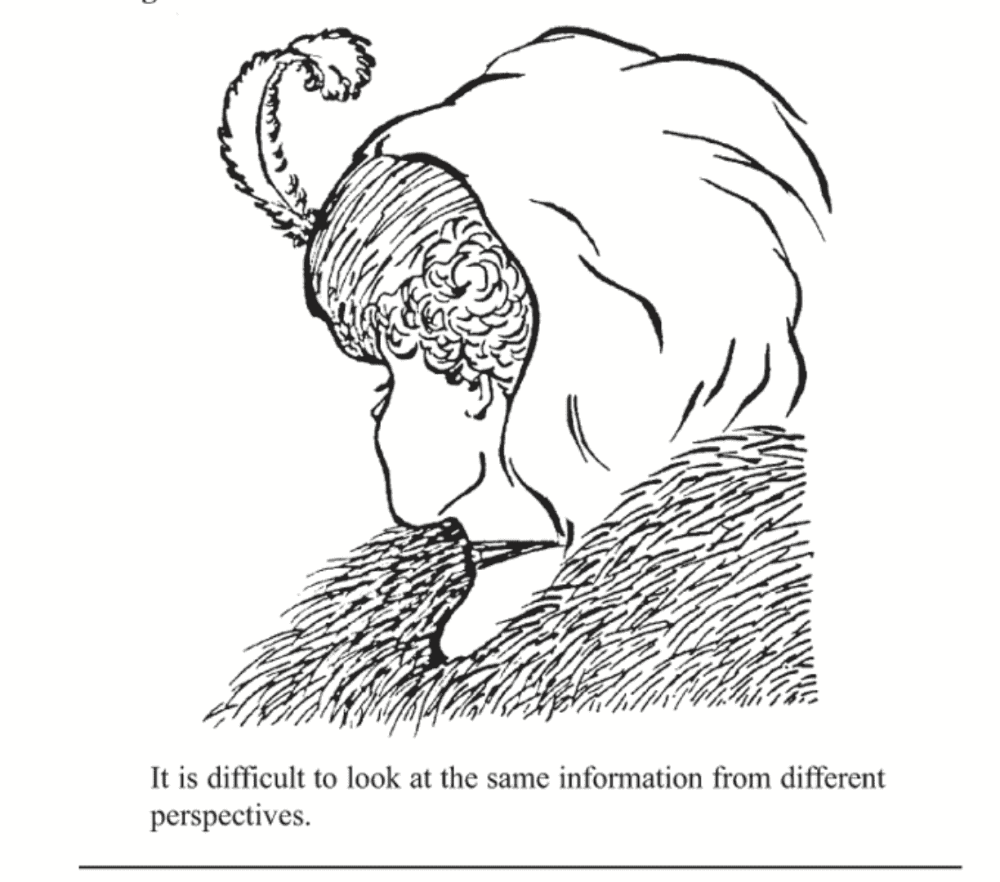

# 数据到预测

> 原文：<https://medium.com/analytics-vidhya/data-to-predictions-99c97a07e30f?source=collection_archive---------21----------------------->

> 有什么条件？

夏洛克解锁

“我没想到会有这一天，”从来没有数据科学家这样说过。不是因为数据包含了每个问题的答案。而是因为他们对数据可能带来的任何发现都做好了准备。随着以数据为中心的文明的到来，数据分析成为每个人必备的新工具。许多组织认为数据分析可以为他们创造奇迹。所以现在的问题是:*这准确吗？数据能回答任何问题吗？*在本文中，我们将了解一种利用数据技术来预防犯罪的方法。

历史上有过数据可以用来预测即将发生的事件的例子。从战争到饥荒，到日蚀，一切都触手可及，只要你看得够近。美国历史上最具创伤性的事件之一是偷袭珍珠港。这是快速和突然的，那些被卷入“托拉托拉托拉”的人无法想象美国会受到攻击。以至于在袭击期间，大多数士兵都认为这是一次空军演习。但是很突然吗？答案是*否*。珍珠港事件后所做的调查显示，夏威夷群岛上的一系列事件都是朝着这个方向发展的。这次袭击的幕后策划者，日本将军山本，长期以来一直在研究美国海军的演习，海上巡逻和港口的舰船计划。他们利用对过去行为和模式的了解来预测 1941 年 12 月 7 日*的早晨*一个安静的星期天将是罢工的最佳时间。他们预测，整个基地将会放松警惕，他们的飞机停在那里，步枪排成一列以防万一。他们是对的，他们的攻击是现代史上最成功的攻击之一。得到的教训是，模式揭示了很多。过去的数据有助于确定未来的情况，有一个置信区间。

在当前的世界形势下，世界大战似乎是一个遥远的可能性，各国都在努力与他们的人口混战。它可能是任何事情，从计划推翻政府，或人口贩运，或只是随机的精神病患者计划他们的下一个激进的举动。现在的问题是，这样的行为能被提前发现吗？简单的答案是*是的*，更复杂的答案是*差不多*。最近在 [Cosmo 杂志](https://www.cosmopolitan.com/politics/a28483247/is-it-possible-to-stop-a-mass-shooting-before-it-happens/)上发表的一篇文章谈到了一位精英调查员，他研究并发现一个非理性的仇恨评论何时会演变成暴力事件。她收集了以某种形式表现出暴力行为的互联网用户的数据。对这些数据进行模式分析，以预测哪个人只是在吹牛，哪个人在积极策划大规模屠杀。她感知差异的能力是无与伦比的。但是为了保证自己的安全，她不得不在电脑上工作，这使得工作变得异常艰难。她面临的一个问题是有很多东西需要筛选。因此，除了互联网数据，她还利用自己的直觉和摄影记忆。她报告说，她竭尽全力想要掌控一切。

但她再也不需要了。我们所说的照相式记忆和寻找模式是可以通过机器学习来实现的。可以设计一个框架来模仿代理的剖析行为。

*上述架构考虑到了受试者和受害者之间的互动。它使用从调查机构收集的标记数据，描述受试者和受害者之间的可疑关系。然后，该标记的数据被用于将公共对话信道分类和识别为恶性或良性。*

这显然会带来自身的风险。首先是因为很难模仿人类的智力。其次，如果数据被有意打乱，以表达我们想听的话，那就很难破译。解决方案可以是使用主动和被动标记的数据集来从目标网站提取相似的单词嵌入。

为了构建这个框架，人们可能不总是需要新数据。只有对现有数据进行充分的研究，才能达到预期的结果。正如前联邦调查局局长鲍勃·穆勒所说，“当你有部分事实时，分析师和特工总是试图解释这些事实的含义，并从中推断，而不是收集更多的事实”。

在情报分析涉及的所有不同方面中，与数据分析联系最紧密的是感知。感知是我们解释周围世界的屏幕或镜头。为了说明，这里有一张图片。它显示了一个年轻的和一个老女人。一旦我们的大脑能够看到一个，就很难看到另一个。即使我们认可这两种观点，也很难来回走。但这符合人类的自然行为。

这张照片最初发表在 1915 年的《冰球杂志》上，是一幅题为“我的妻子和我的岳母”的漫画

提示:老女人的鼻子、嘴和眼睛分别是年轻女人的下巴、项链和耳朵。

感知受到我们的过去、教育、价值观等的强烈影响。这训练我们的大脑在潜意识里期待我们分析中的某些模式。从今以后，我们通过收集这些模式发展出一种思维模式，使我们倾向于以某种方式思考。虽然这些可能很难改变，但我们在数据分析中遇到的陷阱迫使我们超越我们的思维习惯去思考。从他人的角度看待事物也是一种很好的训练，无论是从技术角度还是社会角度。再次向他学习

*“你所做的每一项情报分析都会有不同的观点。”—罗伯特·穆勒*

包含不同观点的数据分析在问题定义和计划中非常有用。就调查者而言，在设计检测模式的 ML 算法时，既要考虑她的工作风格，又要了解她所监控的用户。就国家安全问题而言，在决定分歧的未来时，必须牢记两国的看法。虽然数据和洗钱可以成为预测犯罪分析的有力工具，但必须记住，权力越大，责任越大。虽然它能防止坏事，但也能防止好事发生。