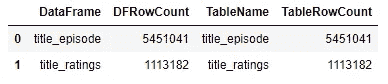

# 使用 Python 的数据传输过程

> 原文：<https://medium.com/analytics-vidhya/data-transfer-process-with-python-999b6cbcd7ea?source=collection_archive---------5----------------------->

在这篇文章中，我们将开发一个使用 URL 链接下载多个文件的过程，在一个循环中解压缩扩展名为“… tsv.gz”的文件，并将数据传输到 SQL 表中。


> 1-让我们从导入库开始。

```
**# Libraries**
import re
from urllib import request
import gzip
import shutil
import requests
import pandas as pd
import pyodbc
import sqlalchemy
import urllib
from multiprocessing.pool import ThreadPool
```

> **2 -我们定义了用 URL 链接下载文件然后解压的函数。gz”文件。**

```
def download_url(url):
    **# Download process**
    print("downloading: ",url)
    file_title = re.split(pattern='/', string=url)[-1]
    urlrtv = request.urlretrieve(url=url, filename=file_title)

 **# for ".tsv" to ".csv"**
    title = re.split(pattern=r'\.tsv', string=file_title)[0] +".csv"

    **# Unzip ".gz" file**
    with gzip.open(file_title, 'rb') as f_in:
        with open(title, 'wb') as f_out:
            shutil.copyfileobj(f_in, f_out)
```

> **3 -首先，我们定义 URL 链接，我们将发送到我们已经创建的函数到一个列表中。**

```
**# URL List**
urls = ["[https://datasets.imdbws.com/title.episode.tsv.gz](https://datasets.imdbws.com/title.episode.tsv.gz)"
        ,"[https://datasets.imdbws.com/title.ratings.tsv.gz](https://datasets.imdbws.com/title.ratings.tsv.gz)"
        #,"[https://datasets.imdbws.com/title.akas.tsv.gz](https://datasets.imdbws.com/title.akas.tsv.gz)"
        #,"[https://datasets.imdbws.com/title.basics.tsv.gz](https://datasets.imdbws.com/title.basics.tsv.gz)"
        #,"[https://datasets.imdbws.com/title.crew.tsv.gz](https://datasets.imdbws.com/title.crew.tsv.gz)"
        #,"[https://datasets.imdbws.com/title.principals.tsv.gz](https://datasets.imdbws.com/title.principals.tsv.gz)"
        #,"[https://datasets.imdbws.com/name.basics.tsv.gz](https://datasets.imdbws.com/name.basics.tsv.gz)"
          ]**# Run 5 multiple threads. Each call will take the next element in urls list**
results = ThreadPool(5).imap_unordered(download_url, urls)
for r in results:
    print(r)
```

> 我们下载了文件，解压后转换成 CSV 格式。下一步是将数据转换成数据框，以便我们可以轻松地处理数据并将其导出到 SQL。

```
**# Read *".csv"* file for Title Ratings**
title_ratings_data = pd.read_csv (‘title.ratings.csv’,sep=’\\t’,engine = ‘python’,na_values=[‘\\N’])**# Data to DataFrame** 
title_ratings = pd.DataFrame(title_ratings_data, columns= ['tconst','averageRating','numVotes'])**# Read *".csv"* file for Title Episode** title_episode_data = pd.read_csv ('title.episode.csv',sep='\\t',engine = 'python',na_values=['\\N'])**# Data to DataFrame** title_episode = pd.DataFrame(title_episode_data, columns= ['tconst','parentTconst','seasonNumber','episodeNumber']
```

> 然后，我们将把数据框中的数据插入到 SQL 表中。在这里，数据写入可以用许多不同的方式来完成。下面的代码块显示了最佳性能。

```
**# Insert DataFrame to SQL Table for Title Ratings**
driver = ‘{ODBC Driver 17 for SQL Server}’
server = ‘(local)’
database = ‘MediumDS’
username = ‘medium’
password = ‘mediumds’
tbl = ‘title_ratings’**# Database connection** params = ‘DRIVER=’+driver + ‘;SERVER=’+server + ‘;PORT=1433;DATABASE=’ + database + ‘;UID=’ + username + ‘;PWD=’ + passwordcnxn = pyodbc.connect(params)
cursor = cnxn.cursor()**# Create SQL Table**
cursor.execute(‘DROP TABLE IF EXISTS dsf.title_ratings; CREATE TABLE dsf.title_ratings (tconst nvarchar(50), averageRating float, numVotes int)’)
cnxn.commit()db_params = urllib.parse.quote_plus(params)
engine = sqlalchemy.create_engine(“mssql+pyodbc:///?odbc_connect={}”.format(db_params))
from sqlalchemy import event**# The code below makes the data load much much faster**
[@event](http://twitter.com/event).listens_for(engine, “before_cursor_execute”)
def receive_before_cursor_execute(
 cnxn, cursor, statement, params, context, executemany
 ):
 if executemany:
 cursor.fast_executemany = True**# Insert Raw Data**
title_ratings.to_sql(tbl, engine, index=False, if_exists=”append”, schema=”dsf”)
```

…

```
**# Insert DataFrame to SQL Table for Title Episode**
tbl = ‘title_episode’cursor.execute(‘DROP TABLE IF EXISTS dsf.title_episode; CREATE TABLE dsf.title_episode (tconst nvarchar(50),parentTconst nvarchar(50),seasonNumber int,episodeNumber int)’)
cnxn.commit()db_params = urllib.parse.quote_plus(params)
engine = sqlalchemy.create_engine(“mssql+pyodbc:///?odbc_connect={}”.format(db_params))
from sqlalchemy import event[@event](http://twitter.com/event).listens_for(engine, “before_cursor_execute”)
def receive_before_cursor_execute(
 cnxn, cursor, statement, params, context, executemany
 ):
 if executemany:
 cursor.fast_executemany = Truetitle_episode.to_sql(tbl, engine, index=False, if_exists=”append”, schema=”dsf”)# Delete DF
# title_episode = title_episode[0:0]
# title_episode_data = title_episode_data[0:0]
```

> **6 -传送过程中可能出现问题，或者传送可能被中断。我们来测试一下。**

```
rowcounts = [["title_episode",len(title_episode)],["title_ratings",len(title_ratings)]]
rowcountsdf = pd.DataFrame(rowcounts,columns=['DataFrame','DFRowCount'])SQL_RowCount = pd.read_sql_query(
                                '''SELECT [Tables].name AS   [TableName],SUM([Partitions].[rows]) AS [TableRowCount]
                                FROM sys.tables AS [Tables]
                                JOIN sys.partitions AS [Partitions] ON [Tables].[object_id] = [Partitions].[object_id]AND [Partitions].index_id IN ( 0, 1 )
                                GROUP BY [Tables].name''', cnxn)
tablesdf = pd.DataFrame(SQL_RowCount,columns=['TableName','TableRowCount'])pd.concat([rowcountsdf, tablesdf], axis=1, join="inner")
```



> **7——而在这篇代表我执念的一面的文章中，我们转移”。gz”和”。csv”文件复制到“备份”文件夹。**

```
import shutiloriginal_csv = r’C:\Users\busra\Documents\Python Scripts\title.ratings.csv’
original_gz = r’C:\Users\busra\Documents\Python Scripts\title.ratings.tsv.gz’
target_csv = r’C:\Users\busra\Documents\Python Scripts\Backups\CSVs\title.ratings.csv’
target_gz = r’C:\Users\busra\Documents\Python Scripts\Backups\Gzs\title.ratings.tsv.gz’shutil.move(original_csv,target_csv)
shutil.move(original_gz,target_gz)
```

仅此而已。

虽然您并不总是需要直接在 Python 上操作整个过程，但是我们已经研究了可以一部分一部分地集成到数据传输或 ETL 过程中的代码块。