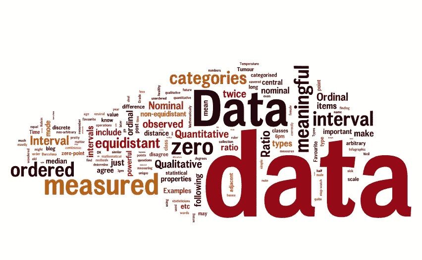

# 机器学习中的数据类型和度量尺度

> 原文：<https://medium.com/analytics-vidhya/data-types-and-measurement-scales-in-machine-learning-b1697b3ba836?source=collection_archive---------2----------------------->

当你开始从事机器学习项目时，最令人困惑的一个方面是如何处理你的数据。正确对待您的要素是绝对重要的，因为它将对您的算法产生重大影响。执行特征工程时要记住的第一件事是，所有算法都期望数字特征，因此我们不能输入任何字符作为特征。

数据可以分类为:

1.  **定性(分类)**
2.  **定量(数值)**

顾名思义，定性或分类数据类型将具有分类/非数值。

**定量可分为离散型或连续型。**

*   **离散**:这将有整数。这意味着，整数值，而不是小数。需要注意的最重要的一点是，这些值不会随时间而改变。
    例如:一个家庭中当前的孩子数量、一天中拨打的电话数量、一个国家的当前人口、一个国家的当前 GDP、一个人在特定时间点的年龄。
*   **连续**:可以取任意数值，有无限可能。要注意的一点是，连续变量的值可以随时间而变化。
    例如:一个人的身高/体重、一辆汽车的里程、一个人在 10 年数据集中的年龄、一个国家在 5 年数据集中的 GDP/人口。

请注意，年龄、人口、GDP 可以是离散的，也可以是连续的，这取决于它们的使用场景。为了处理离散和连续数据类型，我们可以创建容器。

需要注意的是，如果一个要素在整个数据集中只有一个值，那么无论它是定量的还是定性的，我们都会将其删除，因为这样一来，该要素就作为一个常量而不是变量。

**各种测量等级:**

现在，我们已经将数据分类为各种数据类型，让我们来看看可以对每种数据类型进行分类的各种度量级别。

*   名义上的
*   序数
*   间隔
*   比例

**标称:**如果一个变量中的值不遵循任何特定的顺序，我们可以称之为标称。取平均值或中位数在这里是没有意义的。请注意，对名义数据类型的值进行排序没有任何区别。例如，包含颜色、品牌名称、星期几、乐器类型、国家名称等各种值的特性。一次热编码/虚拟变量创建是处理这些特性的最佳方式。

**序数:**如果变量中的值遵循特定的顺序，那么我们可以称之为序数。这意味着与较高的值相比，要素中较低的值具有较小的权重。因此，对有序数据的值进行排序是有意义的。举个例子，

*   等级为 10: 1 为最低，10 为最高
*   年龄分类:< 30 years, 30–45 years, 45- 60 years, > 60 岁
*   社会经济分类:低收入者、中等收入者和高收入者
*   购买力:低、一般、中等、高、非常高
*   基于产品退货行为的客户类型:最低退货者、低退货者、正常退货者、高退货者

为了将这些特征转换成数字，可以使用整数编码/标签编码。这里，每个值将被分配一个整数标签，例如低=0，平均=1，中等=2，高=3，非常高=4。需要注意的是，如果序号要素已经在数据集中进行了标注编码，我们不应为其创建虚拟变量，因为这将破坏要素中维护的顺序。

**区间:**

在区间类型中，0 没有真正的意义。以温度为例，0 不代表没有温度。相反，它是一个有效值。区间数据的一个典型例子是温度。区间标度中每个值之间的区间都有意义，并且将相等。请注意，计算百分比、区间值的乘法或除法没有任何意义。但是我们可以加减数值。间隔数据类型的其他几个例子是以纬度/经度表示的地理坐标、以 12 小时制表示的时间、以摄氏度或华氏度表示的温度。在区间数据中，我们不能比较一个比率中的两个值。例如，我们不能说 10 点是 5 点的两倍。这毫无意义。

**比率:**如果 0 有真正的意义，那么我们可以称之为比率数据类型。例如，在长度或收入的情况下，值 0 意味着没有长度或没有收入。它们是类型比。我们可以做加法，减法，乘法，除法，百分比计算，计算平均值/中位数。几个例子是:一个人的收入，一个物体的重量/高度/长度，一个班级的学生人数，一个人拥有的汽车数量。请注意，用比率表示比率类型数据将有意义。例如，我们可以比较一个体重 50 公斤的人和一个体重 100 公斤的人，并说第二个人的体重是第一个人的两倍。

**其他例子:**

**二元:**如果一个特征只有两个可能的选项，那么它就是一个二元变量。它是定性/分类数据类型。例子包括，是/否，男性/女性，积极/消极，东方/西方，南方/北方等等。我们可以用 0 和 1 来代替这些值。请注意，二进制变量不遵循任何顺序，因此测量水平是名义上的。

**时间/日期:**顾名思义，这些特性将保存时间戳值或日期值。数据类型和度量级别取决于您如何使用日期列。我们可以从日期列中提取相关信息，比如一周中的某一天、一年中的某一月。我们还可以使用日期列来提取事件发生后的天数/月数/年数。例如，当前日期-日期列=人的年龄或建筑物的年龄或事件发生后的年数。如果我们要提取一周中的某一天或一年中的某一个月，我们需要对该列进行一次性编码。提取的星期几是绝对的和名义上的。如果我们看两个日期之间的天数，它是定量/数字和离散的。

本博客中没有涉及的一些数据类型包括文本、图像、音频、视频。

**结论:**

当我们获得一个数据集并开始进行数据分析时，我们不仅需要将它们分类为类别或数值，还需要了解它们的测量级别。这是数据预处理阶段非常重要的一步。

目前就这些。希望这个博客有助于更好地理解你的数据，感谢你的阅读！

**参考:**

[https://en.wikipedia.org/wiki/Statistical_data_type](https://en.wikipedia.org/wiki/Statistical_data_type)

[https://en . Wikipedia . org/wiki/Level _ of _ measurement # Interval _ scale](https://en.wikipedia.org/wiki/Level_of_measurement#Interval_scale)