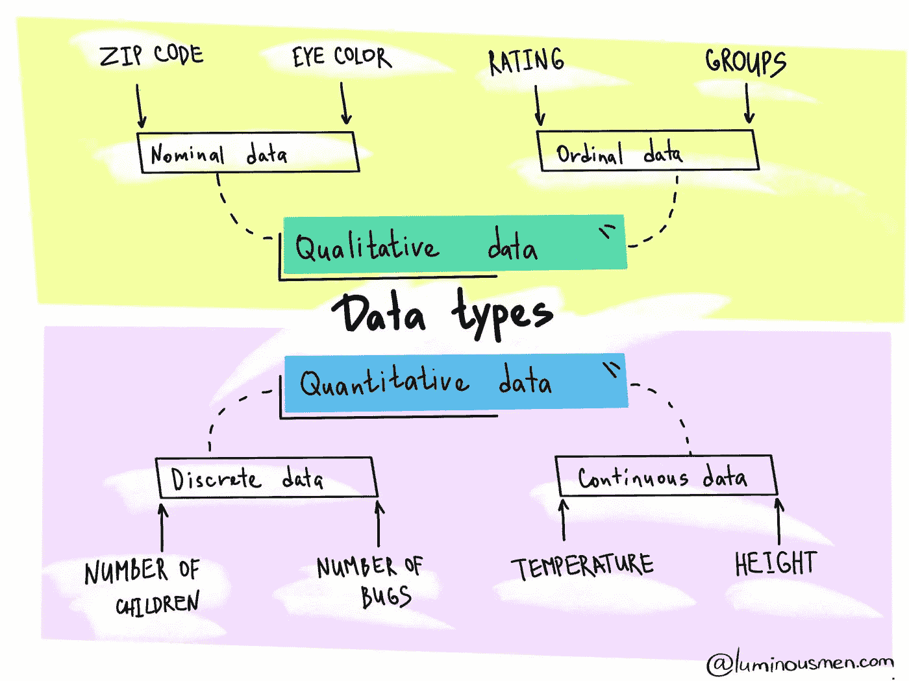

# 数据科学中的数据类型

> 原文：<https://medium.com/analytics-vidhya/data-types-in-data-science-6e91e67ea87c?source=collection_archive---------5----------------------->

## 定量和定性数据差异快速指南

有很多工程师从未涉足统计学或数据科学领域。但是，为了构建数据科学管道或者将数据科学家产生的代码重写为适当的、易于维护的代码，工程上出现了许多细微差别和误解…