# 使用逻辑回归的数据可视化和糖尿病诊断

> 原文：<https://medium.com/analytics-vidhya/data-visualization-and-diagnosis-of-diabetes-using-logistic-regression-1ea3958335a5?source=collection_archive---------4----------------------->

先说数据。数据可以从 [Kaggle](https://www.kaggle.com/uciml/pima-indians-diabetes-database) 数据库下载，前提是你有 Kaggle 账号。数据的目标是基于某些诊断方法预测潜在的糖尿病病例。所有被调查的对象都是至少 21 岁的皮马印第安血统的女性。

逻辑回归(LR)是分类中最重要的预测模型之一。简单来说，可以用逻辑回归对糖尿病的概率进行建模。逻辑回归的关键概念是 logit，比值比的自然对数。

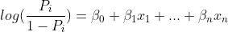

在上式中，Pᵢ是患者 I 患糖尿病的概率。β是 LR 模型的系数，而 x 是数据样本 I 的特征

对于这个二分法分类任务，我将使用 R 编程来加载数据，将其分为训练和测试数据集，使用训练数据集执行数据可视化和模型训练，并最终使用保留数据集评估模型。

首先，加载重要的库包。

```
library(cdata)    # data wrangling
library(ggplot2)  # elegant plots
library(knitr)    # display table 
library(reshape2) # data wrangling
library(WVPlots)  # ROC plot, double density plot and etc
```

接下来，将数据加载到工作环境中(记住使用语法 **setwd()** 或按下**‘Ctrl+Shift+H’**)将工作目录设置为文件所在的位置)。查看每个特征及其变量类型的统计摘要(例如，连续型、布尔型、分类型)。总共有 768 个样本(受试者)和 9 个变量(8 个属性和一个目标)。

```
data=read.csv(‘diabetes.csv’)
summary(data)
str(data)
```

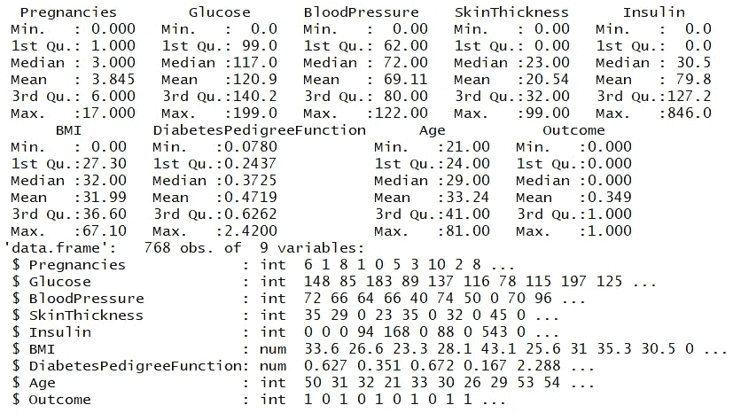

语法 summary()和 str()的输出。

从结果中，我们可以大致了解每个变量的分布情况。例如，受试者的年龄范围从 21 岁到 81 岁，其中一半是 29 岁或以下；胰岛素是正偏态的，如其平均值和中位数之间的巨大差异所示。

下面的代码片段显示了数据中阳性病例(糖尿病)的数量与阴性病例的数量。该数据包括 268 个阳性病例，而其余 500 个为阴性病例。

```
data$Outcome=as.factor(data$Outcome)
summary(data$Outcome)
```

接下来，将数据划分为训练集和保留集。训练集用于 LR 模型的数据可视化和训练，而保留集(测试数据)仅用于评估模型性能。

```
# for reproducibility
set.seed(123)
randn=runif(nrow(data))
train_idx=randn<=0.8  # Roughly 80% training data, 20% test data
train=data[train_idx,]
test=data[!train_idx,]
```

# **数据可视化**

数据可视化是以图形格式呈现数据。它不仅直观，而且有助于探索数据结构和检测异常值。值得注意的是，我们应该只在模型评估阶段使用测试数据。

```
target=’Outcome’
vars=setdiff(colnames(train),target)# moving data from wide to tall form (be careful with the #indentation
data_long=unpivot_to_blocks(data,nameForNewKeyColumn = “variables”,
 nameForNewValueColumn = “values”,columnsToTakeFrom = vars)# plot the histogram
ggplot(data_long,aes(x=values)) + 
 geom_histogram(bins=10,fill=”gray”) +
 facet_wrap(~variables,ncol = 3,scales=”free”)
```

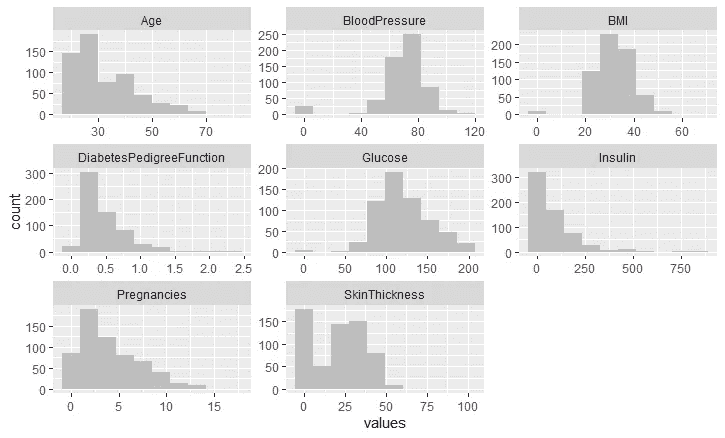

分组箱线图是另一个优秀的可视化工具，可以显示每个类的变量分布。

```
# boxplot for each variables with regards to group
ggplot(data_long,aes(x=Outcome,y=values)) +
 geom_boxplot(color=”blue”,fill=”blue”,alpha=0.2,notch=TRUE,
 outlier.color=”red”,outlier.fill = “red”,outlier.size = 2) +
 facet_wrap(~variables,ncol = 3,scales = “free”)
```

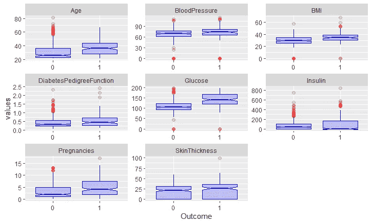

从上面的箱线图可以明显看出，在诊断为糖尿病的患者中，可变“葡萄糖”通常较高，因为两个等级的界限不重叠。然而，重要的是要注意异常值的存在。同样的情况在年龄、怀孕和身体质量指数预测中也很明显。

相关矩阵也有助于揭示两个变量之间的(线性)关系，如下图所示。年龄与妊娠次数呈正相关，Pearson 相关系数为 0.57。

```
cormat=cor(train[,vars]) # correlation matrixcormat[upper.tri(cormat)]=NA 
melted_cormat=melt(cormat,na.rm = TRUE)
# heat-map
ggplot(data=melted_cormat,aes(Var1,Var2,fill=value)) +
 geom_tile(color=’white’) +
 scale_fill_gradient2(low = “blue”, high=”red”,mid=”white”,midpoint = 0,
 limit=c(-1,1),space = “Lab”,name=”Correlation”) +
 theme_minimal()+
 theme(axis.text.x = element_text(angle = 45,vjust = 1,size = 12,hjust = 1)) +
 coord_fixed() +
 geom_text(aes(Var1,Var2,label=round(value,2)),color=”black”,size=3)
```

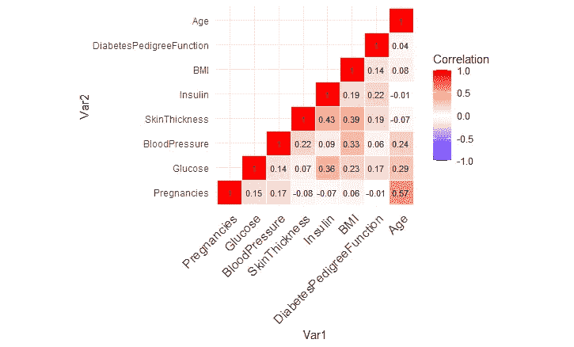

```
# plot grouped scatter plot
# Create the plots
pairs(data[,vars], pch=20,cex=0.3,col=data$Outcome, 
 lower.panel = NULL)
```

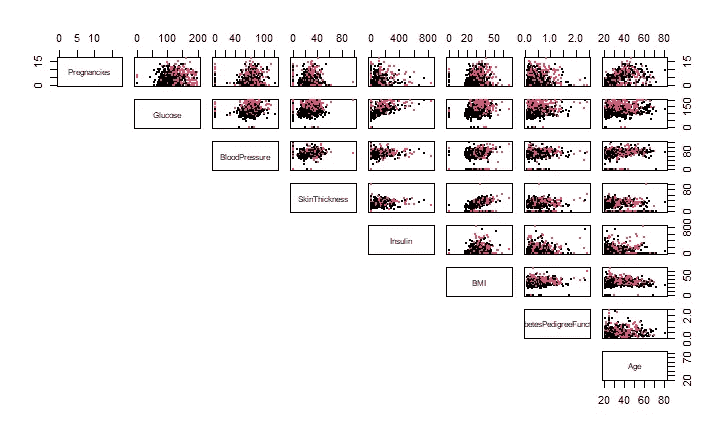

上面的组散点图矩阵表明，在每个散点图中没有可辨别的决策边界来区分这两个类别。

# 逻辑回归

LR 模型的训练可以通过设置自变量用语法 glm()实现: *family=binomial("logit")* 。逻辑回归假设独立变量和对数优势之间呈线性关系。尽管有这个理论上的限制，参数模型的系数可以提供关于个体属性和阳性结果(糖尿病)的优势/概率之间关系的线索。

```
model=glm(Outcome~.,data=train,family = binomial(“logit”))
summary(model)
```

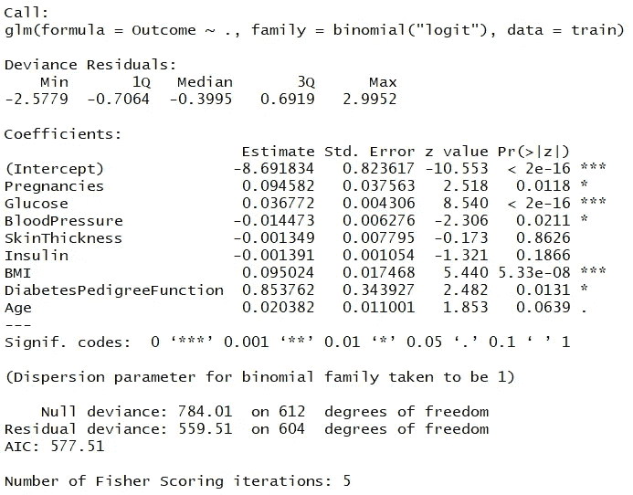

除了“皮肤厚度”和“胰岛素”之外，大多数系数都具有统计学意义。我们如何解释模型的系数？让我们以“身体质量指数”为例。系数估计值 0.095 表明，如果身体质量指数增加 1 个单位，对数优势将增加 9.5%。那么，如果我们想知道概率呢？假设一个人被诊断为糖尿病的概率为 0.25，如果身体质量指数增加 1，而其他变量保持不变，那么被诊断为糖尿病的概率会发生什么变化？让我们算一算。

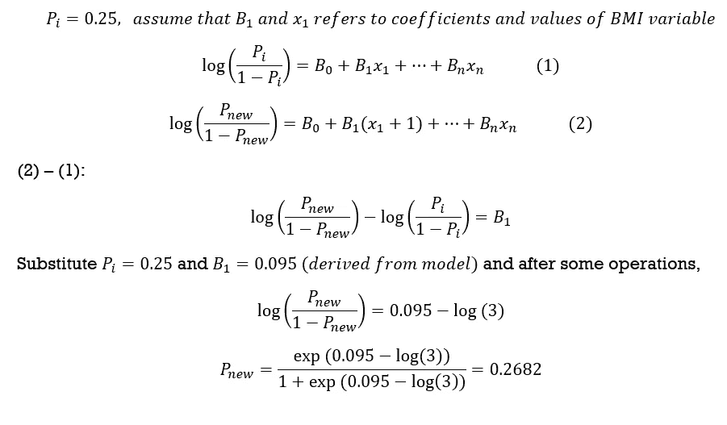

因此，身体质量指数增加一个会将糖尿病发病的概率从 0.25 提高到 0.2682。同样的计算也适用于其他变量。尽管解释不像线性回归那样直接，但它使我们能够深入了解每个预测因子对反应的贡献。

# **车型评测**

通过准确度、精确度和召回率(灵敏度)来评估先前未见过的数据(保留数据集)上的模型泛化性能。

```
# prediction
train$pred=predict(model,newdata = train,type = “response”)
test$pred=predict(model,newdata=test,type=”response”)# confusion matrix
(confmat_test=table(truth=test$Outcome,predict=test$pred>0.5))
(acc_test=sum(diag(confmat_test))/sum(confmat_test))
(precision=confmat_test[2,2]/sum(confmat_test[,2]))
(recall=confmat_test[2,2]/sum(confmat_test[2,]))
```

使用测试数据评估模型的性能:**准确度:0.7355，精确度:0.7083，召回率:0.5574** 。此外，模型性能可以通过接收器工作特性(ROC)曲线和双密度图进行可视化，如下面的代码片段和图形输出所示。

```
plt=DoubleDensityPlot(test,xvar = “pred”,truthVar = “Outcome”,
 title = “Distribution of scores of LR model in test data”)
plt+geom_vline(xintercept = 0.5, color=”red”,linetype=2)
```

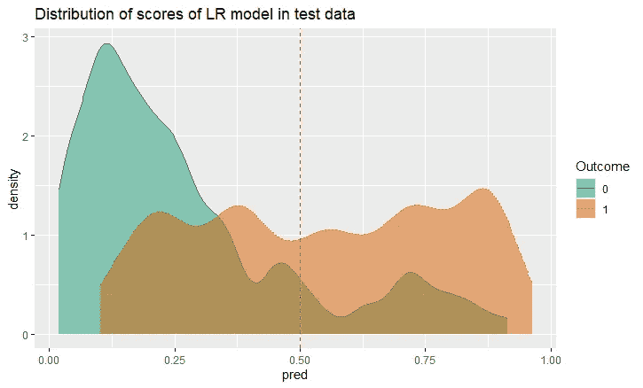

```
test$Outcome_numeric=as.numeric(test$Outcome)-1
ROCPlot(test,xvar=’pred’,truthVar = “Outcome_numeric”,
 truthTarget = TRUE,
 title = “Logistic regression test performance”)
```

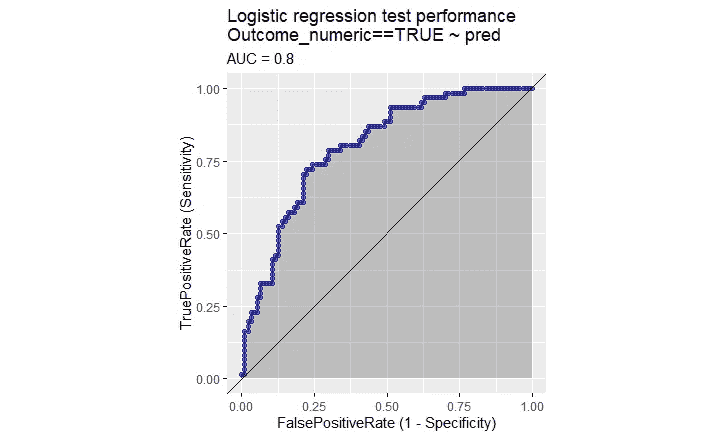

# **微调**

必须确定分数(模型输出)的特定阈值，以将结果(糖尿病或非糖尿病)二进制化。虽然缺省值通常设置为 0.5，但是可以改变阈值来优化精确度和召回率之间的折衷。显示作为阈值函数的丰富和回忆的图形有助于选择合适的阈值。关于如何选择阈值的更多细节，请参考本[电子书](https://livebook.manning.com/book/practical-data-science-with-r-second-edition/welcome/v-6/)。经验观察表明，0.375 可以是一个好的阈值。注意，我们应该始终使用训练数据而不是测试数据，以防止[数据泄露](https://machinelearningmastery.com/data-leakage-machine-learning/)。

```
train$Outcome_numeric=as.numeric(train$Outcome)-1
plt=PRTPlot(test,’pred’,’Outcome_numeric’,TRUE,
 plotvars = c(‘enrichment’,’recall’),
 thresholdrange = c(0,1),
 title = ‘Enrichment/recall vs threshold for LR model’)
plt+geom_vline(xintercept = 0.375,color=”red”,linetype=2)
```

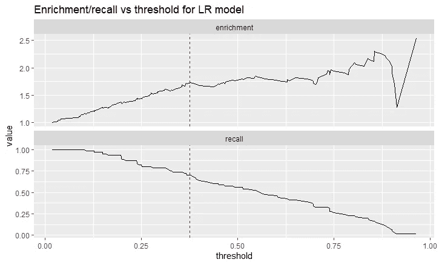

```
# Confusion matrix of test data
(confmat_test=table(truth=test$Outcome,predict=test$pred>0.375))
(acc_test=sum(diag(confmat_test))/sum(confmat_test))
(precision=confmat_test[2,2]/sum(confmat_test[,2]))
(recall=confmat_test[2,2]/sum(confmat_test[2,]))
```

这个新的阈值在准确度和召回率方面给了我们更好的概括性能，但是在准确度方面略有下降:准确度:0.7548，准确度:0.6825，召回率:0.7049。但是，应该注意的是，如果该模型应用于分布与其训练数据非常不同的未来数据，则该模型将表现不佳。

对于二元分类问题，LR 模型是一种可解释的、强有力的预测模型。机器学习从业者应该在应用更高级的预测模型之前，始终选择像逻辑回归这样的简单模型。以上代码可以在 [Github](https://github.com/Jacky-lim-data-analyst/programmer.git) 和 [RPubs](https://rpubs.com/JQ_programmer_92/775059) 中找到。