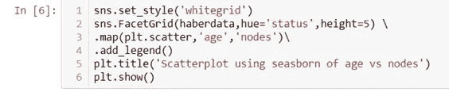
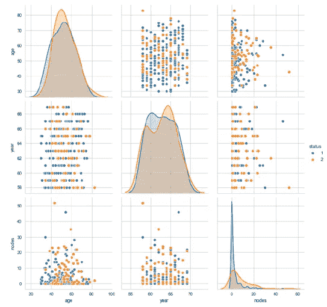

# 数据科学中的数据可视化和探索性数据分析(EDA)

> 原文：<https://medium.com/analytics-vidhya/data-visualization-and-exploratory-data-analysis-eda-in-data-science-984e84942fda?source=collection_archive---------4----------------------->

## Python 数据科学中的 EDA 指南

探索性数据分析是一种简单的分类技术，通常通过可视化方法完成。这是一种分析数据集以总结其主要特征的方法。当你试图建立一个机器学习模型时，你需要非常确定你的数据是否有意义。

> 探索性数据分析(EDA)是使用简单的统计工具和简单的绘图工具来分析数据的任务。

# EDA 的需求是什么？

每一个机器学习问题的解决都是从 EDA 开始的。这可能是机器学习项目中最重要的部分之一。随着市场的不断增长，数据的规模也在不断增长。不进行适当的分析，公司就很难做出决策。

通过使用图表和某些图形，人们可以理解数据，并检查是否有任何关系。

各种各样的图被用来确定任何结论。这有助于公司做出坚定且有利可图的决策。一旦**探索性数据分析**完成并得出见解，其特征可用于监督和非监督机器学习建模。

# 怎样才能表演 EDA？

有很多工具可以用来执行 EDA。使用的编程语言主要是 R 和 Python。使用的工具有 [Tableau](https://www.tableau.com/) 、 [IBM Cognos](https://www.ibm.com/in-en/products/cognos-analytics) 等，这些工具通常被称为商业智能工具(BI)。

谈到 Python，我们使用某些库，如 EDA 的 [NumPy](https://numpy.org/) 、Pandas、 [Matplotlib](https://matplotlib.org/) 和 [seaborn](https://seaborn.pydata.org/) 。

> EDA 是一个可以发挥创造力的地方。每个领域都有技术/科学部分和艺术部分，这里 EDA 被认为是数据科学家的艺术部分。

我们对数据越有创造力，我们就越有洞察力。因此，在执行 EDA 时，总是要问正确的问题，对数据更有创造性，并彻底理解模式。

一个人应该总是有一些与问题领域相关的基本信息。例如，这里我们将处理关于癌症的哈伯曼数据集。因此，在处理这个数据集时，需要一些医学术语或知识。

**一些方法和图被区分为:-**

单变量分析
双变量分析
多变量分析

**以下是执行 EDA 时常用的图形:**

散点图
成对图
直方图
箱线图
小提琴图
等高线图

让我们来看一个如何执行 EDA 的实际例子。这里我们使用一个简单的数据集，即 [Haberman 数据集。](https://github.com/Vihaanshah29/Haberman_dataset_EDA/blob/main/haberman.csv)

我正在把我的代码附在 GitHub 上。请务必检查一下。

为了执行 EDA，我们需要导入一些库。

**年龄** : —代表手术患者的年龄。范围从 30 到 83。(可通过代码确定:*haberdata[‘年龄’]*)
**年份**——患者做手术的年份。时间跨度从 1958 年到 1969 年。
**淋巴结** :-淋巴结，或淋巴腺是淋巴系统的肾形器官，也是适应性免疫系统。(*参考:*[*https://en.wikipedia.org/wiki/Lymph_node*](https://en.wikipedia.org/wiki/Lymph_node))
**状态** : —用 1 和 2 表示。1 表示患者存活了 5 年或更长时间，2 表示患者在 5 年内死亡

从上述代码中我们可以得出结论，在 306 名患者(我们从代码' *haberdata.shape* '中获得)中，225 名患者存活了 5 年或更长时间，可悲的是 81 名患者在 5 年内死亡。状态将是类别标签。

跳转到图表，这将为我们提供关于这些数据的更多细节。

**散点图** : —这是一种散点图格式的图。它主要介于两个特征之间。这里我们将绘制节点与年龄的关系图，看看是否存在线性关系。

输出:

上面的图没有给出一个更好的理解，因为颜色是相同的，很多点是重叠的。

由于 matplotlib 没有给出明确的输出，我们将通过 seaborn 模块来寻找是否可以得到一些见解。

输出:

这里我们使用 seaborn 进行二维散点图绘制。这里蓝色和橙色的点代表病人的生存状态。蓝色代表患者存活了 5 年或更长时间，橙色点代表患者在 5 年内死亡。

**Pair plots** :-用于查看数据集中出现的所有特征的行为，我们还可以看到 [PDF](https://en.wikipedia.org/wiki/Probability_density_function) 表示。

输出:

从上面的情节我们可以得到一些有趣的事实。我们可以说，与其他两个图相比，图 6(年对节点)是可读的，但是我们当然不能根据这个图做出任何具体的观察。地块 4、地块 7 和地块 8 分别是地块 2、地块 3 和地块 6 的倒置地块。

我用过 seaborn，因为它的表现很好，速度也很快。

箱形图:箱形图告诉我们其他图不容易告诉我们的百分比图。它还有助于检测异常值。

输出:

这还是看着不顺眼。这里我们可以了解四分位数范围和异常值的情况。

**直方图:**直方图用来描绘任何连续变量的分布。这些类型的图在统计分析中非常流行。

这条线代表概率密度函数 PDF。通过绘制不同特征的直方图和 PDF，我们可能会对数据集有更好的了解。

**小提琴图-** 它是盒图的扩展，在这种情况下，核密度图也用盒图绘制。

可以像类别 1 一样进行一些观察，我们可以看到在 0 节点处它被高度提升，并且晶须的范围从 0 到 8。

*结论:*

这些是 EDA 中使用的一些基本图。阅读和理解故事情节是很重要的。为了一个机器学习项目而跳过 EDA 从来都不是好事。

***************************************************************

请对任何反馈或疑问留下评论。

谢谢你。