# 数据可视化 III:Python 中的机器学习

> 原文：<https://medium.com/analytics-vidhya/data-visualization-iii-machine-learning-in-python-9cbd9bc9516d?source=collection_archive---------12----------------------->

根据我们从以前的数据可视化博客[数据可视化](/swlh/data-visualization-machine-learning-in-python-249dfb2e7a0d)和[数据可视化 II](/swlh/data-visualization-ii-machine-learning-in-python-1d478bd0e305) 中收集的知识，我们的下一步应该是更深入地理解 Python 中的可视化。


图片来源:[卢克·切瑟](https://unsplash.com/@lukechesser?utm_source=unsplash&utm_medium=referral&utm_content=creditCopyText)上 [Unsplash](https://unsplash.com/s/photos/dashboard?utm_source=unsplash&utm_medium=referral&utm_content=creditCopyText)

Python 提供了 Seaborn 库，该库提供了一个高级接口，用于绘制有吸引力且信息丰富的统计图。虽然 Matplotlib 足以绘制基本图形，但它有一个复杂的可定制选项。另一方面，Seaborn 利用其内置主题的统计绘图能力来提供漂亮的交互式图形。

> 如果 Matplotlib“试图让简单的事情变得简单，让困难的事情变得可能”，seaborn 也试图让一组定义明确的困难事情变得简单。
> — Seaborn 官网

# 学习 Seaborn，自我启动的方式

Seaborn 基于 [Matplotlib](/swlh/data-visualization-machine-learning-in-python-249dfb2e7a0d) 构建，与 [NumPy](https://divyansh7c.medium.com/numpy-basics-machine-learning-in-python-795c39d85bb4) 和 [Pandas](https://divyansh7c.medium.com/pandas-basics-machine-learning-in-python-c0d2ac318ba5) 紧密结合。它提供以下功能:

1.  数据集驱动的 API 设计来确定变量之间的关系。
2.  线性回归图的自动估计和绘制。
3.  支持高度可定制的多图网格。
4.  关系、分布和分类数据的高级统计图表解决方案。

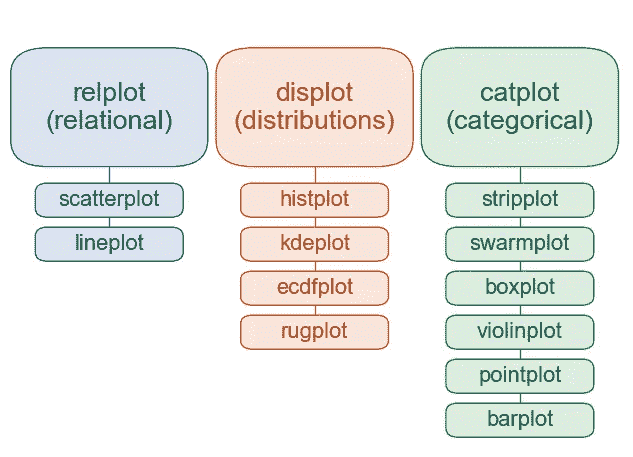

图片来源:[seaborn.pydata.org](https://seaborn.pydata.org/tutorial.html)

## **安装 Seaborn:**

需要帮助吗？[自述](https://pypi.org/project/seaborn/)。

```
pip install seaborn
```

## 将 Seaborn 导入到您的。py 文件:

```
import seaborn
or
import seaborn as sns
or
import seaborn as <alias>
```

> **注意:**在这个简短的教程中，我们将看到如何使用 Seaborn 来提供关于我们数据的深入知识。

## **导入数据集:**

> **注意:**我们将使用 Pokemon.csv 数据集。[下载](https://github.com/itsDV7/Dataset_For_Practice/blob/main/Pokemon.csv)。

```
df = pd.read_csv("..\Path\To\Pokemon.csv", index_col=0)
df.head() # Check and Display first few rows of the dataset.
```

## **从 catplot()开始—分类图**

CatPlot 提供了 3 个主要类别:

1.  分类散点图:`sripplot()`和`swarmplot()`
2.  分类分布图:`boxplot()`、`violinplot()`和`boxenplot()`
3.  分类估计图:`pointplot()`、`barplot()`和`countplot()`

*   **实施:**

```
# Cleaning the dataset of unwanted categories and creating a statistics (stats) data-frame
stats = df.drop(['Total','Stage','Legendary'],axis=1)# Applying boxplot directly
sns.boxplot(data=stats)
plt.show()
# To display plots, we use the plt.show() function from Matplotlib# Applying boxplot via catplot
sns.catplot(data=stats,kind='box')
plt.show()
```

> **注:**通过使用`catplot(data,kind)`功能，我们可以使用任何 CatPlot。

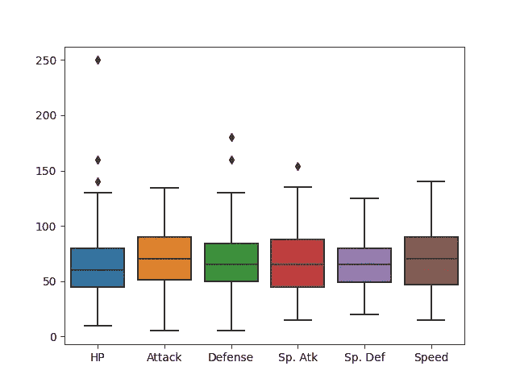

口袋妖怪统计数据的分类分布

```
# Applying simple inbuilt themes for aesthetics
sns.set_style('whitegrid')
sns.boxplot(data=stats)
plt.show()
```

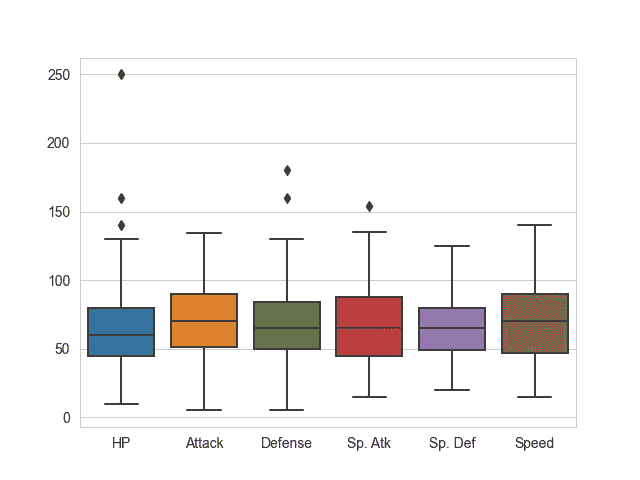

应用白色网格

```
# Applying BarPlot
sns.barplot(x='Type 1',y='Defense',data=stats)
plt.show()#orsns.catplot(x='Type 1',y='Defense',data=stats,kind='bar')
plt.show()
```

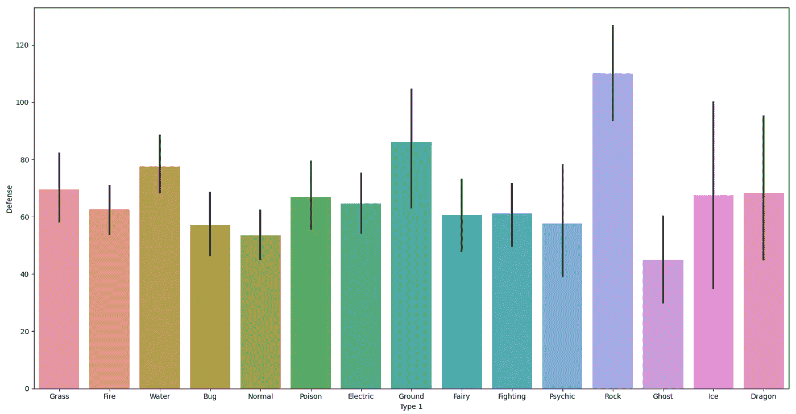

所有类型口袋妖怪的防御统计和变化

```
set_colors = ['#78C850',  # Grass
              '#F08030',  # Fire
              '#6890F0',  # Water
              '#A8B820',  # Bug
              '#A8A878',  # Normal
              '#A040A0',  # Poison
              '#F8D030',  # Electric
              '#E0C068',  # Ground
              '#EE99AC',  # Fairy
              '#C03028',  # Fighting
              '#F85888',  # Psychic
              '#B8A038',  # Rock
              '#705898',  # Ghost
              '#98D8D8',  # Ice
              '#7038F8',  # Dragon
]

sns.barplot(x='Type 1',y='Defense',data=df, palette=set_colors)
plt.show()#orsns.catplot(x='Type 1',y='Defense',data=df, palette=set_colors, kind='bar')
plt.show()
```

> **注:**颜色设置为#Hex 值。

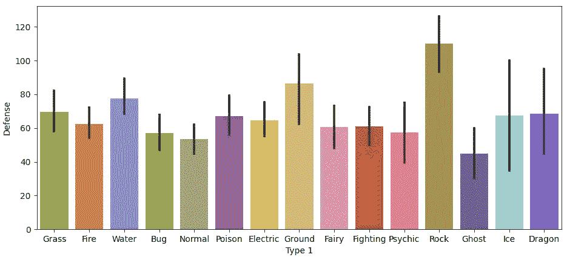

根据 [Bulbapedia](http://bulbapedia.bulbagarden.net/wiki/Category:Type_color_templates) 颜色的口袋妖怪类型

## 叠加图

使用 Seaborn 库覆盖绘图非常容易:

1.  首先，我们将使用 Matplotlib 函数`plt.figure(figsize=(w,h))`初始化一个图形
2.  然后，我们将绘制一个*群集图*并放置`color='Red'`以使其可区分。
3.  接下来，我们用`palette=set_colors`和`saturation=0.2`绘制一个*盒图*。
4.  最后，我们设置一个标题并使用`plt.show()`显示情节。

*   **实施:**

```
plt.figure(figsize=(12,8))
sns.swarmplot(x='Type 1',y='Defense',data=df,color='Red')
sns.boxplot(x='Type 1',y='Defense',data=df,palette=set_colors,saturation=0.2)
plt.title('Type vs Defense')
plt.show()
```

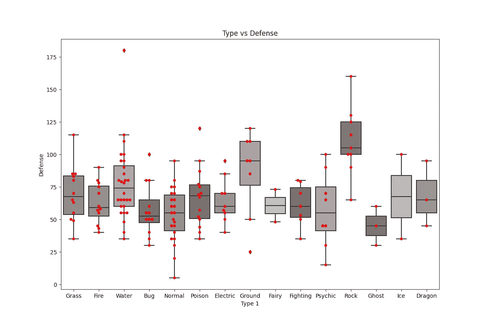

用该图解释箱线图的偏斜度

## 线内下一个显示点()-分布图

DisPlot 还标榜三种方法:

1.  `histplot()` —默认选择
2.  `kdeplot()` —内核密度估计
3.  `ecdfplot()` —仅单变量

*   **实施:**

```
# Setting-up new colors
new_color = ['#FF0000', #Stage 1
             '#00FF00', #Stage 2
             '#0000FF', #Stage 3
]

sns.kdeplot(df.Attack, df.Defense, shade_lowest=True, hue='Stage', data=df, palette=new_color)
plt.show()
```

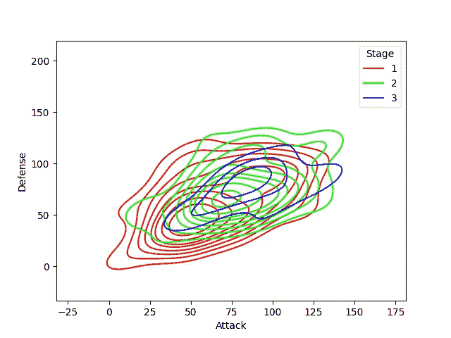

根据攻击和防御统计的口袋妖怪的密度

```
sns.histplot(x=df.Defense,stat='count',kde=True,data=df)
plt.show()
```

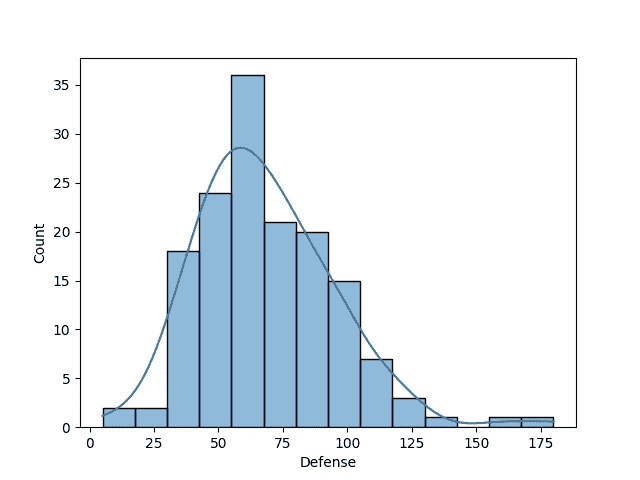

显示每个防御范围内口袋妖怪的数量

> **注:**禁用 KDE 也可制作 HistPlot。

## 接合图()

`jointplot()`用于绘制带有双变量和单变量的两变量图形。

*   **实现:**

```
sns.jointplot(x='Defense',y='Type 1',data=df)
plt.show()
```

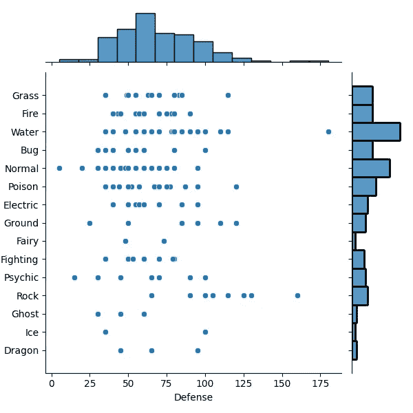

边缘直方图散点图

```
sns.jointplot(x='Defense',y='Attack',data=df,hue="Type 1", palette=set_colors)
plt.show()
```

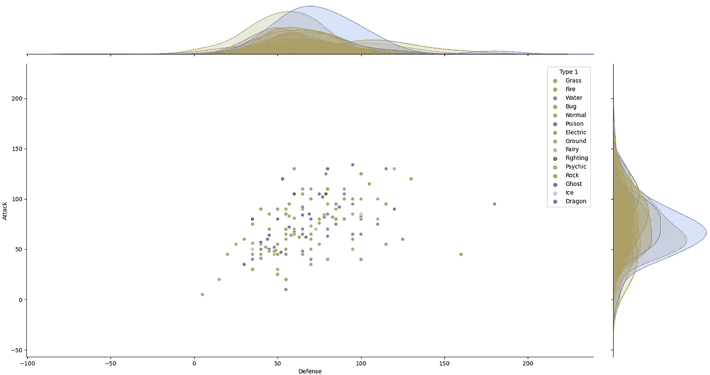

指定色调值将绘制边缘密度曲线

## 最后，Facets 和 relplot() —关系图

Facets 允许您在一个图形中创建多个具有相似属性的图形。

*   **实施:**

```
facet = sns.FacetGrid(df,col='Stage',col_wrap=5,hue="Type 1",palette=set_colors)
facet.map(sns.scatterplot,"Attack","Defense")
facet.add_legend()
plt.show()
```

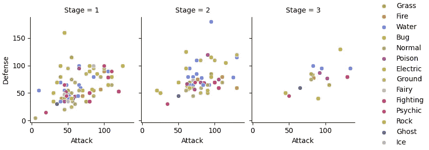

口袋妖怪各阶段攻防

更多功能请参考 [*海博文件*](http://seaborn.pydata.org/tutorial.html) 。

本博客为使用 Python 的 Seaborn 库轻松绘制交互式和美学图形搭建了一个平台。该文档不应被视为完整的指南，建议读者参考博客旁边的 Seaborn 官方文档。

> 感谢阅读。
> 别忘了点击👏！