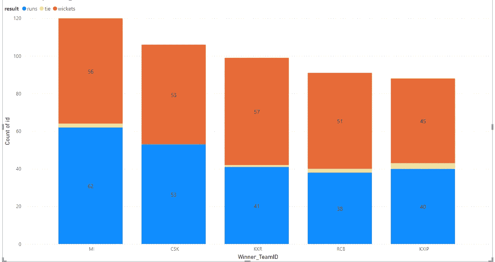
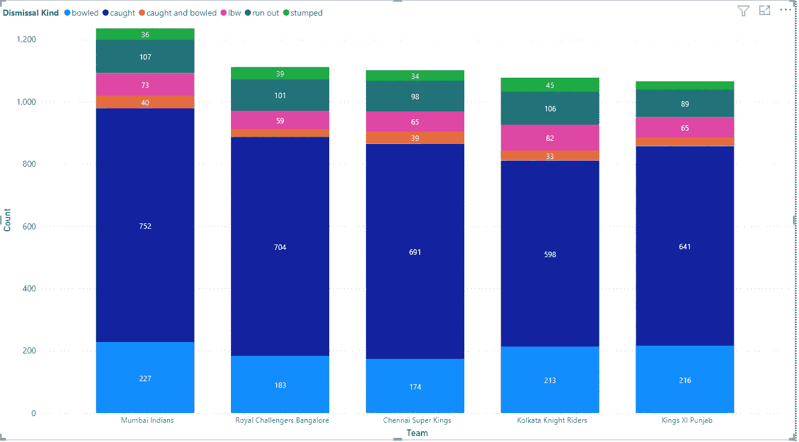
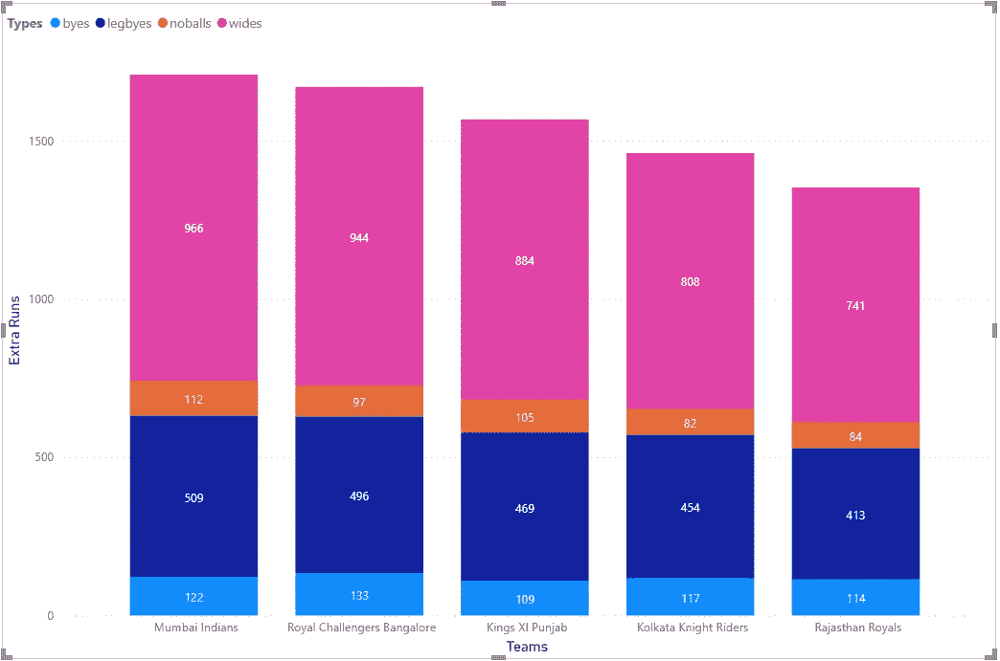
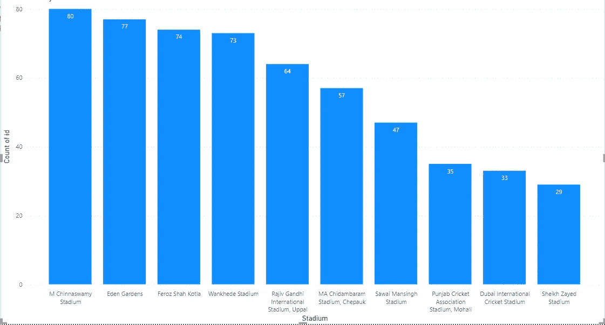

# 数据可视化— IPL 数据集(第 1 部分)

> 原文：<https://medium.com/analytics-vidhya/data-visualization-ipl-data-set-part-1-9748789ac024?source=collection_archive---------20----------------------->

欢迎来到数据可视化系列的第二篇文章，这是印度最受欢迎/最受关注的话题之一——IPL(印度超级联赛)(第一部分)
在这篇文章中，我们将重点关注基于各队的各种分析。

# 数据集概述

IPL 数据集列的描述

> 让我们从检查这些列中的数据开始

IPL 数据集 1 概述

IPL 数据集 2 概述

> *走向最有趣的部分，可视化数据集和关系。*

让我们先来看看自 2008 年以来每支球队的总胜率..

团队对比赛数量获胜

上面的条形图显示了所有赛季中比赛获胜次数最多的前 5 支球队。令人惊讶的是，前五名中的 RCB 仍然没有赢得任何一个 IPL 赛季。

现在，让我们来看看这些胜利

基于跑垒/三柱门的团队 VS 获胜

上面的条形图是之前图表的详细版本，它显示了最多胜利的前 5 支球队除以第一击球和第二击球的胜利。

蓝色条代表第一次击球获胜，而棕色条代表第二次击球获胜，淡黄色细线代表平局比赛。

我们可以注意到，米在第一击球时赢得了更多的比赛，而和擅长追逐。除了他们之外，CSK 通过赢得几乎相等的比赛保持了安静的平衡。

分析一个球队获胜的另一个最重要的方面是场地。所以，让我们看看有多少这样的胜利是在一个中立的场所。

基于地面中立的胜利

上图是基于地面中立的每支球队赢得比赛的另一种表现。

蓝色代表非中立场地，即其中一个队的主场，而棕色代表中立场地。

我们可以看到 CSK，旁遮普和 RCB 是在中立场地赢得最多比赛的顶级球队。

另一个可能影响球队获胜的因素是投掷，我们已经看到投掷是赢得比赛的一个主要因素。让我们看看这里是否也是如此。

看起来很复杂，但是放松很容易..让我们稍微详细地解释一下这个图表，让它变得简单一些..

这 5 根棒线属于我们排名前 5 的球队(MI、CSK、KKR、RCB 和 KKR)。不同的颜色代表着 IPL 中不同的队伍。每个团队的颜色符号在上面的图表中有定义，其中很少是棕色代表 MI，蓝色代表 CSK，深蓝色代表 KKR，紫色代表 RCB，浅蓝色代表旁遮普。

现在，让我们试着阅读图表，并尝试获得一些见解…

正如我们所看到的，在每个条中，他们所代表的球队有很大一部分是相同的颜色，就像在第一个条中，MI 在赢得抛球后赢得了 61 场比赛。同样，在掷硬币获胜后，每个队的胜率也很高。

现在，我们可以得出结论，掷硬币赢是赢得比赛的一个重要因素。

让我们看看哪个队有最多的边界…一个改变游戏规则的因素..边界 IPL 的肾上腺素…

团队 VS 边界

上图显示了团队和他们得分的边界数，这些条有两种不同的颜色，蓝色代表 4，棕色代表 6。

我们可以看到球队排名发生了变化，在我们的分析中，到目前为止排名第二的 CSK 队已经上升到第五位，而 RCB 队已经跃升到第二位。米仍然保持第一的位置。

我们在这里可以得出什么结论..！！！并不总是大力击球会带来胜利，其他因素也是获胜的原因，比如击球轮换和合理击球。

> 到目前为止，我们已经对击球部分做了一些分析，但现在让我们看看一些基于保龄球的图表。毕竟比赛不能只靠球棒赢，它也需要球…

让我们看看哪个队进了最多的三柱门

团队 VS 三柱门

上图显示了最大值的前 5 个团队。IPL 所有赛季的检票口。

还是 5 次，除了米，位置都换了，看起来他们用全面的表现保住了自己的位置。

现在让我们看看什么是最好的出路。

团队 VS 解散方式计数

这篇文章的另一幅彩色图表..别担心，这很容易..我已经过滤了图表，列出了前 5 支球队(像往常一样)和前 6 种让你失去检票口的方式。

正如我们所看到的，每种类型的三柱门的颜色表示在图形上方定义，即投球、接球、接球和投球、低体重、绊倒和出局。

从上面的图表中我们可以推断出什么..！！！

大多数三柱门都是因为被抓住而丢失的(所有球队都是如此)，这个数字比其他任何数字都要高。毫无疑问，它必须是最高的，因为它是击球的游戏。
第二大原因是投球，这是当你试图击球时失去三柱门的另一种方式。

其余的原因也有很小一部分相同。但是对游戏有很大的影响。

与保龄球相关的另一个重要因素是额外服务，人们喜欢免费跑步…

团队和他们的临时演员

在上面的图表中，我们可以看到每支球队投出的各种类型的额外得分以及每种类型的总得分。

我们可以看到，在漏球的情况下，宽球显然是赢家。但是这里要注意的一点是，每支球队的无球得分都很少

同样，米在这里也占据着它的极位…

> 现在让我们来看看最著名的 IPL 体育场

体育场与比赛

我们可以通过比赛的数量来查看 IPL 比赛的前 10 个体育场。

M Chinnaswamy 体育场是最受欢迎的体育场。毫无疑问，它是 T20 最受欢迎的球场，因为它是最适合击球的球场。此外，伊甸园是第二最受欢迎的地方，可能是由于高座位容量。

更多即将在 IPL 第 2 部分…敬请期待..

我希望你喜欢这篇文章，请喜欢并留下你对这篇文章的看法，你的观点，改进点或任何你希望我为你分析的具体内容。
乐于助人

非常感谢各位…稍后见，有更多有趣的分析…

更了解我:- [关于我](https://shashank-singhal.medium.com/about-me-shashank-singhal-6654366c8a05)

> 这个数据集取自互联网，你可以从[这里下载](https://www.kaggle.com/shashanksinghals/ipl-dataset)
> 图表是在 Power BI 的帮助下创建的。
> 如果你也想学习这个工具，请告诉我。