# 数据可视化— IPL 数据集(第二部分)

> 原文：<https://medium.com/analytics-vidhya/data-visualization-ipl-data-set-part-2-b9daa59e4dc8?source=collection_archive---------7----------------------->

欢迎来到数据可视化系列的第三篇文章，这是印度最受欢迎/关注的话题之一——IPL(印度超级联赛)(第二部分)2008–2020 年
在[第一部分中，我们基于](/analytics-vidhya/data-visualization-ipl-data-set-part-1-9748789ac024)的团队进行了分析，在这里，我们将基于所有其他领域进行分析，并尝试涵盖一些非常有趣和独特的分析。

# 数据集概述

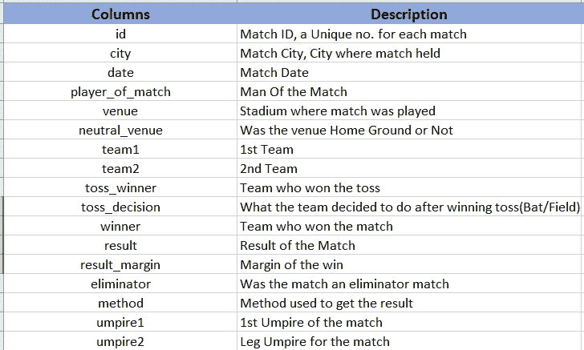

图 1:-IPL 数据集列的描述-1

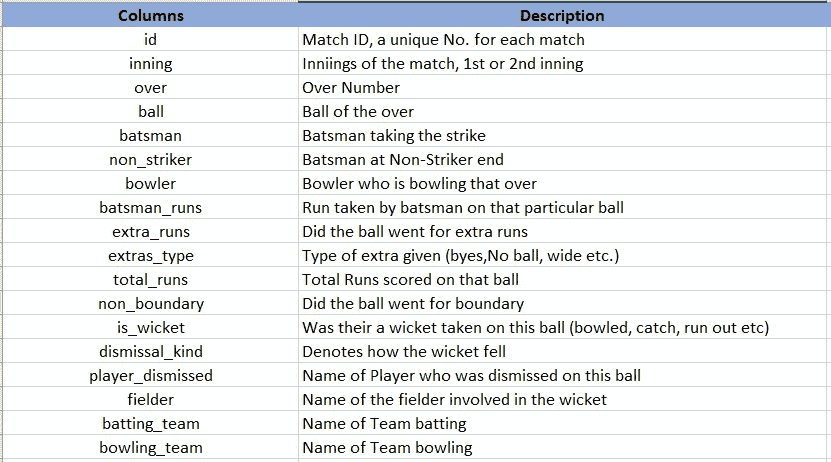

图 2:-IPL 数据集的列的描述-2

> *让我们从检查这些栏中的数据开始*

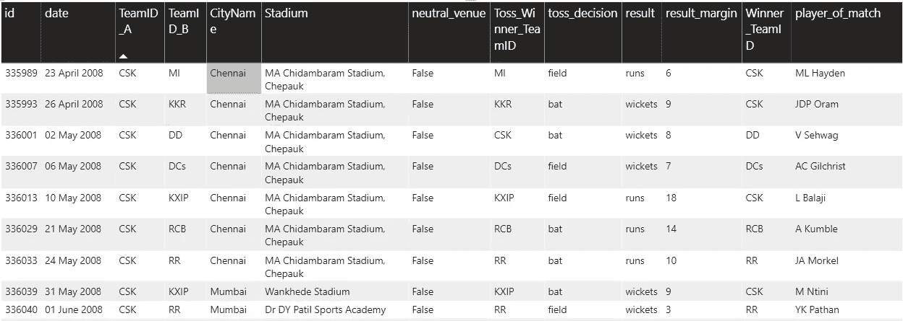

图 3:- IPL 数据集 1 概述

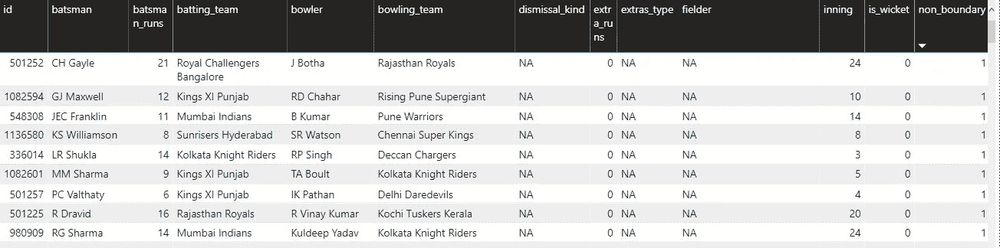

图 4:- IPL 数据集 2 概述

让我们从一些视觉化的东西开始，通过分析所获得的 MoM(最佳球员)奖的数量来找出前 10 名球员。

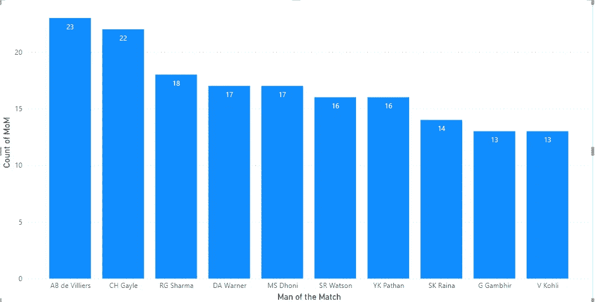

图 5:妈妈奖

上面的图表显示了 IPL 的前 10 名球员获得了最多的最佳球员奖…猜猜看…不是别人，正是我们的 360 先生(ABD)获得了 23 个奖项，其次是宇宙老板(Gayle 333)获得了 22 个奖项，印度的 roHIT MAN 获得了 18 个奖项，华纳和队长 Cool (MSD)各获得了 17 个奖项。

只是一个基于投掷决定检查妈妈的随机想法让我分析并看看谁在追逐和设置目标时玩得最好。让我们看一下这张图表，不要浪费时间。

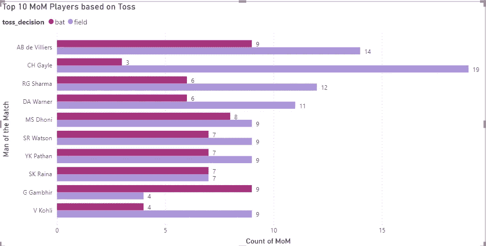

图 6:-基于 Toss 的 10 大妈妈

确实是一个非常有趣的图表…
我们可以看到，当团队决定首先上场时，宇宙老板(盖尔)以 19 个奖项领先，而当团队首先击球时，甘比尔有更好的妈妈(9 个)。而令人惊讶的是，酷酷队长(MSD)和刘冰的妈妈比例相当。

让我们看看迄今为止 IPL 排名前 10 的击球手…

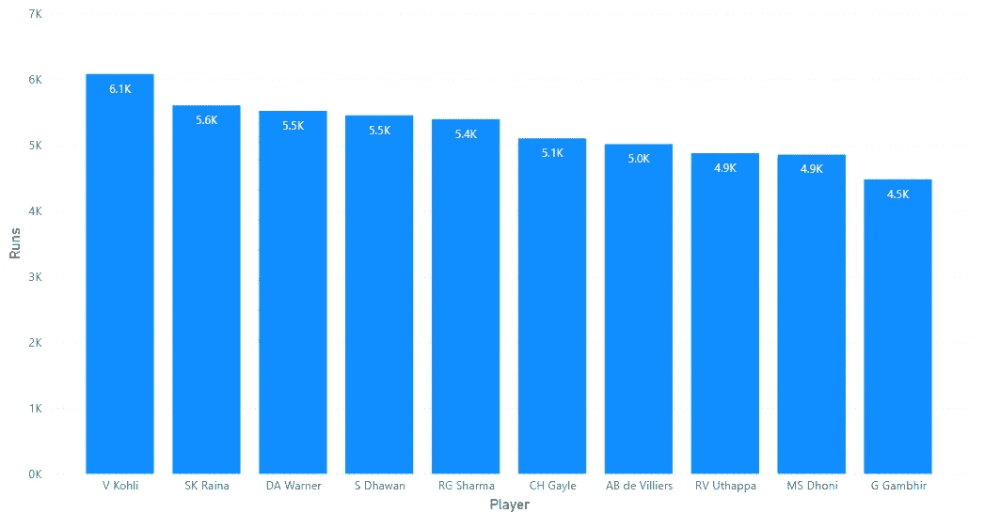

图 7:-得分最高的前 10 名球员

毫无疑问，这个图表必须由国王 Kohli 领导，到目前为止已经超过 6000+次，其次是刘冰，华纳，达万和 Rohit。一个惊人的图表…前 5 名中，4 名是印度球员，其中 3 名是印度队的顶级击球手。

继续下一个画面…通过这些巨大的个人得分，让我们看看谁拥有最多边界的记录…

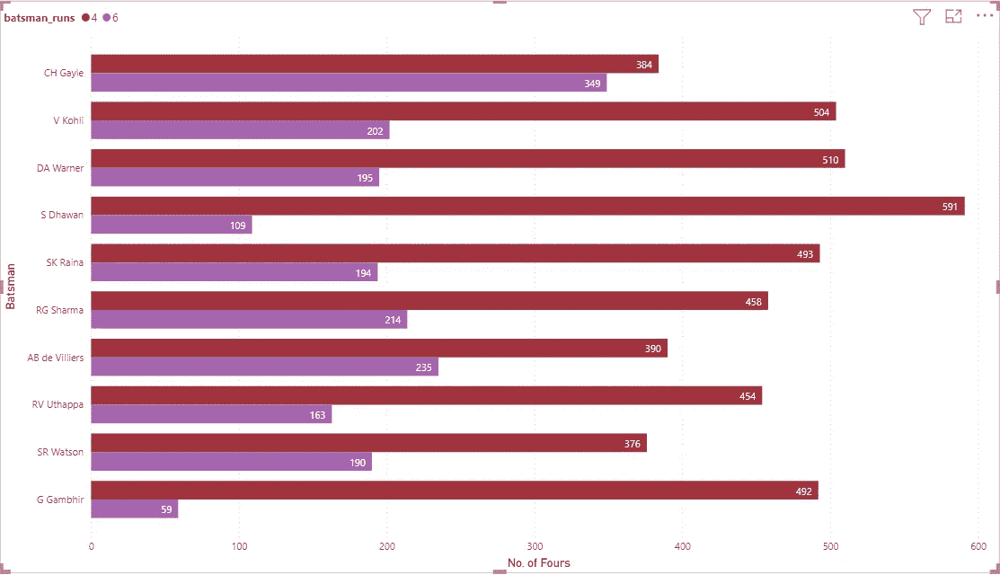

图 8:-10 大玩家 VS 界限

你猜怎么着……如果你说的是越过绳子(6 个),那一定是唯一一个老板..克里斯·盖尔..他喜欢在看台上投球..当谈到 4 的时候，这个地区由我们自己的加巴人统治…什卡·达万…

现在让我们来看看投球手们…

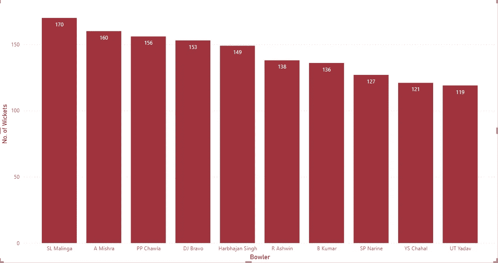

图 9:拥有最多三柱门的投球手

在上面的图表中，我过滤了 10 个拥有最多三柱门的保龄球手。

这张图表必须由马林加爵士领导，他是一个了不起的保龄球手，从不错过他的纽约客和击球的机会。令人惊奇的是，他被 7 名印度和 2 名加勒比球员追随着…

此外，需要注意的一点是，在这 10 人中，有 6 人是纺纱工。

保龄球的另一个重要因素是小球远离三柱门..这些措施的结合是给对手制造压力所需要的。

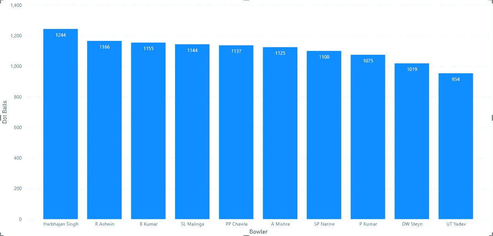

图 10:带着麦克斯的保龄球手。圆点球

穆斯林领袖(Harbhajan Singh)是最有经验的球员之一，绝对是领导这个图表的合适人选..毫无疑问，为什么他拥有“穆斯林”的头衔，他是最麻烦的投球手之一，拥有最多的点数和第五名。

紧随其后的是另一位印度旋转手 R. Ashwin，他可以给世界上最好的击球阵容制造麻烦。这 10 人中，有 7 人是印度保龄球手..惊人的比例。

让我们看看投球手投球最糟糕的是哪一个..即 IPL 中最昂贵的 overs。

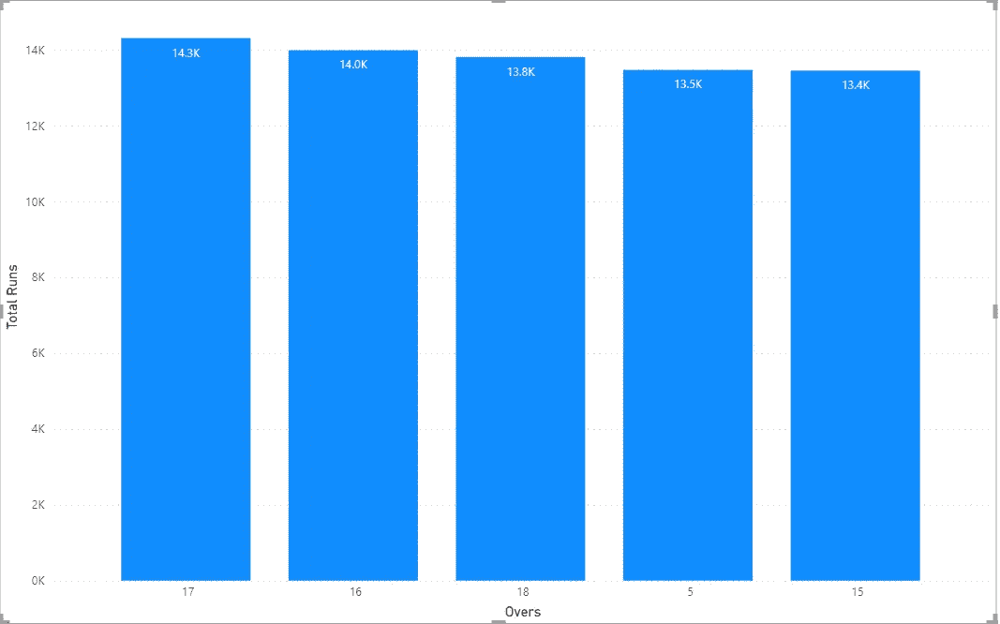

图 11:-最昂贵的车

正如所料，这必须是死亡结束..但它不是第 19 和第 20 名，但这一类别中的前 4 名是 15-18 岁，第 17 名是最贵的。

这清楚地表明击球手从第 15 局开始加速，并试图从那里抓住比赛…

我们已经看到了每局中前 5 名最昂贵的投球手，现在让我们看看 IPL 中前 10 名最昂贵的投球手。

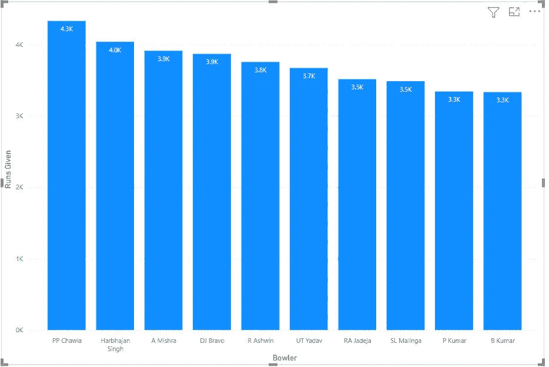

图 12:-最昂贵的保龄球手

如果我们仔细观察上面的图表，我们可以注意到这里的保龄球手列表与上面两个图表中的保龄球手列表相似(最大。三柱门和大多数点球)。显然，我们可以说每一件好事都是有代价的。只有不怕被打到界外的投球手才能拿三柱门。

我们已经分析了一局中最昂贵的前 5 局，让我们看看谁使他们最昂贵。

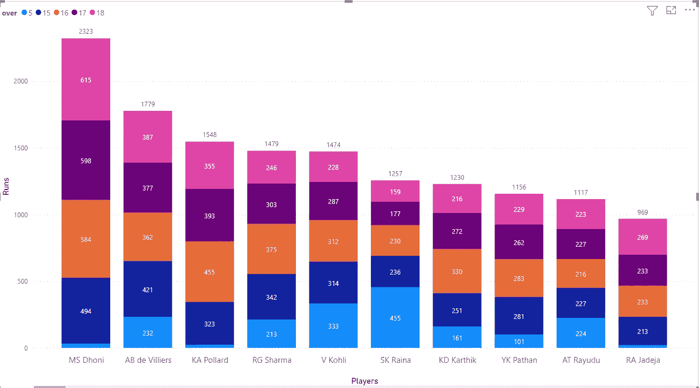

图 13:-在最昂贵回合中跑得最多的玩家

上图显示了在一局最昂贵的回合中得分最多的前 10 名击球手。

当然，当谈到生死关头和“漂亮地结束比赛”的时候，这个人不是别人，正是我们自己的酷队长。他在死亡之旅中以 500+的差距领先。
他之后是 360 先生、波拉德、Hitman 和这一类的金·柯利。

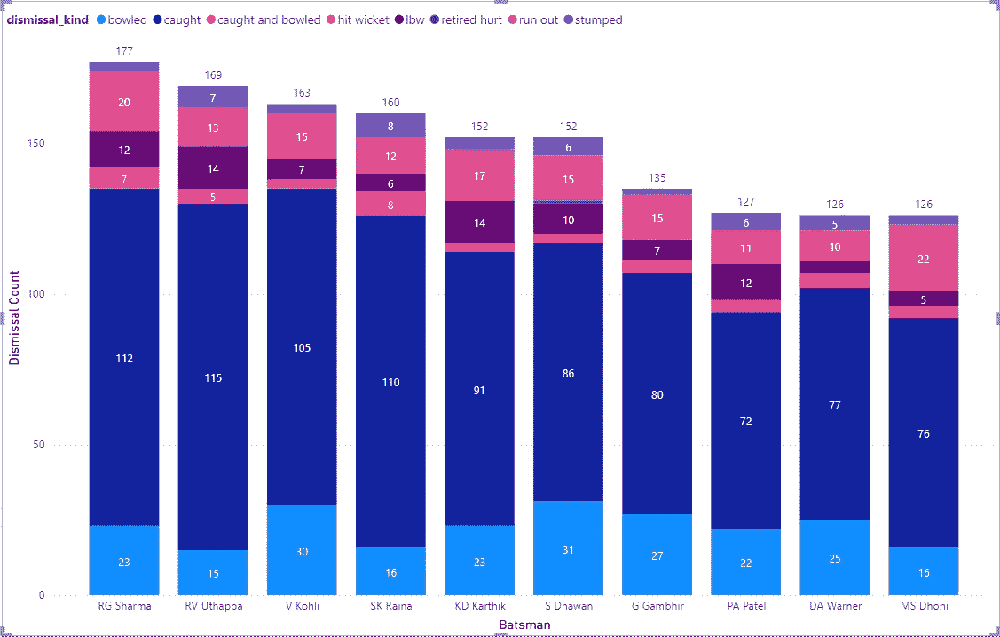

图 14:大多数时候出局的击球手

在上面的图表中，我们可以看到根据他们退出的方式，退出次数最多的顶级玩家。

南达万是投球次数最多的人，其次是科利。而 Dhoni(被认为是三柱门之间最快的)的出局数最高，其次是 Rohit Sharma。
刘冰拥有最高的绊倒、接球和投球记录。而乌塔帕有被抓的记录。Dhawan 和 Warner 是唯一一个因伤退出比赛并分别击中三柱门的人。

我希望你喜欢这篇文章，请喜欢，分享并留下你的观点，改进点或任何你希望我为你分析的具体问题的评论。
乐于助人。

非常感谢各位…稍后见，有更多有趣的分析…

更了解我:- [关于我](https://shashank-singhal.medium.com/about-me-shashank-singhal-6654366c8a05)

快乐学习…！！！🙂