# 数据可视化—网飞数据集

> 原文：<https://medium.com/analytics-vidhya/data-visualization-netflix-data-set-d4fa2da97253?source=collection_archive---------1----------------------->

欢迎来到数据可视化系列的下一篇文章，这是全球人民的最佳消遣和娱乐之一——网飞。
我们将浏览数据集，并对网飞上的内容有一个概述。

[自由股票](https://unsplash.com/@freestocks?utm_source=medium&utm_medium=referral)在 [Unsplash](https://unsplash.com?utm_source=medium&utm_medium=referral) 上的照片

> 让我们对数据集有一个概述

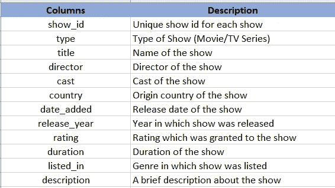

图 2:-网飞数据集列的描述

> 继续前进..并查看这些列中的数据

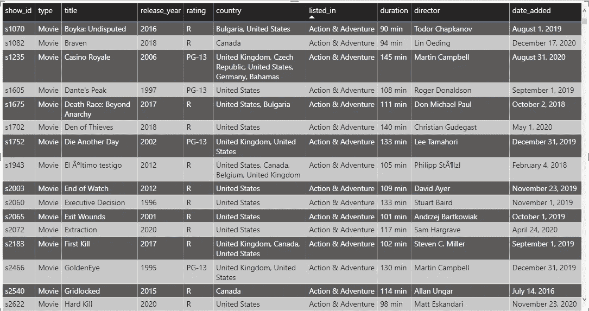

图 3:-网飞数据概述

让我们继续前进，从可视化数据开始，并获得一些关于数据的见解。

首先，让我们根据当前的类型来看看节目的数量。

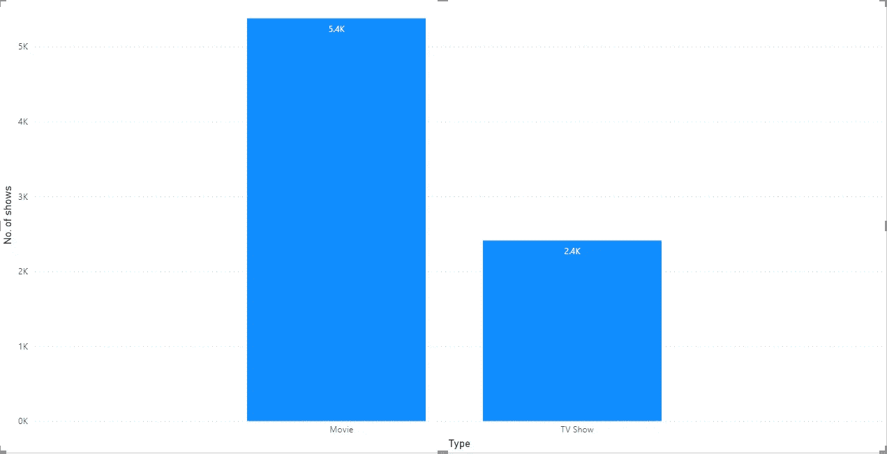

图 4:基于类型的节目数量

从上面的图表中，我们可以注意到我们有大约 5400 部电影数据和 2400 部电视节目数据。
这表明在网飞上映的电影数量高于电视剧数量&我们可以说网飞更像是电影院而不是电视机。

现在让我们看看为网飞制作最多节目的国家。

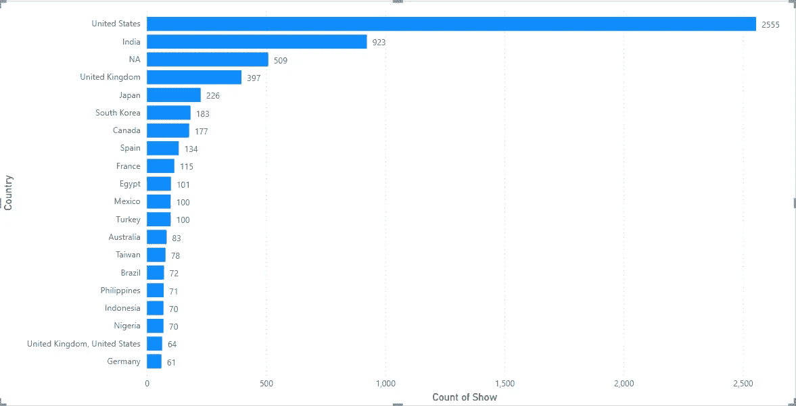

图 5:-基于总展示的前 20 个国家

我们可以注意到，与其他国家相比，来自美国的节目数量相当大。第二高的是印度，大约是美国的 1/3。

此外，我们可以在第三个位置看到北美，不要将其与北美混淆，它实际上是数据集中的空白值。也就是说，我们缺少大约 509 行/场的国家数据。在对这个数据集进行实际分析之前，我们需要处理这些缺失的数据。

现在让我们来看看这些国家制作的电影和电视节目的数量。

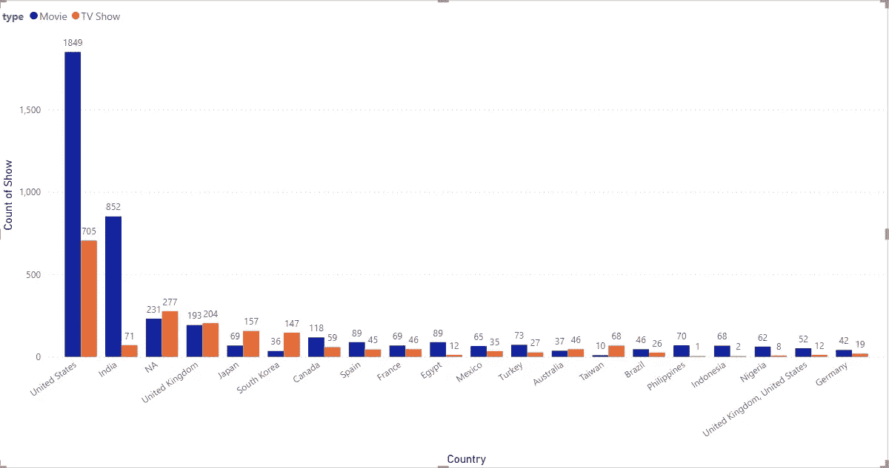

图 6:-根据节目排名的前 20 个国家

我们可以看到，美国和印度的电影数量高于这些国家制作的电视节目数量，而电视节目数量高于英国、日本和韩国的电影数量，但其中日本和韩国的电视节目数量远远高于电影。有意思..不是吗..！！！

继续…让我们根据年份将数据分成两部分，并尝试从中获得一些见解。

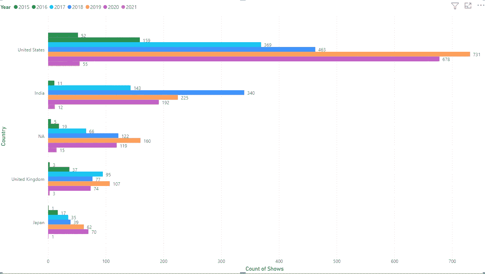

图 7:-过去 7 年中制作的前 5 个国家和节目

上图显示了排名前五的国家和他们每年制作的节目数量。

> 注意:-我特意在图中包括 NA，以显示如果我们直接删除这些行而没有正确处理丢失的值会产生的影响

我们可以看到美国在 2019 年制作了最多的节目，印度在 2018 年制作了最多的节目。
尽管全球大部分地区都处于封锁状态，但我们可以看到，与前几年相比，2020 年美国制作的节目数量很高，日本也创下了个人最高纪录。

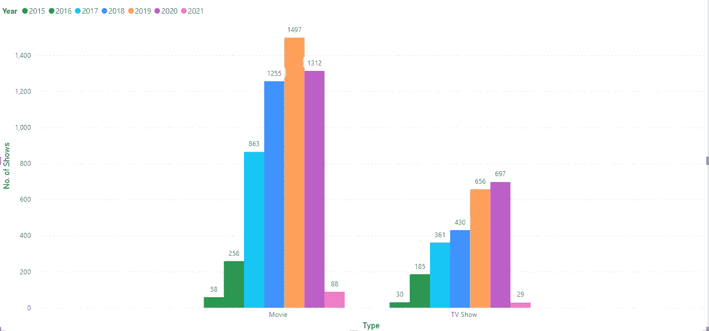

图 8:基于过去 7 年类型的演出数量

上图与上图有点类似，它代表了所有国家(包括北美)在过去 7 年中制作的节目数量。

我们可以看到，类似电影的电视节目数量一直在持续上升，但在 2020 年有所下降，可能是由于新冠肺炎的限制。

现在让我们更深入地研究一下这些数据，看看网飞节目的不同收视率

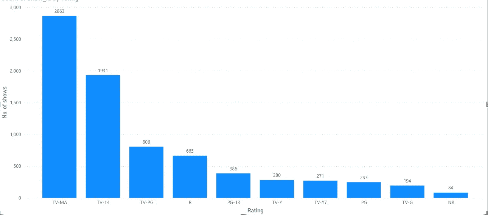

图 9:基于评级的节目数量

我们可以看到 TV-MA(仅限成年观众)下的节目数量很高，其次是 TV-14(家长强烈警告)、TV-PG(建议家长指导)和 R(限制级，儿童)。

我们可以看到列表中的大多数节目都属于受限制的和成熟的观众，因此我们可以说网飞有更多的成熟内容，应该限制儿童观看。

我们已经看到国家制作了最多的节目，那么为什么不看看这些基于收视率的节目呢？

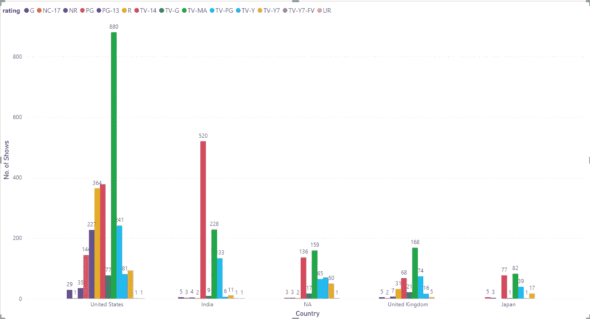

图 10:基于收视率和国家的节目数量

此图是上图的增强版，描述了每个国家在每个评级下制作的节目数量。我们可以看到美国拥有最多的 TV-MA、TV-14 和 R，而印度制作的大多是 TV-14 收视率节目，其次是 TV-MA。

类似地，英国和日本也有很高的电视-MA 和电视-14 节目数量。

让我们来看看这些网飞秀的理想时长。

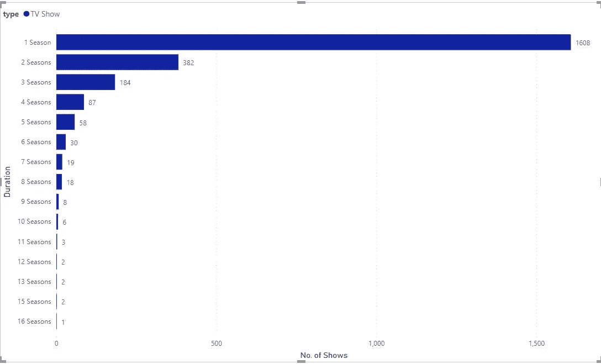

图 11a:电视节目的持续时间

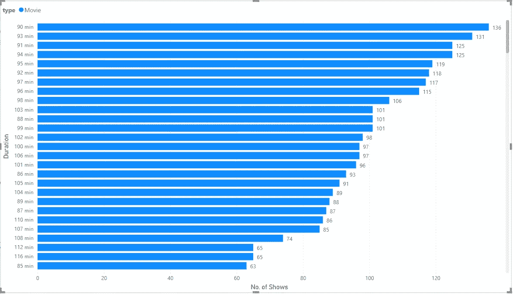

图 11b:-电影的持续时间

为了更清楚起见，我将图表分为电视节目和电影的两个单独的图表。

对于电视节目，我们可以看到最喜欢的持续时间是一季(包含各种剧集)，而对于电影，查看图表(图 11b)我们可以说它是大约 90-100 分钟。

图 12:-最短的电影

我们可以看到我们很少有像 8-9 分钟这么短的电影。
*注:——我们需要核实这些数据的正确性。*
这可能是由于数据收集时的一些错误。

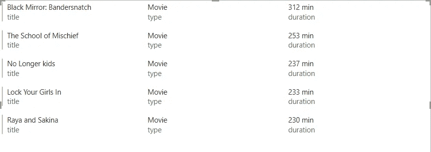

图 13:-最长的电影

网飞上最长的电影是大约 312 部龙敏电影，其次是 253 部龙敏电影，希望它的内容足够好，让人看得如痴如醉。😉

如果能看到你对这些电影的评论就太好了…一定要分享它们…

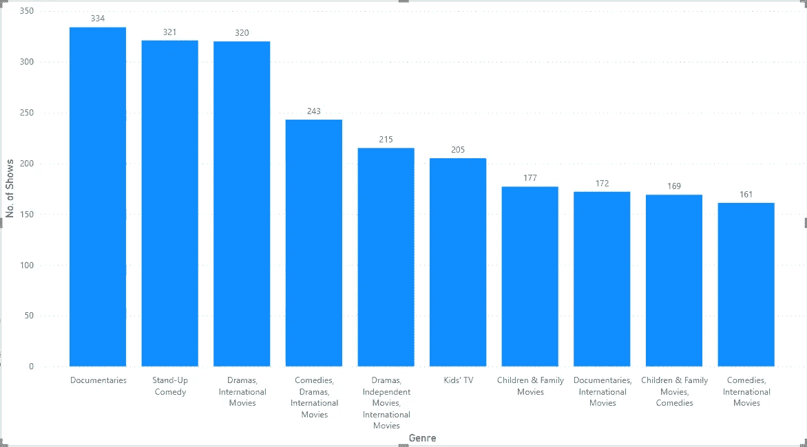

图 14:-基于流派的电影

上图显示了网飞主办的十大类展会。

有趣的是，我们可以注意到纪录片是最高的类别，如果我们从上面回忆，我们有 TV-MA 和 TV-14 作为节目的最高评级。

这些都来自这个网飞数据集，请在下面评论以获取数据集。

我希望你喜欢这篇文章，请喜欢，分享并留下你的观点，改进点或任何你希望我为你分析的具体问题的评论。
乐于助人。

非常感谢各位…稍后见，有更多有趣的分析…

更了解我:- [关于我](https://shashank-singhal.medium.com/about-me-shashank-singhal-6654366c8a05)

快乐学习…！！！🙂