# 数据可视化—神奇宝贝数据集第二部分

> 原文：<https://medium.com/analytics-vidhya/data-visualization-pok%C3%A9mon-dataset-part-ii-4b0adb93691f?source=collection_archive---------20----------------------->

欢迎来到数据可视化系列的下一篇文章，这是有史以来最受欢迎和喜爱的卡通之一《神奇宝贝》的第二部分…
必须抓住它们…(数据集的可视化第二部分)😉

由 [Lia Panidara](https://unsplash.com/@panidara?utm_source=medium&utm_medium=referral) 在 [Unsplash](https://unsplash.com?utm_source=medium&utm_medium=referral) 拍摄的照片

[在第一部分中，我们看到了一些与神奇宝贝的产生有关的有趣图表，并试图找出其他领域与它的关系。接下来，我们将分析更多与其他领域相关的图表..](/analytics-vidhya/data-visualization-pokémon-dataset-48e57690830d)

让我们先回顾一下数据集，看看我们要分析什么..

图 2:-神奇宝贝数据集列的描述

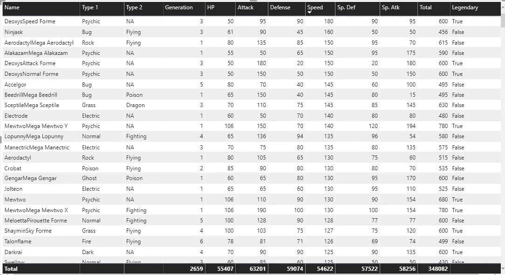

图 3:-神奇宝贝数据概述

从一些与神奇宝贝类型相关的图表开始..

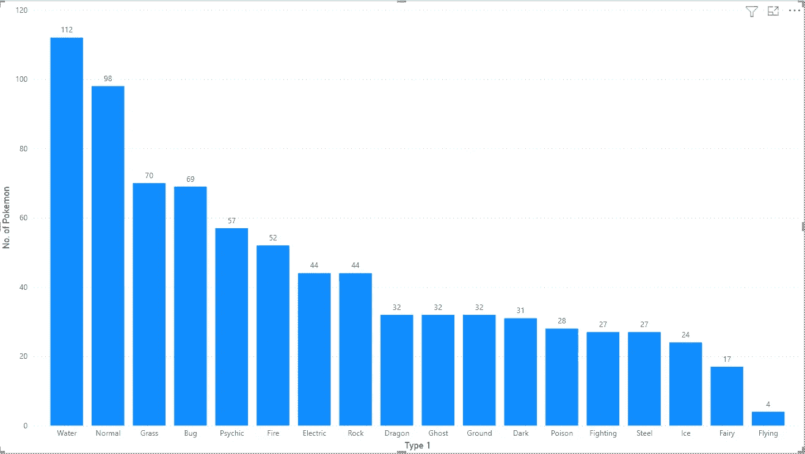

图 4:-基于主要类型的神奇宝贝数量

我们已经在神奇宝贝数据集的第 1 部分中看到了一个类似的图表，当时我们正在分析主要类型的神奇宝贝的世代链接。

我们可以看到，水、普通、草、虫和灵力是神奇宝贝更常见的主要类型，而飞行似乎是 1 型神奇宝贝的罕见类型。

现在我们来分析一下这种神奇宝贝的能力分布…

**1.1 攻击 VS 初级类型**

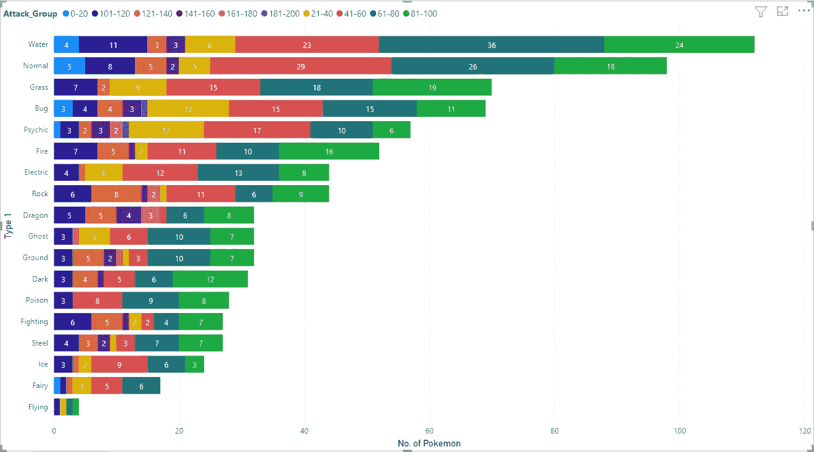

图 5:-基于攻击群和类型的神奇宝贝数量

我们可以注意到，每种类型的主要部分由 41–60、61–80 和 81–100 组占据。此外，攻击组 21–40 在第 1 部分中被视为我们分析的主要部分，对每种类型的贡献都很小。

这里要注意的一点是……攻击群 181-200 只存在于虫类和心灵类型。此外，攻击群 161-180 只出现在少数类型中，而且数量也很少。最后，飞行式在 101-120，21-40，61-80 和 81-100 攻击群各有一个…

**1.2 防御 VS 初级**

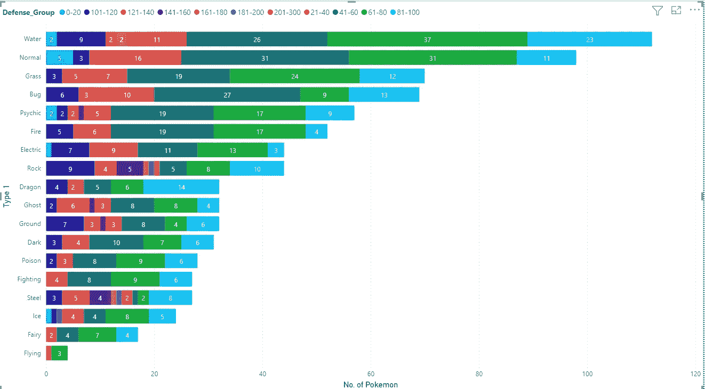

图 6:-基于防御组和类型的神奇宝贝数量

与攻击组类似，我们可以看到防御组 41–60、61–80 和 81–100 在所有类型中都占有很大份额……此外，21–40 在所有类型中只占很小一部分。我们还可以注意到，161-200 范围内的顶级群体没有太多神奇宝贝。

除了这个最高防御是 201-300，这是目前唯一的错误和钢铁类型。如果我们回到攻击组，Bug 型攻击组也是最高的。如果我们看到飞行型，它有 1 个不同攻击组的神奇宝贝，但这里 4 个神奇宝贝中有 3 个有 61-80 的防御组，1 个有 21-40。

所以我们可以说，每个类别中的大多数神奇宝贝的平均攻击和防御为 41-100。

**1.3 HP VS 主要类型**

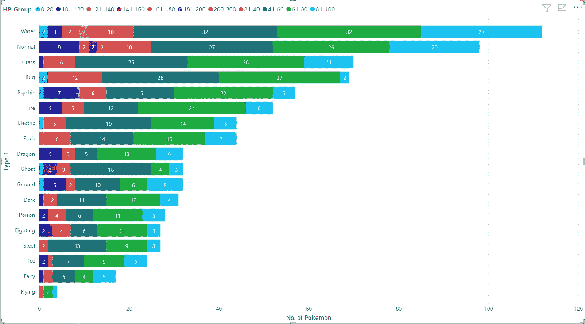

图 7:-基于惠普组和类型的神奇宝贝数量

与前两个图表相反，这里只有 41-60 和 61-80 组拥有所有类型神奇宝贝的主要部分..81-100 组只有前 3 种类型的主要部分。此外，我们注意到最高的 200-300 组只有 2 个普通类型的神奇宝贝。

第二和第三高的群体，即 181-200 和 161-180，也分别只有 1 个和 2 个精神和水类型的神奇宝贝。飞行型在 21-40 和 81-100 组各有 1 个，在 61-80 组有 2 个，这表明飞行型似乎很罕见，但他们没有非常罕见的能力。

**1.4 速 VS 初级型**

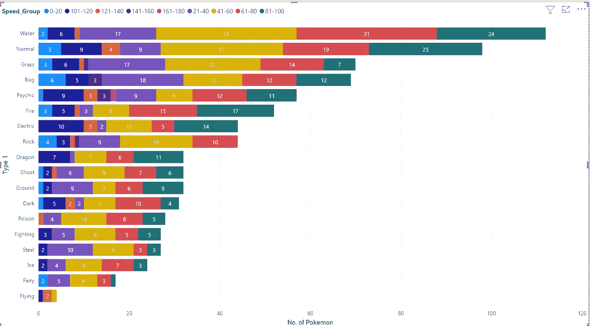

图 7:-基于速度组和类型的神奇宝贝数量

在这里，我们还可以看到 41-60、61-80 和 81-100 组涵盖了所有类型的主要部分，但 81-100 组在岩石和飞行类型中缺失。

这里要注意的另一件事是通灵和草有很好的高速神奇宝贝数量(范围在 101-180 之间),通灵只有最高速度的神奇宝贝。

> *继续第二种…*

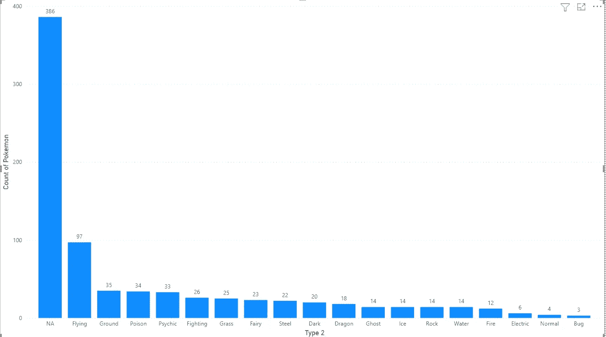

图 8:-基于次要类型的神奇宝贝数量

在分析次要类型神奇宝贝的生成链接时，我们也在神奇宝贝数据集的第 1 部分看到了类似的图表。

不要担心“NA”在这里是额外的…我特意删除了第 1 部分中的 NA 栏，因为当时不需要它。NA 实际上是为我们没有辅助类型的领域添加的…我们可以注意到这里大约有 390 个神奇宝贝没有辅助类型，而飞行对于主要类型来说是罕见的，在这里是常见的类型。此外，正常& Bug 是一种常见的主要类型，是一种罕见的次要类型。
通灵仍然在前五名…有意思…

**2.1 攻击 VS 辅助型**

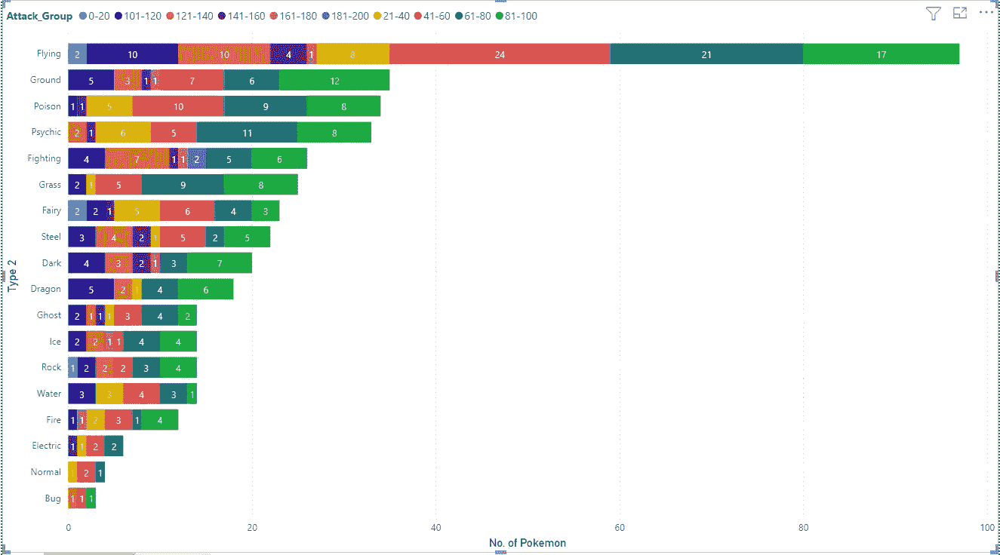

图 9:-基于攻击群和次要类型的神奇宝贝数量

走向..我已经删除了 NA 组，以使图形清晰可分析。

回到这个图表…我们可以注意到一些有趣的地方…
*主要类型的后座上的飞行突然引领次要类型的集会。
*只有两个群体，即 61–80&81–100 在所有类型中占有最大份额。
*只有 2 个战斗型神奇宝贝的攻击群最高(181–200)。
* Bug(3) &正常(4)型没有多少神奇宝贝。
*第二高的 161–180 组很少有神奇宝贝分散在各处。

**2.2 防御 VS 辅助型**

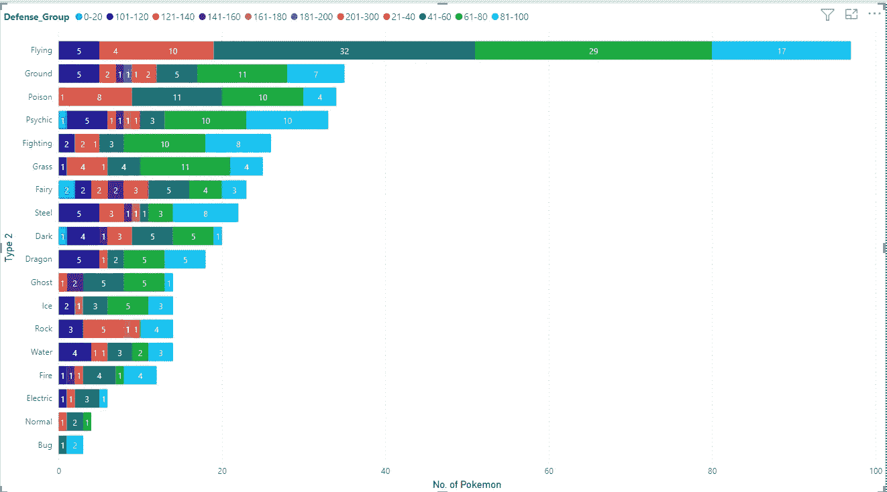

图 10:-基于防御组和次要类型的神奇宝贝数量

在这里，我们可以看到 41-60 和 61-80 组在所有类型的神奇宝贝中占主要部分，81-100 组在所有类型中也有一些次要的发言权..
此外，最高组别 201–300 在地面和岩石类型中各只有 1 个神奇宝贝。这确实让岩石有了一些高防御。

如果仔细看，防御高的神奇宝贝不算太多，top 4 组只有 16 个。此外，我们也没有太多 0-20 岁组的神奇宝贝。

**2.3 马力 VS 二次型**

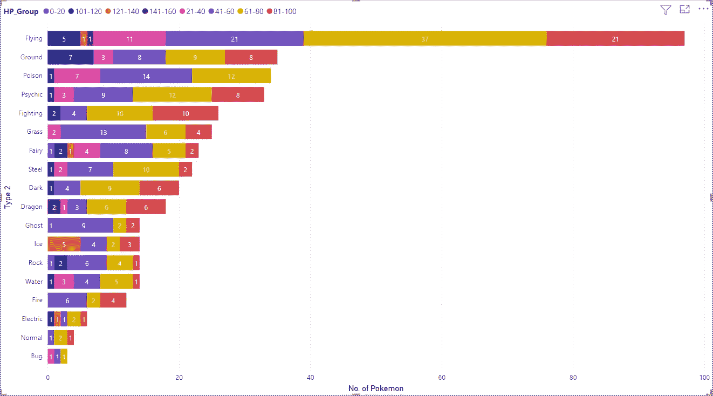

图 11:-基于 HP 组和次要类型的神奇宝贝计数

在这里，我们可以看到 41–60 和 61–80 组涵盖了每种类型的主要部分。
Bug 类型 21–40，41–60&61–80 组各 1 个。

此外，最高群体只有 141-160 岁，其中 1 人是飞行型，2 人是龙型..但是，这些龙型神奇宝贝应该把飞行作为它们的主要类型..因此，我们可以说龙和飞行类型的神奇宝贝有很高的几率获得高 HP。

**2.4 速 VS 二级类型**

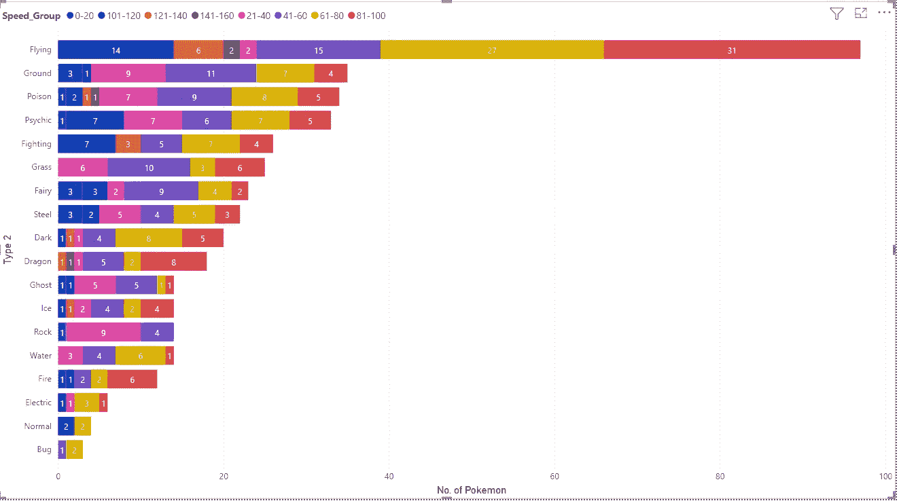

图 12:-基于速度组和次要类型的神奇宝贝数量

我们可以注意到，对于飞行型来说，所有速度组的神奇宝贝数量都相当多，但对于最小的 0-20 组来说就不是这样了，对于 21-40 组来说也只有 2 个。

除此之外，我们可以注意到每种类型的主要部分的速度组在 61-100 之间。但是对于岩石类型，所有的神奇宝贝只有很少的速度组 0-60。

最高的 141-160 组只有 4 个神奇宝贝，其中 2 个是飞行型的，1 个是龙和毒。

这些都来自这个神奇宝贝数据集。请务必阅读[第一部分，了解神奇宝贝一代的一些有趣分析。](/analytics-vidhya/data-visualization-pokémon-dataset-48e57690830d)

现在我们知道我们需要选择哪种类型的神奇宝贝，如果有一天我们真的在一场神奇宝贝的战斗中倒下了…以及要捕捉哪种类型的…所以不要浪费时间把它们都抓住…噼卡噼卡…

直到时间[你可以在这里得到你的数据集](https://www.kaggle.com/shashanksinghals/pokemon)并且试着创造视觉效果或者想到一些你认为我应该在这里添加的分析…

非常感谢各位…稍后见，有更多有趣的分析…

你可以了解我更多:- [关于我](https://shashank-singhal.medium.com/about-me-shashank-singhal-6654366c8a05)

快乐学习…！！！🙂